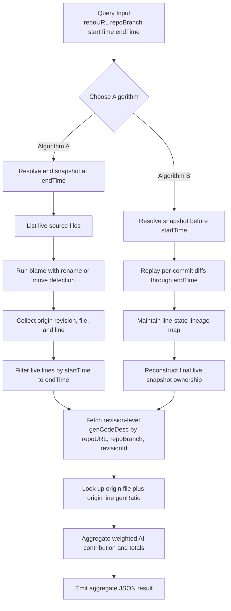

# AggregateGenCodeDesc

## ======>>>WHAT WE HAVE<<<======

- We commit code to a GIT/SVN repository.
- After each revision is created, a separate process generates one `genCodeDesc` record for that revision, describing which lines are generated by AI.
- `genCodeDesc` is not repository content. It is external metadata stored in a standalone database or service and indexed by `repoURL + repoBranch + revisionId`.
  - Protocol definition: [genCodeDescProtocol](genCodeDescProtocol.json)
- In revision-level metadata, `SUMMARY.totalCodeLines` means all non-blank added ('+') code lines in the commit diff. In final aggregate results, it means only the live source lines that survive at the analysis endpoint. It does not include deleted or blank lines.

### Current Supported Contract vs Future Protocol

- The current production-quality baseline is still `Algorithm A + Scope A`, and the runtime also now includes active `Algorithm B + Scope A` replay paths for the proven Git/SVN scenario slices.
- Revision-level metadata currently consumes `DETAIL[*].codeLines` for source files in the supported code-file set.
- The broader `generatedTextDesc` protocol can describe more than source code, including future document-oriented fields such as `docLines` and document summary totals.
- Those broader fields are forward-compatible at the protocol level, but they are not part of the current analyzer's implemented metric path.
- Unknown top-level fields such as `CREDENTIAL` are treated as envelope metadata and ignored by the current analyzer.
- Protocol samples may be written as JSONC for documentation convenience. The runtime loader now accepts `//` and `/* ... */` comments in revision-level metadata files, but the analyzer output remains standard JSON.

## ======>>>WHAT WE WANT<<<======

- We want to calculate the AI ratio among live code lines whose current version was changed within a specific time period.
  - Such as: `AI ratio among live code lines changed within [2026-03-01, 2026-03-31]` in RepoA:branchB.

## ======>>>RELATED DOCS<<<======

- Legacy user-story source during migration: `README_UserStory.md`
- Authoritative next-generation user stories: `README_UserStoryNG.md`
- User guide and typical usage examples: `README_UserGuide.md`
- Dedicated operator examples: `UserExamples/README_UserExamples.md`
- Shared-US convergence roadmap (completed): `README_SharedUS_Convergence.md`
- Concrete Algorithm-B execution plan: `README_AlgorithmB_TDD.md`
- Architecture design: `README_ArchDesign.md`
- Ubiquitous Language glossary: `README_UbiLang.md`
- Test run guide: `README_RunTestCase.md`
- Scenario-based test fixtures: `testdata/`

## ======>>>QUICK START<<<======

If you are new to this repo, start with `README_UserGuide.md`.

Most common current command patterns:

### Git real-repository run with `Algorithm A`

```bash
python3 aggregateGenCodeDesc.py \
  --vcsType git \
  --repoURL /path/to/local/git/repo \
  --repoBranch main \
  --startTime 2026-03-01 \
  --endTime 2026-03-31 \
  --outputFile /tmp/agg-out.json \
  --genCodeDescSetDir /path/to/genCodeDescSet
```

### SVN real-repository run with `Algorithm A`

```bash
python3 aggregateGenCodeDesc.py \
  --vcsType svn \
  --repoURL file:///path/to/local/svn/repo \
  --repoBranch trunk \
  --startTime 2026-03-01 \
  --endTime 2026-03-31 \
  --outputFile /tmp/agg-out.json \
  --genCodeDescSetDir /path/to/genCodeDescSet
```

### Narrow replay run with `Algorithm B`

```bash
python3 aggregateGenCodeDesc.py \
  --vcsType git \
  --repoURL https://example.local/repo/demo \
  --repoBranch main \
  --startTime 2026-03-01 \
  --endTime 2026-03-31 \
  --algorithm B \
  --scope A \
  --outputFile /tmp/agg-b-out.json \
  --genCodeDescSetDir testdata/us1_live_changed_source_ratio \
  --commitDiffSetDir testdata/us1_live_changed_source_ratio/commitDiffSet
```

For more examples, argument explanations, and common failure cases, use `README_UserGuide.md`.

## ======>>>PRODUCTION TARGET<<<======

- The current implementation target is `Algorithm A + Scope A` at production quality for both Git and SVN.
- The verification model should be split explicitly into `Fast` and `Heavy` tiers.
- `Fast` verification is for routine local runs and normal CI, using fixture-driven checks and short-running repository tests.
- `Heavy` verification is for production-readiness and scheduled daily integration, using long-running or production-scale repository histories.
- Production validation should use real local repositories with production-like history shape, including large branch counts, deep commit history, and merge-heavy release convergence.
- Remote hosting is not required for correctness validation. For this analyzer, a local repository is an acceptable production proxy for history, blame, merge topology, and metadata lookup behavior; only network transport is intentionally out of scope.
- The dedicated long-running production gate is `bash run_production_gate.sh`, which currently runs the US-13 Git and US-14 SVN production-scale acceptance tests.
- Exploratory SVN lineage behavior that goes beyond the accepted production contract should live in the separate experimental test track, not in the production gate.

## ======>>>CURRENT REPOURL SUPPORT BOUNDARY<<<======

- Yes, the runtime now supports a logical Git `repoURL` that is different from the local checkout path.
- For Git, `--repoURL` is treated as the logical repository identity used for metadata validation and for the final `REPOSITORY.repoURL` output.
- For Git, VCS commands still run only against a local checkout directory, so when `--repoURL` is something like `https://path/2/repo.git`, `--workingDir` is required and must point at an already checked-out local repository.
- That means the current implementation does **not** clone or fetch a real remote HTTP repository by itself, and it has **not** been validated as a network-accessing remote-repository client.
- For SVN, `repoURL` already serves as both the logical repository identity and the live repository access target because the current implementation invokes `svn` commands directly against that URL.

## ======>>>HOW TO GET IT<<<======

### 1. Exact meaning of the metric

For a given `repo + branch + [startTime, endTime]`, the primary metric is:

`AI ratio among live code lines changed within the time window [startTime, endTime]`

That means:

- Take the branch snapshot at the latest commit whose commit time is `<= endTime`.
- Look at the live code lines in that snapshot.
- Keep only the live lines whose current version was added or modified during `startTime~endTime`.
- For each such live line, determine whether the current version of that line was generated by AI, and by how much.
- Sum the AI-generated portion of those live changed lines.
- Divide by the total number of live changed lines in that same window.

Formula:

`AI_Window_Live_Ratio = Sum(line.genRatio / 100 for live lines whose current origin revision is in [startTime, endTime]) / Total_Live_Changed_Lines_In_Window`

Notes:

- `genRatio = 100` means a full AI-generated line.
- `genRatio = 30` means 30% of that line is attributed to AI.
- This is a weighted ratio, not only a binary AI-or-human count.
- The metric is still evaluated on the live codebase state at `endTime`.
- `startTime` is not only a label. It determines which live lines are in scope.

### 2. Recommended calculation algorithm

`Algorithm A (preferred): blame-based end-snapshot attribution`

The cleanest primary algorithm is `end snapshot + blame + window filter + external metadata lookup`.

Workflow overview:



Steps:

1. Resolve `endCommit`:
   a) the latest commit on `branchB` whose time is `<= endTime`.
2. Get the file list in `endCommit`.
  a) This is intentional: the metric only considers files that are still present in the final live snapshot at `endTime`.
  b) Files changed during `startTime~endTime` but deleted before `endTime` are excluded by design.
3. For each source file in `endCommit`, run blame with rename/move detection.
  a) If a file was renamed or moved and still exists at `endTime`, rename-aware blame should preserve its line origin.
4. For each final live line, collect:
   - final file path
   - final line number
   - origin commit id
   - origin file path
   - origin line number
5. Filter out any live line whose `origin commit id` time is outside `startTime~endTime`.
6. Fetch the `genCodeDesc` records for the remaining `origin commit id` values from the external metadata provider.
7. Find the AI metadata for `origin file path + origin line number`.
8. If found, use that `genRatio`; otherwise treat it as `0`.
9. Sum the AI weights of the remaining live changed lines and divide by the total number of remaining live changed lines.

This works because blame answers the real question: `which commit last introduced the current form of this live line?`
Once that origin revision is known, the time window can be applied exactly to the live line set.

### 3. Why this algorithm matches the requirement

The requirement is not `how much AI code was ever added during the period regardless of whether it survived`.
It is `within the live codebase at endTime, how much of the live changed code in startTime~endTime is AI-generated or partially AI-generated`.

So deleted lines must not count.
Old versions of lines must not count.
Live lines whose current version was introduced before `startTime` must not count.
Only the live lines in the final branch snapshot whose current version was added or modified in the window count.

### 4. Line ownership rules

To make the metric stable, the ownership rules should be explicit.

- If an AI-generated line is later edited by a human, the line should be attributed based on the newer commit that introduced the current text.
- If a human-written line is later rewritten by AI, the line should be attributed to the newer AI-related commit.
- If a line is deleted, it no longer contributes to the ratio.
- If a file is renamed or moved, line ownership should be preserved through blame rename detection.
- If a line is copied into another file, that is a product decision:
  - conservative mode: copied line is treated as newly introduced in the copy commit
  - lineage mode: use copy detection and preserve origin when the tooling can prove it

For a first implementation, rename tracking is necessary. Copy tracking can be optional.

### 5. Role of startTime

For the agreed primary metric, `startTime` is part of the metric definition.

That means:

- a live line is in scope only if the revision that last introduced its current form falls inside `startTime~endTime`
- live lines whose current form comes from before `startTime` are out of scope
- deleted lines are out of scope because they are not live at `endTime`

### 6. Candidate algorithms

There are two candidate algorithms:

- `Algorithm A (preferred): blame-based end-snapshot attribution`
  - method:
    - start from the live snapshot at `endTime`
    - use blame to identify the origin revision of each final live line
    - filter by `startTime~endTime`
  - advantages:
    - directly matches the primary metric, which is defined on the live snapshot at `endTime`
    - implementation is simpler because the VCS already computes line ancestry
    - rename handling is usually easier because mature blame implementations already support it
    - lower logical risk for P0 because there is no need to rebuild line state across every commit in the window
  - disadvantages:
    - can be slower on very large repositories if blame must run across many large files
    - depends heavily on the quality and behavior of VCS blame support
    - is less suitable for metrics about deleted lines, churn, or intermediate history states

- `Algorithm B (alternative): incremental lineage reconstruction without blame`
  - method:
    - start from the snapshot just before `startTime`
    - replay snapshot diff and per-commit diffs through `endTime`
    - maintain a line-state map until the final live snapshot is reconstructed
  - advantages:
    - can support richer history-oriented analytics such as added-then-deleted AI lines, churn, survival rate, and per-commit reports
    - may perform better when the time window is narrow and the touched file set is much smaller than the full live repository at `endTime`
    - may be easier if the system already has a reliable incremental diff-processing pipeline or event log
  - disadvantages:
    - implementation is much harder because the analyzer must correctly track inserts, deletes, rewrites, renames, and line-number shifts
    - correctness risk is higher because this approach effectively rebuilds a partial blame engine
    - merge handling and cross-VCS consistency are more difficult
    - a final `start->end` diff alone is not enough; per-commit replay is required for correct live-line ownership

When the alternative model may be better:

- the product needs history-process metrics, not only final live-snapshot metrics
- the analysis window is small but the final repository snapshot is very large
- commit diffs are already indexed and cheaply queryable, while blame is slow or operationally expensive
- the team wants commit-by-commit attribution outputs in addition to the final ratio

When Algorithm A remains better:

- the primary goal is the agreed `P0 / Scope A` metric on the live snapshot at `endTime`
- correctness and implementation simplicity matter more than richer history analytics
- rename-aware blame is available and reliable in the target VCS environment

For the current project direction, choose `Algorithm A` as the implementation baseline and keep `Algorithm B` as the explicit alternative architecture.

### 8. Algorithm B TDD Plan

`Algorithm B` should be developed as a separate TDD track rather than as an opportunistic extension of the current `Algorithm A` code path.

Recommended staged plan:

1. `B0: contract lock` Keep the same query/result shape as Algorithm A where possible, document exactly which fields stay stable and which semantics change, require explicit golden `query.json` and `expected_result.json` artifacts for every Algorithm-B scenario, and require raw `testdata` commit diff patch artifacts for every replayed revision. Each artifact should be plain unified diff text rather than a custom JSON schema. If any diff is missing inside the replay sequence, the fixture contract must fail fast.

1. `B1: single-branch period-added baseline` The first executable target should be a one-branch, no-rename, no-merge period contribution metric. A narrow Git period-added baseline for the current `US-6` shape now exists both through `--algorithm B --commitDiffSetDir` and through the supported local-Git replay path, and the approved live-snapshot shared-story subset now also has narrow replay coverage. Broader histories and unsupported matrix cells still need dedicated TDD before they should be treated as implemented.

1. `B2: mixed survival and deletion rules` Add TDD scenarios where AI-added lines are later deleted, partially overwritten, or superseded by human edits inside the same requested window. Make the period metric explicit about what counts as added contribution even if the line is not live at `endTime`.

1. `B3: rename and move handling` Add focused Git scenarios for path-only renames and moved files. Defer copy-detection claims until rename behavior is proven stable.

1. `B4: merge-aware Git lineage replay` Add merge-window scenarios that force the implementation to choose a defensible replay policy for first-parent vs merged-parent contribution accounting. Do not claim production readiness until this rule is explicit in tests and docs.

1. `B5: SVN parity subset` Add SVN Algorithm-B coverage only for the subset that can be defended under real SVN history semantics, and keep SVN exploratory behavior separate if blame, mergeinfo, or path-history limitations make a broader parity claim unsafe.

1. `B6: scalability gate` Only after correctness is stable, add separate scalability tests and then a dedicated long-running Algorithm-B gate. Do not reuse Algorithm-A production readiness as evidence for Algorithm-B production readiness.

Recommended first concrete deliverables:

- one `README_AlgorithmB_TDD.md` design-and-test roadmap document
- one `testdata/us6_period_added_ratio` contract refresh if needed
- one real Git baseline test for Algorithm-B single-branch period contribution
- one negative-path test proving unsupported Algorithm-B cases fail clearly before they are implemented

### 7. What counts as code lines

This must be fixed in the spec, otherwise the ratio will drift between tools.

Recommended scope definitions and priorities:

- `P0 / Scope A: pure source code`
  - include only tracked source files of selected languages
  - include code lines only
  - exclude blank lines
  - exclude pure comment lines
  - exclude generated files
  - exclude vendored third-party code
  - exclude binary files
- `P1 / Scope B: source code with comments`
  - include tracked source files of selected languages
  - include code lines and comment lines inside source files
  - exclude standalone documentation files
  - exclude generated files
  - exclude vendored third-party code
  - exclude binary files
- `P2 / Scope C: documentation text lines`
  - include Markdown, plain text, README, design docs, specs, prompts, and similar documentation text files
  - exclude source code files unless explicitly treated as documentation artifacts
  - generated documentation may be optionally included if the product decision is to measure accepted AI-authored docs
- `P2 / Scope D: all text`
  - include source code, source comments, and documentation text
  - optionally include other textual repo assets such as JSON, YAML, SQL, config, or templates depending on product policy
  - exclude binary files

For the first implementation, Scope A is the primary metric.
Scope B is a secondary extension.
Scopes C and D are broader reporting views that can be added later without changing the core line-origin algorithm.

### 8. Required data assumptions

This design assumes each relevant revision has a `genCodeDesc` record in an external metadata store and that the record can be resolved by `repoURL + repoBranch + revisionId`.

The first local test slice uses files only as a test adapter for that external metadata contract.
Those files are not the intended production storage model.

The protocol should stay minimal.
It is primarily an AI-generated code description document, and its `SUMMARY` section is already enough to reuse the same file as a final aggregate report.

The protocol must answer:

- which files were described
- which lines or ranges were AI-generated
- the `genRatio` for each line
- the exact repository revision that the metadata belongs to
- what the aggregate totals are for that described revision or snapshot

The analyzer should treat the repository history and the `genCodeDesc` store as two different systems:

- the repository answers which lines survive and which revision last introduced their current form
- the external metadata store answers how much of a specific revision's lines are attributable to AI

The current protocol example already contains the key fields needed for that.

Recommended aggregate fields in `SUMMARY` include:

- `totalCodeLines`
- `fullGeneratedCodeLines`
- `partialGeneratedCodeLines`

Recommended field semantics are:

- `totalCodeLines`: for revision-level `genCodeDesc`, this means all non-blank added ('+') code lines in the commit diff. For the current final aggregate metric, this means only the live source lines at `endTime` whose current form was added or modified in `startTime~endTime`.
- `fullGeneratedCodeLines`: subset of added code lines whose attribution is fully AI (`genRatio = 100`).
- `partialGeneratedCodeLines`: subset of added code lines whose attribution is partially AI (`0 < genRatio < 100`).

Derived values such as weighted AI lines, AI ratio, or AI ratio percent do not need to be stored in the protocol if they can be calculated from the summary totals and detailed line metadata.

Fields like `metric`, `startTime`, `endTime`, or credentials are not required in the protocol itself if they belong to the external query or runtime environment rather than the generated-code description.

For cross-VCS support, the repository section should use:

- `vcsType`: `git` or `svn`
- `revisionId`: Git commit hash or SVN revision number

`commitID` can be kept temporarily as a Git-only compatibility field, but `revisionId` should be the long-term canonical field.

In the intended production architecture, the practical lookup key is:

- `repoURL`
- `repoBranch`
- `revisionId`

### 9. Output example

Example summary fields inside one protocol document:

- total live changed code lines in window: `2,480`
- full AI-generated live changed code lines: `900`
- partial AI-generated live changed code lines: `410`

From those fields and the detailed `genRatio` entries, the analyzer can calculate weighted AI lines and the final ratio when needed.

Optional breakdowns:

- by genMethod such as `codeCompletion` vs `vibeCoding` or others.

### 10. Practical conclusion

So yes, the intended metric can be defined precisely as:

`At the end of the requested period, in the specified branch snapshot, what percentage of the live code lines whose current version was added or modified in startTime~endTime is attributable to AI generation?`

If we build this, the first implementation should use:

- git snapshot at `endTime`
- blame for live-line origin
- time-window filtering on each live line's current origin revision
- external metadata lookup by `repoURL + repoBranch + origin revisionId`, then line lookup by `origin file + origin line`
- weighted aggregation by `genRatio`

## ======>>>CLI UTILITY DESIGN<<<======

Recommended first utility name:

- `aggregateGenCodeDesc.py`

Purpose:

- take a repository target plus a time window as input
- compute the agreed aggregate metric
- emit a machine-readable result file and an optional human-readable summary

Recommended command shape:

```bash
python aggregateGenCodeDesc.py \
  --repoURL <repo_url> \
  --repoBranch <branch_name> \
  --startTime <yyyy-mm-dd> \
  --endTime <yyyy-mm-dd>
```

Required arguments for the first implementation:

- `--repoURL`
  - repository URL or repository identity to analyze
- `--repoBranch`
  - branch name for Git-style analysis
  - for SVN, this may be mapped to a branch path such as `trunk` or `branches/release-1.0`
- `--startTime`
  - inclusive window start date in `yyyy-mm-dd` format
- `--endTime`
  - inclusive window end date in `yyyy-mm-dd` format

Recommended optional arguments:

- `--vcsType <git|svn>`
  - optional if the tool can auto-detect from `repoURL`
- `--algorithm <A|B>`
  - default: `A`
  - `A` selects `Algorithm A`: blame-based end-snapshot attribution
  - `B` selects `Algorithm B`: incremental lineage reconstruction without blame
- `--scope <A|B|C|D>`
  - default: `A`
  - `A` pure source code
  - `B` source code with comments
  - `C` documentation text lines
  - `D` all text
- `--outputFile <path>`
  - write the aggregate result JSON to a file
- `--outputFormat <json|text>`
  - default: `json`
- `--metadataSource <provider>`
  - select how revision-level `genCodeDesc` is resolved
  - current default: `genCodeDesc`
  - in the current slice, this should remain `genCodeDesc`
- `--genCodeDescSetDir <dir>`
  - local test-only adapter for resolving a set of revision-level `genCodeDesc` files from one directory
  - this is useful for fixtures and offline tests, not the intended production storage model
- `--commitDiffSetDir <dir>`
  - Algorithm-B diff-stream adapter for resolving a precomputed ordered set of per-revision raw patch artifacts from one directory
  - intended contract: pair it with `--genCodeDescSetDir` so the runtime can replay revision diffs in revision/time order and aggregate the final result without needing live repository history access
  - preferred file naming contract: one `<timeSeq>_<revisionId>_commitDiff.patch` file per replayed revision so offline replay order is explicit in the artifact set
  - this is a diff-source override, not a replacement for `--repoURL`
  - currently only valid with `--algorithm B`
  - intended source can come from either Git or SVN history as long as the replay artifacts are normalized into the patch format the current parser supports
  - current boundary: the implemented offline CLI path is still narrower than the intended long-term contract, and broader mixed-topology support still needs dedicated TDD before it should be treated as generally implemented

### 11. Exact Algorithm-B offline replay contract

When `--algorithm B --commitDiffSetDir --genCodeDescSetDir` are used together, the intended contract is:

- `--commitDiffSetDir` supplies the replayable per-revision diff stream.
- `--genCodeDescSetDir` supplies the revision-level AI attribution metadata for those same revisions.
- `query.json` inside `--genCodeDescSetDir` is the contract anchor for the offline run shape, including the intended metric and, when needed, the explicit `includedRevisionIds` / `endRevisionId`.
- each replayed revision must have a matching `<revisionId>_genCodeDesc.json` and `<timeSeq>_<revisionId>_commitDiff.patch` pair.
- replay order is defined first by `query.json.includedRevisionIds` when present; otherwise the current offline path falls back to the `<timeSeq>` filename prefix.
- legacy `<revisionId>_commitDiff.patch` files are still accepted for backward compatibility, but they should no longer be treated as the preferred naming contract.
- do not mix legacy and time-sequenced patch filenames inside one `commitDiffSetDir`; the runtime now fails fast rather than combining two ordering schemes.
- if some replayed revision is missing its `genCodeDesc` metadata and `--warnOnMissingProtocol` is set while `--failOnMissingProtocol` is not, the runtime continues in degraded mode, treats the affected lines as human or unattributed, and emits diagnostic warnings in the final output.
- the runtime aggregates the final result by replaying the ordered diff sequence, joining each revision to its metadata record, reconstructing the final supported line state, and then emitting one final protocol-shaped aggregate JSON result.

This contract is intentionally VCS-neutral at the artifact level:

- the original diffs may come from Git history or SVN history.
- the runtime does not need live Git or SVN access for this offline path if the artifact set is complete.
- the replay artifacts still must be normalized into the unified patch structure the current parser accepts.

For the current repository state, this section should be read as the intended offline contract boundary, not as a blanket claim that every Git/SVN topology is already implemented.

- `--workingDir <path>`
  - local checkout or temporary workspace directory
  - required for Git when `--repoURL` is a logical repository identity such as `https://...` instead of a local absolute path
  - Algorithm-B offline diff mode via `--commitDiffSetDir` can avoid local Git history access for the current narrow baseline slice
- `--failOnMissingProtocol`
  - fail immediately if a required revision-level protocol file is missing
- `--includeBreakdown <genMethod|directory|none>`
  - optional extra summary breakdowns
- `--logLevel <quiet|info|debug>`
  - default: `info`
  - `quiet` suppresses all runtime log output to stderr
  - `info` emits a three-phase narrative to stderr: (1) initial `Starting analysis` banner with repo, branch, window, and end revision, (2) per-line `LiveLine` classification and `TransitionHint` lines showing which live lines transferred state between revisions (e.g. AI→human or human→AI), (3) `Finished analysis` summary with totals, `elapsed`, and `costSeconds`
  - `debug` adds metadata loading (`Loaded genCodeDesc`), file scanning (`Scanning file`), out-of-window skip, and cached-protocol reuse messages on top of all info-level output

Recommended default behavior:

- default to `Algorithm A`
- default to `Scope A`
- default to JSON output
- resolve the branch snapshot at `endTime`
- discover the relevant origin revisions from repository history
- fetch revision-level `genCodeDesc` from the configured metadata provider
- compute the aggregate metric for live lines in `[startTime, endTime]`

Recommended result shape:

- one aggregate result document per run
- use a protocol-shaped JSON output that contains:
  - repository identity
  - query window
  - chosen algorithm and scope
  - summary totals
  - optional breakdowns
  - execution warnings such as missing protocol files

Recommended example commands:

Git example:

```bash
python aggregateGenCodeDesc.py \
  --repoURL https://example.com/repo.git \
  --repoBranch main \
  --startTime 2026-03-01 \
  --endTime 2026-03-31
```

Git example with explicit options:

```bash
python aggregateGenCodeDesc.py \
  --vcsType git \
  --repoURL https://example.com/repo.git \
  --repoBranch release/1.0 \
  --startTime 2026-03-01 \
  --endTime 2026-03-31 \
  --algorithm A \
  --scope A \
  --outputFile out.json
```

SVN example:

```bash
python aggregateGenCodeDesc.py \
  --vcsType svn \
  --repoURL https://svn.example.com/repos/project \
  --repoBranch trunk \
  --startTime 2026-03-01 \
  --endTime 2026-03-31 \
  --outputFile out.json
```

SVN branch-path example:

```bash
python aggregateGenCodeDesc.py \
  --vcsType svn \
  --repoURL https://svn.example.com/repos/project \
  --repoBranch branches/release-1.0 \
  --startTime 2026-03-01 \
  --endTime 2026-03-31
```

First implementation advice:

- implement only `Algorithm A`
- implement only `Scope A`
- require `--repoURL`, `--repoBranch`, `--startTime`, and `--endTime`
- keep `--genCodeDescSetDir` only as a local test adapter
- keep `metadataSource=genCodeDesc` as the only active mode in the current slice
- evolve the production path later around an external metadata provider keyed by `repoURL + repoBranch + revisionId`
- make the rest optional so the CLI stays narrow and testable

## ======>>>REAL LOG MESSAGES<<<======

All log messages are written to `stderr`. Output format:

```
<timestamp> [<SEVERITY>] [agg] <message>
```

The examples below are captured from real test runs using `--logLevel debug`.
Revision hashes are abbreviated for readability; in real output they are full 40-character SHA-1 values.

### Example 1: Human overwrites AI line (US-2)

Scenario: revision r1 has line 2 as 100% AI-generated. In revision r2, a human rewrites that line.

```
[INFO]  Starting analysis for repo=.../repo branch=main window=2026-03-01..2026-03-31 endRevision=6d9ca47...
[DEBUG] Resolved 1 source files in the end snapshot
[DEBUG] Scanning file src/normalize.py
[DEBUG] Loaded genCodeDesc for revision 710fd74... from .../protocols/710fd74..._genCodeDesc.json
[INFO]  LiveLine src/normalize.py:1 aggregate origin=src/normalize.py:1@710fd74... classification=100%-ai                        # ← line 1 unchanged, still AI
[DEBUG] Loaded genCodeDesc for revision 6d9ca47... from .../protocols/6d9ca47..._genCodeDesc.json
[DEBUG] TransitionHint src/normalize.py:2 origin=src/normalize.py:2@6d9ca47... best_effort_transition=100%-ai->human/unattributed  # ← STATE TRANSFER: AI → human
[INFO]  LiveLine src/normalize.py:2 aggregate origin=src/normalize.py:2@6d9ca47... classification=human/unattributed               # ← line 2 now counted as human
[DEBUG] Reuse cached genCodeDesc for revision 710fd74...
[INFO]  LiveLine src/normalize.py:3 aggregate origin=src/normalize.py:3@710fd74... classification=100%-ai                        # ← line 3 unchanged, still AI
[INFO]  Finished analysis with totalCodeLines=3 fullGeneratedCodeLines=2 partialGeneratedCodeLines=0 elapsed=0.11s
```

Key observations:
- `LiveLine ... classification=100%-ai` — this line's current form is 100% AI-generated.
- `TransitionHint ... best_effort_transition=100%-ai->human/unattributed` — **state transferred from AI to human** between the parent revision and the current blame-resolved revision.
- The `TransitionHint` is a debug-only diagnostic. It compares the same `origin_file:origin_line` in the parent revision's protocol vs the current revision's protocol.

### Example 2: AI overwrites human line (US-3)

Scenario: revision r1 has all human-written lines. In revision r2, AI rewrites line 2 (100%) and line 3 (80%).

```
[INFO]  Starting analysis for repo=.../repo branch=main window=2026-03-01..2026-03-31 endRevision=cc13bf1...
[DEBUG] Resolved 1 source files in the end snapshot
[DEBUG] Scanning file src/score.py
[DEBUG] Loaded genCodeDesc for revision e03d29a... from .../protocols/e03d29a..._genCodeDesc.json
[INFO]  LiveLine src/score.py:1 aggregate origin=src/score.py:1@e03d29a... classification=human/unattributed                     # ← line 1 unchanged, still human
[DEBUG] Loaded genCodeDesc for revision cc13bf1... from .../protocols/cc13bf1..._genCodeDesc.json
[DEBUG] TransitionHint src/score.py:2 origin=src/score.py:2@cc13bf1... best_effort_transition=human/unattributed->100%-ai         # ← STATE TRANSFER: human → AI
[INFO]  LiveLine src/score.py:2 aggregate origin=src/score.py:2@cc13bf1... classification=100%-ai                                # ← line 2 now counted as 100% AI
[DEBUG] Reuse cached genCodeDesc for revision cc13bf1...
[DEBUG] TransitionHint src/score.py:3 origin=src/score.py:3@cc13bf1... best_effort_transition=human/unattributed->80%-ai          # ← STATE TRANSFER: human → 80% AI
[INFO]  LiveLine src/score.py:3 aggregate origin=src/score.py:3@cc13bf1... classification=80%-ai                                 # ← line 3 now counted as 80% AI
[INFO]  Finished analysis with totalCodeLines=3 fullGeneratedCodeLines=1 partialGeneratedCodeLines=1 elapsed=0.11s
```

Key observations:
- `best_effort_transition=human/unattributed->100%-ai` — **state transferred from human to AI**.
- `best_effort_transition=human/unattributed->80%-ai` — partial AI rewrite (80% AI-generated).
- A `TransitionHint` only appears when the ratio changed between parent and current revision. Lines that stayed the same (line 1) have no hint.

### Log level summary

| Level | What you see on stderr |
|-------|------------------------|
| `quiet` | Nothing (errors only on fatal exit) |
| `info` | `Starting analysis ...`, per-line `LiveLine ... classification=...`, `Finished analysis ...` |
| `debug` | Everything in `info` + `Scanning file ...`, `Loaded genCodeDesc ...`, `Skip non-code line ...`, `Skip out-of-window line ...`, `Reuse cached genCodeDesc ...`, `TransitionHint ... best_effort_transition=<old>-><new>` |
