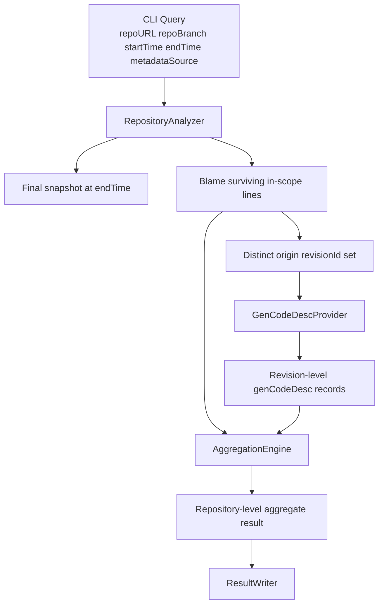
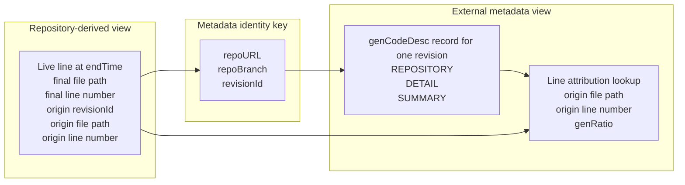

# AggregateGenCodeDesc Architecture Design

## Purpose

This document defines the intended runtime architecture for AggregateGenCodeDesc after the clarification that `genCodeDesc` is external revision metadata rather than repository content.

## Core Consensus

- source history lives in Git or SVN
- `genCodeDesc` lives outside the repository
- one `genCodeDesc` record describes one concrete revision
- the intended metadata lookup key is `repoURL + repoBranch + revisionId`
- the analyzer must discover relevant revisions from repository history before fetching the required `genCodeDesc` records

## Runtime Flow Diagram

This view emphasizes the execution order: discover surviving line origins from repository history first, then fetch only the required external metadata records.

## Data View

This section describes the main data shapes used by the runtime architecture.

### 1. Query View

The user-level analysis request contains repository identity plus a time window.

Current practical fields:

- `repoURL`
- `repoBranch`
- `startTime`
- `endTime`
- `vcsType`
- `metadataSource`
- `genCodeDescSetDir`

This layer answers:

- what repository should be analyzed
- what branch or path should be analyzed
- what time window defines the metric scope
- how revision-level metadata should be resolved in the current runtime mode

### 2. Repository-Derived View

The repository analysis layer derives the final live snapshot and line origins.

Important derived values:

- `endRevisionId`
- final live file path
- final live line number
- origin `revisionId`
- origin file path
- origin line number
- origin revision time

This layer answers:

- which lines survive at `endTime`
- which surviving lines are in scope for `startTime~endTime`
- which revision last introduced the current form of each surviving in-scope line

### 3. External Metadata View

The metadata layer stores one `genCodeDesc` record per revision.

Important fields inside one record:

- `protocolName`
- `protocolVersion`
- `SUMMARY`
- `DETAIL`
- `REPOSITORY.vcsType`
- `REPOSITORY.repoURL`
- `REPOSITORY.repoBranch`
- `REPOSITORY.revisionId`

This layer answers:

- which files were described for one revision
- which lines or ranges are AI-generated
- what `genRatio` applies to each described line

### 4. Join View

The analyzer joins repository-derived line origins with revision-level metadata.

Primary metadata identity key:

- `repoURL`
- `repoBranch`
- `revisionId`

Line-level lookup key after metadata is fetched:

- `origin file path`
- `origin line number`

This join produces the effective attribution input for aggregation.

This view emphasizes the two-stage join: first identify the correct revision-level metadata record, then resolve line-level `genRatio` inside that record.

### 5. Output View

The final output is a repository-level protocol-shaped aggregate record.

Important output fields:

- `protocolName`
- `protocolVersion`
- `SUMMARY.totalCodeLines`
- `SUMMARY.fullGeneratedCodeLines`
- `SUMMARY.partialGeneratedCodeLines`
- `REPOSITORY.vcsType`
- `REPOSITORY.repoURL`
- `REPOSITORY.repoBranch`
- `REPOSITORY.revisionId`

Field semantics:

- `SUMMARY.totalCodeLines`: only the code lines represented by that final result. For the current Model A metric, this means live source lines that still exist at `endTime` and whose current form originated inside `startTime~endTime`.
- `SUMMARY.fullGeneratedCodeLines`: represented lines whose AI attribution is full.
- `SUMMARY.partialGeneratedCodeLines`: represented lines whose AI attribution is partial.

This layer answers:

- what the final aggregate result is for the requested repository window
- which end revision the result corresponds to

### 6. Validation View

The current runtime must validate that fetched metadata belongs to the requested repository target.

Fields that should match during validation:

- query `vcsType` vs metadata `REPOSITORY.vcsType`
- query `repoURL` vs metadata `REPOSITORY.repoURL`
- query `repoBranch` vs metadata `REPOSITORY.repoBranch`
- requested `revisionId` vs metadata `REPOSITORY.revisionId`

This validation prevents the analyzer from silently joining the wrong metadata record to a real repository revision.

## Why This Matters

The analyzer answers one cross-system question:

`For the lines that survive in the final repository snapshot at endTime and whose current form originated inside startTime~endTime, how much is attributable to AI?`

That requires joining two systems:

- the repository system
  - tells us which files and lines survive at `endTime`
  - tells us which revision last introduced the current form of each surviving line
- the external metadata system
  - tells us, for a specific revision, which lines are AI-generated and by how much

Because of this split, `genCodeDesc` should not be modeled as repository content.

## High-Level Architecture

Recommended runtime components:

1. `RepositoryAnalyzer`
   - resolves the `endTime` snapshot
   - lists in-scope source files
   - runs blame with rename support
   - filters surviving lines by the requested time window

2. `GenCodeDescProvider`
   - fetches one revision-level metadata record using `repoURL + repoBranch + revisionId`
   - validates that the returned metadata belongs to the requested repository target

3. `AggregationEngine`
   - joins blame-discovered line origins with revision metadata
   - finds `genRatio` by `origin file + origin line`
   - computes final summary counts and later weighted ratio outputs

4. `ResultWriter`
   - emits the final protocol-shaped repository-level result

## Provider Split

The metadata provider should be a replaceable abstraction.

Recommended provider modes:

Current active provider mode:

- `metadataSource=genCodeDesc`
  - current active metadata source mode
  - in the current implementation, it is backed by `--genCodeDescSetDir`
- `genCodeDescSetDir`
  - local test adapter
  - resolves metadata from a directory that contains a set of revision-level `genCodeDesc` files
  - useful for unit and integration tests

The `genCodeDescSetDir` provider exists to keep tests narrow and reproducible.
It is not the intended production storage model.

## Recommended Data Flow

1. CLI receives:
   - `repoURL`
   - `repoBranch`
   - `startTime`
   - `endTime`
   - provider configuration
2. `RepositoryAnalyzer` resolves the final snapshot at `endTime`
3. `RepositoryAnalyzer` runs blame and discovers the origin revision for each surviving in-scope line
4. `RepositoryAnalyzer` produces the distinct set of required `revisionId` values
5. `GenCodeDescProvider` fetches one metadata record for each required revision
6. `AggregationEngine` looks up line-level `genRatio` using `origin file + origin line`
7. `ResultWriter` emits the final protocol-shaped aggregate result

## Join Key

The intended metadata identity is:

- `repoURL`
- `repoBranch`
- `revisionId`

The practical lookup algorithm is:

1. discover `revisionId` from blame
2. call metadata provider with repository identity plus that revision id
3. validate the returned `REPOSITORY` block

## Validation Rules

When a metadata record is fetched, the analyzer should validate:

- `REPOSITORY.vcsType` matches the active repository type
- `REPOSITORY.repoURL` matches the requested logical repository identity
- `REPOSITORY.repoBranch` matches the requested branch or path convention
- `REPOSITORY.revisionId` matches the requested revision

If the metadata store has a canonical repository identifier in the future, the analyzer can prefer that over raw URL string comparison.

## Current Implementation Status

Current state of the codebase:

- `aggregateGenCodeDesc.py` implements a first narrow `Model A` Git slice
- the current green `US-1` path uses a local directory-based lookup as a test seam
- repository-backed tests under `tests/` already validate real Git and SVN history behavior

What is still missing for the intended production architecture:

- a formal `GenCodeDescProvider` abstraction
- repository identity validation between query input and fetched metadata
- a future production-grade external metadata provider implementation

## Recommended Next Refactor

Before expanding more user stories, the next architectural refactor should be:

1. extract repository operations behind a repository adapter
2. extract metadata lookup behind `GenCodeDescProvider`
3. keep the current `genCodeDescSetDir` provider for tests
4. keep `US-1` green while changing internals behind that contract

## Relationship To Fixtures

`testdata/` remains useful as a design and fixture layer.

In that layer:

- local `genCodeDesc` files simulate the external metadata store
- `query.json` simulates user input
- `expected_result.json` simulates the golden aggregate output

So the fixture files are test doubles for the external metadata system, not evidence that production metadata should live inside the repository.
