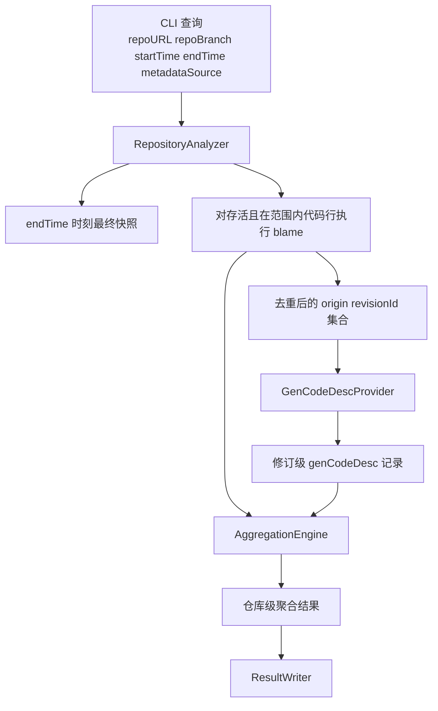
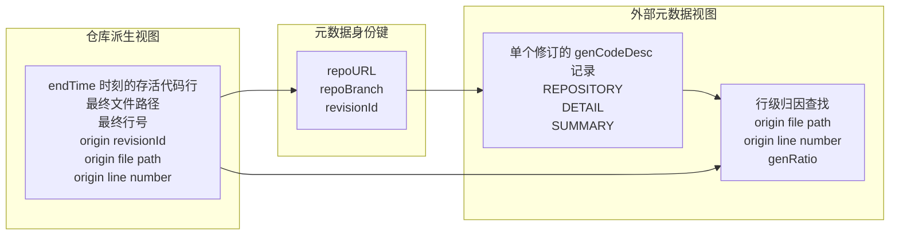

# AggregateGenCodeDesc 架构设计

## 目的

本文档定义 AggregateGenCodeDesc 的目标运行时架构。该架构基于一个已明确的前提：`genCodeDesc` 是外部修订级元数据，而不是仓库内容。

## 核心共识

- 源码历史存放在 Git 或 SVN 中
- `genCodeDesc` 存放在仓库之外
- 一条 `genCodeDesc` 记录描述一个具体修订
- 目标元数据查找键为 `repoURL + repoBranch + revisionId`
- 分析器必须先从仓库历史中发现相关修订，再去获取所需的 `genCodeDesc` 记录

## 运行时流程图

这个视图强调执行顺序：先从仓库历史中发现存活代码行的来源，再只获取真正需要的外部元数据记录。

## 数据视图

本节描述运行时架构中使用的主要数据形态。

### 1. 查询视图

用户级分析请求包含仓库身份和一个时间窗口。

当前实际字段包括：

- `repoURL`
- `repoBranch`
- `startTime`
- `endTime`
- `vcsType`
- `metadataSource`
- `genCodeDescSetDir`

这一层回答：

- 应分析哪个仓库
- 应分析哪个分支或路径
- 哪个时间窗口定义了指标范围
- 在当前运行模式下应如何解析修订级元数据

### 2. 仓库派生视图

仓库分析层派生出最终存活快照和代码行来源。

重要派生值包括：

- `endRevisionId`
- 最终存活文件路径
- 最终存活行号
- 来源 `revisionId`
- 来源文件路径
- 来源行号
- 来源修订时间

这一层回答：

- 哪些代码行在 `endTime` 时仍然存活
- 哪些存活代码行属于 `startTime~endTime` 的统计范围
- 哪个修订最后引入了每条存活且在范围内代码行的当前形态

### 3. 外部元数据视图

元数据层为每个修订存储一条 `genCodeDesc` 记录。

单条记录中的重要字段包括：

- `protocolName`
- `protocolVersion`
- `SUMMARY`
- `DETAIL`
- `REPOSITORY.vcsType`
- `REPOSITORY.repoURL`
- `REPOSITORY.repoBranch`
- `REPOSITORY.revisionId`

这一层回答：

- 某个修订描述了哪些文件
- 哪些行或行范围由 AI 生成
- 每条被描述代码行对应的 `genRatio` 是多少

### 4. 连接视图

分析器将仓库派生出的行来源与修订级元数据做连接。

主元数据身份键：

- `repoURL`
- `repoBranch`
- `revisionId`

在元数据获取完成后的行级查找键：

- `origin file path`
- `origin line number`

这个连接过程会生成用于聚合的有效归因输入。

这个视图强调两阶段连接：先定位正确的修订级元数据记录，再在该记录内部解析行级 `genRatio`。

### 5. 输出视图

最终输出是一个仓库级、协议形态的聚合结果记录。

重要输出字段包括：

- `protocolName`
- `protocolVersion`
- `SUMMARY.totalCodeLines`
- `SUMMARY.fullGeneratedCodeLines`
- `SUMMARY.partialGeneratedCodeLines`
- `REPOSITORY.vcsType`
- `REPOSITORY.repoURL`
- `REPOSITORY.repoBranch`
- `REPOSITORY.revisionId`

这一层回答：

- 给定仓库时间窗口的最终聚合结果是什么
- 该结果对应哪个结束修订

### 6. 校验视图

当前运行时必须校验获取到的元数据确实属于请求的仓库目标。

校验时必须匹配的字段：

- 查询 `vcsType` 与元数据 `REPOSITORY.vcsType`
- 查询 `repoURL` 与元数据 `REPOSITORY.repoURL`
- 查询 `repoBranch` 与元数据 `REPOSITORY.repoBranch`
- 请求的 `revisionId` 与元数据 `REPOSITORY.revisionId`

这类校验可以防止分析器把错误的元数据记录静默地连接到真实仓库修订上。

## 为什么这很重要

分析器要回答的是一个跨系统问题：

`在 endTime 时最终仓库快照中仍然存活，并且其当前形态起源于 startTime~endTime 内的代码行中，有多少可归因于 AI？`

这需要连接两个系统：

- 仓库系统
  - 告诉我们哪些文件和代码行在 `endTime` 时仍然存活
  - 告诉我们每条存活代码行当前形态最后由哪个修订引入
- 外部元数据系统
  - 告诉我们某个具体修订中的哪些代码行由 AI 生成，以及生成比例是多少

正因为存在这种分离，`genCodeDesc` 不应被建模为仓库内容。

## 高层架构

推荐的运行时组件包括：

1. `RepositoryAnalyzer`
   - 解析 `endTime` 对应的快照
   - 列出属于范围的源码文件
   - 运行带 rename 支持的 blame
   - 按请求时间窗口过滤存活代码行

2. `GenCodeDescProvider`
   - 使用 `repoURL + repoBranch + revisionId` 获取一条修订级元数据记录
   - 校验返回的元数据属于请求的仓库目标

3. `AggregationEngine`
   - 将 blame 得到的代码行来源与修订级元数据做连接
   - 通过 `origin file + origin line` 查找 `genRatio`
   - 计算最终 summary 计数，后续也可扩展到加权比例输出

4. `ResultWriter`
   - 输出最终的仓库级协议形态结果

## Provider 划分

元数据提供者应是一个可替换的抽象。

当前启用的 provider 模式：

- `metadataSource=genCodeDesc`
  - 当前启用的元数据来源模式
  - 在当前实现中，它由 `--genCodeDescSetDir` 支撑
- `genCodeDescSetDir`
  - 本地测试适配器
  - 从一个目录中解析一组修订级别的 `genCodeDesc` 文件
  - 适用于单元测试和集成测试

`genCodeDescSetDir` provider 的存在是为了让测试保持收敛且可复现。
它不是目标生产存储模型。

## 推荐数据流

1. CLI 接收：
   - `repoURL`
   - `repoBranch`
   - `startTime`
   - `endTime`
   - provider 配置
2. `RepositoryAnalyzer` 解析 `endTime` 时刻的最终快照
3. `RepositoryAnalyzer` 运行 blame，并发现每条存活且在范围内代码行的来源修订
4. `RepositoryAnalyzer` 产出所需 `revisionId` 的去重集合
5. `GenCodeDescProvider` 为每个所需修订获取一条元数据记录
6. `AggregationEngine` 用 `origin file + origin line` 查找行级 `genRatio`
7. `ResultWriter` 输出最终协议形态的聚合结果

## 连接键

目标元数据身份为：

- `repoURL`
- `repoBranch`
- `revisionId`

实际查找算法为：

1. 通过 blame 发现 `revisionId`
2. 用仓库身份加该修订 id 调用元数据 provider
3. 校验返回的 `REPOSITORY` 块

## 校验规则

当获取一条元数据记录时，分析器应校验：

- `REPOSITORY.vcsType` 与当前仓库类型一致
- `REPOSITORY.repoURL` 与请求的逻辑仓库身份一致
- `REPOSITORY.repoBranch` 与请求的分支或路径约定一致
- `REPOSITORY.revisionId` 与请求的修订一致

如果未来元数据存储中存在规范化的仓库标识符，则分析器可以优先使用它，而不是直接做原始 URL 字符串比较。

## 当前实现状态

当前代码库状态：

- `aggregateGenCodeDesc.py` 已实现一个狭窄的 `Model A` Git 切片
- 当前已通过的 `US-1` 路径使用本地目录查找作为测试缝隙
- `tests/` 下基于真实仓库的测试已经验证了 Git 和 SVN 的历史行为

距离目标生产架构仍缺少：

- 一个正式的 `GenCodeDescProvider` 抽象
- 查询输入与获取到的元数据之间更完整的仓库身份校验
- 面向未来生产环境的外部元数据 provider 实现

## 推荐的下一步重构

在扩展更多用户故事之前，下一步架构重构应为：

1. 将仓库操作抽取到一个 repository adapter 后面
2. 将元数据查找抽取到 `GenCodeDescProvider` 后面
3. 为测试继续保留当前的 `genCodeDescSetDir` provider
4. 在内部重构的同时保持 `US-1` 继续为绿色

## 与夹具的关系

`testdata/` 仍然是一个有价值的设计和夹具层。

在该层里：

- 本地 `genCodeDesc` 文件用于模拟外部元数据存储
- `query.json` 用于模拟用户输入
- `expected_result.json` 用于模拟黄金聚合输出

因此，这些夹具文件是外部元数据系统的测试替身，而不是生产元数据应当存放在仓库中的证据。
