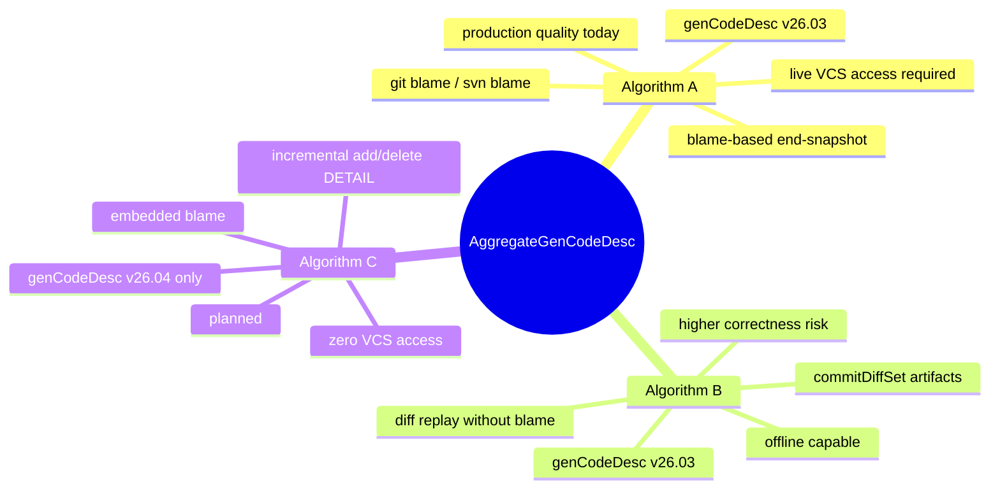
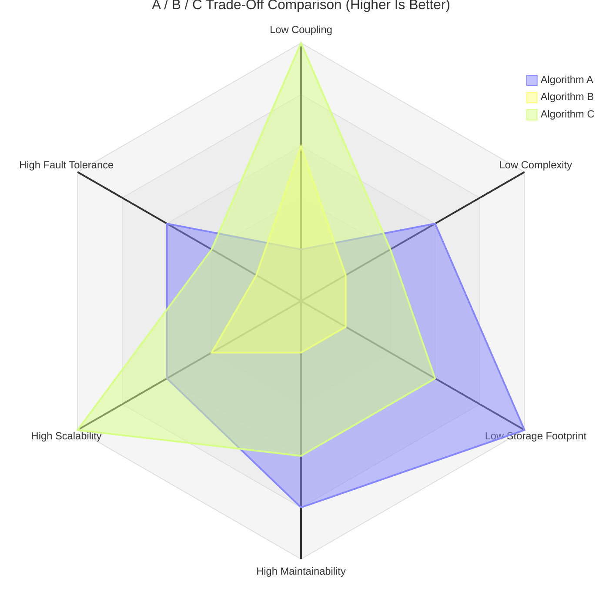
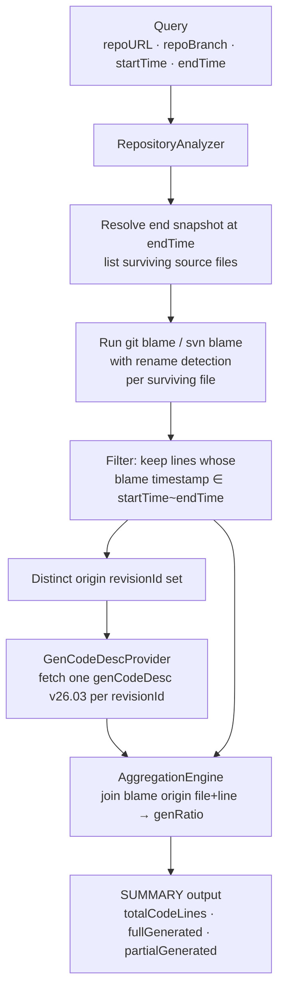
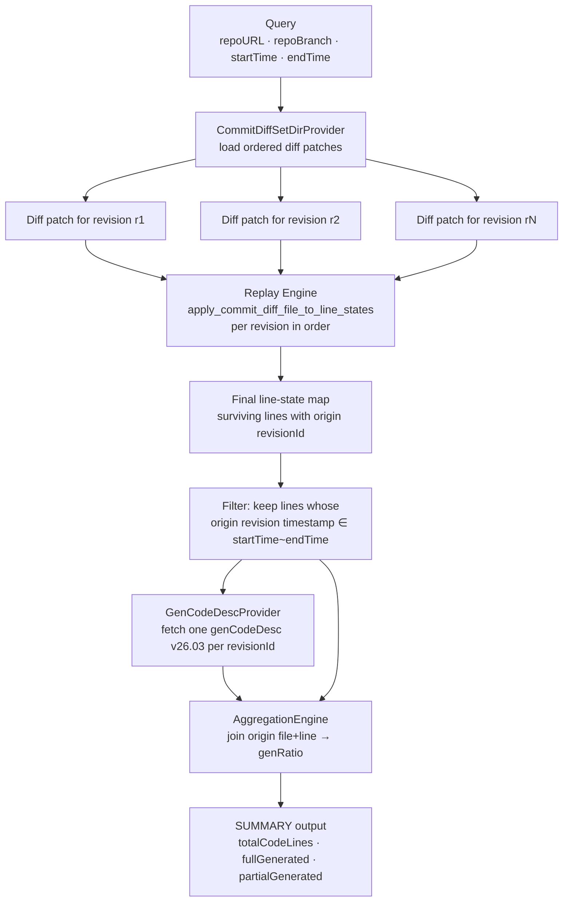
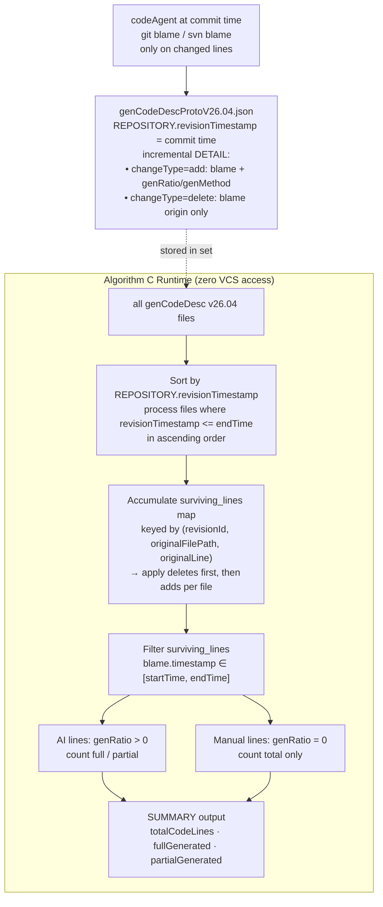
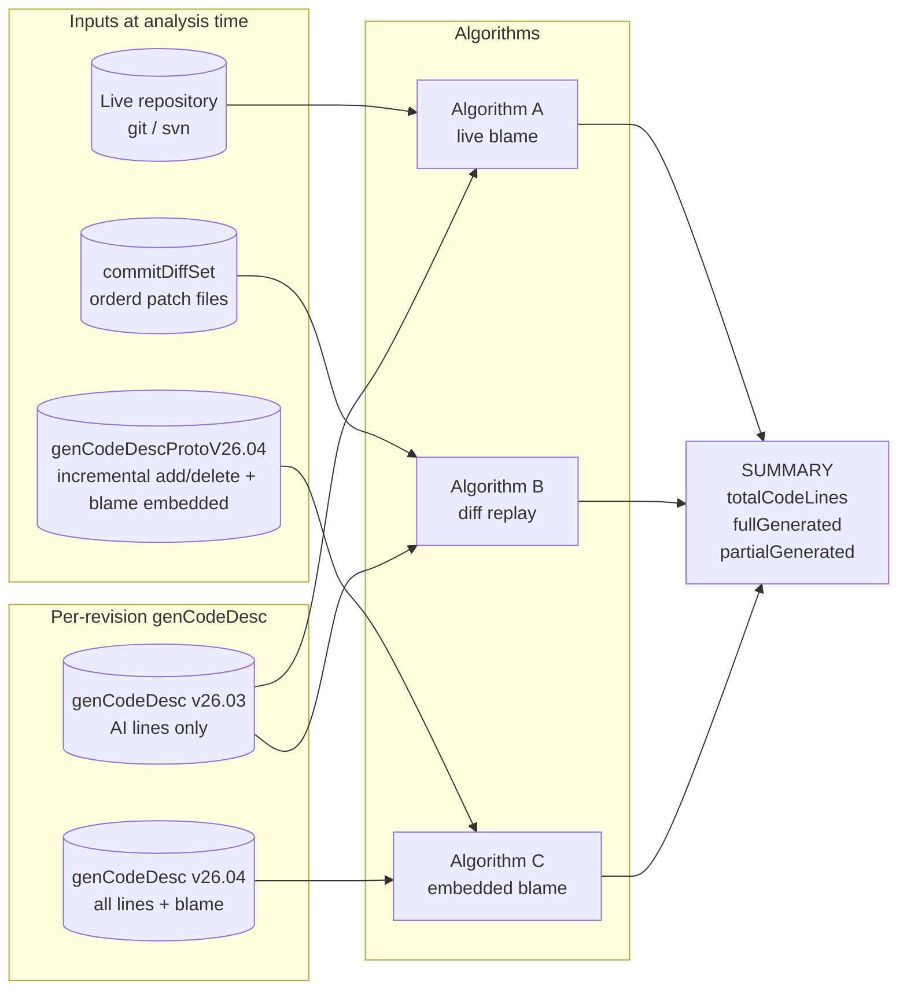
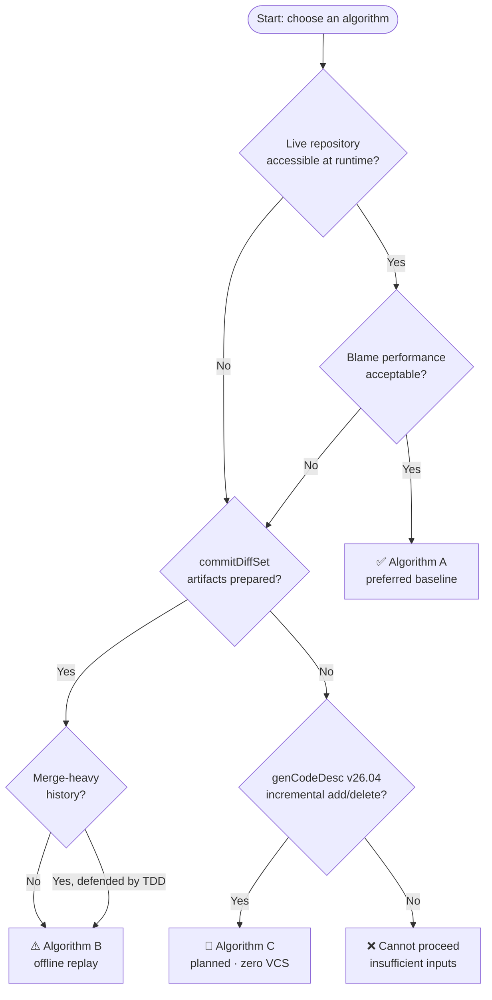

# AggregateGenCodeDesc — Introduction to Algorithm A, B, and C

## Purpose

This document introduces the three attribution algorithms implemented or planned in
AggregateGenCodeDesc and explains what problem each solves, what its inputs are,
and what pitfalls it still carries.

The shared goal of all three algorithms is identical:

> For the source-code lines that survive in the final repository snapshot at `endTime`
> and whose current form originated inside `[startTime, endTime]`,
> how much is attributable to AI?

The algorithms differ in **how they discover line origins** — not in what they measure.

---

## One-Glance Comparison

| | **Algorithm A** | **Algorithm B** | **Algorithm C** |
|---|---|---|---|
| Core technique | live `git/svn blame` | offline diff replay | embedded `blame` in genCodeDesc |
| Repository access at runtime | **required** | not required | **not required** |
| genCodeDesc version | v26.03 | v26.03 | **v26.04** |
| DETAIL completeness | AI lines only | AI lines only | **incremental: adds + deletes per commit** |
| Needs per-commit diff patch at runtime | no | **yes, one patch per replayed revision in offline mode** | no |
| Information security | live repo and VCS credentials may be exposed at runtime | runtime can stay repo-isolated, but exported patch artifacts still carry source diffs | smallest runtime exposure; only v26.04 files are needed, but embedded blame metadata is still sensitive |
| Account coupling | strongest: runtime access is tied to repository account / checkout ACL | weaker at runtime after artifact export; coupling moves to the export pipeline | weakest at runtime after file delivery; coupling moves to the write-time codeAgent pipeline |
| Storage capacity | lowest extra artifact storage | highest: stores per-revision diff patches plus v26.03 metadata | medium: stores per-revision v26.04 incremental add/delete records with embedded blame |
| Redundancy | lowest duplication; lineage stays in VCS | highest duplication; history is duplicated into patch stream plus genCodeDesc metadata | medium redundancy; blame lineage is duplicated into genCodeDesc but diff artifacts are avoided |
| Production status | production quality | narrow replay paths active | planned |
| Correctness authority | VCS blame (authoritative) | rebuilt partial blame (risk) | codeAgent at write time (trusted) |

### Operational Trade-Offs

- Information security: Algorithm A keeps the strongest dependency on live repository access, credentials, and checkout hygiene. Algorithm B and C reduce runtime exposure, but both shift trust to exported artifacts that must still be handled as sensitive source-derived data.
- Account coupling: Algorithm A is directly bound to the repository account and local checkout at analysis time. Algorithm B and C decouple the runtime from repository accounts, but only because an earlier export pipeline already had that access.
- Storage capacity: Algorithm A minimizes extra storage. Algorithm B is the heaviest because offline replay needs a replay-complete patch stream in addition to per-revision metadata. Algorithm C removes patch storage, but still accumulates one v26.04 file per revision.
- Redundancy: Algorithm B duplicates the most historical information because both patch content and genCodeDesc metadata encode parts of the same lineage. Algorithm C still duplicates blame lineage into metadata, but avoids carrying a second diff stream.

### Holistic Strengths And Weaknesses

| Dimension | **Algorithm A** | **Algorithm B** | **Algorithm C** |
|---|---|---|---|
| Coupling | Highest coupling to the live repository, VCS CLI, account permissions, and local checkout | Decoupled from the live repo at runtime, but tightly coupled to the patch export pipeline, naming contract, and replay ordering | Most decoupled from the live repo at runtime, but tightly coupled to write-time protocol quality and embedded-blame completeness |
| Implementation complexity | Medium: relies on mature blame behavior, so the surrounding system is comparatively direct | Highest: effectively rebuilds a partial blame engine and must handle patch ordering, rename behavior, merges, and SVN edge cases | Medium-high: runtime is simpler, but protocol design, write-time constraints, and end-to-end consistency are demanding |
| Storage footprint | Smallest, because only per-revision metadata is added | Largest, because it needs both the per-revision patch stream and per-revision metadata | Medium, because it stores per-revision incremental v26.04 files but no extra patch stream |
| Maintainability | Better: most failures converge on VCS blame behavior or query wiring | Weakest: replay logic, patch contracts, and edge cases make testing and debugging expensive | Medium: the consumer is easier to maintain, but protocol evolution must keep writer and consumer contracts aligned |
| Scalability | Medium: correctness is easier to preserve, but blame cost rises on very large repositories or files | Depends on patch volume and replay window length; long-history replay can become CPU and IO heavy | Strongest long-term potential: runtime is mostly sequential file parsing plus state accumulation, which fits offline batch and air-gapped deployments well |
| Fault tolerance | Medium: missing genCodeDesc can often degrade to unattributed lines, but repository unavailability blocks execution | Weak: any missing patch, wrong ordering, or naming drift can fail fast or silently misattribute | Weak-to-medium: runtime has fewer external dependencies, but once embedded blame or the incremental chain is corrupted, the consumer cannot independently repair it |
| Correctness explainability | Strongest: attribution can be traced back directly to VCS blame | Weaker: explanation depends on trusting the replay engine's reconstructed line-state history | Medium: attribution can be explained through embedded blame, but the consumer cannot independently re-validate against VCS at analysis time |

### Radar View Of Trade-Offs

Interpretation: scores range from `1` to `5`, and **higher is better**.

- Coupling: lower coupling receives a higher score.
- Implementation complexity: lower complexity receives a higher score.
- Storage footprint: lower extra storage receives a higher score.
- Maintainability, scalability, and fault tolerance: stronger capability receives a higher score.
- This chart is a normalized qualitative view for fast architectural comparison, not a benchmark.

Axis mapping:

- `coupling` = Low Coupling
- `complexity` = Low Complexity
- `storage` = Low Storage Footprint
- `maintainability` = High Maintainability
- `scalability` = High Scalability
- `faultTolerance` = High Fault Tolerance
- `a` = Algorithm A
- `b` = Algorithm B
- `c` = Algorithm C

In practical terms:

- If the priority is authoritative correctness, explainability, and conservative production readiness, Algorithm A remains the safest baseline.
- If the priority is repository-free runtime and the team can absorb the highest implementation and maintenance cost, Algorithm B can be justified; its offline benefit comes with the largest systems burden.
- If the priority is offline execution, low runtime coupling, and long-term scalability, Algorithm C has the strongest architectural upside; however, it shifts correctness pressure upstream into protocol governance and write-time data quality gates.

### The Irreplaceable Advantage Of Each Algorithm

- Algorithm A's irreplaceable advantage: it is the only one of the three that can rely directly on live VCS blame as the authoritative fact source at analysis time. Because of that, when the team cares most about being able to trace results back to raw Git / SVN evidence, resolve disputes with direct repository proof, and minimize logical attribution risk, A has no true equivalent substitute.
- Algorithm B's irreplaceable advantage: it is the best fit for consuming an explicit historical patch stream. Because of that, when the team wants not only end-snapshot attribution but also deterministic replay, history-window experiments, process reconstruction, and repository-free re-execution from the same patch artifacts, B provides something distinct; A cannot do fully offline historical replay, and C does not preserve patch-level process detail.
- Algorithm C's irreplaceable advantage: it is the only one of the three that simultaneously achieves zero repository access and zero diff replay at runtime. Because of that, in air-gapped environments, edge deployments, large-scale offline batch processing, or minimal-runtime-permission architectures, C has a deployment advantage that the others cannot match; A needs the repository, B needs the patch stream, while C only needs the v26.04 file set.

Put differently:

- A is irreplaceable for **authority and accountability**.
- B is irreplaceable for **patch-driven historical replay**.
- C is irreplaceable for **minimal-runtime-dependency offline scalability**.

---

## Algorithm A — Blame-Based End-Snapshot Attribution

### What it is

Algorithm A is the primary, production-quality baseline.
It starts from the live file snapshot at `endTime`, runs `git blame` or `svn blame`
on every surviving source line, and uses the blame result to discover which commit
last introduced the current form of each line.
Lines whose origin commit falls inside `[startTime, endTime]` are in scope.
For each in-scope line, Algorithm A looks up `genRatio` from the matching
per-revision `genCodeDesc` (v26.03) record.

### Data Flow

### What problem it solves

- Directly answers the P0 metric on the live snapshot.
- Rename and move detection is handled by mature VCS blame implementations.
- Low logical risk: blame is the authoritative source of line origin; no partial reconstruction needed.
- Works for both Git and SVN.

### Pitfalls

| Pitfall | Detail |
|---|---|
| Requires live repository access | A local checkout must be present at runtime. The current implementation does not clone or fetch remote repositories automatically. `--workingDir` is required when `--repoURL` is a logical URL. |
| Blame performance on large repositories | `git/svn blame` runs per surviving file. Large repos with many large files can make this slow. |
| Depends on VCS blame quality | Blame correctness is only as good as the VCS implementation. SVN blame with complex mergeinfo or path-copy history may return imprecise results. |
| per-revision genCodeDesc required | One v26.03 file must exist for every origin revision discovered by blame. Missing records are treated as unattributed, not as an error. |
| Remote transport is out of scope | Network-accessing remote-repository clients are not validated. |

---

## Algorithm B — Incremental Lineage Reconstruction Without Blame

### What it is

Algorithm B replays an ordered sequence of commit diff patches (`commitDiffSet`)
to reconstruct line ownership incrementally.
Instead of asking the VCS "who last changed this line?", it simulates the history
by applying diffs in order and tracking which commit introduced each surviving line.
No live repository access is needed at runtime.
In the current offline contract, that means every replayed commit/revision up to the
target `endTime` must have its corresponding diff patch available.

### Data Flow

### What problem it solves

- Enables offline analysis without a live repository checkout.
- Useful when blame is operationally slow or unavailable.
- Diff artifacts can be pre-indexed and queried cheaply.
- Can compute history-process metrics beyond live-snapshot attribution.
- Enables deterministic replay in test environments.

### Pitfalls

| Pitfall | Detail |
|---|---|
| Correctness risk is higher | Algorithm B effectively rebuilds a partial blame engine. Any gap in the replay logic produces wrong attributions silently. |
| commitDiffSet artifacts must be prepared | Yes for the current offline AlgB contract: one unified-diff patch file per replayed revision must exist before the run. Missing patches cause the contract to fail fast. |
| Merge-aware lineage replay is complex | Choosing a defensible first-parent vs merged-parent accounting policy for merge commits is non-trivial. Production readiness for merge-heavy histories requires explicit TDD before any claim is safe. |
| SVN parity is limited | SVN path-copy and mergeinfo semantics introduce replay edge cases that are not yet fully covered. |
| Scalability not yet independently validated | Do not reuse Algorithm A production-readiness evidence as Algorithm B evidence. A dedicated scalability gate is required. |
| Still needs per-revision genCodeDesc v26.03 | Same metadata dependency as Algorithm A; only the blame step is removed. |

---

## Algorithm C — Embedded Blame, Pure genCodeDesc

### What it is

Algorithm C is a planned offline algorithm that requires **no repository access and
no diff artifacts at runtime**.
The codeAgent records only the lines **added** or **deleted** in each commit, with
real `git blame` or `svn blame` info per added line, into a `genCodeDescProtoV26.04.json` file.
That embedded blame must come directly from the VCS blame output captured at write time,
not from later inference, replay reconstruction, or manual editing.
Because each add entry carries `blame.revisionId`, `blame.originalFilePath`,
`blame.originalLine`, and `blame.timestamp`, a downstream consumer can accumulate
the full surviving-line set across all files up to `endTime`, apply the
`[startTime, endTime]` filter, and read `genRatio` directly — no VCS, no diffs needed.

DETAIL is **incremental**: each commit's file records only `changeType=add` and
`changeType=delete` entries for lines changed in that commit.
Human lines added by a commit are recorded as `genRatio=0 / genMethod=Manual`.
A line deleted in a commit is recorded with just its blame origin (revisionId +
originalFilePath + originalLine) — enough to remove it from the accumulated set.

### Data Flow

### What problem it solves

- Zero VCS access at analysis time — no checkout, no subprocess, no network.
- Small per-commit files: only changed lines are recorded, not the full snapshot.
- Same metric semantics as Algorithm A and Algorithm B.
- Works for both Git-origin and SVN-origin blame (VCS type is embedded metadata).
- Air-gapped or edge deployments: analysis needs only the set of v26.04 files.

### Pitfalls

| Pitfall | Detail |
|---|---|
| Requires **all** genCodeDesc files up to `endTime` | AlgC must process every commit's file from the beginning up to endRevision to accumulate the surviving-line set. A missing file in the chain corrupts the result. |
| `REPOSITORY.revisionTimestamp` is mandatory | AlgC uses this field to sort and select which files to process. Without it, AlgC cannot determine processing order. |
| Delete entries must reference the exact blame origin | `blame.revisionId + originalFilePath + originalLine` must precisely match the earlier add entry. A mismatch silently leaves a ghost line in the accumulated set. |
| Embedded blame must be real VCS blame | AlgC assumes the embedded blame came directly from real `git blame` or `svn blame` output captured at write time. Synthetic, inferred, or manually edited blame breaks the AlgC contract. |
| Blame accuracy depends on codeAgent | Correctness at consume time is entirely trusted from the codeAgent's write-time blame call. No independent VCS verification is possible during analysis. |
| lineRange constraint for add entries | A lineRange entry is only valid when all lines share the same blame origin. Lines with different blame origins must each have a separate entry. |
| No catch for stale blame | If a force-push or amend happens after the file was written, the embedded blame is silently stale. |
| Implementation not yet started | Algorithm C is planned only. Protocol shape is defined in `genCodeDescProtoV26.04.json`; no runtime exists yet. |

---

## How the Three Algorithms Relate

The three algorithms are **semantically equivalent** for the same scenario.
The choice is driven by what is available and what trade-offs are acceptable:

---

## Summary: What Each Algorithm Leaves Unsolved

| | **Algorithm A** | **Algorithm B** | **Algorithm C** |
|---|---|---|---|
| Works without a live repository | ❌ | ✅ | ✅ |
| Works without diff artifacts | ✅ | ❌ | ✅ |
| Correctness authority | VCS blame (highest) | rebuilt partial blame (medium) | codeAgent write-time (trusted but unverifiable at consume time) |
| Merge-heavy history at scale | ✅ | ⚠️ needs explicit TDD per topology | ✅ (blame already resolved at write time) |
| Large-repo performance risk | blame can be slow | replay can be slow for long windows | file parsing only — scales with DETAIL size |
| Remote repository support | ⚠️ not yet validated | ✅ (no VCS needed) | ✅ (no VCS needed) |
| Production status | ✅ production quality | ⚠️ narrow paths active | 🔬 planned |
