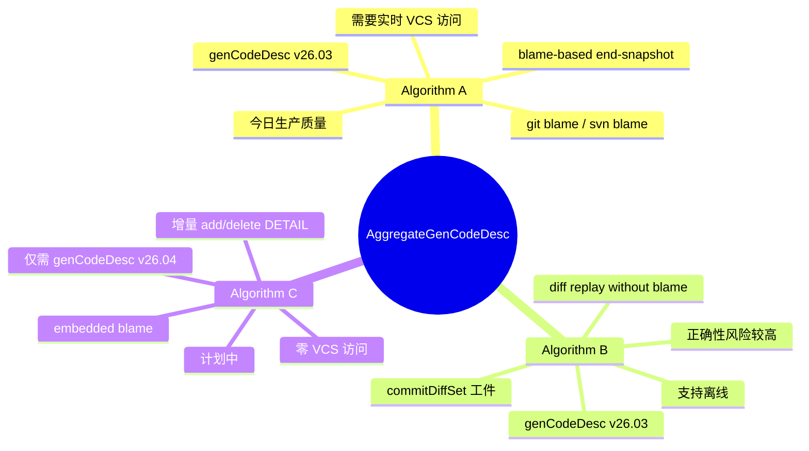
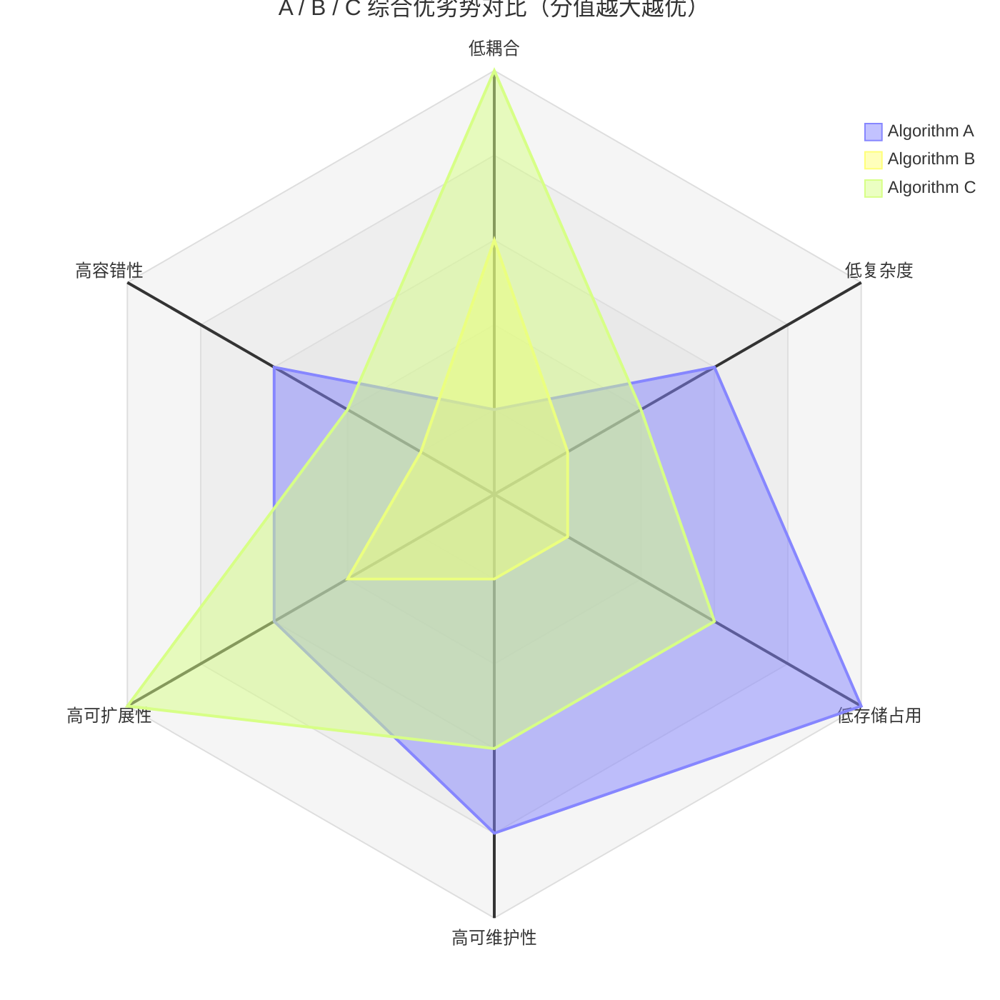
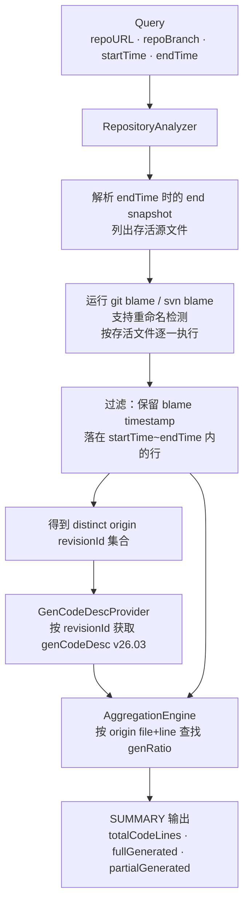
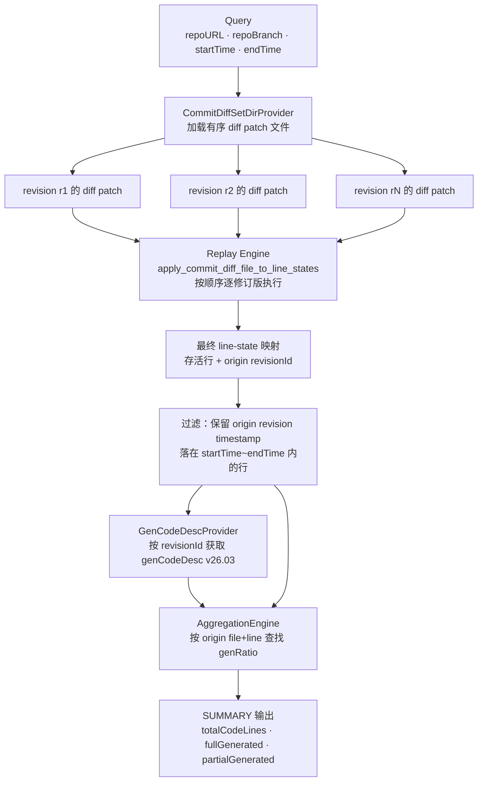
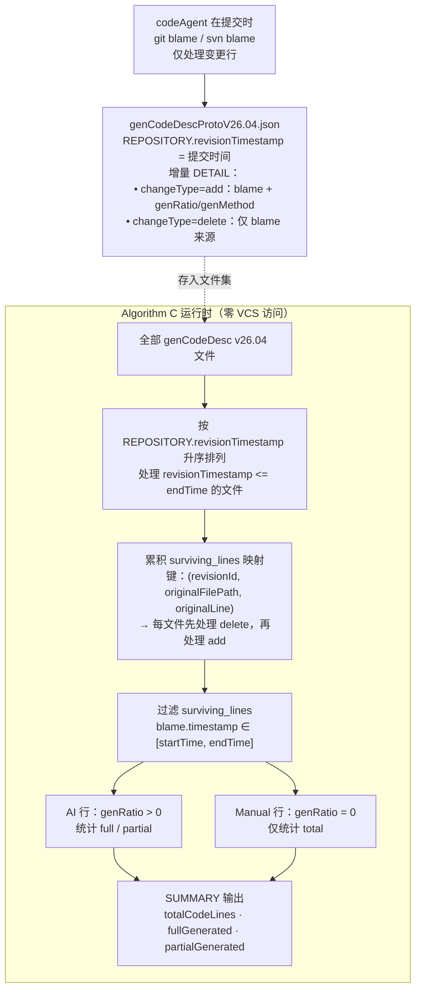
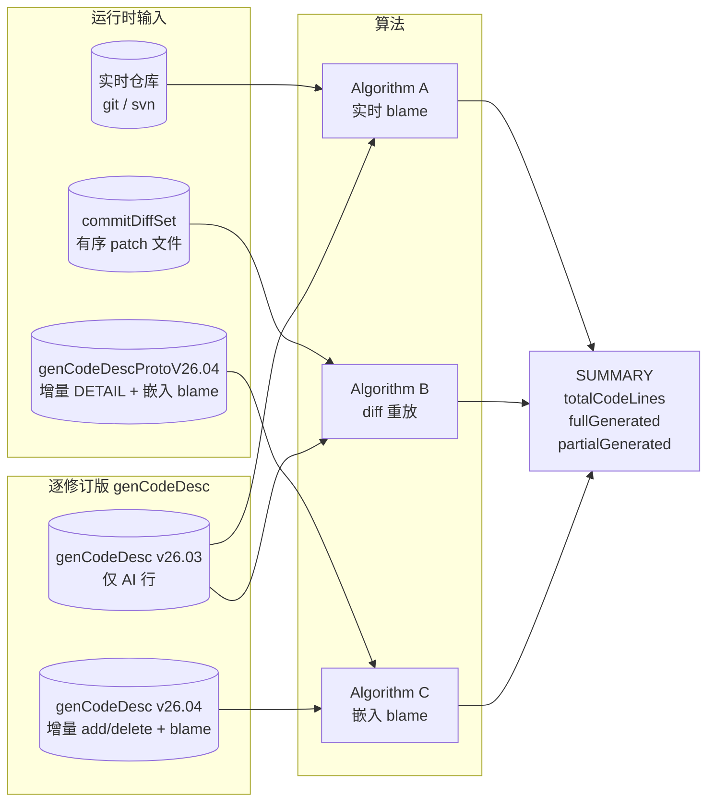
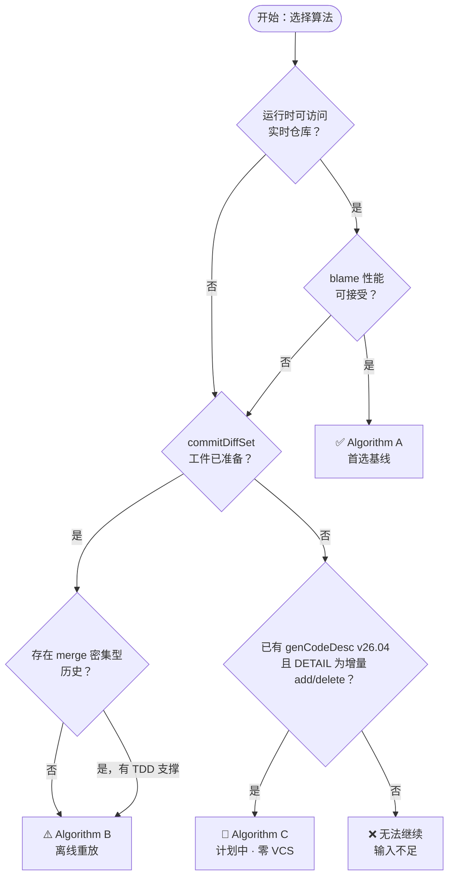

# AggregateGenCodeDesc — Algorithm A、B、C 简介

## 目的

本文档介绍 AggregateGenCodeDesc 中已实现或计划实现的三种归因算法，
说明每种算法解决了什么问题、输入是什么，以及各自仍存在哪些局限。

三种算法的共同目标完全一致：

> 对于在 `endTime` 时仍存活于最终仓库快照中、且其当前形态在 `[startTime, endTime]` 内产生的源代码行，
> 有多少可以归因于 AI？

三种算法的区别在于**如何发现每行的来源**——而非度量什么。

---

## 一图速览

| | **Algorithm A** | **Algorithm B** | **Algorithm C** |
|---|---|---|---|
| 核心技术 | 实时 `git/svn blame` | 离线 diff 重放 | genCodeDesc 中嵌入的 `blame` |
| 运行时是否需要仓库访问 | **需要** | 不需要 | **不需要** |
| genCodeDesc 版本 | v26.03 | v26.03 | **v26.04** |
| DETAIL 完整性要求 | 仅 AI 行 | 仅 AI 行 | **增量：每次提交的 add + delete** |
| 运行时是否需要每提交 diff patch | 不需要 | **需要，离线模式下每个被重放版本都要一份 patch** | 不需要 |
| 信息安全 | 运行时暴露实时仓库与 VCS 凭据风险最高 | 运行时可与仓库隔离，但导出的 patch 工件仍然属于敏感源码派生物 | 运行时暴露面最小；仅需 v26.04 文件，但嵌入 blame 元数据仍属敏感信息 |
| 账户关联 | 最强：运行时直接绑定仓库账号 / checkout ACL | 运行时关联较弱，关联被前移到工件导出流水线 | 运行时关联最弱，关联被前移到写入时的 codeAgent 流水线 |
| 存储容量 | 额外工件存储最低 | 最高：既要逐版本 diff patch，又要 v26.03 元数据 | 中等：逐版本保存 v26.04 增量 add/delete 与嵌入 blame |
| 冗余度 | 最低，谱系主要保留在 VCS 中 | 最高，patch 流与 genCodeDesc 同时重复承载历史信息 | 中等，把 blame 谱系复制进 genCodeDesc，但不再保存第二套 diff 流 |
| 生产状态 | 生产质量 | 窄化回放路径已激活 | 计划中 |
| 正确性权威来源 | VCS blame（权威） | 重建的部分 blame 引擎（存在风险） | codeAgent 写入时（可信但消费时不可独立验证） |

### 工程运维层面的取舍

- 信息安全：Algorithm A 最依赖实时仓库、凭据与本地 checkout 的安全边界。Algorithm B 与 C 降低了分析时暴露面，但都把风险前移到工件导出阶段，因此导出物仍应按敏感源码数据管理。
- 账户关联：Algorithm A 在分析时直接绑定仓库账户权限。Algorithm B 与 C 在运行时可以脱离仓库账户，但前提是更早的导出 / 写入流程已经拥有该访问权限。
- 存储容量：Algorithm A 额外存储最省。Algorithm B 最重，因为离线重放需要一条完整 patch 流，还要保留逐版本元数据。Algorithm C 去掉 patch 后更轻，但仍需要为每个版本保存一份 v26.04 增量记录。
- 冗余度：Algorithm B 的历史信息冗余最高，因为 patch 内容与 genCodeDesc 元数据都在重复表达同一段谱系。Algorithm C 仍把 blame 谱系复制进元数据，但避免了额外 diff 流。

### 综合优劣势分析

| 维度 | **Algorithm A** | **Algorithm B** | **Algorithm C** |
|---|---|---|---|
| 耦合性 | 与实时仓库、VCS CLI、账户权限、本地 checkout 耦合最高 | 与运行时仓库解耦，但与 patch 导出流水线、patch 命名规范、重放顺序强耦合 | 与运行时仓库最解耦，但与写入时协议质量、嵌入 blame 完整性强耦合 |
| 实现复杂度 | 中等：核心依赖成熟 blame 能力，系统拼装相对直接 | 最高：本质是在重建部分 blame 引擎，还要处理 patch 顺序、重命名、merge、SVN 特例 | 中高：运行时较简单，但协议设计、写入端约束、全链路一致性要求高 |
| 存储空间 | 最省，额外只需逐版本元数据 | 最大，需要逐版本 patch 流加逐版本元数据 | 中等，需要逐版本增量 v26.04 文件，但不需要额外 patch 流 |
| 可维护性 | 较好：问题大多收敛到 VCS blame 与查询拼接 | 最差：回放逻辑、patch 契约、边界条件多，测试和排障成本最高 | 中等：消费端较好维护，但协议一旦演进，需要同时维护写入端与消费端契约 |
| 可扩展性 | 中等：正确性容易守住，但大仓库 / 大文件下 blame 成本可能上升 | 取决于 patch 规模与窗口长度，长历史重放的 CPU / IO 压力明显 | 最强潜力：运行时主要是顺序读文件和累积状态，更适合离线批处理与气隔场景 |
| 容错性 | 中等：缺失部分 genCodeDesc 通常可降级为未归因，但仓库不可达会直接阻断运行 | 较差：缺任意 patch、patch 次序错误、命名混乱都容易快速失败或静默错归因 | 较差到中等：运行时少依赖外部系统，但一旦嵌入 blame 或增量链条有缺口，消费阶段难以自证修复 |
| 正确性可解释性 | 最强：可直接回到 VCS blame 解释来源 | 较弱：需要解释 replay 引擎为何得出当前 line-state | 中等：能解释到嵌入 blame，但无法在消费时独立向 VCS 再验证 |

### 综合优劣势雷达图

说明：下图分值范围为 `1~5`，且**分值越大越优**。这意味着：

- 耦合性：越低耦合，分越高。
- 实现复杂度：越低复杂度，分越高。
- 存储空间：额外占用越小，分越高。
- 可维护性、可扩展性、容错性：能力越强，分越高。
- 该图是帮助快速理解架构取舍的定性归一化视图，不是压测或 benchmark 结果。

轴标签映射：

- `coupling` = 低耦合
- `complexity` = 低复杂度
- `storage` = 低存储占用
- `maintainability` = 高可维护性
- `scalability` = 高可扩展性
- `faultTolerance` = 高容错性
- `a` = Algorithm A
- `b` = Algorithm B
- `c` = Algorithm C

结论上：

- 如果优先级是正确性权威、问题可解释性、生产落地稳健性，Algorithm A 仍是最保守也最可信的基线。
- 如果优先级是运行时脱离仓库，且能够承担最高的实现复杂度与维护成本，Algorithm B 才有意义；它的主要优势是离线，但代价也是最大的系统复杂度。
- 如果优先级是离线运行、低运行时耦合、长期可扩展性，Algorithm C 的架构潜力最好；但它把正确性压力前移到了写入端协议治理，因此前置数据质量门禁必须非常严格。

### AlgA / B / C 各自不可替代性的优势

- Algorithm A 不可替代的优势：它是三者中唯一能够在分析时直接依赖实时 VCS blame 作为权威事实源的方案。也因此，当团队最看重“结果必须能回到 Git / SVN 原始证据解释”“线上争议要能直接复核”“需要把逻辑风险压到最低”时，A 没有真正等价替代品。
- Algorithm B 不可替代的优势：它是三者中最适合消费显式历史 patch 流的方案。也因此，当团队不仅要看 end snapshot 归因，还要把同一套 patch 工件用于历史重放、窗口实验、过程回溯、脱离仓库的确定性回放时，B 具备独特价值；A 做不到完全离线历史重放，C 也不保留 patch 级过程信息。
- Algorithm C 不可替代的优势：它是三者中唯一同时做到“运行时零仓库访问”和“运行时零 diff replay”的方案。也因此，在气隔环境、边缘节点、大规模离线批处理、最小运行时权限暴露这类场景里，C 的运行时部署优势不可替代；A 需要仓库，B 需要 patch 流，而 C 只需要 v26.04 文件集。

换句话说：

- A 的不可替代性，在于**权威性与可追责性**。
- B 的不可替代性，在于**patch 驱动的历史过程重放能力**。
- C 的不可替代性，在于**最小运行时依赖下的离线规模化部署能力**。

---

## Algorithm A — 基于 Blame 的 End-Snapshot 归因

### 是什么

Algorithm A 是主要的、生产质量的基线算法。
它从 `endTime` 时的存活文件快照出发，对每条存活源代码行运行 `git blame` 或 `svn blame`，
利用 blame 结果发现每行当前形态最后是由哪个提交引入的。
来源提交落在 `[startTime, endTime]` 内的行处于度量范围内。
对于每条范围内的行，Algorithm A 从匹配的逐修订版 `genCodeDesc`（v26.03）记录中查找 `genRatio`。

### 数据流

### 解决了什么问题

- 直接回答 live snapshot 上的 P0 度量。
- 重命名与移动检测由成熟的 VCS blame 实现负责处理。
- 逻辑风险低：blame 是行来源的权威来源，无需部分重建。
- 同时支持 Git 与 SVN。

### 局限（Pitfalls）

| 局限 | 说明 |
|---|---|
| 需要实时仓库访问 | 运行时必须存在本地 checkout。当前实现不会自动 clone 或 fetch 远程仓库。当 `--repoURL` 是逻辑 URL 时，需要提供 `--workingDir`。 |
| 大型仓库中 blame 性能可能较慢 | `git/svn blame` 按存活文件逐一运行。文件数量多、文件体积大时速度可能较慢。 |
| 依赖 VCS blame 质量 | blame 的正确性取决于 VCS 实现。带有复杂 mergeinfo 或 path-copy 历史的 SVN blame 可能返回不精确的结果。 |
| 每个 origin revision 均需 genCodeDesc | blame 发现的每个来源修订版本都必须存在一份 v26.03 文件。缺失的记录被视为未归因，而非报错。 |
| 远程传输超出当前范围 | 网络访问型远程仓库客户端尚未经过验证。 |

---

## Algorithm B — 无需 Blame 的增量谱系重建

### 是什么

Algorithm B 通过重放一组有序的提交 diff patch（`commitDiffSet`）
来增量重建每行的所有权。
它不向 VCS 询问"谁最后改了这行？"，而是按顺序应用 diff，
追踪每条存活行是由哪个提交引入的。
运行时不需要访问实时仓库。
但在当前离线契约下，这也意味着直到目标 `endTime` 为止，每个被重放的提交 / 版本都必须提供对应的 diff patch。

### 数据流

### 解决了什么问题

- 支持无实时仓库 checkout 的离线分析。
- 当 blame 速度慢或不可用时提供替代路径。
- Diff 工件可预先索引并低成本查询。
- 可计算超出 live-snapshot 范围的历史过程度量。
- 在测试环境中支持确定性重放。

### 局限（Pitfalls）

| 局限 | 说明 |
|---|---|
| 正确性风险更高 | Algorithm B 实际上重建了一个部分 blame 引擎。重放逻辑中的任何缺口都会静默产生错误归因。 |
| 需要预先准备 commitDiffSet 工件 | 当前离线 AlgB 契约下答案是需要：每个被重放修订版本均需一份 unified-diff patch 文件。缺失 patch 会导致契约快速失败。 |
| 感知 merge 的谱系重放较复杂 | 为 merge 提交选择合理的 first-parent 与 merged-parent 贡献统计策略并非易事。在为 merge 密集型历史主张生产就绪之前，必须有显式 TDD 支撑。 |
| SVN 对等覆盖有限 | SVN path-copy 与 mergeinfo 语义引入的重放边界情况尚未完全覆盖。 |
| 可扩展性尚未独立验证 | 不得将 Algorithm A 的生产就绪性证据用于 Algorithm B。需要专属的可扩展性门禁。 |
| 仍需每修订版 genCodeDesc v26.03 | 与 Algorithm A 相同的元数据依赖；仅消除了 blame 步骤。 |

---

## Algorithm C — 嵌入 Blame 的纯 genCodeDesc 方案

### 是什么

Algorithm C 是一种计划中的离线算法，运行时**不需要仓库访问，也不需要 diff 工件**。
codeAgent 只记录每次提交中**新增**或**删除**的行，并将真实的 `git blame` / `svn blame`
信息嵌入每条新增行条目，写入 `genCodeDescProtoV26.04.json` 文件。
这些嵌入的 blame 必须直接来自写入时捕获的 VCS blame 输出，
不能来自后续推断、重放重建或人工编辑。
由于每条新增行都携带 `blame.revisionId`、`blame.originalFilePath`、
`blame.originalLine` 和 `blame.timestamp`，
下游消费方可将所有 `endTime` 之前的文件按顺序累积，得到完整的存活行集合，
再完成 `[startTime, endTime]` 过滤并读取 `genRatio`——无需 VCS、无需 diff。

DETAIL 是**增量式**的：每个提交文件仅记录该次提交的 `changeType=add` 和
`changeType=delete` 条目。
本次提交新增的人工编写行以 `genRatio=0 / genMethod=Manual` 记录。
本次提交删除的行仅需其 blame 来源（revisionId + originalFilePath + originalLine）
即可从累积集合中移除。

### 数据流

### 解决了什么问题

- 分析时零 VCS 访问——无 checkout、无子进程、无网络。
- 每次提交文件体积小：仅记录变更行，而非全量快照。
- 与 Algorithm A 和 Algorithm B 度量语义完全相同。
- 同时支持 git 来源与 svn 来源的 blame（VCS 类型作为嵌入元数据）。
- 气隔或边缘部署场景：分析仅需一组 v26.04 文件。

### 局限（Pitfalls）

| 局限 | 说明 |
|---|---|
| 需要 `endTime` 之前的**全部** genCodeDesc 文件 | AlgC 必须处理从初始提交到 endRevision 的所有文件以累积存活行集合。链中缺失任一文件将导致结果错误。 |
| `REPOSITORY.revisionTimestamp` 为必填项 | AlgC 使用此字段排序并确定处理哪些文件。缺少此字段，AlgC 无法确定处理顺序。 |
| delete 条目必须精确匹配 blame 来源 | `blame.revisionId + originalFilePath + originalLine` 必须与之前的 add 条目完全一致。不匹配将静默地在累积集合中留下幽灵行。 |
| 嵌入 blame 必须是真实 VCS blame | AlgC 假设嵌入的 blame 直接来自写入时真实执行的 `git blame` 或 `svn blame` 输出。合成、推断或人工编辑的 blame 会破坏 AlgC 契约。 |
| blame 准确性依赖 codeAgent | 消费时的正确性完全信任 codeAgent 写入时的 blame 调用结果。分析过程中无法独立进行 VCS 验证。 |
| add 条目的 lineRange 约束 | lineRange 条目仅在该范围内所有行共享同一 blame 来源时才合法。blame 来源不同的行必须各自使用独立条目。 |
| 无法检测过期 blame | 如果 codeAgent 生成 genCodeDesc 文件后仓库发生了 force-push 或 amend，嵌入的 blame 将静默过期。 |
| 实现尚未启动 | Algorithm C 仅处于计划阶段。协议形态定义于 `genCodeDescProtoV26.04.json`，尚无运行时实现。 |

---

## 三种算法的关系

三种算法对相同场景**语义等价**。
选择哪种算法取决于可用的输入和可接受的权衡：

---

## 总结：每种算法尚未解决的问题

| | **Algorithm A** | **Algorithm B** | **Algorithm C** |
|---|---|---|---|
| 无需实时仓库 | ❌ | ✅ | ✅ |
| 无需 diff 工件 | ✅ | ❌ | ✅ |
| 正确性权威来源 | VCS blame（最高） | 重建的部分 blame（中等） | codeAgent 写入时（可信但消费时不可独立验证） |
| 大规模 merge 密集型历史 | ✅ | ⚠️ 每种拓扑需专属 TDD | ✅（blame 在写入时已解析） |
| 大型仓库性能风险 | blame 可能较慢 | 长时间窗口重放可能较慢 | 仅文件解析——随 DETAIL 行数线性扩展 |
| 远程仓库支持 | ⚠️ 尚未验证 | ✅（无需 VCS） | ✅（无需 VCS） |
| 生产状态 | ✅ 生产质量 | ⚠️ 窄化路径已激活 | 🔬 计划中 |
