# Architecture Design - myDistillSkillAgent

```mermaid
graph TD
    Start([myDistillSkillAgent]) --> InputLayer

    subgraph InputLayer["1️⃣ INPUT LAYER - Source Parser"]
        PDF[PDF Parser<br/>PyMuPDF/pdfplumber]
        MD[Markdown Parser]
        Web[Web Scraper]
        Extract[Extract: text, structure,<br/>headings, code blocks]
        PDF --> Extract
        MD --> Extract
        Web --> Extract
    end

    InputLayer --> DistillLayer

    subgraph DistillLayer["2️⃣ DISTILLATION LAYER - LLM-Powered Extraction"]
        Chunk[Chunking Strategy<br/>semantic sections]
        LLMPrompts[LLM Prompts:<br/>• Identify actionable skills<br/>• Extract WHAT/WHY/HOW<br/>• Detect context/constraints]
        Pass1[Pass 1: Identify candidates]
        Pass2[Pass 2: Enrich with context]
        Pass3[Pass 3: Validate & deduplicate]
        
        Chunk --> LLMPrompts
        LLMPrompts --> Pass1
        Pass1 --> Pass2
        Pass2 --> Pass3
    end

    DistillLayer --> IR

    subgraph IR["3️⃣ INTERMEDIATE REPRESENTATION - Skill Schema"]
        Schema["SkillDescriptor {<br/>• name: str<br/>• description: str<br/>• what: str (task)<br/>• why: str (purpose)<br/>• how: [Step] (execution)<br/>• when: [Context] (scenarios)<br/>• examples: [str]<br/>• constraints: [str]<br/>}"]
    end

    IR --> AnthropicFormatter
    IR --> ContinueFormatter

    subgraph AnthropicFormatter["4a️⃣ OUTPUT FORMATTER → Anthropic SKILL"]
        GenXML[Generate prompt.xml]
        CreateInst[Create instructions]
        PackageZip[Package as .zip]
        IncludeEx[Include examples]
        
        GenXML --> CreateInst
        CreateInst --> PackageZip
        PackageZip --> IncludeEx
    end

    subgraph ContinueFormatter["4b️⃣ OUTPUT FORMATTER → Continue SlashCMD"]
        GenYAML[Generate YAML header]
        StructMD[Structure markdown:<br/>• Task@WHAT<br/>• Purpose@WHY<br/>• Steps@HOW<br/>• One-More-Thing]
        
        GenYAML --> StructMD
    end

    AnthropicFormatter --> Output1[📦 .zip SKILL Package]
    ContinueFormatter --> Output2[📄 .md Slash Command]

    style Start fill:#e1f5ff
    style InputLayer fill:#fff4e6
    style DistillLayer fill:#f3e5f5
    style IR fill:#e8f5e9
    style AnthropicFormatter fill:#fce4ec
    style ContinueFormatter fill:#e0f2f1
    style Output1 fill:#ffebee
    style Output2 fill:#e3f2fd
```



## Component Details

### 1. Input Layer
```python
class SourceParser:
    def parse_pdf(path) -> Document
    def parse_markdown(path) -> Document
    def parse_web(url) -> Document
    
class Document:
    content: str
    structure: [Section]  # hierarchical
    metadata: dict
```

### 2. Distillation Layer
```python
class SkillDistiller:
    def __init__(self, llm_client):
        self.llm = llm_client
        
    def identify_skills(doc: Document) -> [SkillCandidate]
    def enrich_skill(candidate: SkillCandidate) -> SkillDescriptor
    def validate_skills(skills: [SkillDescriptor]) -> [SkillDescriptor]
```

### 3. Intermediate Representation
```python
@dataclass
class SkillDescriptor:
    name: str
    description: str
    what: str
    why: str
    how: List[Step]
    when: List[Context]
    examples: List[str]
    constraints: List[str]
    
@dataclass
class Step:
    order: int
    action: str
    reasoning: str  # ReACT style
```

### 4. Output Formatters
```python
class AnthropicSkillFormatter:
    def format(skill: SkillDescriptor) -> SkillPackage
    def create_zip(package: SkillPackage, output_path: str)
    
class ContinueSlashCMDFormatter:
    def format(skill: SkillDescriptor) -> str  # markdown
    def write_file(content: str, output_path: str)
```

## CLI Arguments
- `--input <path|url>`: Source document (PDF, Markdown, URL)
- `--output-claude-skill [name]`: Generate Anthropic SKILL package
- `--output-continue-slash-command <path>`: Generate Continue slash command
- `--llm <provider>`: LLM provider (anthropic/openai/local)
- `--verbose`: Detailed logging of extraction process

## Design Principles

1. **Separation of Concerns**: Each layer has a single, well-defined responsibility
2. **Format Agnostic**: Intermediate representation decouples input parsing from output generation
3. **Extensible**: Easy to add new input sources or output formats
4. **LLM Provider Agnostic**: Support multiple LLM backends
5. **Quality Focused**: Multi-pass extraction ensures comprehensive and validated skills
6. **Human-Reviewable**: Intermediate schema allows manual inspection/editing before output generation
