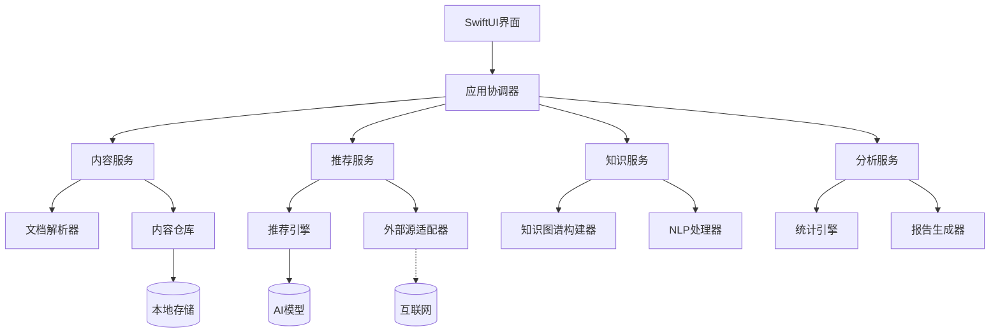

# NextBook Agent - macOS版开发计划

## 目录

- [项目概述](#项目概述)
- [技术栈选择](#技术栈选择)
- [开发阶段规划](#开发阶段规划)
- [架构实现方案](#架构实现方案)
- [数据模型实现](#数据模型实现)
- [核心功能实现计划](#核心功能实现计划)
- [UI/UX实现方案](#uiux实现方案)
- [测试策略](#测试策略)
- [部署计划](#部署计划)
- [项目目录结构](#项目目录结构)
- [开发环境选择](#开发环境选择)
- [项目框架操作指导](#项目框架操作指导)
- [多平台移植策略](#多平台移植策略)

## 项目概述

NextBook Agent macOS版作为概念验证(POC)版本，旨在验证核心功能并建立初始用户群体。本文档定义了macOS版本的开发计划和关键技术决策。

## 技术栈选择

### 前端技术

- **UI框架**: Swift和SwiftUI
  - 理由: 原生macOS开发体验，性能优秀，适合单机应用
  - 替代方案: Electron (跨平台但性能和体验不如原生)
  - 多平台考虑: 核心UI组件设计应考虑未来迁移到Flutter/React Native的可能性

- **状态管理**: SwiftUI内置状态管理 + Combine
  - 理由: 与SwiftUI无缝集成，反应式编程模型简化状态管理
  - 多平台考虑: 设计状态管理接口，便于未来适配其他平台的状态管理框架

### 后端技术

- **编程语言**: Swift + Python
  - Swift: 应用核心逻辑
  - Python: AI相关功能和数据处理
  - 多平台考虑: 关键逻辑应尽可能模块化，便于未来用Kotlin/Dart/C++重构

- **AI框架**: OpenAI API + Ollama + CoreML
  - 理由: 采用混合AI策略以平衡性能、功能和隐私
    - OpenAI API: 提供高质量的内容分析、摘要生成和智能推荐能力
    - Ollama: 支持本地模型部署，减少网络依赖，保护用户隐私
    - CoreML: 处理设备端轻量级AI任务，如基础分类和推荐
  - 多平台考虑: 设计AI抽象层，便于未来适配TensorFlow Lite、ONNX Runtime等跨平台AI引擎

### 数据存储

- **主数据库**: SQLite 
  - 理由: 轻量级，无需服务器，嵌入式数据库适合单机应用
  - 替代方案: Core Data (更强大但复杂度更高)
  - 多平台考虑: SQLite本身支持多平台，设计数据访问抽象层以屏蔽平台差异

- **全文搜索**: SQLite FTS5扩展
  - 理由: 直接集成于主数据库，提供强大全文搜索能力
  - 多平台考虑: 确保搜索接口通用化，便于未来替换为MeiliSearch等专用搜索引擎

- **文件存储**: 本地文件系统 + 结构化索引
  - 理由: 简单直接，适合管理书籍文件和附件
  - 多平台考虑: 设计文件存储抽象层，兼容各平台文件系统特性

### 同步技术

- **本地同步**: FileProvider和文件访问框架
  - 理由: 适用于单设备场景，简化初期开发
  - 多平台考虑: 预留同步协议接口，为未来基于CRDTs的多设备同步做准备

## 开发阶段规划

### 阶段一: 基础框架构建 (4周)
- 搭建项目基本结构
- 实现基本的UI框架和导航
- 设计并实现数据模型和存储层
- 建立单元测试框架
- **跨平台准备**: 定义核心接口规范，区分平台特定与平台无关代码

### 阶段二: 核心功能开发 (8周)

按照优先级矩阵中的P0项目进行开发:
1. **SAVE模块** (3周)
   - 书籍导入功能
   - 基础笔记系统
   - 文件解析器(PDF/EPUB)
   - **跨平台准备**: 制定通用文档解析接口与数据格式

2. **NEXT模块** (3周)
   - 基础推荐算法
   - 书籍元数据展示
   - 推荐理由生成
   - **跨平台准备**: AI推荐引擎设计为服务式架构，便于跨平台复用

3. **核心基础设施** (2周)
   - 本地数据同步
   - 错误处理机制
   - **跨平台准备**: 设计平台无关的数据模型序列化与存储方案

### 阶段三: 功能扩展 (6周)

按照优先级矩阵中的P1项目进行开发:
1. **内容分类系统** (1周)
   - **跨平台准备**: 采用通用分类标准，便于多平台统一理解
2. **时间线回顾功能** (2周)
   - **跨平台准备**: 时间线数据结构设计为平台无关格式
3. **基本搜索功能** (1周)
   - **跨平台准备**: 搜索算法与索引结构设计为可移植实现
4. **用户设置界面** (1周)
   - **跨平台准备**: 配置项结构化设计，便于跨平台设置共享
5. **数据备份与恢复** (1周)
   - **跨平台准备**: 备份格式设计为平台无关格式，便于跨设备恢复

### 阶段四: 测试与优化 (4周)
- 系统测试与bug修复
- 性能优化
- 用户体验改进
- 准备App Store发布
- **跨平台准备**: 建立跨平台兼容性测试框架与标准

## 架构实现方案

### 系统层次结构

NextBook macOS版采用分层架构，参照系统架构设计文档，实现以下四层结构:

1. **表现层** - 负责用户界面与交互
   - 使用SwiftUI构建响应式界面
   - 通过MVVM模式隔离UI与业务逻辑
   - 实现四大功能模块对应的视图组件

2. **应用层** - 协调业务流程与功能实现
   - 实现应用服务与协调器
   - 管理用户会话与应用状态
   - 处理功能间的交互与数据流转

3. **领域层** - 包含核心业务规则与领域模型
   - 实现领域模型与业务规则
   - 定义领域服务与聚合
   - 处理领域事件与状态变化

4. **基础设施层** - 提供技术实现与外部接口
   - 实现数据存储与检索
   - 集成AI服务与文件解析
   - 处理网络通信与外部资源访问

### 组件设计



### 平台适配策略

设计核心组件时将采用以下策略以便于未来多平台适配:

1. **接口抽象** - 关键服务通过协议/接口定义，隐藏平台实现细节
2. **依赖注入** - 使用依赖注入模式便于替换平台特定实现
3. **平台分层** - 清晰分离平台相关与平台无关代码
4. **跨平台核心** - 核心业务逻辑设计为平台无关实现

## 数据模型实现

参照领域模型设计文档，macOS版本将实现以下关键数据模型:

### 核心领域模型

1. **Content (内容)** - 表示书籍、文章等内容单元
   ```swift
   struct Content: Identifiable, Codable {
       let id: UUID
       var title: String
       var author: String
       var contentType: ContentType
       var path: String
       var coverImage: Data?
       var metadata: [String: String]
       var tags: [String]
       var addedDate: Date
       var lastAccessedDate: Date?
   }
   ```

2. **Note (笔记)** - 表示用户对内容的笔记和批注
   ```swift
   struct Note: Identifiable, Codable {
       let id: UUID
       var contentId: UUID
       var text: String
       var pageNumber: Int?
       var creationDate: Date
       var lastModifiedDate: Date
       var tags: [String]
       var attachments: [Attachment]
   }
   ```

3. **ReadingRecord (阅读记录)** - 追踪用户阅读活动
   ```swift
   struct ReadingRecord: Identifiable, Codable {
       let id: UUID
       var contentId: UUID
       var startTime: Date
       var endTime: Date?
       var progress: Double
       var lastPosition: String?
   }
   ```

4. **Recommendation (推荐)** - 表示系统生成的内容推荐
   ```swift
   struct Recommendation: Identifiable, Codable {
       let id: UUID
       var title: String
       var author: String
       var coverImageUrl: String?
       var summary: String
       var recommendationReason: String
       var sourceType: RecommendationSourceType
       var creationDate: Date
       var metadata: [String: String]
   }
   ```

5. **KnowledgeNode (知识节点)** - 知识图谱中的节点
   ```swift
   struct KnowledgeNode: Identifiable, Codable {
       let id: UUID
       var label: String
       var type: NodeType
       var properties: [String: String]
       var connections: [UUID: ConnectionType]
   }
   ```

### 数据访问层

数据访问采用仓储模式实现，通过抽象接口隔离业务逻辑与具体存储实现:

```swift
protocol ContentRepository {
    func getById(_ id: UUID) -> Content?
    func getAll() -> [Content]
    func getByTag(_ tag: String) -> [Content]
    func save(_ content: Content) -> Content
    func delete(_ id: UUID) -> Bool
    // 预留多平台同步方法
    func prepareForSync() -> [SyncOperation]
    func applyRemoteChanges(_ changes: [SyncChange]) -> Result<Void, SyncError>
}

class SQLiteContentRepository: ContentRepository {
    // 具体实现...
}
```

## 核心功能实现计划

### SAVE模块

实现文件导入、解析、分类与笔记管理:

1. **文件导入**
   - 支持拖放、文件选择器和系统共享
   - 自动元数据提取与预览生成
   - 多平台考虑: 设计通用导入协议与数据转换流程

2. **内容解析**
   - PDF解析使用PDFKit
   - EPUB解析使用自定义解析器
   - 文本提取与结构化
   - 多平台考虑: 为Android/Windows预留替代解析器接口

3. **笔记系统**
   - 实现笔记创建、编辑、链接
   - 支持多媒体附件
   - 多平台考虑: 笔记格式设计为通用JSON结构

### NEXT模块

实现图书推荐、信息展示与获取:

1. **推荐引擎**
   - 基于用户阅读历史的本地推荐
   - 外部API集成获取新书信息
   - 多平台考虑: 将算法核心与数据获取分离设计

2. **推荐展示**
   - 书籍信息卡片设计
   - 推荐理由生成与展示
   - 多平台考虑: UI组件设计考虑不同平台屏幕特性

3. **内容获取**
   - 本地资源链接
   - 外部资源整合
   - 多平台考虑: 设计通用资源访问协议

### RECALL模块

实现知识回忆与内容检索:

1. **时间线系统**
   - 阅读历史可视化
   - 时间维度筛选与导航
   - 多平台考虑: 时间线数据结构与渲染分离

2. **知识图谱**
   - 内容关联可视化
   - 交互式图谱探索
   - 多平台考虑: 使用抽象图形绘制API

3. **搜索系统**
   - 全文检索实现
   - 多维度过滤与排序
   - 多平台考虑: 搜索引擎设计为服务模式

### REPORT模块

实现数据分析与报告生成:

1. **数据收集**
   - 阅读行为统计
   - 笔记活动追踪
   - 多平台考虑: 统一数据收集格式与API

2. **报告生成**
   - 数据可视化渲染
   - 洞察提取与生成
   - 多平台考虑: 渲染逻辑与渲染引擎分离

3. **导出分享**
   - 多格式报告导出
   - 分享功能集成
   - 多平台考虑: 导出格式设计为通用标准

## 项目目录结构

```
macOS_Version/
├── NextBook/                   # 主项目目录
│   ├── App/                    # 应用入口
│   │   └── NextBookApp.swift
│   ├── Core/                   # 核心领域模型与逻辑(平台无关)
│   │   ├── Models/             # 数据模型
│   │   ├── Interfaces/         # 抽象接口定义
│   │   └── Services/           # 领域服务
│   ├── Application/            # 应用服务层(部分平台无关)
│   │   ├── Coordinators/       # 应用协调器
│   │   ├── Services/           # 应用服务
│   │   └── ViewModels/         # 视图模型
│   ├── Infrastructure/         # 基础设施层(平台相关)
│   │   ├── Database/           # 数据库实现
│   │   ├── FileSystem/         # 文件系统操作
│   │   ├── Network/            # 网络服务
│   │   ├── Repositories/       # 仓储实现
│   │   └── AI/                 # AI服务集成
│   │       ├── OpenAI/         # OpenAI集成
│   │       └── Ollama/         # Ollama集成
│   ├── Presentation/           # 表现层(平台相关)
│   │   ├── Views/              # SwiftUI视图
│   │   ├── Components/         # UI组件
│   │   └── Resources/          # UI资源
│   ├── Features/               # 功能模块
│   │   ├── Save/               # 内容保存模块
│   │   ├── Next/               # 推荐模块
│   │   ├── Recall/             # 知识回忆模块
│   │   └── Report/             # 数据报告模块
│   ├── Common/                 # 通用工具与扩展(部分平台无关)
│   │   ├── Extensions/         # Swift扩展
│   │   ├── Utilities/          # 工具类
│   │   └── Constants/          # 常量定义
│   └── Resources/              # 应用资源
│       ├── Assets.xcassets/    # 图片资源
│       └── Localizations/      # 本地化资源
├── NextBookTests/              # 单元测试
│   ├── CoreTests/              # 核心层测试
│   ├── ApplicationTests/       # 应用层测试
│   └── InfrastructureTests/    # 基础设施测试
├── NextBookUITests/            # UI测试
├── CrossPlatform/              # 跨平台共享代码(为多平台准备)
│   ├── Models/                 # 平台无关模型
│   ├── Protocols/              # 平台无关接口
│   └── Algorithms/             # 平台无关算法
├── Packages/                   # Swift Packages
│   └── AIServices/             # AI服务封装包
├── NextBook.xcodeproj/         # Xcode项目文件
└── NextBook.xcworkspace/       # Xcode工作区
```

## 开发环境选择

### 主开发环境：Xcode

NextBook macOS版应主要使用Xcode进行开发，原因如下：

1. **原生支持Swift和SwiftUI**: Xcode提供完整的Swift和SwiftUI工具链，包括实时预览、代码补全和UI设计器
2. **完整的调试工具**: 提供强大的调试、性能分析和内存泄漏检测工具
3. **签名和部署**: 简化应用签名、证书管理和App Store发布流程
4. **CoreML集成**: 无缝支持CoreML框架，便于实现本地AI功能
5. **Interface Builder**: 提供可视化界面设计工具，简化UI开发

### 辅助开发环境：VSCode

对于项目中的Python部分（AI相关功能）建议使用VSCode：

1. **Python开发体验**: VSCode提供出色的Python开发支持
2. **跨语言协作**: 便于在同一环境中处理Swift和Python代码
3. **轻量级**: 处理辅助脚本和工具时启动更快
4. **多平台准备**: 有助于未来多平台开发时的代码共享与管理

### 混合开发工作流

1. 使用Xcode进行所有Swift/SwiftUI相关开发
2. 使用VSCode开发Python脚本和AI模型集成代码
3. 使用Git作为版本控制，确保两个环境间的代码同步
4. 在VSCode中管理跨平台共享代码和文档

## 项目框架操作指导

本节提供从零开始搭建NextBook macOS版项目框架的Step-by-Step操作指南。

### 必须通过Xcode手动完成的操作

以下是必须通过Xcode图形界面手动完成，无法通过脚本自动化的关键操作：

1. **创建Xcode项目**
   - 必须通过Xcode界面创建项目并设置初始模板
   - 无法通过命令行完成完整的项目配置和模板选择

2. **项目配置与签名**
   - 设置开发团队和证书配置
   - 调整Bundle Identifier和版本信息
   - 配置App权限和entitlements
   - 设置应用图标和启动屏幕

3. **项目结构创建**
   - 通过Xcode界面创建组和文件结构以确保正确的引用关系
   - 添加资源文件到Assets.xcassets

4. **Interface Builder相关操作**
   - 创建和编辑storyboard或xib文件
   - 设置Auto Layout约束
   - 配置控件属性和连接outlets/actions

5. **SwiftUI预览配置**
   - 设置和自定义SwiftUI预览
   - 创建多种预览配置以测试不同设备和状态

6. **测试配置**
   - 在Xcode测试导航器中创建和组织测试用例
   - 配置UI测试的录制和回放

7. **调试与性能分析**
   - 使用Xcode调试工具进行断点调试
   - 使用Instruments进行性能分析和内存泄漏检测

8. **签名和发布**
   - 配置App Store Connect信息
   - 生成发布证书和配置文件
   - 创建应用归档并提交至App Store

执行这些操作时，请遵循文档中的详细步骤，确保正确配置Xcode环境和项目设置。

### 第一阶段：项目初始化与环境配置

#### 步骤1：安装必要工具
1. 确保已安装最新版Xcode（14.0+）
2. 安装VSCode用于Python开发
3. 安装Homebrew：`/bin/bash -c "$(curl -fsSL https://raw.githubusercontent.com/Homebrew/install/HEAD/install.sh)"`
4. 安装Python 3.10+：`brew install python@3.10`
5. 安装Git：`brew install git`（如果未预装）

#### 步骤2：创建Xcode项目
1. 打开Xcode，选择"Create a new Xcode project"
2. 选择"macOS" → "App"模板
3. 填写项目信息：
   - Product Name: NextBook
   - Organization Identifier: com.yourcompany.nextbook
   - Interface: SwiftUI
   - Language: Swift
   - 勾选"Include Tests"
4. 选择保存位置：`/Users/EnigmaWU/GitHub/MyLLM_Arena/MyStartups/NextBook/macOS_Version`
5. 初始化Git仓库（勾选"Create Git repository"）

#### 步骤3：项目基础配置
1. 在Xcode中设置开发团队（如适用）
2. 配置Bundle Identifier和版本信息
3. 设置部署目标（最低macOS版本，建议macOS 12+）

### 第二阶段：项目结构建立

#### 步骤4：创建基础目录结构
按照项目目录规划创建主要文件夹结构：

1. 在Xcode中，右键点击项目导航栏中的项目名称，选择"New Group"
2. 依次创建以下主要目录：
   - Core
   - Data
   - UI
   - Features
   - Utilities
   - Resources

3. 在各主目录下继续创建子目录（参照项目目录结构）

#### 步骤5：配置SwiftLint（代码质量保证）
1. 通过CocoaPods或SPM添加SwiftLint：
   ```bash
   # 切换到项目目录
   cd /Users/EnigmaWU/GitHub/MyLLM_Arena/MyStartups/NextBook/macOS_Version
   
   # 创建Podfile
   pod init
   
   # 编辑Podfile，添加SwiftLint
   echo "platform :osx, '12.0'\ntarget 'NextBook' do\n  pod 'SwiftLint'\nend" > Podfile
   
   # 安装依赖
   pod install
   ```

2. 创建SwiftLint配置文件：
   ```bash
   touch .swiftlint.yml
   ```

3. 添加基本配置到.swiftlint.yml

### 第三阶段：创建核心模型和服务

#### 步骤6：实现数据模型
1. 在Core/Models目录下创建基础数据模型：
   - Book.swift
   - Note.swift
   - Tag.swift
   - ReadingSession.swift
   - Recommendation.swift

2. 为每个模型实现基本结构，例如在Book.swift中：
   ```swift
   struct Book: Identifiable, Codable {
       let id: UUID
       var title: String
       var author: String
       var path: String
       var coverImage: Data?
       var addedDate: Date
       var lastOpenedDate: Date?
       var tags: [String]
       var notes: [UUID]  // References to Note objects
       var metadata: [String: String]
       
       init(title: String, author: String, path: String) {
           self.id = UUID()
           self.title = title
           self.author = author
           self.path = path
           self.addedDate = Date()
           self.tags = []
           self.notes = []
           self.metadata = [:]
       }
   }
   ```

#### 步骤7：搭建数据层
1. 在Data/Database目录下创建数据库管理类：
   - DatabaseManager.swift
   - SQLiteManager.swift

2. 实现基本的数据库连接和初始化功能

#### 步骤8：创建仓储层
1. 在Data/Repositories目录下创建仓储实现：
   - BookRepository.swift
   - NoteRepository.swift
   - TagRepository.swift

2. 实现基础CRUD操作

### 第四阶段：创建基础UI组件

#### 步骤9：搭建UI结构
1. 在UI/Views目录下创建主要视图：
   - MainView.swift (应用主视图)
   - LibraryView.swift (书籍库视图)
   - ReaderView.swift (阅读器视图)
   - SettingsView.swift (设置视图)

2. 创建基础UI组件（在UI/Components下）：
   - BookCard.swift
   - TagView.swift
   - NoteCard.swift
   - SearchBar.swift

#### 步骤10：设置导航
1. 在MainView中实现基本导航结构：
   ```swift
   struct MainView: View {
       var body: some View {
           NavigationSplitView {
               Sidebar()
           } content: {
               ContentList()
           } detail: {
               DetailView()
           }
       }
   }
   ```

### 第五阶段：实现功能模块

#### 步骤11：SAVE模块实现
1. 在Features/Save目录下创建：
   - BookImporter.swift
   - PDFParser.swift
   - EPUBParser.swift
   - ImportView.swift

#### 步骤12：AI服务集成
1. 创建Python虚拟环境：
   ```bash
   cd /Users/EnigmaWU/GitHub/MyLLM_Arena/MyStartups/NextBook/macOS_Version
   python -m venv venv
   source venv/bin/activate
   pip install openai ollama pyyaml
   ```

2. 在Data/AI目录下创建AI服务接口：
   - AIManager.swift
   - OpenAIService.swift

3. 使用PythonKit或创建Python桥接器连接Swift和Python代码

### 第六阶段：测试与完善

#### 步骤13：创建基础测试
1. 在Xcode测试导航器中为每个主要组件创建单元测试

#### 步骤14：创建构建脚本
1. 在项目根目录创建构建脚本：
   ```bash
   touch build.sh
   chmod +x build.sh
   ```

2. 添加自动化构建和测试命令

### 第七阶段：完善文档

#### 步骤15：创建开发文档
1. 在项目根目录创建docs文件夹
2. 添加关键组件的文档

#### 步骤16：设置持续集成
1. 创建GitHub Actions配置或选择其他CI工具
2. 配置自动构建和测试流程

这套操作指南提供了从零开始搭建项目的详细步骤，开发者可以按照这些步骤一步步构建起完整的NextBook macOS应用框架。

## 多平台移植策略

### 跨平台核心设计原则

为确保macOS版顺利迁移到多平台版本，需遵循以下设计原则:

1. **分离关注点** - 清晰区分业务逻辑与平台特定代码
   - 核心领域模型与服务应平台无关
   - 将平台特定实现封装在接口后面

2. **通用数据格式** - 使用跨平台标准格式
   - JSON/Protocol Buffers用于数据序列化
   - 统一的数据模型映射策略
   - 标准化的时间和多语言处理

3. **抽象依赖** - 所有外部依赖通过抽象接口访问
   - 文件系统操作通过抽象层进行
   - 网络请求通过通用客户端接口
   - 数据存储通过仓储模式抽象

4. **模块化体系结构** - 功能模块化设计
   - 每个核心功能作为独立模块实现
   - 明确定义模块间接口与通信

### 共享代码策略

1. **分层共享** - 从底层到顶层的共享策略
   - 领域模型完全共享
   - 业务逻辑大部分共享
   - UI逻辑部分共享设计理念
   - UI实现平台特定

2. **代码复用机制**
   - 核心算法在CrossPlatform目录实现
   - 对于Swift/Kotlin共享，考虑使用KMP(Kotlin Multiplatform)
   - 长期可考虑Rust实现核心逻辑以最大化跨平台兼容

### 多平台测试计划

1. **单元测试优先** - 确保核心逻辑的平台无关性
   - 为所有共享代码编写平台无关单元测试
   - 使用模拟对象替代平台特定依赖

2. **平台适配测试** - 验证平台特定适配
   - 为每个平台编写集成测试
   - 创建跨平台测试矩阵验证关键功能

### 移植路径规划

1. **阶段性移植** - 循序渐进的迁移策略
   - 第一阶段: 提取共享核心模型和接口
   - 第二阶段: 实现Android版本核心功能
   - 第三阶段: 拓展到iOS和Windows平台
   - 第四阶段: 实现Linux版本

2. **特性优先级** - 按功能重要性排序迁移
   - P0: SAVE和NEXT基础功能
   - P1: RECALL核心能力
   - P2: REPORT和高级功能

3. **同步机制引入** - 从单机版到多设备支持
   - 初期: 导出/导入功能实现基础数据共享
   - 中期: 引入基于云端的同步服务
   - 长期: 实现去中心化的端到端加密同步
