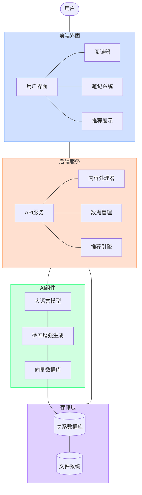
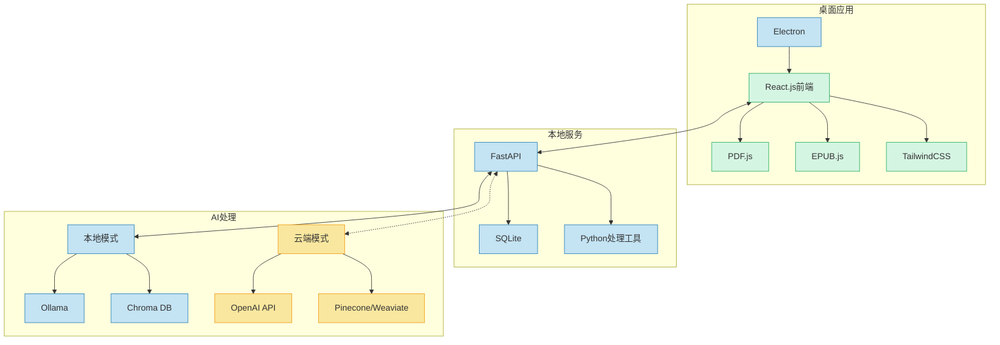
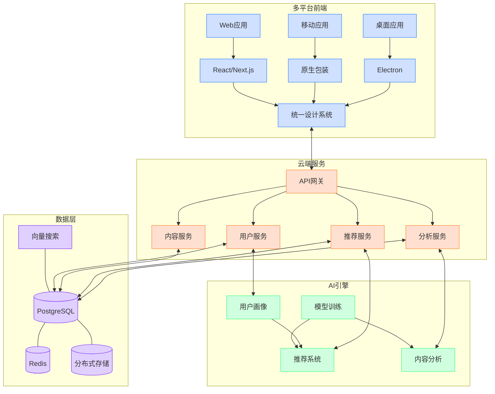
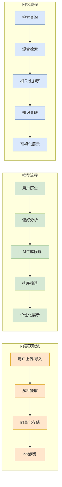

# NextBook Agent（我的下一本书）

> 智能阅读助手：记录、管理与发现你的阅读世界

<p align="center">
  
</p>

## 📚 目录

- [NextBook Agent（我的下一本书）](#nextbook-agent我的下一本书)
  - [📚 目录](#-目录)
  - [项目概述](#项目概述)
  - [核心功能](#核心功能)
    - [📥 SAVE - 内容保存](#-save---内容保存)
    - [📚 NEXT - 书籍推荐](#-next---书籍推荐)
    - [🔍 RECALL - 知识回忆](#-recall---知识回忆)
    - [📊 REPORT - 数据报告](#-report---数据报告)
  - [使用场景](#使用场景)
  - [技术架构](#技术架构)
    - [系统架构概述](#系统架构概述)
    - [首版架构 (macOS POC版)](#首版架构-macos-poc版)
    - [扩展架构 (多平台版)](#扩展架构-多平台版)
    - [数据流架构](#数据流架构)
    - [架构设计原则](#架构设计原则)
  - [快速上手](#快速上手)
  - [开发状态](#开发状态)
  - [未来计划](#未来计划)
  - [贡献指南](#贡献指南)
  - [许可证](#许可证)

## 项目概述

NextBook Agent 是一个智能阅读助手，帮助用户管理阅读内容、笔记和获取个性化图书推荐。通过AI技术，它能够理解用户的阅读偏好，提供高质量的内容推荐，同时对阅读历史进行多维度分析。

**主要价值**：
- 📝 【通过】高效记录阅读内容和笔记
- 🔍 【达到】智能推荐相关优质书籍
- 🧠 【同时】构建个人知识库
- 📊 【顺带】生成阅读统计与报告

## 核心功能

### 📥 SAVE - 内容保存

* **支持格式**：PDF、EPUB格式的书籍
* **划线功能**：文本和图像划线
* **笔记系统**：支持文本和图像笔记
* **备注**：为任何内容添加额外备注
* **分类**：保持手动分类，支持自动分类（基于主题）

### 📚 NEXT - 书籍推荐

* **个性化推荐**：基于阅读历史和笔记智能推荐三本新书（关键功能）
* **推荐展示**：封面 + 摘要 + 个性化推荐理由
* **获取方式**：自动搜索EPUB（优先）或PDF下载源
* **推荐算法**：
  * 【AlgA】基于用户阅读历史
    * 结合：最新出版 + 领域经典 + 近期热门
  * 【AlgB】（TODO）

### 🔍 RECALL - 知识回忆

* **自动回顾**：默认展示最近1个月的阅读记录与笔记
* **即时添加**：支持在回顾时添加新的见解和笔记
* **高级检索**：按主题、作者、时间等多维度筛选内容
* **关联展示**：显示知识点间的关联性

### 📊 REPORT - 数据报告

* **阅读统计**：展示当年和历年阅读量、笔记数量
* **主题分析**：阅读主题分布可视化
* **知识地图**：构建个人知识图谱
* **进度追踪**：阅读目标完成度

## 使用场景

* **首版聚焦**：`macOS Version`
  * **个人桌面**：优先支持macBook用户，提供完整的桌面阅读体验
  * **单设备部署**：本地化存储和处理，保护阅读隐私
  
* **未来扩展**：`multiOS Version`
  * **多端使用**：将支持Win11、Ubuntu Linux、iPhone和Android平台
  * **无缝同步**：在不同设备间保持阅读进度和笔记的同步
  * **跨平台体验**：统一的UI和功能设计，适配不同设备特性

## 技术架构

### 系统架构概述



### 首版架构 (macOS POC版)



### 扩展架构 (多平台版)



### 数据流架构



### 架构设计原则

* **本地优先**：核心功能不依赖网络连接
* **模块化设计**：组件可独立升级和替换
* **渐进增强**：基础功能可在低配置环境运行，高级功能随资源扩展
* **隐私保护**：敏感数据默认存储在本地，云同步为可选项

## 快速上手

```bash
# 克隆仓库
git clone https://github.com/yourusername/nextbook-agent.git

# 安装依赖
cd nextbook-agent
pip install -r requirements.txt

# 启动应用
python app.py
```

## 开发状态

- [x] 核心功能设计
- [x] 基础架构搭建
- [ ] UI界面开发
- [ ] 内容保存功能
- [ ] 推荐算法实现
- [ ] 知识回忆系统
- [ ] 报告生成功能

## 未来计划

* **社区功能**：分享笔记和推荐
* **语音笔记**：支持语音输入和转录
* **云端同步**：确保多设备数据一致性
* **扩展平台**：支持iOS、Linux、Windows

## 贡献指南

欢迎贡献代码、报告问题或提出新功能建议！详情请参考[贡献指南](CONTRIBUTING.md)。

## 许可证

本项目基于[MIT许可证](LICENSE)开源。