# NextBook Agent（我的下一本书）

> 智能阅读助手：记录、管理与发现你的阅读世界

<p align="center">
  
</p>

## 📚 目录

- [NextBook Agent（我的下一本书）](#nextbook-agent我的下一本书)
  - [📚 目录](#-目录)
  - [项目概述](#项目概述)
  - [核心功能](#核心功能)
    - [📥 SAVE - 内容保存](#-save---内容保存)
    - [📚 NEXT - 书籍推荐](#-next---书籍推荐)
    - [🔍 RECALL - 知识回忆](#-recall---知识回忆)
    - [📊 REPORT - 数据报告](#-report---数据报告)
  - [使用场景](#使用场景)
  - [技术架构](#技术架构)
    - [架构设计原则](#架构设计原则)
    - [系统架构概述](#系统架构概述)
    - [首版架构 (macOS Version\<for POC\>)](#首版架构-macos-versionfor-poc)
    - [扩展架构 (multiOS Version)](#扩展架构-multios-version)
    - [数据流架构](#数据流架构)
      - [核心存储架构](#核心存储架构)
      - [内容获取流程 (SAVE)](#内容获取流程-save)
      - [推荐系统流程 (NEXT)](#推荐系统流程-next)
      - [知识回忆流程 (RECALL)](#知识回忆流程-recall)
      - [数据报告流程 (REPORT)](#数据报告流程-report)
      - [跨流程数据交互](#跨流程数据交互)
  - [用户界面](#用户界面)
    - [设计理念](#设计理念)
    - [操作模型](#操作模型)
    - [主界面设计](#主界面设计)
    - [核心功能界面](#核心功能界面)
      - [📥 SAVE - 内容保存](#-save---内容保存-1)
      - [📚 NEXT - 书籍推荐](#-next---书籍推荐-1)
      - [🔍 RECALL - 知识回忆](#-recall---知识回忆-1)
      - [📊 REPORT - 数据报告](#-report---数据报告-1)
    - [交互设计原则](#交互设计原则)
    - [视觉风格](#视觉风格)
    - [适配策略](#适配策略)
  - [快速上手](#快速上手)
  - [开发状态](#开发状态)
  - [未来计划](#未来计划)
  - [贡献指南](#贡献指南)
  - [许可证](#许可证)

## 项目概述

NextBook Agent 是一个智能阅读助手，帮助用户管理阅读内容、笔记和获取个性化图书推荐。通过AI技术，它能够理解用户的阅读偏好，提供高质量的内容推荐，同时对阅读历史进行多维度分析。

**主要价值**：
- 📝 【通过】高效记录阅读内容和笔记
- 🔍 【达到】智能推荐相关优质书籍
- 🧠 【同时】构建个人知识库、建立`洞见链接`
- 📊 【顺带】生成阅读统计与报告

* 备注：
  * 洞见链接：即用户的个人见解与他人见解的关联
     * 他人：某位当代活跃的、历史著名的大神们
     * 关联：指发掘出，自己的见解与他们相当、或更深刻

## 核心功能

### 📥 SAVE - 内容保存

* **形式**：导入（上传）PDF、EPUB格式的书籍文件
  * **以及**：拷贝粘贴文本和图像，作为笔记
  * **还有**：添加额外的文本和图像，作为备注
* **分类**：手动创建目录结构，保持手动分类视图（默认：保存时间）
  * **支持** 自动智能分类视图（基于：主题）

### 📚 NEXT - 书籍推荐

* **推荐**：三本新书（关键功能）
  * **支持**：再来三本（不满意当前推荐）
* **展示**：封面 + 摘要 + 推荐理由
* **获取**：预下载、立刻、后台，搜索可下载源，
  * **优先**：本地文件 > 在线资源，EPUB > PDF
* **来源**：
  * **实时互联网搜索**：获取最新出版信息、读者评价和购买链接
  * **专业书评网站**：整合Goodreads、豆瓣读书等平台的评分和评论
  * **学术数据库**：连接Google Scholar等获取学术著作推荐
* **算法**：
  * 【AlgA】基于用户阅读历史、参考其笔记和备注
    * 结合：最新出版 + 领域经典 + 近期热门
  * 【AlgB】实时搜索引擎整合，根据用户兴趣关键词爬取推荐

### 🔍 RECALL - 知识回忆

* **回顾**：默认展示（生成）最近1个月的阅读记录与笔记
  * **支持**：按时间线（月/季/年）查看
* **添加**：支持在回顾时添加新的见解和笔记
* **检索**：按主题、作者、时间等多维度筛选内容
* **挖掘**：
  * 知识图谱
  * 见解关联（即：我的见解、跟哪位大神的见解相当）

### 📊 REPORT - 数据报告

* **阅读统计**：展示当年和历年阅读量、笔记数量
* **主题分析**：阅读主题分布可视化
* **知识地图**：构建个人知识图谱
* **进度追踪**：阅读目标完成度

## 使用场景

* **首版聚焦**：`macOS Version`
  * **个人桌面**：优先支持macBook用户，提供完整的桌面阅读体验
  * **单设备部署**：本地化存储和处理，保护阅读隐私
  * **目的**：
    * POC（概念验证）版本，验证核心功能和用户体验
    * 寻找到核心用户群体，收集反馈和建议 
  
* **未来扩展**：`multiOS Version`
  * **多端使用**：将支持Win11、Ubuntu Linux、iPhone和Android平台
  * **无缝同步**：在不同设备间保持阅读进度和笔记的同步
  * **跨平台体验**：统一的UI和功能设计，适配不同设备特性
  * **目的**：
    * 扩大用户群体，提升产品的市场竞争力

## 技术架构

### 架构设计原则

* **本地优先**：核心功能不依赖网络连接
* **模块化设计**：组件可独立升级和替换
* **渐进增强**：基础功能的技术方案保持简单，只有在必要时，才引入更复杂技术方案
* **隐私保护**：敏感数据默认存储在本地，云同步为可选项

### 系统架构概述


### 首版架构 (macOS Version\<for POC>)

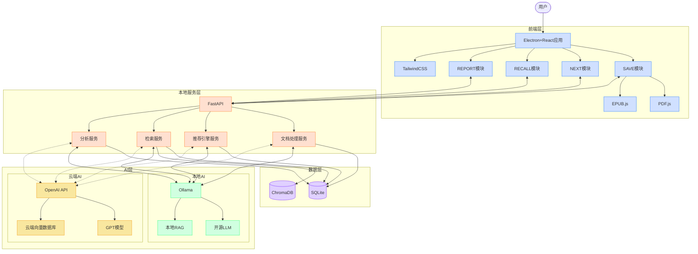

### 扩展架构 (multiOS Version)

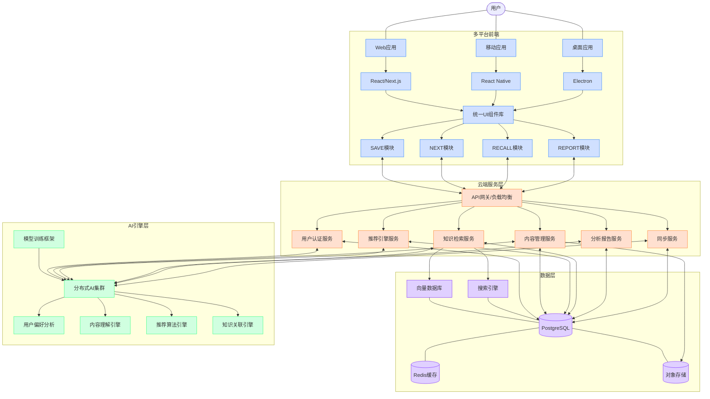

### 数据流架构

系统的数据流被分为四个主要功能流，所有流程共享核心存储系统。

#### 核心存储架构

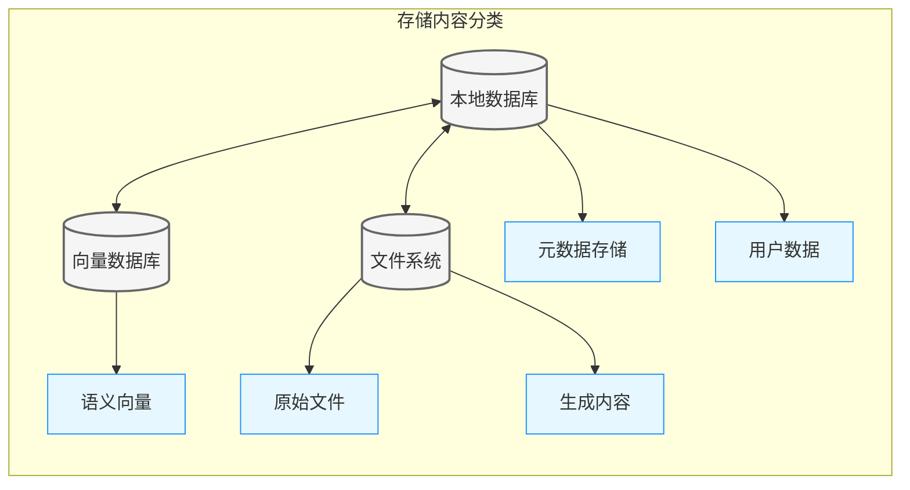

**存储组件用途解释**:

| 存储组件             | 类型     | 用途说明                                                             |
| -------------------- | -------- | -------------------------------------------------------------------- |
| **本地数据库 (DB)**  | 核心存储 | 存储结构化数据，管理用户信息、阅读历史、书籍元数据和系统配置         |
| **向量数据库 (VDB)** | 核心存储 | 管理文本语义向量，支持相似度搜索和语义匹配，为推荐和回忆功能提供支持 |
| **文件系统 (FS)**    | 核心存储 | 存储原始书籍文件、图像和导出内容，提供高效的大文件管理               |
| **元数据存储 (MD)**  | 内容分类 | 保存书籍信息（标题、作者、出版信息）、阅读状态和标签数据             |
| **用户数据 (UD)**    | 内容分类 | 记录用户配置、阅读习惯、偏好设置和推荐历史                           |
| **语义向量 (VS)**    | 内容分类 | 存储文本内容的向量表示，用于相似内容查找和语义检索                   |
| **原始文件 (RAW)**   | 内容分类 | 保存原始PDF、EPUB等格式的完整书籍文件，确保内容完整性                |
| **生成内容 (GEN)**   | 内容分类 | 存储AI生成的摘要、见解、报告和知识关联等衍生内容                     |

**数据流动与工作原理**:

* **内容处理流**: 原始文件上传 → 解析为文本 → 提取元数据 → 转换为向量 → 分别存储
* **检索流程**: 用户查询 → 向量匹配 + 关键词搜索 → 从原始文件提取相关段落 → 返回结果
* **推荐机制**: 分析用户数据 → 结合语义向量相似度 → 生成个性化推荐 → 存储反馈

#### 内容获取流程 (SAVE)

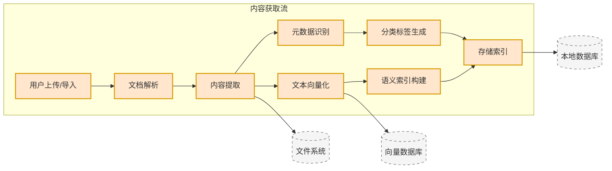

#### 推荐系统流程 (NEXT)

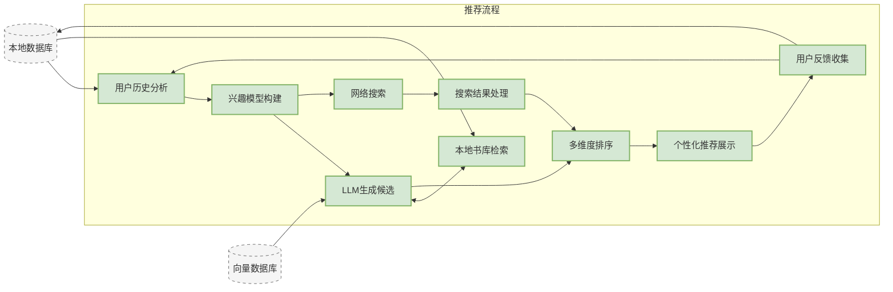

#### 知识回忆流程 (RECALL)

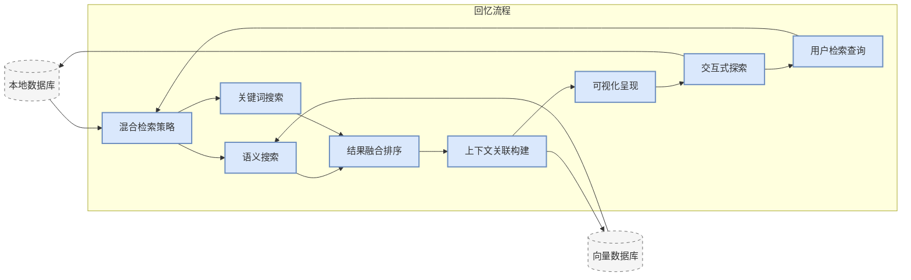

#### 数据报告流程 (REPORT)

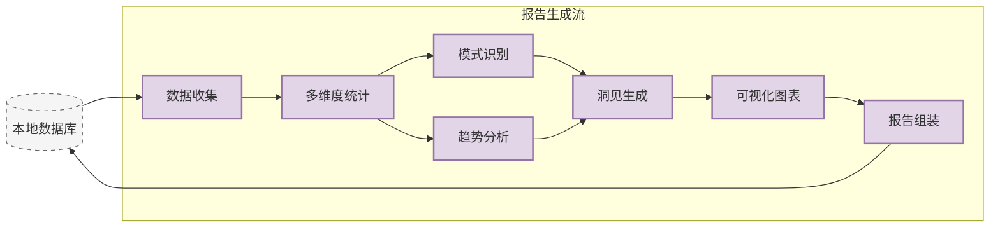

#### 跨流程数据交互

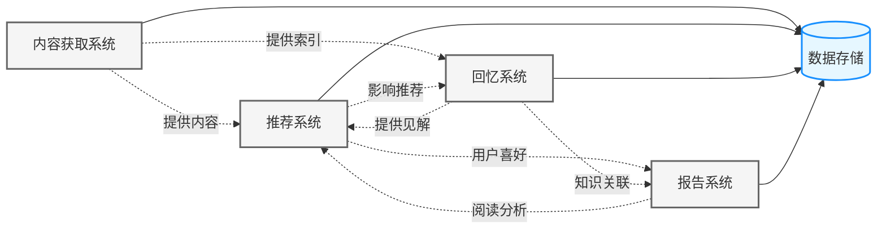

## 用户界面

NextBook Agent采用简洁直观的界面设计，将四大核心功能无缝集成为统一的用户体验。

### 设计理念

* **内容为王**：界面设计以内容展示为中心，最大化阅读区域
* **减少干扰**：最小化不必要的视觉元素，让用户专注于阅读与思考
* **自然交互**：符合用户心智模型的操作方式，降低学习成本
* **灵活布局**：支持用户根据需求自定义工作区布局
* **暗黑模式**：全面支持系统级暗黑模式，保护用户视力
* **过程反馈**：每个操作都有明确的视觉反馈，让用户知道正在发生什么
* **渐进式学习**：从简单到复杂，逐步引导用户了解高级功能

### 操作模型

NextBook采用"重点-内容-操作"的三层交互模型，确保用户在任意时刻都清楚自己在做什么以及接下来可以做什么。

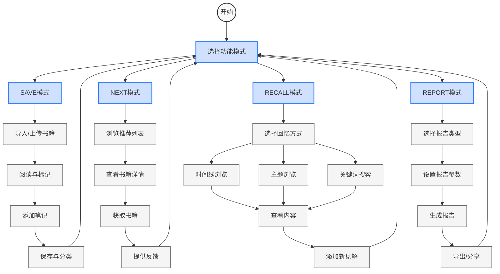

### 主界面设计


### 核心功能界面

#### 📥 SAVE - 内容保存

**操作流程**:

1. **内容导入** → 2. **阅读浏览** → 3. **内容标记** → 4. **添加笔记** → 5. **分类保存**

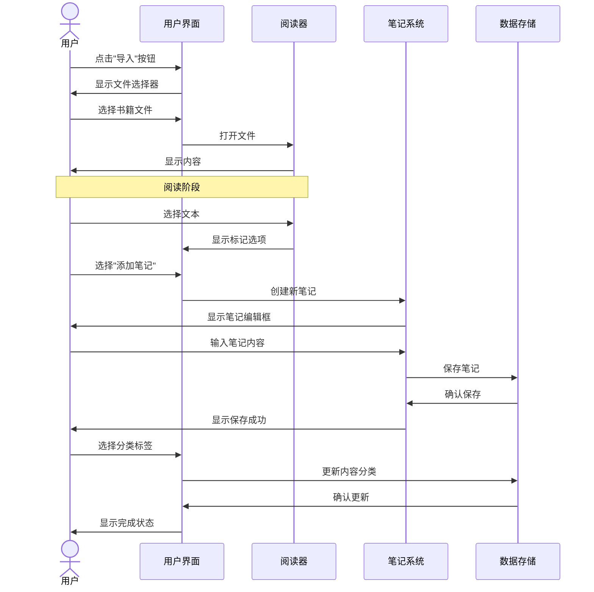

界面设计:

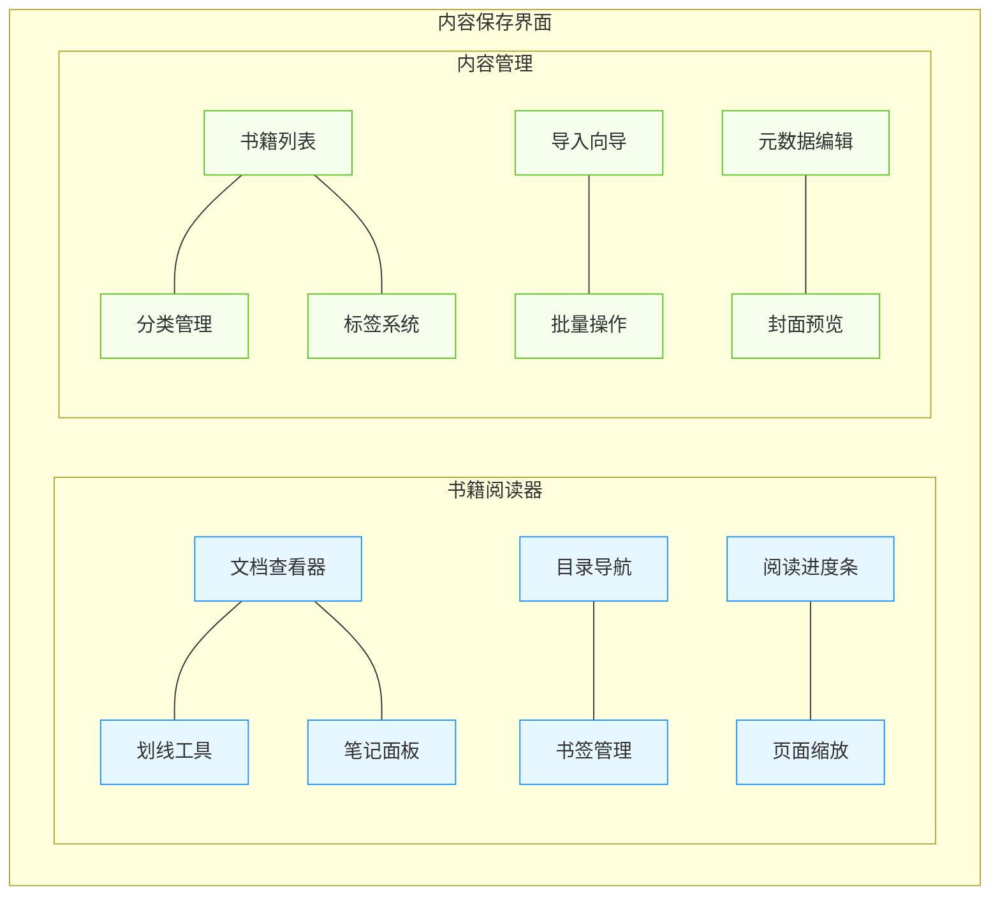

**特色设计与操作流程**:
* **拖放导入**: 直接拖放文件到界面即可导入，无需多步操作
* **一键标记**: 选中文本后直接出现标记选项，减少点击步骤
* **上下文笔记**: 笔记始终与原文保持视觉关联，不丢失阅读上下文
* **标签推荐**: 基于内容自动推荐标签，一键应用
* **快速定位**: 通过目录或搜索快速跳转到特定章节，支持书签记忆

#### 📚 NEXT - 书籍推荐

**操作流程**:

1. **进入推荐** → 2. **浏览推荐列表** → 3. **查看详情** → 4. **获取书籍** → 5. **提供反馈**

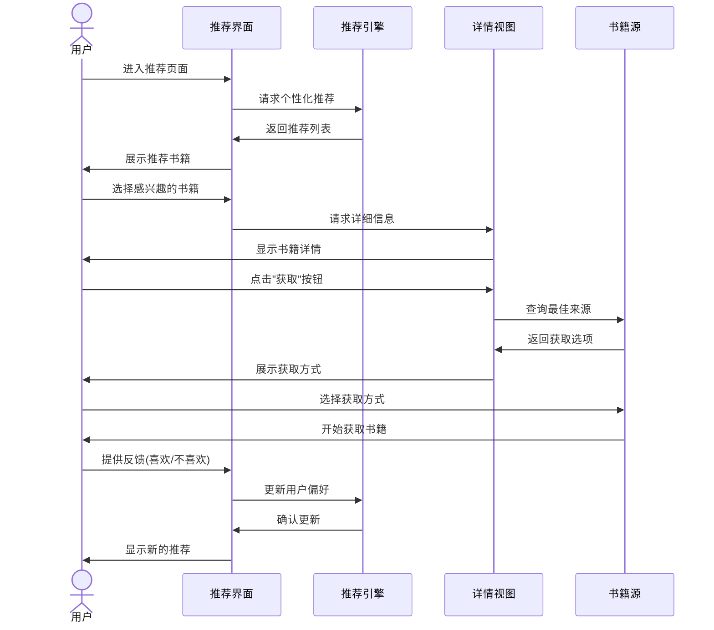

界面设计:

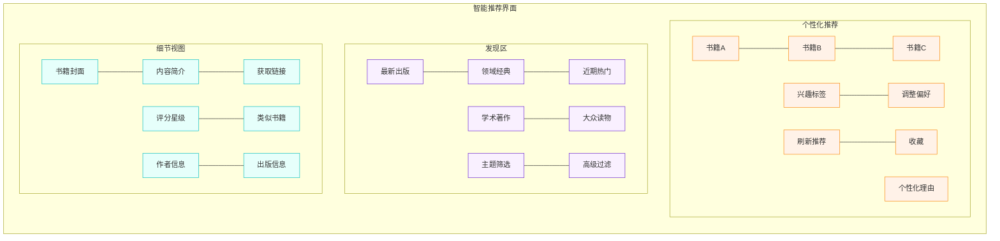

**特色设计与操作流程**:
* **渐进式展示**: 首先展示书籍封面和简短推荐理由，点击后逐步展开详情
* **情境推荐**: 根据当前时间、最近阅读和用户习惯调整推荐内容
* **即时预览**: 悬停在书籍上即可预览核心信息，减少页面切换
* **一键获取**: 获取按钮自动选择最佳来源，简化获取过程
* **推荐透明度**: 点击"为什么推荐"按钮，查看详细推荐原因和数据来源

#### 🔍 RECALL - 知识回忆

**操作流程**:

1. **选择回忆方式** → 2. **浏览/搜索内容** → 3. **查看细节** → 4. **添加新见解** → 5. **关联探索**

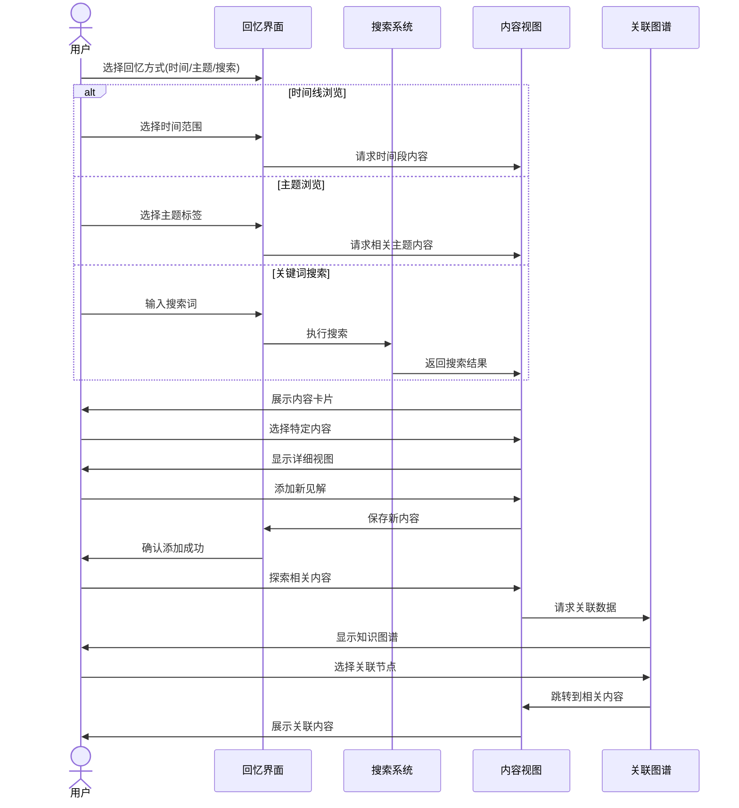

界面设计:

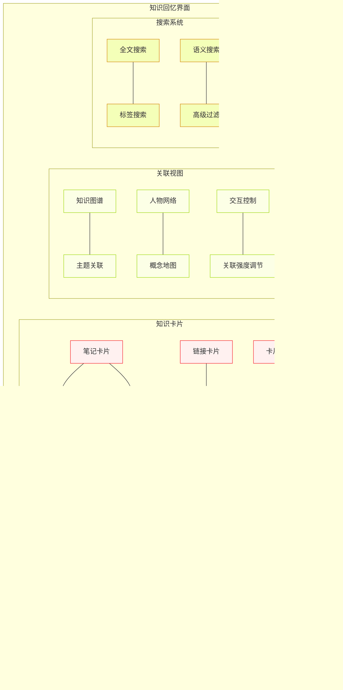

**特色设计与操作流程**:
* **智能提示**: 根据当前查看内容自动提示可能相关的其他笔记和见解
* **路径记忆**: 记录用户探索路径，支持随时回退或前进
* **焦点缩放**: 在关联图谱中支持缩放操作，从全局概览到细节查看
* **动态关系**: 关联强度可视化，连线粗细表示关联度
* **无限画布**: 采用无限滚动设计，不限制内容展示空间，减少分页干扰

#### 📊 REPORT - 数据报告

**操作流程**:

1. **选择报告类型** → 2. **设置参数** → 3. **生成报告** → 4. **交互探索** → 5. **导出分享**

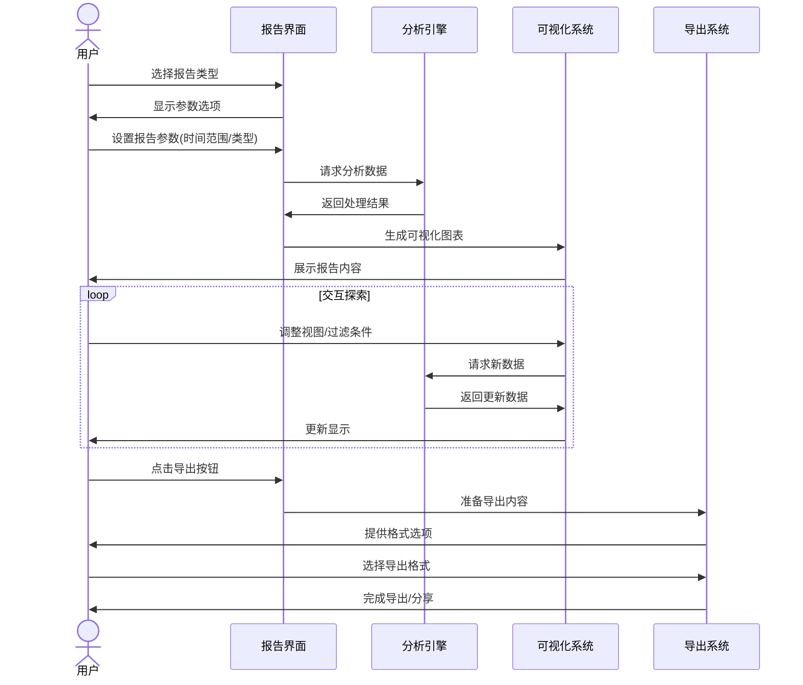

界面设计:

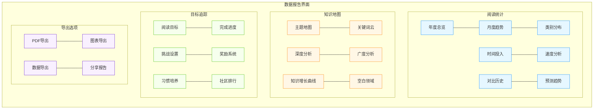

**特色设计与操作流程**:
* **模板选择**: 提供多种报告模板，一键生成不同风格报告
* **实时更新**: 报告数据实时更新，反映最新阅读活动
* **交互式图表**: 支持点击、拖拽、缩放等操作探索数据细节
* **目标调整**: 在报告界面直接调整阅读目标，系统即时反馈影响
* **智能摘要**: 自动生成核心发现和建议，突出重要数据洞察

### 交互设计原则

* **简洁直观**：界面清晰，减少视觉噪音，突出内容
* **操作连贯性**：相关操作放在一起，形成自然流程，减少跳转
* **即时反馈**：每个操作都有明确的视觉反馈，让用户知道系统状态
* **可逆操作**：允许用户撤销大多数操作，减少操作焦虑
* **上下文感知**：界面根据用户当前活动智能调整，提供相关功能
* **渐进引导**：新用户引导流程，帮助快速掌握核心功能
* **快捷键支持**：全面的键盘快捷键支持，提高操作效率
* **错误预防**：设计防止错误发生，而不只是处理错误
* **操作一致性**：相似操作在不同功能中保持一致的交互方式
* **状态可见性**：系统状态始终可见，用户知道正在发生什么

### 视觉风格

* **色彩系统**：采用自然、舒适的配色方案，减少眼部疲劳
* **排版层级**：清晰的文字层级结构，提升可读性
* **图标语言**：简洁统一的图标设计，增强直观性
* **动效策略**：适度的过渡动画，提供流畅感但不过度装饰
* **空间利用**：合理利用页面空间，避免过度拥挤或空白

### 适配策略

* **屏幕尺寸**：针对不同尺寸的MacBook屏幕优化布局
* **输入方式**：同时优化触控板和鼠标操作体验
* **系统集成**：与macOS原生交互模式保持一致
* **外接显示**：支持外接显示器下的布局自动调整

## 快速上手

```bash
# 克隆仓库
git clone https://github.com/yourusername/nextbook-agent.git

# 安装依赖
cd nextbook-agent
pip install -r requirements.txt

# 启动应用
python app.py
```

## 开发状态

- [x] 核心功能设计
- [x] 基础架构搭建
- [ ] UI界面开发
- [ ] 内容保存功能
- [ ] 推荐算法实现
- [ ] 知识回忆系统
- [ ] 报告生成功能

## 未来计划

* **社区功能**：分享笔记和推荐
* **语音笔记**：支持语音输入和转录
* **云端同步**：确保多设备数据一致性
* **扩展平台**：支持iOS、Linux、Windows

## 贡献指南

欢迎贡献代码、报告问题或提出新功能建议！详情请参考[贡献指南](CONTRIBUTING.md)。

## 许可证

本项目基于[MIT许可证](LICENSE)开源。