# NextBook Agent（我的下一本书）

> 智能阅读助手：记录、管理与发现你的阅读世界

<p align="center">
  
</p>

## 📚 目录

- [NextBook Agent（我的下一本书）](#nextbook-agent我的下一本书)
  - [📚 目录](#-目录)
  - [项目概述](#项目概述)
  - [核心功能](#核心功能)
    - [📥 SAVE - 内容保存](#-save---内容保存)
    - [📚 NEXT - 书籍推荐](#-next---书籍推荐)
    - [🔍 RECALL - 知识回忆](#-recall---知识回忆)
    - [📊 REPORT - 数据报告](#-report---数据报告)
  - [使用场景](#使用场景)
  - [技术架构](#技术架构)
    - [系统架构概述](#系统架构概述)
    - [首版架构 (macOS POC版)](#首版架构-macos-poc版)
    - [扩展架构 (多平台版)](#扩展架构-多平台版)
    - [数据流架构](#数据流架构)
    - [架构设计原则](#架构设计原则)
  - [用户界面](#用户界面)
    - [主界面设计](#主界面设计)
    - [核心功能界面](#核心功能界面)
      - [📥 SAVE - 内容保存](#-save---内容保存-1)
      - [📚 NEXT - 书籍推荐](#-next---书籍推荐-1)
      - [🔍 RECALL - 知识回忆](#-recall---知识回忆-1)
      - [📊 REPORT - 数据报告](#-report---数据报告-1)
    - [交互设计原则](#交互设计原则)
  - [快速上手](#快速上手)
  - [开发状态](#开发状态)
  - [未来计划](#未来计划)
  - [贡献指南](#贡献指南)
  - [许可证](#许可证)

## 项目概述

NextBook Agent 是一个智能阅读助手，帮助用户管理阅读内容、笔记和获取个性化图书推荐。通过AI技术，它能够理解用户的阅读偏好，提供高质量的内容推荐，同时对阅读历史进行多维度分析。

**主要价值**：
- 📝 【通过】高效记录阅读内容和笔记
- 🔍 【达到】智能推荐相关优质书籍
- 🧠 【同时】构建个人知识库
- 📊 【顺带】生成阅读统计与报告

## 核心功能

### 📥 SAVE - 内容保存

* **支持格式**：PDF、EPUB格式的书籍
* **划线功能**：文本和图像划线
* **笔记系统**：支持文本和图像笔记
* **备注**：为任何内容添加额外备注
* **分类**：保持手动分类，支持自动分类（基于主题）

### 📚 NEXT - 书籍推荐

* **个性化推荐**：基于阅读历史和笔记智能推荐三本新书（关键功能）
* **推荐展示**：封面 + 摘要 + 个性化推荐理由
* **获取方式**：自动搜索EPUB（优先）或PDF下载源
* **推荐算法**：
  * 【AlgA】基于用户阅读历史
    * 结合：最新出版 + 领域经典 + 近期热门
  * 【AlgB】（TODO）

### 🔍 RECALL - 知识回忆

* **自动回顾**：默认展示最近1个月的阅读记录与笔记
* **即时添加**：支持在回顾时添加新的见解和笔记
* **高级检索**：按主题、作者、时间等多维度筛选内容
* **关联展示**：显示知识点间的关联性

### 📊 REPORT - 数据报告

* **阅读统计**：展示当年和历年阅读量、笔记数量
* **主题分析**：阅读主题分布可视化
* **知识地图**：构建个人知识图谱
* **进度追踪**：阅读目标完成度

## 使用场景

* **首版聚焦**：`macOS Version`
  * **个人桌面**：优先支持macBook用户，提供完整的桌面阅读体验
  * **单设备部署**：本地化存储和处理，保护阅读隐私
  
* **未来扩展**：`multiOS Version`
  * **多端使用**：将支持Win11、Ubuntu Linux、iPhone和Android平台
  * **无缝同步**：在不同设备间保持阅读进度和笔记的同步
  * **跨平台体验**：统一的UI和功能设计，适配不同设备特性

## 技术架构

### 系统架构概述

```mermaid
flowchart TD
    User([用户]) --- Frontend
    
    subgraph Frontend["前端界面"]
        UI[用户界面] --- Reader[阅读器]
        UI --- Notes[笔记系统]
        UI --- Recommend[推荐展示]
    end
    
    subgraph Backend["后端服务"]
        API[API服务] --- ContentProcessor[内容处理器]
        API --- DataManager[数据管理]
        API --- RecommendEngine[推荐引擎]
    end
    
    subgraph AI["AI组件"]
        LLM[大语言模型] --- RAG[检索增强生成]
        RAG --- VectorDB[向量数据库]
    end
    
    subgraph Storage["存储层"]
        DB[(关系数据库)] --- FileSystem[(文件系统)]
        VectorDB --- DB
    end
    
    Frontend --- Backend
    Backend --- AI
    Backend --- Storage
    
    style Frontend fill:#d0e0ff,stroke:#3080ff
    style Backend fill:#ffe0d0,stroke:#ff8030
    style AI fill:#d0ffe0,stroke:#30ff80
    style Storage fill:#e0d0ff,stroke:#8030ff
```



### 首版架构 (macOS POC版)

```mermaid
flowchart TD
    subgraph "桌面应用"
        A[Electron] --> B[React.js前端]
        B --> C1[PDF.js]
        B --> C2[EPUB.js]
        B --> C3[TailwindCSS]
    end
    
    subgraph "本地服务"
        D[FastAPI] --> E[SQLite]
        D --> F[Python处理工具]
    end
    
    subgraph "AI处理"
        G1[本地模式] --> H1[Ollama]
        G1 --> H2[Chroma DB]
        G2[云端模式] --> I1[OpenAI API]
        G2 --> I2[Pinecone/Weaviate]
    end
    
    B <--> D
    D <--> G1
    D <-.-> G2
    
    classDef local fill:#c4e3f3,stroke:#2980b9
    classDef cloud fill:#f9e79f,stroke:#f39c12
    classDef ui fill:#d5f5e3,stroke:#27ae60
    
    class A,B,C1,C2,C3,D,E,F,G1,H1,H2 local
    class G2,I1,I2 cloud
    class B,C1,C2,C3 ui
```



### 扩展架构 (多平台版)

```mermaid
flowchart TD
    subgraph "多平台前端"
        A1[Web应用] --> B1[React/Next.js]
        A2[移动应用] --> B2[原生包装]
        A3[桌面应用] --> B3[Electron]
        B1 & B2 & B3 --> C[统一设计系统]
    end
    
    subgraph "云端服务"
        D[API网关] --> E1[用户服务]
        D --> E2[内容服务]
        D --> E3[推荐服务]
        D --> E4[分析服务]
    end
    
    subgraph "数据层"
        F1[(PostgreSQL)] --- F2[(Redis)]
        F1 --- F3[(分布式存储)]
        F4[向量搜索] --- F1
    end
    
    subgraph "AI引擎"
        G1[模型训练] --> G2[推荐系统]
        G1 --> G3[内容分析]
        G4[用户画像] --> G2
    end
    
    C <--> D
    E1 & E2 & E3 & E4 <--> F1
    E3 <--> G2
    E4 <--> G3
    E1 <--> G4
    
    classDef frontend fill:#d0e0ff,stroke:#3080ff
    classDef backend fill:#ffe0d0,stroke:#ff8030
    classDef data fill:#e0d0ff,stroke:#8030ff
    classDef ai fill:#d0ffe0,stroke:#30ff80
    
    class A1,A2,A3,B1,B2,B3,C frontend
    class D,E1,E2,E3,E4 backend
    class F1,F2,F3,F4 data
    class G1,G2,G3,G4 ai
```



### 数据流架构

```mermaid
flowchart LR
    subgraph "内容获取流"
        A1[用户上传/导入] --> A2[解析提取] --> A3[向量化存储] --> A4[本地索引]
    end
    
    subgraph "推荐流程"
        B1[用户历史] --> B2[偏好分析] --> B3[LLM生成候选] --> B4[排序筛选] --> B5[个性化展示]
    end
    
    subgraph "回忆流程"
        C1[检索查询] --> C2[混合检索] --> C3[相关性排序] --> C4[知识关联] --> C5[可视化展示]
    end
    
    classDef flow1 fill:#ffe6cc,stroke:#d79b00
    classDef flow2 fill:#d5e8d4,stroke:#82b366
    classDef flow3 fill:#dae8fc,stroke:#6c8ebf
    
    class A1,A2,A3,A4 flow1
    class B1,B2,B3,B4,B5 flow2
    class C1,C2,C3,C4,C5 flow3
```



### 架构设计原则

* **本地优先**：核心功能不依赖网络连接
* **模块化设计**：组件可独立升级和替换
* **渐进增强**：基础功能可在低配置环境运行，高级功能随资源扩展
* **隐私保护**：敏感数据默认存储在本地，云同步为可选项

## 用户界面

NextBook Agent采用简洁直观的界面设计，将四大核心功能无缝集成为统一的用户体验。

### 主界面设计

```mermaid
graph TD
    subgraph "NextBook主界面"
        direction LR
        
        subgraph "侧边栏导航"
            N1[📥 SAVE] -.-> N5[书库]
            N2[📚 NEXT] -.-> N6[推荐]
            N3[🔍 RECALL] -.-> N7[回忆]
            N4[📊 REPORT] -.-> N8[报告]
        end
        
        subgraph "主内容区"
            C[视图切换区]
        end
        
        subgraph "工具栏"
            T1[导入] --- T2[搜索] --- T3[设置]
        end
    end
    
    classDef nav fill:#f9f9f9,stroke:#666
    classDef content fill:#ffffff,stroke:#999
    classDef tools fill:#f0f0f0,stroke:#666
    
    class N1,N2,N3,N4,N5,N6,N7,N8 nav
    class C content
    class T1,T2,T3 tools
```



### 核心功能界面

#### 📥 SAVE - 内容保存

```mermaid
graph TD
    subgraph "内容保存界面"
        direction LR
        
        subgraph "书籍阅读器"
            R1[文档查看器] --- R2[划线工具]
            R1 --- R3[笔记面板]
        end
        
        subgraph "内容管理"
            M1[书籍列表] --- M2[分类管理]
            M1 --- M3[标签系统]
        end
    end
    
    classDef reader fill:#e6f7ff,stroke:#1890ff
    classDef manager fill:#f6ffed,stroke:#52c41a
    
    class R1,R2,R3 reader
    class M1,M2,M3 manager
```



#### 📚 NEXT - 书籍推荐

```mermaid
graph LR
    subgraph "智能推荐界面"
        direction TB
        
        subgraph "个性化推荐"
            P1[书籍A] --- P2[书籍B] --- P3[书籍C]
            P4[个性化理由]
        end
        
        subgraph "发现区"
            D1[最新出版] --- D2[领域经典]
            D2 --- D3[近期热门]
        end
        
        subgraph "细节视图"
            V1[书籍封面] --- V2[内容简介]
            V2 --- V3[获取链接]
        end
    end
    
    classDef recommend fill:#fff2e8,stroke:#fa8c16
    classDef discover fill:#f9f0ff,stroke:#722ed1
    classDef detail fill:#e6fffb,stroke:#13c2c2
    
    class P1,P2,P3,P4 recommend
    class D1,D2,D3 discover
    class V1,V2,V3 detail
```



#### 🔍 RECALL - 知识回忆

```mermaid
graph TD
    subgraph "知识回忆界面"
        direction LR
        
        subgraph "时间线视图"
            T1[月视图] --- T2[周视图] --- T3[日视图]
        end
        
        subgraph "知识卡片"
            K1[笔记卡片] --- K2[引用卡片]
            K1 --- K3[思考卡片]
        end
        
        subgraph "关联视图"
            C1[知识图谱] --- C2[主题关联]
        end
    end
    
    classDef timeline fill:#f0f5ff,stroke:#2f54eb
    classDef cards fill:#fff1f0,stroke:#f5222d
    classDef connections fill:#fcffe6,stroke:#a0d911
    
    class T1,T2,T3 timeline
    class K1,K2,K3 cards
    class C1,C2 connections
```



#### 📊 REPORT - 数据报告

```mermaid
graph LR
    subgraph "数据报告界面"
        direction TB
        
        subgraph "阅读统计"
            S1[年度总览] --- S2[月度趋势]
            S2 --- S3[类别分布]
        end
        
        subgraph "知识地图"
            M1[主题地图] --- M2[关键词云]
        end
        
        subgraph "目标追踪"
            G1[阅读目标] --- G2[完成进度]
        end
    end
    
    classDef stats fill:#e6f7ff,stroke:#1890ff
    classDef map fill:#fff7e6,stroke:#fa8c16
    classDef goals fill:#f6ffed,stroke:#52c41a
    
    class S1,S2,S3 stats
    class M1,M2 map
    class G1,G2 goals
```



### 交互设计原则

* **简洁直观**：界面清晰，减少视觉噪音，突出内容
* **一致性**：各功能区保持一致的设计语言和交互模式
* **响应式**：适应不同屏幕尺寸，优化macOS上的显示效果
* **上下文感知**：界面根据用户当前活动智能调整，提供相关功能
* **减少认知负担**：常用功能一键可达，复杂功能分层展示

## 快速上手

```bash
# 克隆仓库
git clone https://github.com/yourusername/nextbook-agent.git

# 安装依赖
cd nextbook-agent
pip install -r requirements.txt

# 启动应用
python app.py
```

## 开发状态

- [x] 核心功能设计
- [x] 基础架构搭建
- [ ] UI界面开发
- [ ] 内容保存功能
- [ ] 推荐算法实现
- [ ] 知识回忆系统
- [ ] 报告生成功能

## 未来计划

* **社区功能**：分享笔记和推荐
* **语音笔记**：支持语音输入和转录
* **云端同步**：确保多设备数据一致性
* **扩展平台**：支持iOS、Linux、Windows

## 贡献指南

欢迎贡献代码、报告问题或提出新功能建议！详情请参考[贡献指南](CONTRIBUTING.md)。

## 许可证

本项目基于[MIT许可证](LICENSE)开源。