# NextBook Agent（我的下一本书）

> 智能阅读助手：记录、管理与发现你的阅读世界

<p align="center">
  
</p>

## 📚 目录

- [NextBook Agent（我的下一本书）](#nextbook-agent我的下一本书)
  - [📚 目录](#-目录)
  - [项目概述](#项目概述)
  - [核心功能](#核心功能)
    - [📥 SAVE - 内容保存](#-save---内容保存)
    - [📚 NEXT - 书籍推荐](#-next---书籍推荐)
    - [🔍 RECALL - 知识回忆](#-recall---知识回忆)
    - [📊 REPORT - 数据报告](#-report---数据报告)
  - [模型设计](#模型设计)
    - [领域模型概述](#领域模型概述)
    - [核心领域与边界上下文](#核心领域与边界上下文)
    - [聚合与聚合根](#聚合与聚合根)
    - [领域事件](#领域事件)
    - [领域服务](#领域服务)
    - [值对象](#值对象)
    - [DDD战略设计](#ddd战略设计)
  - [版本规划](#版本规划)
  - [技术架构](#技术架构)
    - [系统架构概述](#系统架构概述)
    - [架构设计文档](#架构设计文档)
  - [用户界面](#用户界面)
    - [设计理念](#设计理念)
    - [操作模型](#操作模型)
    - [主界面设计](#主界面设计)
    - [核心功能界面](#核心功能界面)
      - [📥 SAVE - 内容保存](#-save---内容保存-1)
      - [📚 NEXT - 书籍推荐](#-next---书籍推荐-1)
      - [🔍 RECALL - 知识回忆](#-recall---知识回忆-1)
      - [📊 REPORT - 数据报告](#-report---数据报告-1)
    - [交互设计原则](#交互设计原则)
    - [视觉风格](#视觉风格)
    - [适配策略](#适配策略)
  - [快速上手](#快速上手)
    - [系统要求](#系统要求)
    - [安装步骤](#安装步骤)
    - [初次使用配置](#初次使用配置)
  - [开发状态](#开发状态)
  - [常见问题](#常见问题)
    - [Q: NextBook Agent需要联网使用吗？](#q-nextbook-agent需要联网使用吗)
    - [Q: 我可以在多台设备上同步使用吗？](#q-我可以在多台设备上同步使用吗)
    - [Q: NextBook Agent支持哪些文件格式？](#q-nextbook-agent支持哪些文件格式)
    - [Q: 如何保护我的阅读数据和笔记？](#q-如何保护我的阅读数据和笔记)
  - [反馈与支持](#反馈与支持)
  - [未来计划](#未来计划)
  - [贡献指南](#贡献指南)
  - [许可证](#许可证)

## 项目概述

* NextBook Agent 是一个智能阅读助手，帮助用户管理 `阅读过` 的内容、笔记和获取个性化图书推荐。通过AI技术，它能够理解用户的阅读偏好，提供高质量的内容推荐，同时对阅读历史进行多维度分析。
  * 注意：本助手不是阅读器，作为阅读助手，帮助用户更好地管理和挖掘曾经阅读过的内容。

**主要价值**：
- 📝 【通过】方便记录阅读内容和笔记
- 🔍 【达到】智能推荐相关优质书籍
- 🧠 【同时】构建个人知识库、建立`洞见链接`
- 📊 【顺带】生成阅读统计与报告

* 何谓：
  * 洞见链接：即用户的个人见解与他人见解的关联
     * 他人：某位当代活跃的、历史著名的大神们
     * 关联：指本助手发掘出，`我`的见解与他们相当、或更深刻
       * 只为：告诉自己，洞见时刻，`我`并不孤单 

**典型使用场景**：
- 📖 学者整理研究笔记，追踪学术发展脉络
- 🎓 学生管理课程阅读材料，准备论文和考试
- 💼 专业人士跟踪行业动态，积累专业知识
- 📚 爱书人管理个人书单，发现新的阅读兴趣

## 核心功能

### 📥 SAVE - 内容保存

* **形式**：导入（上传）PDF、EPUB格式的书籍文件
  * **以及**：拷贝粘贴文本和图像，作为笔记
  * **还有**：添加额外的文本和图像，作为备注
* **分类**：手动创建目录结构，保持手动分类视图（默认：保存时间）
  * **支持** 自动智能分类视图（基于：主题）

### 📚 NEXT - 书籍推荐

* **推荐**：三本新书（关键功能）
  * **支持**：再来三本（不满意当前推荐）
* **展示**：封面 + 摘要 + 推荐理由
* **获取**：预下载、立刻、后台，搜索可下载源，
  * **优先**：本地文件 > 在线资源，EPUB > PDF
* **来源**：
  * **实时互联网搜索**：获取最新出版信息、读者评价和购买链接
  * **专业书评网站**：整合Goodreads、豆瓣读书等平台的评分和评论
  * **学术数据库**：连接Google Scholar等获取学术著作推荐
* **算法**：
  * 【AlgA】基于用户阅读历史、参考其笔记和备注
    * 结合：最新出版 + 领域经典 + 近期热门
  * 【AlgB】实时搜索引擎整合，根据用户兴趣关键词爬取推荐

### 🔍 RECALL - 知识回忆

* **回顾**：默认展示（生成）最近1个月的阅读记录与笔记
  * **支持**：按时间线（月/季/年）查看
* **添加**：支持在回顾时添加新的见解和笔记
* **检索**：按主题、作者、时间等多维度筛选内容
* **挖掘**：
  * 知识图谱
  * 见解关联（即：我的见解、跟哪位大神的见解相当）

### 📊 REPORT - 数据报告

* **阅读统计**：展示当年和历年阅读量、笔记数量
* **主题分析**：阅读主题分布可视化
* **知识地图**：构建个人知识图谱
* **进度追踪**：阅读目标完成度

## 模型设计

NextBook Agent采用领域驱动设计(DDD)方法构建核心模型，确保系统具有清晰的业务边界和丰富的领域表达能力。

### 领域模型概述


### 核心领域与边界上下文

1. **内容管理领域**：处理书籍、文章和笔记的导入、存储和分类
2. **推荐领域**：负责基于用户阅读历史和偏好推荐新内容
3. **知识构建领域**：处理知识图谱构建、关联发现和洞见链接
4. **分析报告领域**：负责统计分析和报告生成

### 聚合与聚合根

```mermaid
graph TD
    subgraph "用户聚合"
        U[User<br>聚合根] --> UP[PreferenceProfile]
        U --> UH[ReadingHistory]
        U --> UG[ReadingGoals]
    end
    
    subgraph "内容聚合"
        C[Content<br>聚合根] --> CM[Metadata]
        C --> CT[Tags]
        C --> CC[Categories]
        C --> CF[ContentFiles]
    end
    
    subgraph "阅读记录聚合"
        RR[ReadingRecord<br>聚合根] --> RN[Notes]
        RR --> RP[Progress]
        RN --> NA[Attachments]
    end
    
    subgraph "推荐聚合"
        RE[Recommendation<br>聚合根] --> RS[RecommendationSource]
        RE --> RR2[RecommendationReason]
        RE --> RF[UserFeedback]
    end
    
    subgraph "知识图谱聚合"
        KG[KnowledgeGraph<br>聚合根] --> KE[Entities]
        KG --> KR[Relationships]
        KG --> KI[Insights]
    end
    
    style U fill:#f9d5e5,stroke:#333
    style C fill:#d5e8d4,stroke:#333
    style RR fill:#ffe6cc,stroke:#333
    style RE fill:#e1d5e7,stroke:#333
    style KG fill:#dae8fc,stroke:#333
```

### 领域事件

NextBook Agent系统中的关键领域事件：

| 事件名称                | 描述                 | 产生者       | 消费者                 |
| ----------------------- | -------------------- | ------------ | ---------------------- |
| ContentImported         | 新内容被导入系统     | 内容管理服务 | 推荐引擎、知识图谱服务 |
| NoteAdded               | 用户添加了新笔记     | 笔记服务     | 知识图谱服务、分析服务 |
| RecommendationGenerated | 生成了新推荐         | 推荐引擎     | 用户界面、分析服务     |
| UserFeedbackProvided    | 用户对推荐提供了反馈 | 用户界面     | 推荐引擎               |
| InsightDiscovered       | 发现了知识洞见       | 知识图谱服务 | 用户界面、分析服务     |
| ReadingGoalAchieved     | 用户达成了阅读目标   | 分析服务     | 用户界面、通知服务     |

### 领域服务

```mermaid
graph LR
    subgraph "领域服务"
        CS[内容管理服务] --> CI[内容导入服务]
        CS --> CT[内容分类服务]
        
        RS[推荐服务] --> RP[个性化推荐服务]
        RS --> RS2[搜索服务]
        
        KS[知识服务] --> KG[知识图谱服务]
        KS --> KI[洞见发现服务]
        
        AS[分析服务] --> AR[报告生成服务]
        AS --> AT[趋势分析服务]
    end
    
    subgraph "应用服务"
        UI[用户交互服务] --> CS
        UI --> RS
        UI --> KS
        UI --> AS
        
        SS[同步服务] --> CS
    end
    
    style CS fill:#d5e8d4,stroke:#82b366
    style RS fill:#ffe6cc,stroke:#d79b00
    style KS fill:#dae8fc,stroke:#6c8ebf
    style AS fill:#e1d5e7,stroke:#9673a6
    style UI fill:#f5f5f5,stroke:#666666
    style SS fill:#f5f5f5,stroke:#666666
```

### 值对象

| 值对象               | 属性                             | 用途               |
| -------------------- | -------------------------------- | ------------------ |
| ContentMetadata      | 标题、作者、出版信息、页数       | 描述内容基本信息   |
| TextFragment         | 文本内容、页码、位置             | 记录笔记关联的原文 |
| ReadingProgress      | 当前页、总页数、百分比、阅读时长 | 跟踪阅读进度       |
| RecommendationReason | 推荐原因描述、关联内容、匹配度   | 解释推荐依据       |
| InsightLink          | 关联内容、关联强度、发现时间     | 描述知识关联       |
| ReadingStatistics    | 阅读量、阅读频率、主题分布       | 用于分析报告       |

### DDD战略设计

```mermaid
graph TD
    subgraph "核心域"
        CC[内容收集] --> CA[内容分析]
        CA --> KD[知识发现]
        KD --> PR[个性化推荐]
    end
    
    subgraph "支撑域"
        DM[数据管理] --> SY[同步系统]
        UI[用户界面] --> NF[通知服务]
    end
    
    subgraph "通用域"
        AU[认证授权] --> SE[搜索引擎]
        SE --> FL[文件处理]
    end
    
    style CC fill:#ff9999,stroke:#333
    style CA fill:#ff9999,stroke:#333
    style KD fill:#ff9999,stroke:#333
    style PR fill:#ff9999,stroke:#333
    
    style DM fill:#ffcc99,stroke:#333
    style SY fill:#ffcc99,stroke:#333
    style UI fill:#ffcc99,stroke:#333
    style NF fill:#ffcc99,stroke:#333
    
    style AU fill:#cccccc,stroke:#333
    style SE fill:#cccccc,stroke:#333
    style FL fill:#cccccc,stroke:#333
```

## 版本规划

* **单机版**：`macOS Version`
  * **个人桌面**：仅支持macBook，典型的桌面使用体验
  * **单设备部署**：本地化部署、存储和使用
  * **目的**：
    * POC（概念验证）版本，验证核心功能和用户体验
    * 寻找到核心用户群体，收集反馈和建议 
  
* **多端版**：`multiOS Version`
  * **多端使用**：将支持Win11、Ubuntu Linux、iPhone和Android平台
  * **无缝同步**：在不同设备间保持阅读进度和笔记的同步
  * **跨平台体验**：统一功能设计，适配不同设备特性
  * **目的**：
    * 扩大用户群体，具有市场竞争力的产品

## 技术架构

NextBook Agent采用模块化、本地优先的技术架构，确保用户数据安全的同时提供强大的功能。

### 系统架构概述

```mermaid
flowchart TD
    User([用户]) --- Frontend
    
    subgraph Frontend["前端界面"]
        UI[用户界面] --- SaveUI[SAVE界面]
        UI --- NextUI[NEXT界面]
        UI --- RecallUI[RECALL界面]
        UI --- ReportUI[REPORT界面]
        
        SaveUI --- ContentViewer[内容预览器]
        SaveUI --- Notes[笔记系统]
        NextUI --- Recommend[推荐展示]
        RecallUI --- KnowledgeMap[知识图谱]
        ReportUI --- Dashboard[数据仪表盘]
    end
    
    subgraph Backend["后端服务"]
        API[API服务] --- ContentService[内容服务]
        API --- RecommendService[推荐服务]
        API --- RecallService[回忆服务]
        API --- AnalyticsService[分析服务]
        
        ContentService --- DocumentProcessor[文档处理器]
        ContentService --- NoteManager[笔记管理器]
        RecommendService --- RecommendEngine[推荐引擎]
        RecommendService --- WebSearchEngine[网络搜索引擎]
        RecallService --- SearchEngine[检索引擎]
        AnalyticsService --- StatisticsEngine[统计引擎]
    end
    
    subgraph Internet["互联网资源"]
        BookAPI[图书API] --- ReviewSites[书评网站]
        BookAPI --- BookStores[在线书店]
        BookAPI --- AcademicDB[学术数据库]
    end
    
    subgraph AI["AI组件"]
        LLM[大语言模型] --- RAG[检索增强生成]
        RAG --- VectorDB[向量数据库]
        LLM --- TopicExtractor[主题提取器]
        LLM --- BookRecommender[图书推荐器]
        LLM --- InsightGenerator[见解生成器]
    end
    
    subgraph Storage["存储层"]
        DB[(关系数据库)] --- FileSystem[(文件系统)]
        VectorDB --- DB
        DB --- UserProfile[用户画像]
        DB --- ReadingHistory[阅读历史]
        DB --- SearchCache[搜索缓存]
    end
    
    Frontend --- Backend
    Backend --- AI
    Backend --- Storage
    Backend --- Internet
    
    style Frontend fill:#d0e0ff,stroke:#3080ff
    style Backend fill:#ffe0d0,stroke:#ff8030
    style AI fill:#d0ffe0,stroke:#30ff80
    style Storage fill:#e0d0ff,stroke:#8030ff
    style Internet fill:#fff0d0,stroke:#ffb030
```

### 架构设计文档

查看详细架构设计文档：

- [通用架构设计原则](docs/architecture/ArchDesignCommon.md) - 基本设计理念和原则
- [macOS版架构设计](docs/architecture/ArchDesignMacOsVersion.md) - 单机版(POC)的具体实现架构
- [多平台版架构设计](docs/architecture/ArchDesignMultiOsVersion.md) - 多平台支持的扩展架构

## 用户界面

NextBook Agent采用简洁直观的界面设计，将四大核心功能无缝集成为统一的用户体验。

### 设计理念

* **内容为王**：界面设计以内容展示为中心，最大化内容查看区域
* **减少干扰**：最小化不必要的视觉元素，让用户专注于内容与思考
* **自然交互**：符合用户心智模型的操作方式，降低学习成本
* **灵活布局**：支持用户根据需求自定义工作区布局
* **暗黑模式**：全面支持系统级暗黑模式，保护用户视力
* **过程反馈**：每个操作都有明确的视觉反馈，让用户知道正在发生什么
* **渐进式学习**：从简单到复杂，逐步引导用户了解高级功能

### 操作模型

```mermaid
graph TD
    Start((开始)) --> Mode[选择功能模式]
    Mode --> Save[SAVE模式]
    Mode --> Next[NEXT模式]
    Mode --> Recall[RECALL模式]
    Mode --> Report[REPORT模式]
    
    Save --> S1[导入/上传书籍]
    S1 --> S2[内容浏览]
    S2 --> S3[添加笔记]
    S3 --> S4[保存与分类]
    S4 --> Mode
    
    Next --> N1[浏览推荐列表]
    N1 --> N2[查看书籍详情]
    N2 --> N3[获取书籍]
    N3 --> N4[提供反馈]
    N4 --> Mode
    
    Recall --> R1[选择回忆方式]
    R1 --> R2a[时间线浏览]
    R1 --> R2b[主题浏览]
    R1 --> R2c[关键词搜索]
    R2a & R2b & R2c --> R3[查看内容]
    R3 --> R4[添加新见解]
    R4 --> Mode
    
    Report --> P1[选择报告类型]
    P1 --> P2[设置报告参数]
    P2 --> P3[生成报告]
    P3 --> P4[导出/分享]
    P4 --> Mode
    
    classDef start fill:#f9f9f9,stroke:#333,stroke-width:2px
    classDef mode fill:#d0e0ff,stroke:#3080ff,stroke-width:2px
    classDef operation fill:#f5f5f5,stroke:#666
    
    class Start start
    class Mode,Save,Next,Recall,Report mode
    class S1,S2,S3,S4,N1,N2,N3,N4,R1,R2a,R2b,R2c,R3,R4,P1,P2,P3,P4 operation
```

### 主界面设计

```mermaid
graph TD
    subgraph "NextBook主界面"
        direction LR
        
        subgraph "侧边栏导航"
            N1[📥 SAVE] -.-> N5[书库]
            N2[📚 NEXT] -.-> N6[推荐]
            N3[🔍 RECALL] -.-> N7[回忆]
            N4[📊 REPORT] -.-> N8[报告]
            N9[快速笔记区]
            N10[最近导入]
        end
        
        subgraph "主内容区"
            C[视图切换区]
            C1[内容视图]
            C2[笔记视图]
            C3[推荐视图]
            C4[报告视图]
        end
        
        subgraph "工具栏"
            T1[导入] --- T2[搜索] --- T3[设置]
            T4[视图切换] --- T5[分享] --- T6[同步]
        end
        
        subgraph "状态栏"
            S1[进度指示] --- S2[同步状态]
            S3[统计信息] --- S4[AI助手]
        end
    end
    
    classDef nav fill:#f9f9f9,stroke:#666
    classDef content fill:#ffffff,stroke:#999
    classDef tools fill:#f0f0f0,stroke:#666
    classDef status fill:#f6f6f6,stroke:#888
    
    class N1,N2,N3,N4,N5,N6,N7,N8,N9,N10 nav
    class C,C1,C2,C3,C4 content
    class T1,T2,T3,T4,T5,T6 tools
    class S1,S2,S3,S4 status
```

### 核心功能界面

#### 📥 SAVE - 内容保存

**操作流程**:

1. **内容导入** → 2. **内容浏览** → 3. **内容标记** → 4. **添加笔记** → 5. **分类保存**

```mermaid
sequenceDiagram
    actor 用户
    participant UI as 用户界面
    participant Viewer as 内容查看器
    participant Notes as 笔记系统
    participant DB as 数据存储
    
    用户->>UI: 点击"导入"按钮
    UI->>用户: 显示文件选择器
    用户->>UI: 选择书籍文件
    UI->>Viewer: 打开文件
    Viewer->>用户: 显示内容
    
    Note over 用户,Viewer: 内容查看阶段
    
    用户->>Viewer: 选择文本
    Viewer->>UI: 显示标记选项
    用户->>UI: 选择"添加笔记"
    UI->>Notes: 创建新笔记
    Notes->>用户: 显示笔记编辑框
    
    用户->>Notes: 输入笔记内容
    Notes->>DB: 保存笔记
    DB->>Notes: 确认保存
    Notes->>用户: 显示保存成功
    
    用户->>UI: 选择分类标签
    UI->>DB: 更新内容分类
    DB->>UI: 确认更新
    UI->>用户: 显示完成状态
```

界面设计:

```mermaid
graph TD
    subgraph "内容保存界面"
        direction LR
        
        subgraph "内容查看器"
            R1[文档预览器] --- R2[划线工具]
            R1 --- R3[笔记面板]
            R4[目录导航] --- R5[书签管理]
            R6[浏览进度条] --- R7[页面缩放]
        end
        
        subgraph "内容管理"
            M1[书籍列表] --- M2[分类管理]
            M1 --- M3[标签系统]
            M4[导入向导] --- M5[批量操作]
            M6[元数据编辑] --- M7[封面预览]
        end
    end
    
    classDef viewer fill:#e6f7ff,stroke:#1890ff
    classDef manager fill:#f6ffed,stroke:#52c41a
    
    class R1,R2,R3,R4,R5,R6,R7 viewer
    class M1,M2,M3,M4,M5,M6,M7 manager
```

**特色设计与操作流程**:
* **拖放导入**: 直接拖放文件到界面即可导入，无需多步操作
* **一键标记**: 选中文本后直接出现标记选项，减少点击步骤
* **上下文笔记**: 笔记始终与原文保持视觉关联，不丢失内容上下文
* **标签推荐**: 基于内容自动推荐标签，一键应用
* **快速导航**: 通过目录或搜索快速查找特定章节，支持书签定位

#### 📚 NEXT - 书籍推荐

**操作流程**:

1. **进入推荐** → 2. **浏览推荐列表** → 3. **查看详情** → 4. **获取书籍** → 5. **提供反馈**

```mermaid
sequenceDiagram
    actor 用户
    participant UI as 推荐界面
    participant Engine as 推荐引擎
    participant Detail as 详情视图
    participant Source as 书籍源
    
    用户->>UI: 进入推荐页面
    UI->>Engine: 请求个性化推荐
    Engine->>UI: 返回推荐列表
    UI->>用户: 展示推荐书籍
    
    用户->>UI: 选择感兴趣的书籍
    UI->>Detail: 请求详细信息
    Detail->>用户: 显示书籍详情
    
    用户->>Detail: 点击"获取"按钮
    Detail->>Source: 查询最佳来源
    Source->>Detail: 返回获取选项
    Detail->>用户: 展示获取方式
    
    用户->>Source: 选择获取方式
    Source->>用户: 开始获取书籍
    
    用户->>UI: 提供反馈(喜欢/不喜欢)
    UI->>Engine: 更新用户偏好
    Engine->>UI: 确认更新
    UI->>用户: 显示新的推荐
```

界面设计:

```mermaid
graph LR
    subgraph "智能推荐界面"
        direction TB
        
        subgraph "个性化推荐"
            P1[书籍A] --- P2[书籍B] --- P3[书籍C]
            P4[个性化理由]
            P5[兴趣标签] --- P6[调整偏好]
            P7[刷新推荐] --- P8[收藏]
        end
        
        subgraph "发现区"
            D1[最新出版] --- D2[领域经典]
            D2 --- D3[近期热门]
            D4[学术著作] --- D5[大众读物]
            D6[主题筛选] --- D7[高级过滤]
        end
        
        subgraph "细节视图"
            V1[书籍封面] --- V2[内容简介]
            V2 --- V3[获取链接]
            V4[评分星级] --- V5[类似书籍]
            V6[作者信息] --- V7[出版信息]
        end
    end
    
    classDef recommend fill:#fff2e8,stroke:#fa8c16
    classDef discover fill:#f9f0ff,stroke:#722ed1
    classDef detail fill:#e6fffb,stroke:#13c2c2
    
    class P1,P2,P3,P4,P5,P6,P7,P8 recommend
    class D1,D2,D3,D4,D5,D6,D7 discover
    class V1,V2,V3,V4,V5,V6,V7 detail
```

**特色设计与操作流程**:
* **渐进式展示**: 首先展示书籍封面和简短推荐理由，点击后逐步展开详情
* **情境推荐**: 根据当前时间、最近阅读和用户习惯调整推荐内容
* **即时预览**: 悬停在书籍上即可预览核心信息，减少页面切换
* **一键获取**: 获取按钮自动选择最佳来源，简化获取过程
* **推荐透明度**: 点击"为什么推荐"按钮，查看详细推荐原因和数据来源

#### 🔍 RECALL - 知识回忆

**操作流程**:

1. **选择回忆方式** → 2. **浏览/搜索内容** → 3. **查看细节** → 4. **添加新见解** → 5. **关联探索**

```mermaid
sequenceDiagram
    actor 用户
    participant UI as 回忆界面
    participant Search as 搜索系统
    participant View as 内容视图
    participant Graph as 关联图谱
    
    用户->>UI: 选择回忆方式(时间/主题/搜索)
    
    alt 时间线浏览
        用户->>UI: 选择时间范围
        UI->>View: 请求时间段内容
    else 主题浏览
        用户->>UI: 选择主题标签
        UI->>View: 请求相关主题内容
    else 关键词搜索
        用户->>UI: 输入搜索词
        UI->>Search: 执行搜索
        Search->>View: 返回搜索结果
    end
    
    View->>用户: 展示内容卡片
    
    用户->>View: 选择特定内容
    View->>用户: 显示详细视图
    
    用户->>View: 添加新见解
    View->>UI: 保存新内容
    UI->>用户: 确认添加成功
    
    用户->>View: 探索相关内容
    View->>Graph: 请求关联数据
    Graph->>用户: 显示知识图谱
    
    用户->>Graph: 选择关联节点
    Graph->>View: 跳转到相关内容
    View->>用户: 展示关联内容
```

界面设计:

```mermaid
graph TD
    subgraph "知识回忆界面"
        direction LR
        
        subgraph "时间线视图"
            T1[月视图] --- T2[周视图] --- T3[日视图]
            T4[时间筛选器] --- T5[历史轴]
        end
        
        subgraph "知识卡片"
            K1[笔记卡片] --- K2[引用卡片]
            K1 --- K3[思考卡片]
            K4[链接卡片] --- K5[图像卡片]
            K6[卡片排序] --- K7[卡片过滤]
        end
        
        subgraph "关联视图"
            C1[知识图谱] --- C2[主题关联]
            C3[人物网络] --- C4[概念地图]
            C5[交互控制] --- C6[关联强度调节]
        end
        
        subgraph "搜索系统"
            S1[全文搜索] --- S2[标签搜索]
            S3[语义搜索] --- S4[高级过滤]
        end
    end
    
    classDef timeline fill:#f0f5ff,stroke:#2f54eb
    classDef cards fill:#fff1f0,stroke:#f5222d
    classDef connections fill:#fcffe6,stroke:#a0d911
    classDef search fill:#f4ffb8,stroke:#d48806
    
    class T1,T2,T3,T4,T5 timeline
    class K1,K2,K3,K4,K5,K6,K7 cards
    class C1,C2,C3,C4,C5,C6 connections
    class S1,S2,S3,S4 search
```

**特色设计与操作流程**:
* **智能提示**: 根据当前查看内容自动提示可能相关的其他笔记和见解
* **路径记忆**: 记录用户探索路径，支持随时回退或前进
* **焦点缩放**: 在关联图谱中支持缩放操作，从全局概览到细节查看
* **动态关系**: 关联强度可视化，连线粗细表示关联度
* **无限画布**: 采用无限滚动设计，不限制内容展示空间，减少分页干扰

#### 📊 REPORT - 数据报告

**操作流程**:

1. **选择报告类型** → 2. **设置参数** → 3. **生成报告** → 4. **交互探索** → 5. **导出分享**

```mermaid
sequenceDiagram
    actor 用户
    participant UI as 报告界面
    participant Engine as 分析引擎
    participant Vis as 可视化系统
    participant Export as 导出系统
    
    用户->>UI: 选择报告类型
    UI->>用户: 显示参数选项
    
    用户->>UI: 设置报告参数(时间范围/类型)
    UI->>Engine: 请求分析数据
    Engine->>UI: 返回处理结果
    
    UI->>Vis: 生成可视化图表
    Vis->>用户: 展示报告内容
    
    loop 交互探索
        用户->>Vis: 调整视图/过滤条件
        Vis->>Engine: 请求新数据
        Engine->>Vis: 返回更新数据
        Vis->>用户: 更新显示
    end
    
    用户->>UI: 点击导出按钮
    UI->>Export: 准备导出内容
    Export->>用户: 提供格式选项
    
    用户->>Export: 选择导出格式
    Export->>用户: 完成导出/分享
```

界面设计:

```mermaid
graph LR
    subgraph "数据报告界面"
        direction TB
        
        subgraph "内容统计"
            S1[年度总览] --- S2[月度趋势]
            S2 --- S3[类别分布]
            S4[内容收集时间] --- S5[处理效率分析]
            S6[对比历史] --- S7[预测趋势]
        end
        
        subgraph "知识地图"
            M1[主题地图] --- M2[关键词云]
            M3[深度分析] --- M4[广度分析]
            M5[知识增长曲线] --- M6[空白领域]
        end
        
        subgraph "目标追踪"
            G1[收集目标] --- G2[完成进度]
            G3[挑战设置] --- G4[奖励系统]
            G5[习惯培养] --- G6[社区排行]
        end
        
        subgraph "导出选项"
            E1[PDF导出] --- E2[图表导出]
            E3[数据导出] --- E4[分享报告]
        end
    end
    
    classDef stats fill:#e6f7ff,stroke:#1890ff
    classDef map fill:#fff7e6,stroke:#fa8c16
    classDef goals fill:#f6ffed,stroke:#52c41a
    classDef export fill:#f9f0ff,stroke:#722ed1
    
    class S1,S2,S3,S4,S5,S6,S7 stats
    class M1,M2,M3,M4,M5,M6 map
    class G1,G2,G3,G4,G5,G6 goals
    class E1,E2,E3,E4 export
```

**特色设计与操作流程**:
* **模板选择**: 提供多种报告模板，一键生成不同风格报告
* **实时更新**: 报告数据实时更新，反映最新内容收集活动
* **交互式图表**: 支持点击、拖拽、缩放等操作探索数据细节
* **目标调整**: 在报告界面直接调整内容收集目标，系统即时反馈影响
* **智能摘要**: 自动生成核心发现和建议，突出重要数据洞察

### 交互设计原则

* **简洁直观**：界面清晰，减少视觉噪音，突出内容
* **操作连贯性**：相关操作放在一起，形成自然流程，减少跳转
* **即时反馈**：每个操作都有明确的视觉反馈，让用户知道系统状态
* **可逆操作**：允许用户撤销大多数操作，减少操作焦虑
* **上下文感知**：界面根据用户当前活动智能调整，提供相关功能
* **快捷键支持**：全面的键盘快捷键支持，提高操作效率

### 视觉风格

* **色彩系统**：采用自然、舒适的配色方案，减少眼部疲劳
* **排版层级**：清晰的文字层级结构，提升可读性
* **图标语言**：简洁统一的图标设计，增强直观性
* **动效策略**：适度的过渡动画，提供流畅感但不过度装饰
* **空间利用**：合理利用页面空间，避免过度拥挤或空白

### 适配策略

* **屏幕尺寸**：针对不同尺寸的MacBook屏幕优化布局
* **输入方式**：同时优化触控板和鼠标操作体验
* **系统集成**：与macOS原生交互模式保持一致
* **外接显示**：支持外接显示器下的布局自动调整

## 快速上手

### 系统要求
- macOS 12.0及以上
- 最低8GB内存
- 1GB可用存储空间
- 推荐：Apple Silicon芯片(M1及以上)

### 安装步骤

```bash
# 克隆仓库
git clone https://github.com/yourusername/nextbook-agent.git

# 进入项目目录
cd nextbook-agent

# 创建虚拟环境
python -m venv venv
source venv/bin/activate  # macOS/Linux
# 或 venv\Scripts\activate  # Windows

# 安装依赖
pip install -r requirements.txt

# 配置应用
cp config.example.yml config.yml
# 编辑config.yml文件，设置必要的API密钥和配置选项

# 启动应用
python app.py
```

### 初次使用配置

1. **创建账户**：首次启动需创建本地用户档案
2. **导入内容**：使用"SAVE"功能导入你的第一本书或笔记
3. **设置偏好**：在设置面板中配置阅读偏好和推荐设置
4. **开始探索**：使用"NEXT"功能获取首批个性化推荐

## 开发状态

- [x] 核心功能设计
- [x] 基础架构搭建
- [x] 数据存储层实现
- [ ] UI界面开发（进行中：60%）
- [ ] 内容保存功能（进行中：40%）
- [ ] 推荐算法实现（进行中：30%）
- [ ] 知识回忆系统（计划中）
- [ ] 报告生成功能（计划中）

## 常见问题

### Q: NextBook Agent需要联网使用吗？
A: 基本功能可离线使用，但书籍推荐和部分高级分析功能需要网络连接。

### Q: 我可以在多台设备上同步使用吗？
A: 当前版本为单机版，多设备同步功能将在多端版本中实现。

### Q: NextBook Agent支持哪些文件格式？
A: 目前支持PDF和EPUB格式，后续版本将添加更多格式支持。

### Q: 如何保护我的阅读数据和笔记？
A: 您的数据存储在本地设备，建议定期备份重要数据。未来版本将提供端到端加密的云备份选项。

## 反馈与支持

- **问题报告**：通过[GitHub Issues](https://github.com/yourusername/nextbook-agent/issues)提交问题
- **功能建议**：使用[功能请求模板](https://github.com/yourusername/nextbook-agent/issues/new?template=feature_request.md)
- **社区讨论**：加入我们的[Discord社区](https://discord.gg/nextbook)或[Reddit论坛](https://reddit.com/r/nextbookagent)
- **邮件联系**：support@nextbookagent.com

## 未来计划

* **社区功能**：分享笔记和推荐
* **语音笔记**：支持语音输入和转录
* **云端同步**：确保多设备数据一致性
* **扩展平台**：支持iOS、Linux、Windows

## 贡献指南

欢迎贡献代码、报告问题或提出新功能建议！详情请参考[贡献指南](CONTRIBUTING.md)。

## 许可证

本项目基于[MIT许可证](LICENSE)开源。