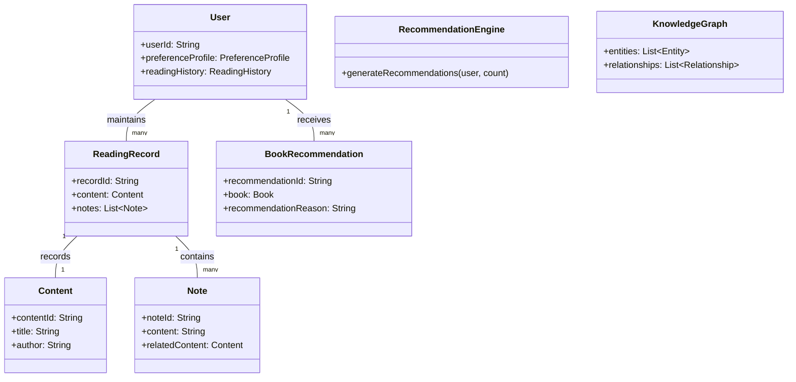

# NextBook Agent（我的下一本书）

> 智能阅读助手：记录、管理与发现你的阅读世界

<p align="center">
  
</p>

## 📚 目录

- [NextBook Agent（我的下一本书）](#nextbook-agent我的下一本书)
  - [📚 目录](#-目录)
  - [项目概述](#项目概述)
  - [核心功能](#核心功能)
    - [📥 SAVE - 内容保存](#-save---内容保存)
    - [📚 NEXT - 书籍推荐](#-next---书籍推荐)
    - [🔍 RECALL - 知识回忆](#-recall---知识回忆)
    - [📊 REPORT - 数据报告](#-report---数据报告)
  - [模型设计](#模型设计)
    - [领域模型概述](#领域模型概述)
    - [模型设计文档](#模型设计文档)
  - [版本规划](#版本规划)
  - [技术架构](#技术架构)
    - [系统架构概述](#系统架构概述)
    - [架构设计文档](#架构设计文档)
  - [用户界面](#用户界面)
    - [设计理念](#设计理念)
    - [操作模型](#操作模型)
    - [主界面设计](#主界面设计)
    - [核心功能界面](#核心功能界面)
      - [📥 SAVE - 内容保存](#-save---内容保存-1)
      - [📚 NEXT - 书籍推荐](#-next---书籍推荐-1)
      - [🔍 RECALL - 知识回忆](#-recall---知识回忆-1)
      - [📊 REPORT - 数据报告](#-report---数据报告-1)
    - [交互设计原则](#交互设计原则)
    - [视觉风格](#视觉风格)
    - [适配策略](#适配策略)
  - [快速上手](#快速上手)
    - [系统要求](#系统要求)
    - [安装步骤](#安装步骤)
    - [初次使用配置](#初次使用配置)
  - [开发状态](#开发状态)
  - [常见问题](#常见问题)
    - [Q: NextBook Agent需要联网使用吗？](#q-nextbook-agent需要联网使用吗)
    - [Q: 我可以在多台设备上同步使用吗？](#q-我可以在多台设备上同步使用吗)
    - [Q: NextBook Agent支持哪些文件格式？](#q-nextbook-agent支持哪些文件格式)
    - [Q: 如何保护我的阅读数据和笔记？](#q-如何保护我的阅读数据和笔记)
  - [反馈与支持](#反馈与支持)
  - [未来计划](#未来计划)
  - [贡献指南](#贡献指南)
  - [许可证](#许可证)

## 项目概述

* NextBook Agent 是一个智能阅读助手，帮助用户管理 `阅读过` 的内容、笔记和获取个性化图书推荐。通过AI技术，它能够理解用户的阅读偏好，提供高质量的内容推荐，同时对阅读历史进行多维度分析。
  * 注意：本助手不是阅读器，作为阅读助手，帮助用户更好地管理和挖掘曾经阅读过的内容。

**主要价值**：
- 📝 【通过】方便记录阅读内容和笔记
- 🔍 【达到】智能推荐相关优质书籍
- 🧠 【同时】构建个人知识库、建立`洞见链接`
- 📊 【顺带】生成阅读统计与报告

* 何谓：
  * 洞见链接：即用户的个人见解与他人见解的关联
     * 他人：某位当代活跃的、历史著名的大神们
     * 关联：指本助手发掘出，`我`的见解与他们相当、或更深刻
       * 只为：告诉自己，洞见时刻，`我`并不孤单 

**典型使用场景**：
- 📖 学者整理研究笔记，追踪学术发展脉络
- 🎓 学生管理课程阅读材料，准备论文和考试
- 💼 专业人士跟踪行业动态，积累专业知识
- 📚 爱书人管理个人书单，发现新的阅读兴趣

## 核心功能

### 📥 SAVE - 内容保存

* **形式**：导入（上传）PDF、EPUB格式的书籍文件
  * **以及**：拷贝粘贴文本和图像，作为笔记
  * **还有**：添加额外的文本和图像，作为备注
* **分类**：手动创建目录结构，保持手动分类视图（默认：保存时间）
  * **支持** 自动智能分类视图（基于：主题）

### 📚 NEXT - 书籍推荐

* **推荐**：三本新书（关键功能）
  * **支持**：再来三本（不满意当前推荐）
* **展示**：封面 + 摘要 + 推荐理由
* **获取**：预下载、立刻、后台，搜索可下载源，
  * **优先**：本地文件 > 在线资源，EPUB > PDF
* **来源**：
  * **实时互联网搜索**：获取最新出版信息、读者评价和购买链接
  * **专业书评网站**：整合Goodreads、豆瓣读书等平台的评分和评论
  * **学术数据库**：连接Google Scholar等获取学术著作推荐
* **算法**：
  * 【AlgA】基于用户阅读历史、参考其笔记和备注
    * 结合：最新出版 + 领域经典 + 近期热门
  * 【AlgB】实时搜索引擎整合，根据用户兴趣关键词爬取推荐

### 🔍 RECALL - 知识回忆

* **回顾**：默认展示（生成）最近1个月的阅读记录与笔记
  * **支持**：按时间线（月/季/年）查看
* **添加**：支持在回顾时添加新的见解和笔记
* **检索**：按主题、作者、时间等多维度筛选内容
* **挖掘**：
  * 知识图谱
  * 见解关联（即：我的见解、跟哪位大神的见解相当）

### 📊 REPORT - 数据报告

* **阅读统计**：展示当年和历年阅读量、笔记数量
* **主题分析**：阅读主题分布可视化
* **知识地图**：构建个人知识图谱
* **进度追踪**：阅读目标完成度

## 模型设计

NextBook Agent采用领域驱动设计(DDD)方法构建核心模型，确保系统具有清晰的业务边界和丰富的领域表达能力。

### 领域模型概述



### 模型设计文档

查看详细模型设计文档：

- [领域模型设计](docs/models/DomainModel.md) - 完整领域模型与实体关系
- [核心领域与上下文](docs/models/CoreDomains.md) - 领域划分与上下文映射
- [聚合与聚合根](docs/models/Aggregates.md) - 聚合设计与实体关系
- [领域事件](docs/models/DomainEvents.md) - 事件驱动设计与事件流
- [领域服务](docs/models/DomainServices.md) - 核心领域服务设计
- [值对象](docs/models/ValueObjects.md) - 值对象设计与使用场景
- [战略设计](docs/models/StrategicDesign.md) - DDD战略设计与通用语言

## 版本规划

* **单机版**：`macOS Version`
  * **个人桌面**：仅支持macBook，典型的桌面使用体验
  * **单设备部署**：本地化部署、存储和使用
  * **目的**：
    * POC（概念验证）版本，验证核心功能和用户体验
    * 寻找到核心用户群体，收集反馈和建议 
  
* **多端版**：`multiOS Version`
  * **多端使用**：将支持Win11、Ubuntu Linux、iPhone和Android平台
  * **无缝同步**：在不同设备间保持阅读进度和笔记的同步
  * **跨平台体验**：统一功能设计，适配不同设备特性
  * **目的**：
    * 扩大用户群体，具有市场竞争力的产品

## 技术架构

NextBook Agent采用模块化、本地优先的技术架构，确保用户数据安全的同时提供强大的功能。

### 系统架构概述


### 架构设计文档

查看详细架构设计文档：

- [通用架构设计原则](docs/architecture/ArchDesignCommon.md) - 基本设计理念和原则
- [macOS版架构设计](docs/architecture/ArchDesignMacOsVersion.md) - 单机版(POC)的具体实现架构
- [多平台版架构设计](docs/architecture/ArchDesignMultiOsVersion.md) - 多平台支持的扩展架构

## 用户界面

NextBook Agent采用简洁直观的界面设计，将四大核心功能无缝集成为统一的用户体验。

### 设计理念

* **内容为王**：界面设计以内容展示为中心，最大化内容查看区域
* **减少干扰**：最小化不必要的视觉元素，让用户专注于内容与思考
* **自然交互**：符合用户心智模型的操作方式，降低学习成本
* **灵活布局**：支持用户根据需求自定义工作区布局
* **暗黑模式**：全面支持系统级暗黑模式，保护用户视力
* **过程反馈**：每个操作都有明确的视觉反馈，让用户知道正在发生什么
* **渐进式学习**：从简单到复杂，逐步引导用户了解高级功能

### 操作模型


### 主界面设计


### 核心功能界面

#### 📥 SAVE - 内容保存

**操作流程**:

1. **内容导入** → 2. **内容浏览** → 3. **内容标记** → 4. **添加笔记** → 5. **分类保存**


界面设计:


**特色设计与操作流程**:
* **拖放导入**: 直接拖放文件到界面即可导入，无需多步操作
* **一键标记**: 选中文本后直接出现标记选项，减少点击步骤
* **上下文笔记**: 笔记始终与原文保持视觉关联，不丢失内容上下文
* **标签推荐**: 基于内容自动推荐标签，一键应用
* **快速导航**: 通过目录或搜索快速查找特定章节，支持书签定位

#### 📚 NEXT - 书籍推荐

**操作流程**:

1. **进入推荐** → 2. **浏览推荐列表** → 3. **查看详情** → 4. **获取书籍** → 5. **提供反馈**


界面设计:


**特色设计与操作流程**:
* **渐进式展示**: 首先展示书籍封面和简短推荐理由，点击后逐步展开详情
* **情境推荐**: 根据当前时间、最近阅读和用户习惯调整推荐内容
* **即时预览**: 悬停在书籍上即可预览核心信息，减少页面切换
* **一键获取**: 获取按钮自动选择最佳来源，简化获取过程
* **推荐透明度**: 点击"为什么推荐"按钮，查看详细推荐原因和数据来源

#### 🔍 RECALL - 知识回忆

**操作流程**:

1. **选择回忆方式** → 2. **浏览/搜索内容** → 3. **查看细节** → 4. **添加新见解** → 5. **关联探索**


界面设计:


**特色设计与操作流程**:
* **智能提示**: 根据当前查看内容自动提示可能相关的其他笔记和见解
* **路径记忆**: 记录用户探索路径，支持随时回退或前进
* **焦点缩放**: 在关联图谱中支持缩放操作，从全局概览到细节查看
* **动态关系**: 关联强度可视化，连线粗细表示关联度
* **无限画布**: 采用无限滚动设计，不限制内容展示空间，减少分页干扰

#### 📊 REPORT - 数据报告

**操作流程**:

1. **选择报告类型** → 2. **设置参数** → 3. **生成报告** → 4. **交互探索** → 5. **导出分享**


界面设计:


**特色设计与操作流程**:
* **模板选择**: 提供多种报告模板，一键生成不同风格报告
* **实时更新**: 报告数据实时更新，反映最新内容收集活动
* **交互式图表**: 支持点击、拖拽、缩放等操作探索数据细节
* **目标调整**: 在报告界面直接调整内容收集目标，系统即时反馈影响
* **智能摘要**: 自动生成核心发现和建议，突出重要数据洞察

### 交互设计原则

* **简洁直观**：界面清晰，减少视觉噪音，突出内容
* **操作连贯性**：相关操作放在一起，形成自然流程，减少跳转
* **即时反馈**：每个操作都有明确的视觉反馈，让用户知道系统状态
* **可逆操作**：允许用户撤销大多数操作，减少操作焦虑
* **上下文感知**：界面根据用户当前活动智能调整，提供相关功能
* **快捷键支持**：全面的键盘快捷键支持，提高操作效率

### 视觉风格

* **色彩系统**：采用自然、舒适的配色方案，减少眼部疲劳
* **排版层级**：清晰的文字层级结构，提升可读性
* **图标语言**：简洁统一的图标设计，增强直观性
* **动效策略**：适度的过渡动画，提供流畅感但不过度装饰
* **空间利用**：合理利用页面空间，避免过度拥挤或空白

### 适配策略

* **屏幕尺寸**：针对不同尺寸的MacBook屏幕优化布局
* **输入方式**：同时优化触控板和鼠标操作体验
* **系统集成**：与macOS原生交互模式保持一致
* **外接显示**：支持外接显示器下的布局自动调整

## 快速上手

### 系统要求
- macOS 12.0及以上
- 最低8GB内存
- 1GB可用存储空间
- 推荐：Apple Silicon芯片(M1及以上)

### 安装步骤

```bash
# 克隆仓库
git clone https://github.com/yourusername/nextbook-agent.git

# 进入项目目录
cd nextbook-agent

# 创建虚拟环境
python -m venv venv
source venv/bin/activate  # macOS/Linux
# 或 venv\Scripts\activate  # Windows

# 安装依赖
pip install -r requirements.txt

# 配置应用
cp config.example.yml config.yml
# 编辑config.yml文件，设置必要的API密钥和配置选项

# 启动应用
python app.py
```

### 初次使用配置

1. **创建账户**：首次启动需创建本地用户档案
2. **导入内容**：使用"SAVE"功能导入你的第一本书或笔记
3. **设置偏好**：在设置面板中配置阅读偏好和推荐设置
4. **开始探索**：使用"NEXT"功能获取首批个性化推荐

## 开发状态

- [x] 核心功能设计
- [x] 基础架构搭建
- [x] 数据存储层实现
- [ ] UI界面开发（进行中：60%）
- [ ] 内容保存功能（进行中：40%）
- [ ] 推荐算法实现（进行中：30%）
- [ ] 知识回忆系统（计划中）
- [ ] 报告生成功能（计划中）

## 常见问题

### Q: NextBook Agent需要联网使用吗？
A: 基本功能可离线使用，但书籍推荐和部分高级分析功能需要网络连接。

### Q: 我可以在多台设备上同步使用吗？
A: 当前版本为单机版，多设备同步功能将在多端版本中实现。

### Q: NextBook Agent支持哪些文件格式？
A: 目前支持PDF和EPUB格式，后续版本将添加更多格式支持。

### Q: 如何保护我的阅读数据和笔记？
A: 您的数据存储在本地设备，建议定期备份重要数据。未来版本将提供端到端加密的云备份选项。

## 反馈与支持

- **问题报告**：通过[GitHub Issues](https://github.com/yourusername/nextbook-agent/issues)提交问题
- **功能建议**：使用[功能请求模板](https://github.com/yourusername/nextbook-agent/issues/new?template=feature_request.md)
- **社区讨论**：加入我们的[Discord社区](https://discord.gg/nextbook)或[Reddit论坛](https://reddit.com/r/nextbookagent)
- **邮件联系**：support@nextbookagent.com

## 未来计划

* **社区功能**：分享笔记和推荐
* **语音笔记**：支持语音输入和转录
* **云端同步**：确保多设备数据一致性
* **扩展平台**：支持iOS、Linux、Windows

## 贡献指南

欢迎贡献代码、报告问题或提出新功能建议！详情请参考[贡献指南](CONTRIBUTING.md)。

## 许可证

本项目基于[MIT许可证](LICENSE)开源。