# NextBook Agent（我的下一本书）

> 智能阅读助手：记录、管理与发现你的阅读世界

<p align="center">
  
</p>

## 📚 目录

- [NextBook Agent（我的下一本书）](#nextbook-agent我的下一本书)
  - [📚 目录](#-目录)
  - [项目概述](#项目概述)
  - [核心功能](#核心功能)
    - [📥 SAVE - 内容保存](#-save---内容保存)
    - [📚 NEXT - 书籍推荐](#-next---书籍推荐)
    - [🔍 RECALL - 知识回忆](#-recall---知识回忆)
    - [📊 REPORT - 数据报告](#-report---数据报告)
  - [使用场景](#使用场景)
  - [技术架构](#技术架构)
    - [系统架构概述](#系统架构概述)
    - [首版架构 (macOS POC版)](#首版架构-macos-poc版)
    - [扩展架构 (多平台版)](#扩展架构-多平台版)
    - [数据流架构](#数据流架构)
      - [核心存储架构](#核心存储架构)
      - [内容获取流程 (SAVE)](#内容获取流程-save)
      - [推荐系统流程 (NEXT)](#推荐系统流程-next)
      - [知识回忆流程 (RECALL)](#知识回忆流程-recall)
      - [数据报告流程 (REPORT)](#数据报告流程-report)
      - [跨流程数据交互](#跨流程数据交互)
    - [架构设计原则](#架构设计原则)
  - [用户界面](#用户界面)
    - [主界面设计](#主界面设计)
    - [核心功能界面](#核心功能界面)
      - [📥 SAVE - 内容保存](#-save---内容保存-1)
      - [📚 NEXT - 书籍推荐](#-next---书籍推荐-1)
      - [🔍 RECALL - 知识回忆](#-recall---知识回忆-1)
      - [📊 REPORT - 数据报告](#-report---数据报告-1)
    - [交互设计原则](#交互设计原则)
  - [快速上手](#快速上手)
  - [开发状态](#开发状态)
  - [未来计划](#未来计划)
  - [贡献指南](#贡献指南)
  - [许可证](#许可证)

## 项目概述

NextBook Agent 是一个智能阅读助手，帮助用户管理阅读内容、笔记和获取个性化图书推荐。通过AI技术，它能够理解用户的阅读偏好，提供高质量的内容推荐，同时对阅读历史进行多维度分析。

**主要价值**：
- 📝 【通过】高效记录阅读内容和笔记
- 🔍 【达到】智能推荐相关优质书籍
- 🧠 【同时】构建个人知识库、建立`洞见链接`
- 📊 【顺带】生成阅读统计与报告

* 备注：
  * 洞见链接：即用户的个人见解与他人见解的关联
     * 他人：某位当代活跃的、历史著名的大神们
     * 关联：指发掘出，自己的见解与他们相当、或更深刻

## 核心功能

### 📥 SAVE - 内容保存

* **形式**：导入（上传）PDF、EPUB格式的书籍文件
  * **以及**：拷贝粘贴文本和图像，作为笔记
  * **还有**：添加额外的文本和图像，作为备注
* **分类**：手动创建目录结构，保持手动分类视图（默认：保存时间）
  * **支持** 自动智能分类视图（基于：主题）

### 📚 NEXT - 书籍推荐

* **推荐**：三本新书（关键功能）
  * **支持**：再来三本（不满意当前推荐）
* **展示**：封面 + 摘要 + 推荐理由
* **获取**：预下载、立刻、后台，搜索可下载源，
  * **优先**：本地文件 > 在线资源，EPUB > PDF
* **来源**：
  * **实时互联网搜索**：获取最新出版信息、读者评价和购买链接
  * **专业书评网站**：整合Goodreads、豆瓣读书等平台的评分和评论
  * **学术数据库**：连接Google Scholar等获取学术著作推荐
* **算法**：
  * 【AlgA】基于用户阅读历史、参考其笔记和备注
    * 结合：最新出版 + 领域经典 + 近期热门
  * 【AlgB】实时搜索引擎整合，根据用户兴趣关键词爬取推荐

### 🔍 RECALL - 知识回忆

* **回顾**：默认展示（生成）最近1个月的阅读记录与笔记
  * **支持**：按时间线（月/季/年）查看
* **添加**：支持在回顾时添加新的见解和笔记
* **检索**：按主题、作者、时间等多维度筛选内容
* **挖掘**：
  * 知识图谱
  * 见解关联（即：我的见解、跟哪位大神的见解相当）

### 📊 REPORT - 数据报告

* **阅读统计**：展示当年和历年阅读量、笔记数量
* **主题分析**：阅读主题分布可视化
* **知识地图**：构建个人知识图谱
* **进度追踪**：阅读目标完成度

## 使用场景

* **首版聚焦**：`macOS Version`
  * **个人桌面**：优先支持macBook用户，提供完整的桌面阅读体验
  * **单设备部署**：本地化存储和处理，保护阅读隐私
  * **目的**：
    * POC（概念验证）版本，验证核心功能和用户体验
    * 寻找到核心用户群体，收集反馈和建议 
  
* **未来扩展**：`multiOS Version`
  * **多端使用**：将支持Win11、Ubuntu Linux、iPhone和Android平台
  * **无缝同步**：在不同设备间保持阅读进度和笔记的同步
  * **跨平台体验**：统一的UI和功能设计，适配不同设备特性
  * **目的**：
    * 扩大用户群体，提升产品的市场竞争力

## 技术架构

### 系统架构概述

```mermaid
flowchart TD
    User([用户]) --- Frontend
    
    subgraph Frontend["前端界面"]
        UI[用户界面] --- SaveUI[SAVE界面]
        UI --- NextUI[NEXT界面]
        UI --- RecallUI[RECALL界面]
        UI --- ReportUI[REPORT界面]
        
        SaveUI --- Reader[阅读器]
        SaveUI --- Notes[笔记系统]
        NextUI --- Recommend[推荐展示]
        RecallUI --- KnowledgeMap[知识图谱]
        ReportUI --- Dashboard[数据仪表盘]
    end
    
    subgraph Backend["后端服务"]
        API[API服务] --- ContentService[内容服务]
        API --- RecommendService[推荐服务]
        API --- RecallService[回忆服务]
        API --- AnalyticsService[分析服务]
        
        ContentService --- DocumentProcessor[文档处理器]
        ContentService --- NoteManager[笔记管理器]
        RecommendService --- RecommendEngine[推荐引擎]
        RecommendService --- WebSearchEngine[网络搜索引擎]
        RecallService --- SearchEngine[检索引擎]
        AnalyticsService --- StatisticsEngine[统计引擎]
    end
    
    subgraph Internet["互联网资源"]
        BookAPI[图书API] --- ReviewSites[书评网站]
        BookAPI --- BookStores[在线书店]
        BookAPI --- AcademicDB[学术数据库]
    end
    
    subgraph AI["AI组件"]
        LLM[大语言模型] --- RAG[检索增强生成]
        RAG --- VectorDB[向量数据库]
        LLM --- TopicExtractor[主题提取器]
        LLM --- BookRecommender[图书推荐器]
        LLM --- InsightGenerator[见解生成器]
    end
    
    subgraph Storage["存储层"]
        DB[(关系数据库)] --- FileSystem[(文件系统)]
        VectorDB --- DB
        DB --- UserProfile[用户画像]
        DB --- ReadingHistory[阅读历史]
        DB --- SearchCache[搜索缓存]
    end
    
    Frontend --- Backend
    Backend --- AI
    Backend --- Storage
    Backend --- Internet
    
    style Frontend fill:#d0e0ff,stroke:#3080ff
    style Backend fill:#ffe0d0,stroke:#ff8030
    style AI fill:#d0ffe0,stroke:#30ff80
    style Storage fill:#e0d0ff,stroke:#8030ff
    style Internet fill:#fff0d0,stroke:#ffb030
```

### 首版架构 (macOS POC版)

```mermaid
flowchart TD
    User([用户]) --> UI[Electron+React应用]
    
    subgraph "前端层"
        UI --> SaveUI[SAVE模块]
        UI --> NextUI[NEXT模块]
        UI --> RecallUI[RECALL模块]
        UI --> ReportUI[REPORT模块]
        
        SaveUI --> PDF[PDF.js]
        SaveUI --> EPUB[EPUB.js]
        UI --> TW[TailwindCSS]
    end
    
    subgraph "本地服务层"
        API[FastAPI] --> DocProcess[文档处理服务]
        API --> RecommendEngine[推荐引擎服务]
        API --> SearchService[检索服务]
        API --> AnalyticsService[分析服务]
    end
    
    subgraph "数据层"
        DocProcess --> SQLite[(SQLite)]
        RecommendEngine --> SQLite
        SearchService --> SQLite
        AnalyticsService --> SQLite
        SearchService --> VectorDB[(ChromaDB)]
    end
    
    subgraph "AI层"
        subgraph "本地AI"
            LocalAI[Ollama] --> LocalLLM[开源LLM]
            LocalAI --> LocalRAG[本地RAG]
        end
        
        subgraph "云端AI"
            style CloudAI fill:#f9e79f,stroke:#f39c12
            CloudAI[OpenAI API] --> CloudLLM[GPT模型]
            CloudAI --> CloudVectorDB[云端向量数据库]
        end
    end
    
    SaveUI <--> API
    NextUI <--> API
    RecallUI <--> API
    ReportUI <--> API
    
    DocProcess <--> LocalAI
    RecommendEngine <--> LocalAI
    SearchService <--> LocalAI
    AnalyticsService <--> LocalAI
    
    DocProcess <-.-> CloudAI
    RecommendEngine <-.-> CloudAI
    SearchService <-.-> CloudAI
    AnalyticsService <-.-> CloudAI
    
    classDef frontend fill:#d0e0ff,stroke:#3080ff
    classDef backend fill:#ffe0d0,stroke:#ff8030
    classDef data fill:#e0d0ff,stroke:#8030ff
    classDef localai fill:#d0ffe0,stroke:#30ff80
    classDef cloudai fill:#f9e79f,stroke:#f39c12
    
    class UI,SaveUI,NextUI,RecallUI,ReportUI,PDF,EPUB,TW frontend
    class API,DocProcess,RecommendEngine,SearchService,AnalyticsService backend
    class SQLite,VectorDB data
    class LocalAI,LocalLLM,LocalRAG localai
    class CloudAI,CloudLLM,CloudVectorDB cloudai
```

### 扩展架构 (多平台版)

```mermaid
flowchart TD
    User([用户]) --- A1 & A2 & A3
    
    subgraph "多平台前端"
        A1[Web应用] --> B1[React/Next.js]
        A2[移动应用] --> B2[React Native]
        A3[桌面应用] --> B3[Electron]
        
        B1 & B2 & B3 --> C[统一UI组件库]
        
        C --> SaveUIMulti[SAVE模块]
        C --> NextUIMulti[NEXT模块]
        C --> RecallUIMulti[RECALL模块]
        C --> ReportUIMulti[REPORT模块]
    end
    
    subgraph "云端服务层"
        D[API网关/负载均衡] --> E1[用户认证服务]
        D --> E2[内容管理服务]
        D --> E3[推荐引擎服务]
        D --> E4[知识检索服务]
        D --> E5[分析报告服务]
        D --> E6[同步服务]
    end
    
    subgraph "数据层"
        F1[(PostgreSQL)] --- F2[(Redis缓存)]
        F1 --- F3[(对象存储)]
        F4[向量数据库] --- F1
        F5[搜索引擎] --- F1
    end
    
    subgraph "AI引擎层"
        G1[分布式AI集群] --> G2[用户偏好分析]
        G1 --> G3[内容理解引擎]
        G1 --> G4[推荐算法引擎]
        G1 --> G5[知识关联引擎]
        
        G6[模型训练框架] --> G1
    end
    
    SaveUIMulti & NextUIMulti & RecallUIMulti & ReportUIMulti <--> D
    
    E1 & E2 & E3 & E4 & E5 & E6 <--> F1
    E1 & E2 & E3 & E4 & E5 & E6 <--> G1
    
    E2 --> F3
    E4 --> F4
    E4 --> F5
    
    classDef frontend fill:#d0e0ff,stroke:#3080ff
    classDef backend fill:#ffe0d0,stroke:#ff8030
    classDef data fill:#e0d0ff,stroke:#8030ff
    classDef ai fill:#d0ffe0,stroke:#30ff80
    
    class A1,A2,A3,B1,B2,B3,C,SaveUIMulti,NextUIMulti,RecallUIMulti,ReportUIMulti frontend
    class D,E1,E2,E3,E4,E5,E6 backend
    class F1,F2,F3,F4,F5 data
    class G1,G2,G3,G4,G5,G6 ai
```

### 数据流架构

系统的数据流被分为四个主要功能流，所有流程共享核心存储系统。

#### 核心存储架构

```mermaid
flowchart LR
    %% 定义主要数据节点及连接
    DB[(本地数据库)]
    VDB[(向量数据库)]
    FS[(文件系统)]
    
    DB <--> VDB
    DB <--> FS
    
    subgraph "存储内容分类"
        DB --> MD[元数据存储]
        DB --> UD[用户数据]
        VDB --> VS[语义向量]
        FS --> RAW[原始文件]
        FS --> GEN[生成内容]
    end
    
    classDef storage fill:#f5f5f5,stroke:#666666,stroke-width:2px
    classDef content fill:#e6f7ff,stroke:#1890ff,stroke-width:1px
    
    class DB,VDB,FS storage
    class MD,UD,VS,RAW,GEN content
```

**存储组件用途解释**:

| 存储组件             | 类型     | 用途说明                                                             |
| -------------------- | -------- | -------------------------------------------------------------------- |
| **本地数据库 (DB)**  | 核心存储 | 存储结构化数据，管理用户信息、阅读历史、书籍元数据和系统配置         |
| **向量数据库 (VDB)** | 核心存储 | 管理文本语义向量，支持相似度搜索和语义匹配，为推荐和回忆功能提供支持 |
| **文件系统 (FS)**    | 核心存储 | 存储原始书籍文件、图像和导出内容，提供高效的大文件管理               |
| **元数据存储 (MD)**  | 内容分类 | 保存书籍信息（标题、作者、出版信息）、阅读状态和标签数据             |
| **用户数据 (UD)**    | 内容分类 | 记录用户配置、阅读习惯、偏好设置和推荐历史                           |
| **语义向量 (VS)**    | 内容分类 | 存储文本内容的向量表示，用于相似内容查找和语义检索                   |
| **原始文件 (RAW)**   | 内容分类 | 保存原始PDF、EPUB等格式的完整书籍文件，确保内容完整性                |
| **生成内容 (GEN)**   | 内容分类 | 存储AI生成的摘要、见解、报告和知识关联等衍生内容                     |

**数据流动与工作原理**:

* **内容处理流**: 原始文件上传 → 解析为文本 → 提取元数据 → 转换为向量 → 分别存储
* **检索流程**: 用户查询 → 向量匹配 + 关键词搜索 → 从原始文件提取相关段落 → 返回结果
* **推荐机制**: 分析用户数据 → 结合语义向量相似度 → 生成个性化推荐 → 存储反馈

#### 内容获取流程 (SAVE)

```mermaid
flowchart LR
    %% SAVE流程
    DB[(本地数据库)]
    VDB[(向量数据库)]
    FS[(文件系统)]
    
    subgraph "内容获取流"
        A1[用户上传/导入] --> A2[文档解析]
        A2 --> A3[内容提取]
        A3 --> A4[元数据识别]
        A3 --> A5[文本向量化]
        A4 --> A6[分类标签生成]
        A5 --> A7[语义索引构建]
        A6 & A7 --> A8[存储索引]
    end
    
    A3 --> FS
    A5 --> VDB
    A8 --> DB
    
    classDef flow1 fill:#ffe6cc,stroke:#d79b00,stroke-width:2px
    classDef storage fill:#f5f5f5,stroke:#666666,stroke-dasharray:5 5
    
    class A1,A2,A3,A4,A5,A6,A7,A8 flow1
    class DB,VDB,FS storage
```

#### 推荐系统流程 (NEXT)

```mermaid
flowchart LR
    %% NEXT流程
    DB[(本地数据库)]
    VDB[(向量数据库)]
    
    subgraph "推荐流程"
        B1[用户历史分析] --> B2[兴趣模型构建]
        B2 --> B3[LLM生成候选]
        B2 --> B6[网络搜索]
        B3 <--> B8[本地书库检索]
        B6 --> B7[搜索结果处理]
        B3 & B7 --> B4[多维度排序]
        B4 --> B5[个性化推荐展示]
        B5 --> B9[用户反馈收集]
        B9 --> B1
    end
    
    DB --> B1
    DB --> B8
    VDB --> B3
    B9 --> DB
    
    classDef flow2 fill:#d5e8d4,stroke:#82b366,stroke-width:2px
    classDef storage fill:#f5f5f5,stroke:#666666,stroke-dasharray:5 5
    
    class B1,B2,B3,B4,B5,B6,B7,B8,B9 flow2
    class DB,VDB storage
```

#### 知识回忆流程 (RECALL)

```mermaid
flowchart LR
    %% RECALL流程
    DB[(本地数据库)]
    VDB[(向量数据库)]
    
    subgraph "回忆流程"
        C1[用户检索查询] --> C2[混合检索策略]
        C2 --> C3[语义搜索]
        C2 --> C6[关键词搜索]
        C3 & C6 --> C4[结果融合排序]
        C4 --> C7[上下文关联构建]
        C7 --> C5[可视化呈现]
        C5 --> C8[交互式探索]
        C8 --> C1
    end
    
    DB --> C2
    VDB --> C3
    C7 --> VDB
    C8 --> DB
    
    classDef flow3 fill:#dae8fc,stroke:#6c8ebf,stroke-width:2px
    classDef storage fill:#f5f5f5,stroke:#666666,stroke-dasharray:5 5
    
    class C1,C2,C3,C4,C5,C6,C7,C8 flow3
    class DB,VDB storage
```

#### 数据报告流程 (REPORT)

```mermaid
flowchart LR
    %% REPORT流程
    DB[(本地数据库)]
    
    subgraph "报告生成流"
        D1[数据收集] --> D2[多维度统计]
        D2 --> D3[模式识别]
        D2 --> D4[趋势分析]
        D3 & D4 --> D5[洞见生成]
        D5 --> D6[可视化图表]
        D6 --> D7[报告组装]
    end
    
    DB --> D1
    D7 --> DB
    
    classDef flow4 fill:#e1d5e7,stroke:#9673a6,stroke-width:2px
    classDef storage fill:#f5f5f5,stroke:#666666,stroke-dasharray:5 5
    
    class D1,D2,D3,D4,D5,D6,D7 flow4
    class DB storage
```

#### 跨流程数据交互

```mermaid
flowchart LR
    %% 流程间的交互连接
    SAVE[内容获取系统] --> DB[(数据存储)]
    NEXT[推荐系统] --> DB
    RECALL[回忆系统] --> DB
    REPORT[报告系统] --> DB
    
    SAVE -.-> |"提供内容"| NEXT
    SAVE -.-> |"提供索引"| RECALL
    NEXT -.-> |"影响推荐"| RECALL
    RECALL -.-> |"提供见解"| NEXT
    NEXT -.-> |"用户喜好"| REPORT
    RECALL -.-> |"知识关联"| REPORT
    REPORT -.-> |"阅读分析"| NEXT
    
    classDef system fill:#f5f5f5,stroke:#666666,stroke-width:2px
    classDef storage fill:#e6f7ff,stroke:#1890ff,stroke-width:2px
    classDef flow fill:#fff2e8,stroke:#fa8c16,stroke-width:1px,stroke-dasharray:5 5
    
    class SAVE,NEXT,RECALL,REPORT system
    class DB storage
```

### 架构设计原则

* **本地优先**：核心功能不依赖网络连接
* **模块化设计**：组件可独立升级和替换
* **渐进增强**：基础功能可在低配置环境运行，高级功能随资源扩展
* **隐私保护**：敏感数据默认存储在本地，云同步为可选项

## 用户界面

NextBook Agent采用简洁直观的界面设计，将四大核心功能无缝集成为统一的用户体验。

### 主界面设计

```mermaid
graph TD
    subgraph "NextBook主界面"
        direction LR
        
        subgraph "侧边栏导航"
            N1[📥 SAVE] -.-> N5[书库]
            N2[📚 NEXT] -.-> N6[推荐]
            N3[🔍 RECALL] -.-> N7[回忆]
            N4[📊 REPORT] -.-> N8[报告]
        end
        
        subgraph "主内容区"
            C[视图切换区]
        end
        
        subgraph "工具栏"
            T1[导入] --- T2[搜索] --- T3[设置]
        end
    end
    
    classDef nav fill:#f9f9f9,stroke:#666
    classDef content fill:#ffffff,stroke:#999
    classDef tools fill:#f0f0f0,stroke:#666
    
    class N1,N2,N3,N4,N5,N6,N7,N8 nav
    class C content
    class T1,T2,T3 tools
```

### 核心功能界面

#### 📥 SAVE - 内容保存

```mermaid
graph TD
    subgraph "内容保存界面"
        direction LR
        
        subgraph "书籍阅读器"
            R1[文档查看器] --- R2[划线工具]
            R1 --- R3[笔记面板]
        end
        
        subgraph "内容管理"
            M1[书籍列表] --- M2[分类管理]
            M1 --- M3[标签系统]
        end
    end
    
    classDef reader fill:#e6f7ff,stroke:#1890ff
    classDef manager fill:#f6ffed,stroke:#52c41a
    
    class R1,R2,R3 reader
    class M1,M2,M3 manager
```

#### 📚 NEXT - 书籍推荐

```mermaid
graph LR
    subgraph "智能推荐界面"
        direction TB
        
        subgraph "个性化推荐"
            P1[书籍A] --- P2[书籍B] --- P3[书籍C]
            P4[个性化理由]
        end
        
        subgraph "发现区"
            D1[最新出版] --- D2[领域经典]
            D2 --- D3[近期热门]
        end
        
        subgraph "细节视图"
            V1[书籍封面] --- V2[内容简介]
            V2 --- V3[获取链接]
        end
    end
    
    classDef recommend fill:#fff2e8,stroke:#fa8c16
    classDef discover fill:#f9f0ff,stroke:#722ed1
    classDef detail fill:#e6fffb,stroke:#13c2c2
    
    class P1,P2,P3,P4 recommend
    class D1,D2,D3 discover
    class V1,V2,V3 detail
```

#### 🔍 RECALL - 知识回忆

```mermaid
graph TD
    subgraph "知识回忆界面"
        direction LR
        
        subgraph "时间线视图"
            T1[月视图] --- T2[周视图] --- T3[日视图]
        end
        
        subgraph "知识卡片"
            K1[笔记卡片] --- K2[引用卡片]
            K1 --- K3[思考卡片]
        end
        
        subgraph "关联视图"
            C1[知识图谱] --- C2[主题关联]
        end
    end
    
    classDef timeline fill:#f0f5ff,stroke:#2f54eb
    classDef cards fill:#fff1f0,stroke:#f5222d
    classDef connections fill:#fcffe6,stroke:#a0d911
    
    class T1,T2,T3 timeline
    class K1,K2,K3 cards
    class C1,C2 connections
```

#### 📊 REPORT - 数据报告

```mermaid
graph LR
    subgraph "数据报告界面"
        direction TB
        
        subgraph "阅读统计"
            S1[年度总览] --- S2[月度趋势]
            S2 --- S3[类别分布]
        end
        
        subgraph "知识地图"
            M1[主题地图] --- M2[关键词云]
        end
        
        subgraph "目标追踪"
            G1[阅读目标] --- G2[完成进度]
        end
    end
    
    classDef stats fill:#e6f7ff,stroke:#1890ff
    classDef map fill:#fff7e6,stroke:#fa8c16
    classDef goals fill:#f6ffed,stroke:#52c41a
    
    class S1,S2,S3 stats
    class M1,M2 map
    class G1,G2 goals
```

### 交互设计原则

* **简洁直观**：界面清晰，减少视觉噪音，突出内容
* **一致性**：各功能区保持一致的设计语言和交互模式
* **响应式**：适应不同屏幕尺寸，优化macOS上的显示效果
* **上下文感知**：界面根据用户当前活动智能调整，提供相关功能
* **减少认知负担**：常用功能一键可达，复杂功能分层展示

## 快速上手

```bash
# 克隆仓库
git clone https://github.com/yourusername/nextbook-agent.git

# 安装依赖
cd nextbook-agent
pip install -r requirements.txt

# 启动应用
python app.py
```

## 开发状态

- [x] 核心功能设计
- [x] 基础架构搭建
- [ ] UI界面开发
- [ ] 内容保存功能
- [ ] 推荐算法实现
- [ ] 知识回忆系统
- [ ] 报告生成功能

## 未来计划

* **社区功能**：分享笔记和推荐
* **语音笔记**：支持语音输入和转录
* **云端同步**：确保多设备数据一致性
* **扩展平台**：支持iOS、Linux、Windows

## 贡献指南

欢迎贡献代码、报告问题或提出新功能建议！详情请参考[贡献指南](CONTRIBUTING.md)。

## 许可证

本项目基于[MIT许可证](LICENSE)开源。