# NextBook Agent（我的下一本书）

> 智能阅读助手：记录、管理与发现你的阅读世界

<p align="center">
  
</p>

## 📚 目录

- [NextBook Agent（我的下一本书）](#nextbook-agent我的下一本书)
  - [📚 目录](#-目录)
  - [项目概述](#项目概述)
  - [核心功能](#核心功能)
    - [📥 SAVE - 内容保存](#-save---内容保存)
    - [📚 NEXT - 书籍推荐](#-next---书籍推荐)
    - [🔍 RECALL - 知识回忆](#-recall---知识回忆)
    - [📊 REPORT - 数据报告](#-report---数据报告)
  - [版本定义](#版本定义)
  - [模型设计](#模型设计)
    - [领域模型概述](#领域模型概述)
    - [模型设计文档](#模型设计文档)
    - [核心模型对应功能](#核心模型对应功能)
  - [技术架构](#技术架构)
    - [系统架构概述](#系统架构概述)
      - [主要组件](#主要组件)
    - [架构设计文档](#架构设计文档)
  - [用户界面](#用户界面)
    - [界面架构概述](#界面架构概述)
    - [界面设计原则](#界面设计原则)
    - [界面设计文档](#界面设计文档)
  - [快速上手](#快速上手)
    - [系统要求](#系统要求)
    - [安装步骤](#安装步骤)
    - [初次使用配置](#初次使用配置)
  - [使用手册](#使用手册)
    - [终端用户](#终端用户)
    - [开发者](#开发者)
    - [维护者](#维护者)
  - [开发状态](#开发状态)
  - [常见问题](#常见问题)
    - [Q: NextBook Agent需要联网使用吗？](#q-nextbook-agent需要联网使用吗)
    - [Q: 我可以在多台设备上同步使用吗？](#q-我可以在多台设备上同步使用吗)
    - [Q: NextBook Agent支持哪些文件格式？](#q-nextbook-agent支持哪些文件格式)
    - [Q: 如何保护我的阅读数据和笔记？](#q-如何保护我的阅读数据和笔记)
  - [反馈与支持](#反馈与支持)
  - [未来计划](#未来计划)
  - [贡献指南](#贡献指南)
  - [许可证](#许可证)

## 项目概述

NextBook Agent 是一个智能阅读助手，专注于帮助用户管理**阅读过的内容**、整理笔记并获取个性化图书推荐。通过AI技术，它能够理解用户的阅读偏好，提供高质量的内容推荐，同时对阅读历史进行多维度分析。

> **注意**：NextBook不是阅读器，而是一个阅读助手，帮助用户更好地管理和挖掘曾经阅读过的内容。

**主要价值**：
- 📝 **内容记录** - 方便记录阅读内容和笔记
- 🔍 **智能推荐** - 提供相关优质`书籍推荐`
- 🧠 **知识构建** - 建立个人知识库与`洞见链接`
- 📊 **数据分析** - 生成阅读统计与报告

**洞见链接**是指将用户的个人见解与历史或当代著名思想家的观点关联起来，帮助用户发现自己的思考与伟大思想之间的共鸣点，让用户在探索知识的旅程中不感到孤独。

**典型使用场景**：
- 📖 学者整理研究笔记，追踪学术发展脉络
- 🎓 学生管理课程阅读材料，准备论文和考试
- 💼 专业人士跟踪行业动态，积累专业知识
- 📚 爱书人管理个人书单，发现新的阅读兴趣

## 核心功能

### 📥 SAVE - 内容保存

* **形式**：导入（上传）PDF、EPUB、TXT格式的书籍文件
  * **以及**：拷贝粘贴文本和图像，作为笔记
  * **还有**：添加额外的文本和图像，作为备注
* **分类**：手动创建目录结构，保持手动分类视图（默认：保存时间）
  * **支持** 自动智能分类视图（基于：主题）

### 📚 NEXT - 书籍推荐

* **推荐**：三本新书（关键功能）
  * **支持**：再来三本（不满意当前推荐）
* **展示**：封面 + 摘要 + 推荐理由
* **获取**：预下载、立刻、后台，搜索可下载源，
  * **优先**：本地文件 > 在线资源，EPUB > PDF
* **来源**：
  * **实时互联网搜索**：获取最新出版信息、读者评价和购买链接
  * **专业书评网站**：整合Goodreads、豆瓣读书等平台的评分和评论
  * **学术数据库**：连接Google Scholar等获取学术著作推荐
* **算法**：
  * 【AlgA】基于用户阅读历史、参考其笔记和备注
    * 结合：最新出版 + 领域经典 + 近期热门
  * 【AlgB】实时搜索引擎整合，根据用户兴趣关键词爬取推荐

### 🔍 RECALL - 知识回忆

* **回顾**：默认展示（生成）最近1个月的阅读记录与笔记
  * **支持**：按时间线（月/季/年）查看
* **添加**：支持在回顾时添加新的见解和笔记
* **检索**：按主题、作者、时间等多维度筛选内容
* **挖掘**：
  * 知识图谱
  * 见解关联（即：我的见解、跟哪位大神的见解相当）

### 📊 REPORT - 数据报告

* **阅读统计**：展示当年和历年阅读量、笔记数量
* **主题分析**：阅读主题分布可视化
* **知识地图**：构建个人知识图谱
* **进度追踪**：阅读目标完成度

## 版本定义

* **初始版本（POC）**：`macOS Version`
  * **开发优先级**：作为首要目标，专注于单用户场景的完整功能验证
  * **技术基础**：建立核心技术架构，为后续扩展奠定基础
  * **个人桌面**：仅支持macBook，典型的桌面使用体验
  * **单设备部署**：本地化部署、存储和使用
  * **目的**：
    * 概念验证，验证核心功能和用户体验
    * 寻找到核心用户群体，收集反馈和建议
  
* **扩展版本**：`multiOS Version`
  * **技术架构**：与初始版共享相同核心架构，确保技术一致性
  * **设计考虑**：在设计阶段已为多平台、云模式和多用户场景预留扩展点
  * **多端使用**：将支持Win11、Ubuntu Linux、iPhone和Android平台
  * **无缝同步**：在不同设备间保持阅读进度和笔记的同步
  * **目的**：
    * 扩大用户群体，形成市场竞争力的产品

## 模型设计

NextBook Agent采用领域驱动设计(DDD)方法构建核心模型，确保业务概念清晰表达并支持系统的四大核心功能。

### 领域模型概述


### 模型设计文档

NextBook Agent的模型设计遵循领域驱动设计的核心原则，包含以下详细设计文档：

- [领域模型设计](docs/models/DomainModel.md) - 详细的领域实体与关系
- [核心领域与上下文映射](docs/models/CoreDomains.md) - 领域划分与边界
- [聚合与聚合根](docs/models/Aggregates.md) - 实体聚合与一致性保障
- [领域事件](docs/models/DomainEvents.md) - 系统内部的事件流设计
- [领域服务](docs/models/DomainServices.md) - 跨实体业务逻辑设计
- [值对象](docs/models/ValueObjects.md) - 不可变属性集设计
- [战略设计](docs/models/StrategicDesign.md) - 领域划分与通用语言

### 核心模型对应功能

| 核心模型 | 对应功能 | 关键职责 |
|---------|---------|---------|
| Content | SAVE | 表示书籍、文章等内容项，支持元数据提取与自动分类 |
| ReadingRecord + Note | SAVE, RECALL | 记录阅读历史与笔记，支持后续回顾与检索 |
| RecommendationEngine + BookRecommendation | NEXT | 生成个性化书籍推荐，整合多种推荐策略 |
| KnowledgeGraph | RECALL | 构建知识关联，支持知识回顾与洞见链接 |
| AnalyticsService | REPORT | 生成阅读统计与报告，提供多维度分析 |

## 技术架构

<!-- 修改说明：
     技术架构采用统一设计，确保所有版本共享相同的核心组件和接口，
     优先实现单用户本地模式，同时在设计层面为后续扩展场景做好准备。 -->

NextBook Agent采用模块化、本地优先的技术架构，确保用户数据安全的同时提供强大的功能。

### 系统架构概述

系统由四个主要部分组成，详细架构图请参见[完整架构图](docs/architecture/SystemArchitecture.md)。

```mermaid
flowchart TD
    User([用户]) --> Frontend[前端界面层]
    Frontend --> Backend[后端服务层]
    Backend --> Storage[存储层]
    Backend --> AI[AI组件]
    Backend -.-> Internet[互联网资源]
    
    style Frontend fill:#d0e0ff,stroke:#3080ff
    style Backend fill:#ffe0d0,stroke:#ff8030
    style Storage fill:#e0d0ff,stroke:#8030ff
    style AI fill:#d0ffe0,stroke:#30ff80
    style Internet fill:#fff0d0,stroke:#ffb030
```



#### 主要组件

- **前端界面层**：用户交互界面，包含SAVE、NEXT、RECALL和REPORT四大功能模块
- **后端服务层**：核心业务逻辑，处理内容管理、推荐、知识回忆和数据分析
- **AI组件**：提供智能推荐、内容分析和知识图谱构建功能
- **存储层**：管理用户数据、内容索引和搜索缓存
- **互联网资源**：选择性连接外部资源获取最新图书信息和评价

### 架构设计文档

查看详细架构设计文档：

- [通用架构设计原则](docs/architecture/ArchDesignCommon.md) - 基本设计理念和原则
- [macOS版架构设计](docs/architecture/ArchDesignMacOsVersion.md) - 单机版(POC)的具体实现架构
- [多平台版架构设计](docs/architecture/ArchDesignMultiOsVersion.md) - 多平台支持的扩展架构

## 用户界面

NextBook Agent采用简洁直观的界面设计，将四大核心功能无缝集成为统一的用户体验。

### 界面架构概述

```mermaid
flowchart TD
    User([用户]) --- MainUI[主界面]
    
    MainUI --- Nav[导航系统]
    MainUI --- Content[内容区域]
    MainUI --- Tools[工具栏]
    MainUI --- Status[状态栏]
    
    Nav --- Save[SAVE模块]
    Nav --- Next[NEXT模块]
    Nav --- Recall[RECALL模块]
    Nav --- Report[REPORT模块]
    
    Save --- S1[内容导入]
    Save --- S2[笔记系统]
    Save --- S3[分类管理]
    
    Next --- N1[推荐引擎]
    Next --- N2[书籍详情]
    Next --- N3[获取系统]
    
    Recall --- R1[时间视图]
    Recall --- R2[知识图谱]
    Recall --- R3[搜索系统]
    
    Report --- P1[数据分析]
    Report --- P2[可视化报表]
    Report --- P3[导出系统]
    
    style MainUI fill:#d0e0ff,stroke:#3080ff
    style Save,Next,Recall,Report fill:#ffe0d0,stroke:#ff8030
    style S1,S2,S3,N1,N2,N3,R1,R2,R3,P1,P2,P3 fill:#f5f5f5,stroke:#666
```



### 界面设计原则

* **内容为王**：界面设计以内容展示为中心，最大化内容查看区域
* **减少干扰**：最小化不必要的视觉元素，让用户专注于内容与思考
* **自然交互**：符合用户心智模型的操作方式，降低学习成本
* **灵活布局**：支持用户根据需求自定义工作区布局
* **反馈机制**：每个操作都有明确的视觉反馈，增强用户信心

### 界面设计文档

查看详细界面设计文档：

- [界面设计理念](docs/ui/DesignPrinciples.md) - 设计哲学与核心理念
- [操作模型](docs/ui/InteractionModel.md) - 用户操作流程与交互模式
- [主界面布局](docs/ui/MainLayout.md) - 主界面元素与布局设计
- [功能模块界面](docs/ui/FunctionalModules.md) - 四大核心功能的界面设计
- [视觉语言系统](docs/ui/VisualLanguage.md) - 色彩、排版、图标与动效规范
- [适配策略](docs/ui/AdaptiveDesign.md) - 对不同设备与配置的适配方案
- [无障碍设计](docs/ui/Accessibility.md) - 包容性与无障碍设计准则

## 快速上手

### 系统要求
- macOS 12.0及以上
- 最低8GB内存
- 1GB可用存储空间
- 推荐：Apple Silicon芯片(M1及以上)

### 安装步骤

```bash
# 克隆仓库
git clone https://github.com/yourusername/nextbook-agent.git

# 进入项目目录
cd nextbook-agent

# 创建虚拟环境
python -m venv venv
source venv/bin/activate  # macOS/Linux
# 或 venv\Scripts\activate  # Windows

# 安装依赖
pip install -r requirements.txt

# 配置应用
cp config.example.yml config.yml
# 编辑config.yml文件，设置必要的API密钥和配置选项

# 启动应用
python app.py
```

### 初次使用配置

1. **创建账户**：首次启动需创建本地用户档案
2. **导入内容**：使用"SAVE"功能导入你的第一本书或笔记
3. **设置偏好**：在设置面板中配置阅读偏好和推荐设置
4. **开始探索**：使用"NEXT"功能获取首批个性化推荐

## 使用手册

NextBook Agent提供三种使用手册，针对不同类型的用户：

* **[用户手册](docs/manuals/UserGuide.md)** - 面向终端使用者，详细介绍如何使用NextBook Agent进行日常阅读管理、获取推荐、回顾笔记和生成报告。
* **[开发者手册](docs/manuals/DeveloperGuide.md)** - 面向想要扩展或自定义NextBook Agent功能的开发人员，包含API文档、插件开发指南和架构详解。
* **[维护者手册](docs/manuals/MaintainerGuide.md)** - 面向系统管理员和维护人员，包含安装部署、故障排除、性能优化和数据备份恢复等内容。

以下是各类用户的使用概要：

### 终端用户

终端用户可通过直观的界面与NextBook Agent交互：

```mermaid
graph LR
    A[导入内容] --> B[阅读和做笔记]
    B --> C[获取推荐]
    B --> D[回顾知识]
    B --> E[查看报告]
```



### 开发者

开发者可以通过API和插件系统扩展NextBook Agent：

```mermaid
graph TD
    A[Fork代码库] --> B[设置开发环境]
    B --> C[开发插件或扩展]
    C --> D[测试功能]
    D --> E[提交Pull Request]
```



### 维护者

系统维护者负责部署和保障系统稳定运行：

```mermaid
graph TD
    A[安装部署] --> B[配置系统]
    B --> C[监控性能]
    C --> D[故障排除]
    C --> E[数据备份]
    C --> F[系统更新]
```



查看详细手册了解更多信息和操作指南。

## 开发状态

- [x] 核心功能设计
- [x] 基础架构搭建
- [x] 数据存储层实现
- [ ] UI界面开发（进行中：60%）
- [ ] 内容保存功能（进行中：40%）
- [ ] 推荐算法实现（进行中：30%）
- [ ] 知识回忆系统（计划中）
- [ ] 报告生成功能（计划中）

## 常见问题

### Q: NextBook Agent需要联网使用吗？
A: 基本功能可离线使用，但书籍推荐和部分高级分析功能需要网络连接。

### Q: 我可以在多台设备上同步使用吗？
A: 当前版本为单机版，多设备同步功能将在多端版本中实现。

### Q: NextBook Agent支持哪些文件格式？
A: 目前支持PDF、EPUB和TXT格式，后续版本计划添加MOBI、RTF、DOC/DOCX等更多常见电子书和文档格式的支持。

### Q: 如何保护我的阅读数据和笔记？
A: 您的数据存储在本地设备，建议定期备份重要数据。未来版本将提供端到端加密的云备份选项。

## 反馈与支持

- **问题报告**：通过[GitHub Issues](https://github.com/yourusername/nextbook-agent/issues)提交问题
- **功能建议**：使用[功能请求模板](https://github.com/yourusername/nextbook-agent/issues/new?template=feature_request.md)
- **社区讨论**：加入我们的[Discord社区](https://discord.gg/nextbook)或[Reddit论坛](https://reddit.com/r/nextbookagent)
- **邮件联系**：support@nextbookagent.com

## 未来计划

* **社区功能**：分享笔记和推荐
* **语音笔记**：支持语音输入和转录
* **云端同步**：确保多设备数据一致性
* **扩展平台**：支持iOS、Linux、Windows

## 贡献指南

欢迎贡献代码、报告问题或提出新功能建议！详情请参考[贡献指南](CONTRIBUTING.md)。

## 许可证

本项目基于[MIT许可证](LICENSE)开源。