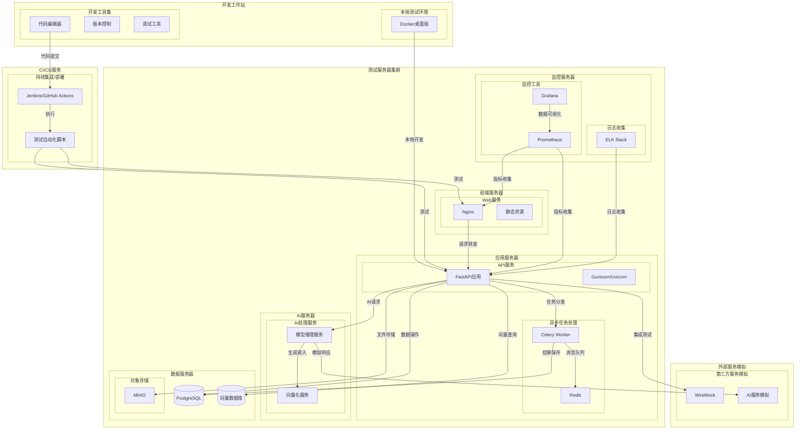

# NextBook Agent - 端到端测试设计

## 1. 测试目标与范围

### 1.1 测试目标
- 验证NextBook Agent的核心功能（SAVE, NEXT, RECALL, REPORT）按设计工作。
- 确保用户流程的完整性和流畅性。
- 评估系统的性能和可靠性。

### 1.2 测试范围
- 所有四个核心功能模块：
  - **SAVE**：电子书上传、解析与笔记创建
  - **NEXT**：个性化书籍推荐系统
  - **RECALL**：知识回忆和检索功能
  - **REPORT**：阅读数据分析与可视化
- 用户界面交互和响应性
- 核心模块集成场景
- 数据持久性和一致性
- 系统在不同负载下的性能
- 系统架构各层级的交互效率
- 安全性和数据隐私Kv

## 2. 测试环境

### 2.1 环境配置
- **开发环境**：本地开发环境，用于单元测试和集成测试。
- **测试环境**：模拟生产环境，配置与生产环境尽可能一致，用于端到端测试和性能测试。
- **生产环境**：最终用户使用的环境。

### 2.2 硬件要求
- 标准开发机器配置：16GB+ RAM, 8+ Core CPU, 500GB+ SSD
- 服务器配置：根据预期用户量和数据量进行配置，至少需要16GB RAM, 8 Core CPU, 1TB SSD

### 2.3 软件依赖
- Python 3.10+
- 数据库系统：PostgreSQL 14+
- AI模型依赖项：OpenAI API 或 本地模型 (如LLama)
- 前端框架和库：React/Next.js 或 Vue.js
- UI组件库：Element UI/Ant Design
- 阅读器组件：PDF.js和EPUB.js
- 数据可视化库：D3.js/ECharts
- 向量数据库：Pinecone 或 Chroma 或 FAISS
- 任务队列：Celery（用于异步处理）
- 文本分析库：SpaCy/NLTK

### 2.4 测试数据
- 样本电子书集合：
  - 格式：PDF, EPUB, TXT
  - 大小：1MB - 200MB
  - 结构：纯文本，图文混排，复杂表格
  - 语言：中文，英文
- 用户配置文件：包含不同阅读习惯和偏好的用户
- 阅读历史和笔记：模拟用户的使用数据
- 书籍元数据：用于验证数据解析的准确性

### 2.5 测试环境部署视图

以下部署视图描述了测试环境的架构和组件部署方式。测试环境应尽可能模拟生产环境的架构，以确保测试结果的有效性。

#### 2.5.1 测试环境组件说明

1. **开发工作站**
   - 用于开发人员本地开发和初步测试
   - 通过Docker容器化应用以确保环境一致性
   - 安装必要的开发和调试工具

2. **测试服务器集群**
   - **前端服务器**：部署Web界面和静态资源
   - **应用服务器**：运行核心业务逻辑和API服务
   - **AI服务器**：专门用于AI模型推理和向量处理的高性能服务器
   - **数据服务器**：部署各类数据存储系统
   - **监控服务器**：收集系统指标和日志进行监控

3. **CI/CD服务**
   - 负责自动化构建、测试和部署
   - 执行端到端测试套件
   - 生成测试报告和覆盖率分析

4. **外部服务模拟**
   - 模拟第三方API响应以便进行隔离测试
   - 提供可控的AI服务响应以测试边缘情况

#### 2.5.2 网络配置

1. **内部网络**
   - 测试集群内部使用私有网络（10.x.x.x）
   - 组件间通信使用内部DNS解析
   - 微服务间通信通过服务发现机制

2. **外部访问**
   - 测试环境通过VPN或特定IP白名单访问
   - 前端和API层通过反向代理暴露
   - 限制对敏感组件的直接访问

#### 2.5.3 测试数据管理

1. **测试数据库**
   - 使用生产数据的匿名化副本
   - 每次测试运行前重置到已知状态
   - 提供数据库快照恢复功能

2. **测试账号**
   - 维护不同权限级别的测试用户
   - 测试账号密码在部署环境中安全存储
   - 自动创建和管理测试数据

#### 2.5.4 监控与日志

1. **测试运行监控**
   - 实时监控测试执行状态
   - 收集性能指标以识别瓶颈
   - 自动检测并报告异常行为

2. **日志聚合**
   - 中央化收集所有组件日志
   - 实现结构化日志以便分析
   - 支持按测试用例ID关联日志

## 3. 测试用例设计

### 3.1 SAVE模块测试

#### 3.1.1 文件上传与解析
| 测试ID   | SE-001                                                                                  |
| -------- | --------------------------------------------------------------------------------------- |
| 测试名称 | PDF文件上传与解析                                                                       |
| 先决条件 | 用户已登录系统                                                                          |
| 测试步骤 | 1. 导航至上传页面 2. 选择一个有效的PDF文件 3. 点击上传按钮 4. 等待系统处理文件 |
| 预期结果 | 1. 文件成功上传 2. 系统自动提取元数据（标题、作者等） 3. 文件内容被正确解析并渲染 |
| 测试数据 | 样本PDF文件（不同大小和格式）                                                           |

| 测试ID   | SE-002                                                                                   |
| -------- | ---------------------------------------------------------------------------------------- |
| 测试名称 | EPUB文件上传与解析                                                                       |
| 先决条件 | 用户已登录系统                                                                           |
| 测试步骤 | 1. 导航至上传页面 2. 选择一个有效的EPUB文件 3. 点击上传按钮 4. 等待系统处理文件 |
| 预期结果 | 1. 文件成功上传 2. 系统自动提取元数据（标题、作者等） 3. 文件内容被正确解析并渲染  |
| 测试数据 | 样本EPUB文件（不同大小和格式）                                                           |

| 测试ID   | SE-003                                                          |
| -------- | --------------------------------------------------------------- |
| 测试名称 | URL内容导入                                                     |
| 先决条件 | 用户已登录系统                                                  |
| 测试步骤 | 1. 导航至URL导入页面 2. 输入有效的内容URL 3. 点击导入按钮 |
| 预期结果 | 1. 系统成功抓取URL内容 2. 内容被解析并添加到用户的库中       |
| 测试数据 | 不同类型的有效URL（博客、文章等）                               |

#### 3.1.2 笔记和划线功能

| 测试ID   | SE-004                                                                        |
| -------- | ----------------------------------------------------------------------------- |
| 测试名称 | 文本划线与笔记创建                                                            |
| 先决条件 | 1. 用户已登录系统 2. 已上传并打开一本电子书                                |
| 测试步骤 | 1. 选择一段文本 2. 应用高亮 3. 添加笔记内容 4. 保存笔记              |
| 预期结果 | 1. 文本成功高亮显示 2. 笔记成功创建并与高亮内容关联 3. 笔记在侧边栏可见 |
| 测试数据 | 样本电子书中的不同文本段落                                                    |

| 测试ID   | SE-005                                                                                  |
| -------- | --------------------------------------------------------------------------------------- |
| 测试名称 | 图像划线与标记                                                                          |
| 先决条件 | 1. 用户已登录系统 2. 已上传并打开含有图像的电子书                                    |
| 测试步骤 | 1. 导航到图像页面 2. 选择图像区域 3. 应用标记 4. 添加笔记 5. 保存标记和笔记 |
| 预期结果 | 1. 图像区域成功标记 2. 笔记成功创建并与标记区域关联                                  |
| 测试数据 | 含有图像的样本电子书                                                                    |

| 测试ID   | SE-006                                                                           |
| -------- | -------------------------------------------------------------------------------- |
| 测试名称 | 标签添加与管理                                                                   |
| 先决条件 | 1. 用户已创建划线和笔记                                                          |
| 测试步骤 | 1. 选择现有笔记 2. 点击添加标签 3. 输入新标签或选择已有标签 4. 保存标签 |
| 预期结果 | 1. 标签成功添加到笔记 2. 标签在标签列表中可见 3. 可以通过标签筛选笔记      |
| 测试数据 | 各种标签名称（单词、短语等）                                                     |

#### 3.1.3 智能分类测试

| 测试ID   | SE-007                                                 |
| -------- | ------------------------------------------------------ |
| 测试名称 | 内容自动分类                                           |
| 先决条件 | 用户已上传电子书                                       |
| 测试步骤 | 1. 系统自动分析电子书内容 2. 查看系统建议的分类     |
| 预期结果 | 1. 系统提供合理的主题分类建议 2. 分类结果与内容相关 |
| 测试数据 | 不同主题的电子书（科技、历史、文学等）                 |

| 测试ID   | SE-008                                                               |
| -------- | -------------------------------------------------------------------- |
| 测试名称 | 文件元数据提取                                                       |
| 先决条件 | 用户已上传电子书                                                     |
| 测试步骤 | 1. 系统自动提取电子书元数据 2. 查看提取的元数据                   |
| 预期结果 | 1. 系统准确提取书籍标题、作者、出版信息等元数据 2. 元数据显示正确 |
| 测试数据 | 具有完整元数据的电子书样本                                           |

### 3.2 NEXT模块测试

#### 3.2.1 书籍推荐功能

| 测试ID   | NE-001                                                                                              |
| -------- | --------------------------------------------------------------------------------------------------- |
| 测试名称 | 个性化书籍推荐                                                                                      |
| 先决条件 | 1. 用户已有阅读历史和笔记 2. 推荐系统已训练完成                                                  |
| 测试步骤 | 1. 导航至推荐页面 2. 请求个性化推荐                                                              |
| 预期结果 | 1. 系统展示三本推荐书籍 2. 每本书包含封面、摘要和个性化推荐理由 3. 推荐内容与用户阅读历史相关 |
| 测试数据 | 用户阅读历史数据集                                                                                  |

| 测试ID   | NE-002                                                                 |
| -------- | ---------------------------------------------------------------------- |
| 测试名称 | 推荐反馈系统                                                           |
| 先决条件 | 系统已生成书籍推荐                                                     |
| 测试步骤 | 1. 查看推荐书籍 2. 对推荐提供反馈（喜欢/不喜欢） 3. 请求新的推荐 |
| 预期结果 | 1. 系统记录用户反馈 2. 新的推荐考虑了用户反馈                       |
| 测试数据 | 用户反馈数据                                                           |

| 测试ID   | NE-003                                                |
| -------- | ----------------------------------------------------- |
| 测试名称 | 获取推荐书籍途径                                      |
| 先决条件 | 系统已生成书籍推荐                                    |
| 测试步骤 | 1. 选择一本推荐书籍 2. 点击获取按钮                |
| 预期结果 | 1. 系统提供多个获取途径 2. 链接到合法购买/下载渠道 |
| 测试数据 | 推荐书籍列表                                          |

| 测试ID   | NE-004                                                                                                 |
| -------- | ------------------------------------------------------------------------------------------------------ |
| 测试名称 | 推荐算法多样性                                                                                         |
| 先决条件 | 用户有阅读历史和偏好设置                                                                               |
| 测试步骤 | 1. 获取推荐内容 2. 评估推荐内容的主题分布                                                           |
| 预期结果 | 1. 推荐内容既包含与历史阅读相似的书籍，也包含一定比例的探索性内容 2. 推荐内容不会过度集中在单一主题 |
| 测试数据 | 具有多样化兴趣的用户配置                                                                               |

| 测试ID   | NE-005                                                                           |
| -------- | -------------------------------------------------------------------------------- |
| 测试名称 | 上下文感知推荐                                                                   |
| 先决条件 | 用户最近的阅读行为有明显的主题变化                                               |
| 测试步骤 | 1. 用户连续阅读不同主题的内容 2. 在每次主题变化后获取推荐                     |
| 预期结果 | 1. 推荐系统能够感知用户兴趣的变化 2. 推荐内容随着用户最近阅读主题的变化而调整 |
| 测试数据 | 包含明显主题变化的用户阅读序列                                                   |

### 3.3 RECALL模块测试

#### 3.3.1 知识回忆功能

| 测试ID   | RE-001                                                        |
| -------- | ------------------------------------------------------------- |
| 测试名称 | 默认回顾视图                                                  |
| 先决条件 | 用户有至少1个月的阅读历史和笔记                               |
| 测试步骤 | 1. 导航至回忆页面 2. 查看默认展示内容                      |
| 预期结果 | 1. 系统默认展示最近1个月的阅读记录和笔记 2. 按时间倒序排列 |
| 测试数据 | 含有时间戳的笔记和阅读记录                                    |

| 测试ID   | RE-002                                                       |
| -------- | ------------------------------------------------------------ |
| 测试名称 | 自定义时间范围回顾                                           |
| 先决条件 | 用户有多个月的阅读历史                                       |
| 测试步骤 | 1. 导航至回忆页面 2. 调整时间范围筛选器 3. 应用筛选    |
| 预期结果 | 1. 系统展示指定时间范围内的记录 2. 数据准确反映所选时间段 |
| 测试数据 | 跨越多个月的历史数据                                         |

#### 3.3.2 检索系统测试

| 测试ID   | RE-003                                                                                  |
| -------- | --------------------------------------------------------------------------------------- |
| 测试名称 | 全文搜索功能                                                                            |
| 先决条件 | 用户有多本书籍和笔记                                                                    |
| 测试步骤 | 1. 打开搜索界面 2. 输入搜索关键词 3. 执行搜索                                     |
| 预期结果 | 1. 系统返回包含关键词的所有内容 2. 结果按相关性排序 3. 搜索结果包括书籍内容和笔记 |
| 测试数据 | 各种搜索关键词                                                                          |

| 测试ID   | RE-004                                                                                     |
| -------- | ------------------------------------------------------------------------------------------ |
| 测试名称 | 多维度筛选                                                                                 |
| 先决条件 | 用户有多本书籍和笔记，且已添加标签和分类                                                   |
| 测试步骤 | 1. 导航至笔记/内容页面 2. 应用多种筛选条件（主题、作者、时间、标签） 3. 查看筛选结果 |
| 预期结果 | 1. 系统展示符合所有筛选条件的内容 2. 筛选结果准确                                       |
| 测试数据 | 各种筛选条件组合                                                                           |

| 测试ID   | RE-005                                                 |
| -------- | ------------------------------------------------------ |
| 测试名称 | 语义搜索测试                                           |
| 先决条件 | 系统已完成内容嵌入处理                                 |
| 测试步骤 | 1. 使用自然语言描述搜索内容 2. 执行搜索             |
| 预期结果 | 1. 系统返回与描述语义相关的内容 2. 结果按相关性排序 |
| 测试数据 | 自然语言查询样本                                       |

#### 3.3.3 知识关联测试

| 测试ID   | RE-006                                                           |
| -------- | ---------------------------------------------------------------- |
| 测试名称 | 概念关联识别                                                     |
| 先决条件 | 用户有多本相关书籍和笔记                                         |
| 测试步骤 | 1. 选择一个特定概念或笔记 2. 查看关联内容                     |
| 预期结果 | 1. 系统展示与所选概念相关的其他内容 2. 关联内容具有逻辑相关性 |
| 测试数据 | 具有明确关联的概念和内容                                         |

| 测试ID   | RE-007                                                                            |
| -------- | --------------------------------------------------------------------------------- |
| 测试名称 | 知识图谱可视化                                                                    |
| 先决条件 | 用户有足够的笔记和阅读内容                                                        |
| 测试步骤 | 1. 导航至知识图谱页面 2. 浏览图谱 3. 与图谱元素交互                         |
| 预期结果 | 1. 系统生成可视化的知识图谱 2. 图谱展示概念间的关联 3. 点击节点显示详细信息 |
| 测试数据 | 有明确关联的知识点集合                                                            |

| 测试ID   | RE-008                                                                                                    |
| -------- | --------------------------------------------------------------------------------------------------------- |
| 测试名称 | 个人知识图谱构建                                                                                          |
| 先决条件 | 用户有充分的笔记和阅读记录                                                                                |
| 测试步骤 | 1. 系统自动构建用户知识图谱 2. 查看知识图谱                                                            |
| 预期结果 | 1. 系统生成包含用户学习概念的知识图谱 2. 图谱中的概念间关系合理 3. 图谱随着用户学习内容的增加而扩展 |
| 测试数据 | 包含相互关联概念的学习记录                                                                                |

### 3.4 REPORT模块测试

#### 3.4.1 阅读统计测试

| 测试ID   | RP-001                                                                       |
| -------- | ---------------------------------------------------------------------------- |
| 测试名称 | 阅读量统计生成                                                               |
| 先决条件 | 用户有阅读历史记录                                                           |
| 测试步骤 | 1. 导航至报告页面 2. 查看阅读量统计                                       |
| 预期结果 | 1. 系统展示准确的阅读页数、书籍数和阅读时长 2. 数据与用户实际阅读记录一致 |
| 测试数据 | 包含阅读时长和页数的历史记录                                                 |

| 测试ID   | RP-002                                                             |
| -------- | ------------------------------------------------------------------ |
| 测试名称 | 时间分布分析                                                       |
| 先决条件 | 用户有跨越多个时间段的阅读记录                                     |
| 测试步骤 | 1. 导航至报告页面 2. 查看时间分布分析                           |
| 预期结果 | 1. 系统显示每日/每周/每月阅读时间分布 2. 数据可视化呈现准确清晰 |
| 测试数据 | 含时间戳的阅读记录                                                 |

| 测试ID   | RP-003                                                             |
| -------- | ------------------------------------------------------------------ |
| 测试名称 | 完成率统计                                                         |
| 先决条件 | 用户有已完成和未完成的书籍记录                                     |
| 测试步骤 | 1. 导航至报告页面 2. 查看书籍完成率统计                         |
| 预期结果 | 1. 系统准确展示已完成和未完成书籍比例 2. 统计数据与实际记录一致 |
| 测试数据 | 具有完成状态的书籍记录                                             |

#### 3.4.2 内容分析测试

| 测试ID   | RP-004                                                     |
| -------- | ---------------------------------------------------------- |
| 测试名称 | 阅读主题分布                                               |
| 先决条件 | 用户阅读过多个主题的书籍                                   |
| 测试步骤 | 1. 导航至报告页面 2. 查看主题分布可视化                 |
| 预期结果 | 1. 系统生成主题分布图表 2. 分布准确反映用户阅读主题比例 |
| 测试数据 | 不同主题的书籍记录                                         |

| 测试ID   | RP-005                                                           |
| -------- | ---------------------------------------------------------------- |
| 测试名称 | 关键词云生成                                                     |
| 先决条件 | 用户有足够的阅读内容和笔记                                       |
| 测试步骤 | 1. 导航至报告页面 2. 查看关键词云                             |
| 预期结果 | 1. 系统生成基于用户内容的关键词云 2. 词云大小反映词频和重要性 |
| 测试数据 | 含有明确关键词的内容集合                                         |

#### 3.4.3 目标追踪测试

| 测试ID   | RP-006                                                          |
| -------- | --------------------------------------------------------------- |
| 测试名称 | 阅读目标设置与追踪                                              |
| 先决条件 | 用户已登录系统                                                  |
| 测试步骤 | 1. 导航至目标设置页面 2. 创建阅读目标 3. 查看目标追踪报告 |
| 预期结果 | 1. 系统允许创建和保存目标 2. 报告页面准确显示目标完成度      |
| 测试数据 | 阅读目标数据（如每月读5本书）                                   |

| 测试ID   | RP-007                                                                     |
| -------- | -------------------------------------------------------------------------- |
| 测试名称 | 阅读习惯分析                                                               |
| 先决条件 | 用户有至少2周的阅读记录                                                    |
| 测试步骤 | 1. 导航至报告页面 2. 查看阅读习惯分析                                   |
| 预期结果 | 1. 系统分析并展示用户的阅读习惯模式 2. 提供关于优化阅读时间和效率的建议 |
| 测试数据 | 包含时间戳和持续时间的阅读记录                                             |

| 测试ID   | RP-008                                                                              |
| -------- | ----------------------------------------------------------------------------------- |
| 测试名称 | 学习进度追踪                                                                        |
| 先决条件 | 用户设置了学习目标                                                                  |
| 测试步骤 | 1. 设置学习目标 2. 记录阅读活动 3. 查看进度报告                               |
| 预期结果 | 1. 系统准确追踪目标完成进度 2. 提供视觉化的进度展示 3. 在达成里程碑时提供反馈 |
| 测试数据 | 包含明确目标的用户配置                                                              |

## 4. 集成流程测试

### 4.1 端到端用户旅程

| 测试ID   | INT-001                                                                                 |
| -------- | --------------------------------------------------------------------------------------- |
| 测试名称 | 完整用户阅读旅程                                                                        |
| 先决条件 | 系统各组件正常工作                                                                      |
| 测试步骤 | 1. 用户上传电子书 2. 阅读并创建笔记 3. 获取推荐 4. 查看回忆内容 5. 生成报告 |
| 预期结果 | 1. 整个流程无缝衔接 2. 每一步功能正常工作 3. 数据在各模块间正确传递               |
| 测试数据 | 完整的用户操作序列                                                                      |

| 测试ID   | INT-002                                                      |
| -------- | ------------------------------------------------------------ |
| 测试名称 | 多设备数据一致性                                             |
| 先决条件 | 系统支持多设备登录                                           |
| 测试步骤 | 1. 在设备A上上传内容和创建笔记 2. 在设备B上登录并查看内容 |
| 预期结果 | 设备B上可以看到在设备A上创建的所有内容，数据完全一致         |
| 测试数据 | 多设备测试账号                                               |

| 测试ID   | INT-003                                                                                               |
| -------- | ----------------------------------------------------------------------------------------------------- |
| 测试名称 | 前后端架构集成测试                                                                                    |
| 先决条件 | 所有组件正常部署                                                                                      |
| 测试步骤 | 1. 测试前端到后端API的调用流程 2. 测试后端API到AI服务的调用流程 3. 测试数据在各存储系统间的流转 |
| 预期结果 | 1. 所有API调用正常响应 2. 数据正确传递和存储 3. 各组件间通信无延迟或错误                        |
| 测试数据 | 覆盖所有API端点的测试用例集                                                                           |

| 测试ID   | INT-004                                                                               |
| -------- | ------------------------------------------------------------------------------------- |
| 测试名称 | C4架构验证测试                                                                        |
| 先决条件 | 系统按C4模型部署完成                                                                  |
| 测试步骤 | 1. 验证系统上下文交互 2. 测试容器间通信 3. 验证组件接口                         |
| 预期结果 | 1. 系统与外部系统交互正常 2. 各容器间通信符合设计规范 3. 组件接口实现与设计一致 |
| 测试数据 | 架构验证测试集                                                                        |

## 5. 性能测试

### 5.1 负载测试

| 测试ID   | PERF-001                                                          |
| -------- | ----------------------------------------------------------------- |
| 测试名称 | 多用户并发访问测试                                                |
| 先决条件 | 系统部署在测试环境                                                |
| 测试步骤 | 模拟50/100/500用户同时访问系统核心功能                            |
| 预期结果 | 1. 系统保持响应速度 2. 无功能错误 3. 资源使用在可接受范围内 |
| 测试数据 | 用户操作脚本                                                      |

| 测试ID   | PERF-002                                                 |
| -------- | -------------------------------------------------------- |
| 测试名称 | 大文件处理性能                                           |
| 先决条件 | 系统正常运行                                             |
| 测试步骤 | 上传并处理不同大小的PDF/EPUB文件(5MB/20MB/50MB/100MB)    |
| 预期结果 | 1. 所有文件能被成功处理 2. 处理时间随文件大小线性增加 |
| 测试数据 | 不同大小的样本文件                                       |

### 5.2 AI系统性能测试

| 测试ID   | PERF-003                                                   |
| -------- | ---------------------------------------------------------- |
| 测试名称 | 推荐引擎响应时间                                           |
| 先决条件 | AI推荐系统已部署                                           |
| 测试步骤 | 1. 测量生成推荐的响应时间 2. 在不同用户历史数据量下测试 |
| 预期结果 | 1. 推荐生成时间低于5秒 2. 响应时间增长曲线符合预期      |
| 测试数据 | 不同规模的用户历史数据                                     |

| 测试ID   | PERF-004                                                                        |
| -------- | ------------------------------------------------------------------------------- |
| 测试名称 | 向量数据库查询性能                                                              |
| 先决条件 | 向量数据库已部署并包含测试数据                                                  |
| 测试步骤 | 1. 执行不同复杂度的语义搜索查询 2. 测量响应时间和结果准确性                  |
| 预期结果 | 1. 简单查询响应时间小于1秒 2. 复杂查询响应时间小于3秒 3. 搜索结果相关性高 |
| 测试数据 | 包含不同数量向量的测试数据集                                                    |

| 测试ID   | PERF-005                                                                                                    |
| -------- | ----------------------------------------------------------------------------------------------------------- |
| 测试名称 | 内容嵌入生成性能                                                                                            |
| 先决条件 | 嵌入生成服务已部署                                                                                          |
| 测试步骤 | 1. 对不同长度的文本内容生成嵌入向量 2. 测量处理时间和资源消耗                                            |
| 预期结果 | 1. 标准长度文本(约500字)处理时间小于1秒 2. 大型文档(10万字)分段处理总时间合理 3. 资源使用效率符合预期 |
| 测试数据 | 不同长度和复杂度的文本样本                                                                                  |

## 6. 安全性测试

### 6.1 数据安全测试

| 测试ID   | SEC-001                                                            |
| -------- | ------------------------------------------------------------------ |
| 测试名称 | 用户数据访问控制                                                   |
| 先决条件 | 系统已部署用户认证机制                                             |
| 测试步骤 | 1. 尝试未授权访问其他用户数据 2. 测试不同权限级别的数据访问限制 |
| 预期结果 | 1. 系统阻止未授权访问 2. 权限控制正确实施                       |
| 测试数据 | 多用户测试账号                                                     |

| 测试ID   | SEC-002                                                   |
| -------- | --------------------------------------------------------- |
| 测试名称 | API安全测试                                               |
| 先决条件 | API服务已部署                                             |
| 测试步骤 | 1. 测试API认证机制 2. 尝试常见攻击方式(SQL注入、XSS等) |
| 预期结果 | 1. 所有API端点要求正确认证 2. 系统防御常见攻击         |
| 测试数据 | 安全测试用例集                                            |

### 6.2 隐私保护测试

| 测试ID   | SEC-003                                                    |
| -------- | ---------------------------------------------------------- |
| 测试名称 | 用户隐私设置                                               |
| 先决条件 | 系统已实现隐私设置功能                                     |
| 测试步骤 | 1. 配置不同级别的隐私设置 2. 验证数据显示和共享符合设置 |
| 预期结果 | 1. 系统尊重用户隐私设置 2. 敏感数据根据设置正确处理     |
| 测试数据 | 包含隐私设置的用户配置                                     |

## 7. 自动化测试方案

### 7.1 UI自动化测试
- 使用Selenium/Cypress实现关键用户流程的自动化测试
- 实现页面响应性和视觉一致性的自动检查
- 建立持续集成流程，每次代码提交后执行UI测试

### 7.2 API自动化测试
- 使用Postman/REST Assured建立API测试集合
- 验证所有API端点的功能正确性
- 测试各种参数组合和边界条件

### 7.3 性能测试自动化
- 使用JMeter/Locust实现性能测试脚本
- 定期执行基准测试并记录结果
- 建立性能回归检测机制

## 8. 结论

本端到端测试设计提供了一个全面的框架，以确保NextBook Agent的所有核心功能和用户流程能够以预期方式工作。测试范围涵盖了从基本功能验证到复杂集成流程，以及性能、安全性和自动化测试方案。

基于最新的架构设计(C4模型和4+1视图)，测试计划已经更新以确保对系统各层的充分验证。特别关注了AI组件的性能和准确性，以及系统在不同负载下的表现。

随着项目的发展，测试计划应定期更新，以纳入新功能并优化测试策略。特别是AI组件的测试可能需要随着技术的进步和用户反馈而调整测试方法和标准。
