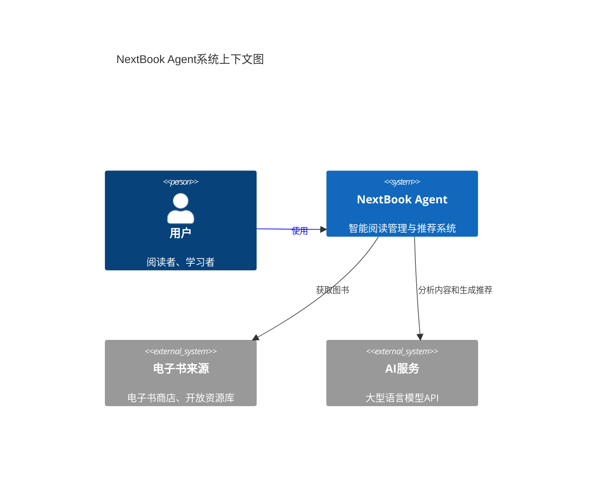
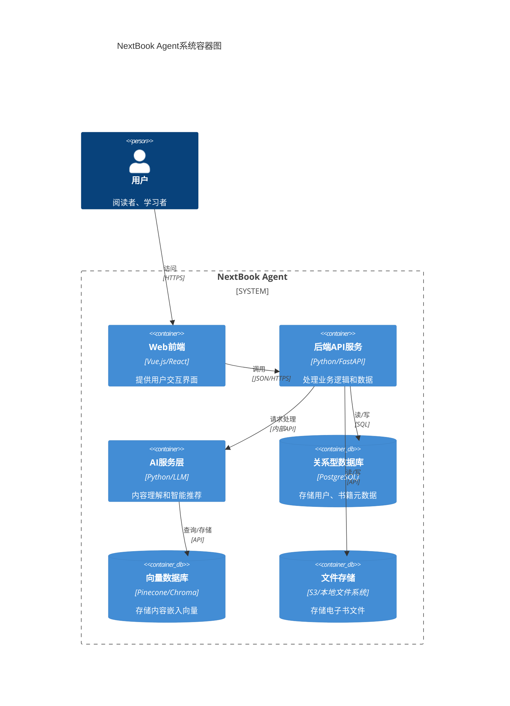
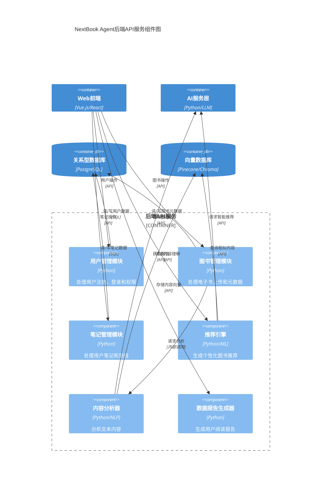
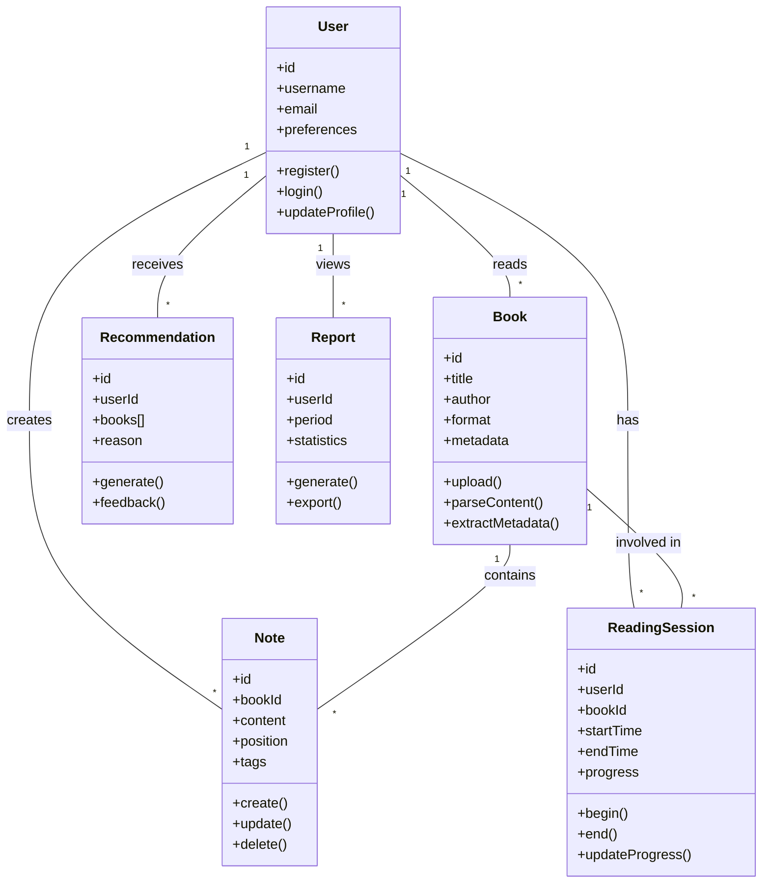
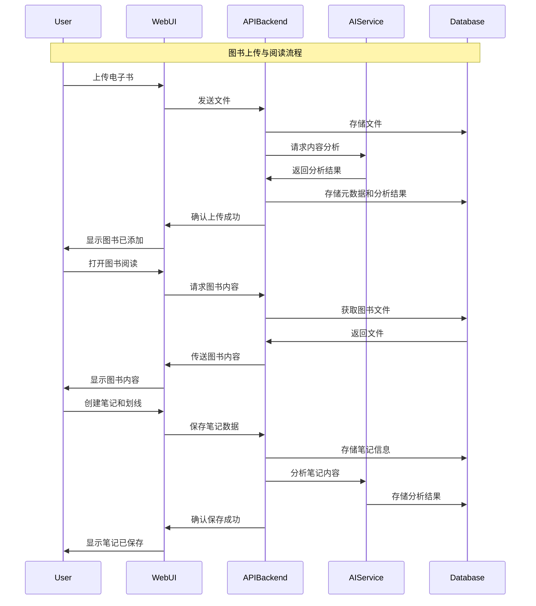
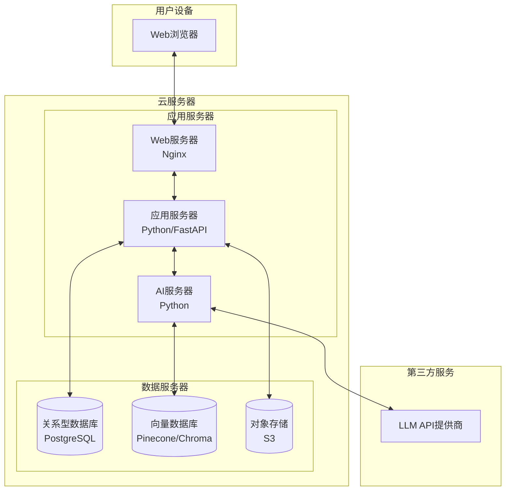
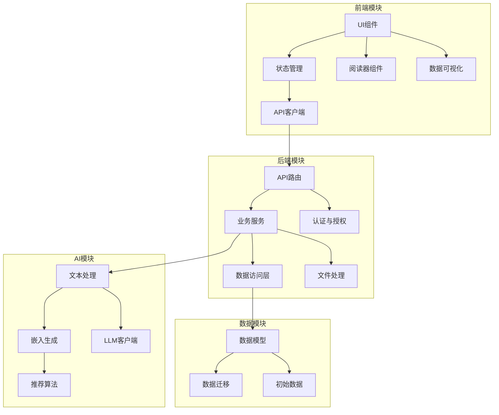
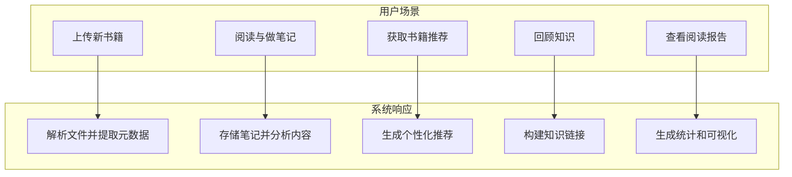
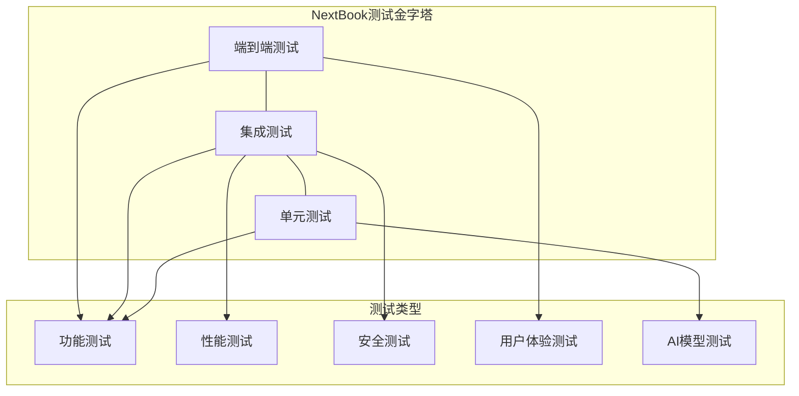

# NextBook Agent - 初步设计文档

## 1. 项目概述

NextBook Agent是一款智能阅读助手应用，旨在通过AI技术帮助用户管理阅读内容、笔记和获取个性化图书推荐。该应用致力于解决以下用户痛点：

- 阅读笔记管理分散且低效
- 难以找到符合个人兴趣的高质量后续阅读内容
- 知识碎片化，缺乏系统性整理
- 无法有效跟踪和分析自己的阅读习惯

本设计文档详细说明了应用的功能规格、系统架构和实现路径。

## 2. 系统架构

### 2.1 总体架构 - C4模型

#### 2.1.1 上下文视图(Context View)



#### 2.1.2 容器视图(Container View)



#### 2.1.3 组件视图(Component View)



### 2.2 4+1视图架构

#### 2.2.1 逻辑视图(Logical View)



#### 2.2.2 进程视图(Process View)



#### 2.2.3 物理视图(Physical View)



#### 2.2.4 开发视图(Development View)



#### 2.2.5 场景视图(Scenario View)



### 2.3 组件说明

#### 2.3.1 前端组件
- **WebUI界面**：基于Web技术构建的用户界面
- **阅读器组件**：支持PDF和EPUB格式的内容渲染
- **笔记编辑器**：支持文本和图像笔记的创建和编辑
- **数据可视化**：用于展示阅读报告和知识地图

#### 2.3.2 后端组件
- **API服务**：提供RESTful接口供前端调用
- **文件处理服务**：处理书籍文件的上传、存储和解析
- **用户管理**：处理用户身份验证和权限控制
- **推荐引擎**：基于用户历史和偏好生成推荐

#### 2.3.3 AI组件
- **内容理解模块**：分析和理解书籍内容
- **用户偏好模型**：学习用户阅读习惯和偏好
- **知识图谱构建**：构建用户的个人知识图谱
- **检索增强生成系统**：提高推荐和回忆功能的质量

#### 2.3.4 数据存储
- **关系型数据库**：存储用户信息、书籍元数据等结构化数据
- **向量数据库**：存储内容嵌入，用于相似性搜索
- **文件存储**：存储书籍文件和用户上传的图像

## 3. 详细功能规格

### 3.1 SAVE - 内容保存

#### 3.1.1 文件支持
- 支持上传、导入和管理PDF和EPUB格式的电子书
- 提供书籍元数据自动提取功能（标题、作者、出版信息等）
- 支持通过URL导入在线内容

#### 3.1.2 划线与笔记
- 文本划线：支持多种颜色和样式的文本高亮
- 图像划线：允许在图片上标记重点区域
- 笔记关联：笔记可以关联到特定文本段落或页面
- 标签系统：为笔记添加自定义标签

#### 3.1.3 智能分类
- 自动主题识别：分析内容自动提取主题和关键概念
- 分类建议：智能推荐分类目录
- 自定义分类：允许用户创建和管理自定义分类体系

### 3.2 NEXT - 书籍推荐

#### 3.2.1 推荐算法
- 基于内容的推荐：分析已阅读内容的主题和风格
- 协同过滤：考虑相似用户的阅读选择（未来社区功能）
- 新颖性平衡：在相关性和探索性之间取得平衡
- 上下文感知：根据用户当前阅读进度和兴趣变化调整推荐

#### 3.2.2 推荐展示
- 每次推荐3本书籍，包含封面、摘要和个性化推荐理由
- 提供"更多推荐"选项以获取额外建议
- 允许用户反馈推荐质量，用于算法优化

#### 3.2.3 获取途径
- 集成电子书资源搜索引擎
- 提供多个合法购买/下载渠道
- 支持用户手动上传已拥有的电子书

### 3.3 RECALL - 知识回忆

#### 3.3.1 自动回顾
- 默认展示最近1个月的阅读记录与笔记
- 可自定义回顾时间范围
- 提供按书籍、主题、时间的回顾视图

#### 3.3.2 检索系统
- 全文搜索：搜索所有书籍内容和笔记
- 过滤器：多维度筛选（主题、作者、时间、标签等）
- 语义搜索：通过自然语言描述查找相关内容

#### 3.3.3 知识关联
- 自动识别并链接相关概念
- 可视化展示知识点之间的关联
- 基于用户笔记构建个人知识图谱

### 3.4 REPORT - 数据报告

#### 3.4.1 阅读统计
- 阅读量统计：页数、书籍数、阅读时长
- 时间分布：每日、每周、每月阅读时间分布
- 完成率：已完成vs未完成书籍统计

#### 3.4.2 内容分析
- 阅读主题分布可视化
- 关键词云和热点概念
- 笔记密度分析

#### 3.4.3 进度追踪
- 阅读目标设置与完成度展示
- 习惯培养追踪
- 提供成就和里程碑系统

## 4. 用户流程

### 4.1 内容保存流程
```
用户上传电子书 → 系统解析文件 → 用户开始阅读 → 创建划线/笔记 → 系统自动分类并存储
```

### 4.2 获取推荐流程
```
用户请求推荐 → 系统分析用户历史 → 生成个性化推荐 → 展示推荐结果 → 用户选择感兴趣的书籍 → 系统提供获取途径
```

### 4.3 知识回忆流程
```
用户进入回忆界面 → 系统展示最近阅读内容 → 用户浏览或搜索 → 查看详细笔记与内容 → 添加新的见解
```

### 4.4 数据报告流程
```
用户请求报告 → 系统生成统计数据 → 展示多维度分析 → 用户浏览并获取阅读见解
```

## 5. 技术栈选择

### 5.1 前端技术
- **框架**：Vue.js/React
- **UI组件库**：Element UI/Ant Design
- **阅读器**：基于PDF.js和EPUB.js
- **数据可视化**：D3.js/ECharts

### 5.2 后端技术
- **主语言**：Python
- **Web框架**：FastAPI/Flask
- **任务队列**：Celery（处理异步任务如文档解析）

### 5.3 AI技术
- **大型语言模型**：OpenAI GPT-4或本地部署的开源模型
- **向量嵌入**：Sentence Transformers或类似技术
- **向量数据库**：Pinecone/FAISS/Chroma
- **文本分析**：SpaCy/NLTK

### 5.4 数据存储
- **关系数据库**：PostgreSQL
- **向量数据库**：Pinecone/Chroma
- **文件存储**：本地文件系统或AWS S3

## 6. 开发路线图

### 6.1 阶段一：基础功能（1-2个月）
- [ ] 搭建基础技术架构
- [ ] 实现PDF和EPUB阅读器组件
- [ ] 开发基本的笔记和划线功能
- [ ] 创建简单的书籍管理系统

### 6.2 阶段二：AI集成（2-3个月）
- [ ] 整合大语言模型
- [ ] 实现内容理解和主题提取
- [ ] 开发基础推荐算法
- [ ] 构建向量存储系统

### 6.3 阶段三：高级功能（2-3个月）
- [ ] 完善推荐系统
- [ ] 实现知识关联功能
- [ ] 开发数据分析和报告功能
- [ ] 优化用户界面和体验

### 6.4 阶段四：完善与扩展（持续）
- [ ] 增加社区功能
- [ ] 实现云同步
- [ ] 支持更多平台
- [ ] 持续优化AI性能

## 7. 潜在挑战与解决方案

### 7.1 技术挑战

#### 7.1.1 文件格式处理
**挑战**：处理各种PDF和EPUB格式的复杂性和多样性
**解决方案**：
- 使用成熟的解析库基础上构建适配层
- 针对常见格式问题开发专门处理逻辑
- 提供用户反馈机制报告无法正确解析的文件

#### 7.1.2 AI性能与成本
**挑战**：平衡AI推理质量和运行成本
**解决方案**：
- 混合使用云端API和本地部署模型
- 实现缓存机制减少重复计算
- 为不同功能选择适当规模的模型

### 7.2 用户体验挑战

#### 7.2.1 推荐质量
**挑战**：提供真正有价值的个性化推荐
**解决方案**：
- 综合考虑多种信号（阅读历史、笔记内容、明确兴趣表达）
- 实现A/B测试框架持续优化推荐算法
- 加入人工反馈环节改进推荐质量

#### 7.2.2 信息过载
**挑战**：帮助用户管理大量笔记和内容而不造成认知负担
**解决方案**：
- 设计层级化的信息展示界面
- 提供智能摘要和重点突出功能
- 实现渐进式信息披露

## 8. 未来扩展考虑

### 8.1 功能扩展
- **语音笔记**：支持语音输入和自动转录
- **OCR功能**：从图片和扫描件中提取文本
- **跨应用集成**：与Notion、Evernote等笔记应用集成
- **多媒体支持**：扩展到视频课程、有声读物等内容形式

### 8.2 平台扩展
- **iOS客户端**：提供原生iOS应用体验
- **Android客户端**：支持Android设备
- **浏览器插件**：便于保存网页内容
- **电子墨水设备集成**：与Kindle等电子阅读器协同工作

### 8.3 商业模式探索
- **基础功能免费 + 高级功能订阅**
- **API服务**：向第三方应用提供内容理解和推荐能力
- **社区知识共享生态**：构建内容创作者的激励机制

## 9. DFX - 设计优化策略

DFX (Design For X) 是一种工程方法论，旨在从多个维度优化产品设计。本章节将探讨如何在NextBook Agent中实施这些关键设计优化策略，首先从可测试性开始。

### 9.1 Design for Testability (DFT) - 可测试性设计

#### 9.1.1 测试策略总览



#### 9.1.2 前端测试框架

- **组件测试**
  - 使用Jest和React Testing Library进行UI组件单元测试
  - 为每个UI组件创建快照测试确保视觉一致性
  - 使用Storybook构建组件库，支持交互式测试

- **端到端测试**
  - 利用Cypress自动化关键用户流程测试
  - 实现关键路径的视觉回归测试
  - 模拟各种设备和屏幕尺寸的响应式布局测试

#### 9.1.3 后端测试策略

- **单元测试**
  - 所有核心业务逻辑需达到至少80%的测试覆盖率
  - 使用依赖注入模式便于模拟外部依赖
  - 实现契约测试确保API规范一致性

- **集成测试**
  - 使用测试容器技术模拟数据库和依赖服务
  - 实现自动化API测试套件
  - 建立专门的测试环境模拟完整系统

#### 9.1.4 AI组件测试

- **模型评估框架**
  - 构建黄金数据集评估AI模型性能
  - 实现A/B测试框架比较不同模型和参数
  - 定期对模型进行回归测试确保性能稳定

- **测试数据生成**
  - 创建合成数据集用于测试边缘情况
  - 实现数据增强技术扩充测试场景
  - 维护匿名化的真实用户数据样本集用于测试

#### 9.1.5 持续测试实践

- **CI/CD集成**
  - 每次代码提交触发自动化测试套件
  - 实现测试结果可视化和报告系统
  - 建立测试性能指标和趋势分析

- **测试环境管理**
  - 维护独立的开发、测试、预生产和生产环境
  - 实现环境配置即代码，确保环境一致性
  - 使用服务虚拟化模拟外部依赖

#### 9.1.6 特殊测试类型

- **性能和负载测试**
  - 构建自动化性能测试套件监控关键指标
  - 实施定期负载测试模拟高峰使用场景
  - 建立性能基准和预警机制

- **安全测试**
  - 集成静态代码分析工具于开发流程
  - 定期进行渗透测试和漏洞扫描
  - 实施数据保护和隐私合规性测试

#### 9.1.7 可观测性设计

- **日志和监控**
  - 实现结构化日志系统便于测试分析
  - 设计详细的错误代码和消息系统
  - 建立健康检查和自诊断端点

- **追踪与调试**
  - 实现分布式追踪系统跟踪请求流
  - 提供测试模式开关启用额外的调试信息
  - 建立开发者工具和内部调试界面

## 10. 结论

NextBook Agent旨在创建一个智能、高效的阅读管理和知识发现系统。通过结合现代AI技术与用户中心设计，我们相信这个应用能够显著提升用户的阅读体验和知识管理效率。

本初步设计将作为项目开发的基础框架，随着项目推进可能会根据技术实现难度和用户反馈进行相应调整和优化。
