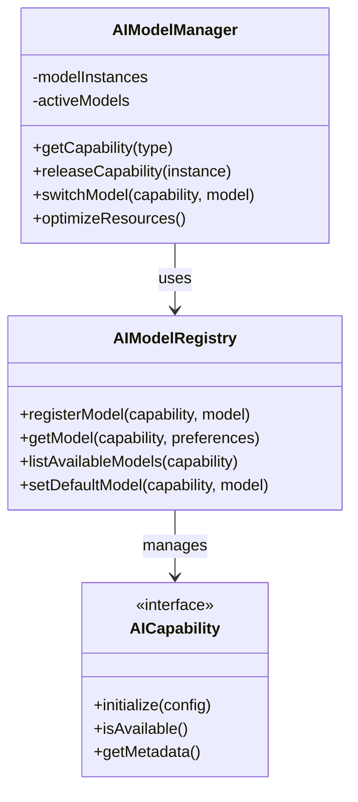
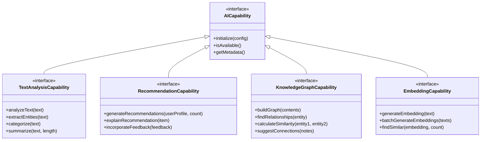
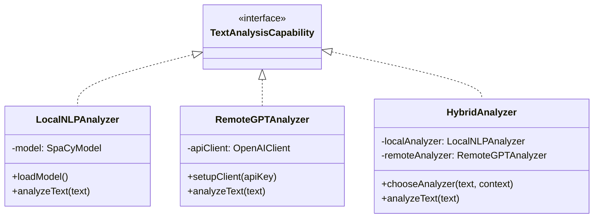
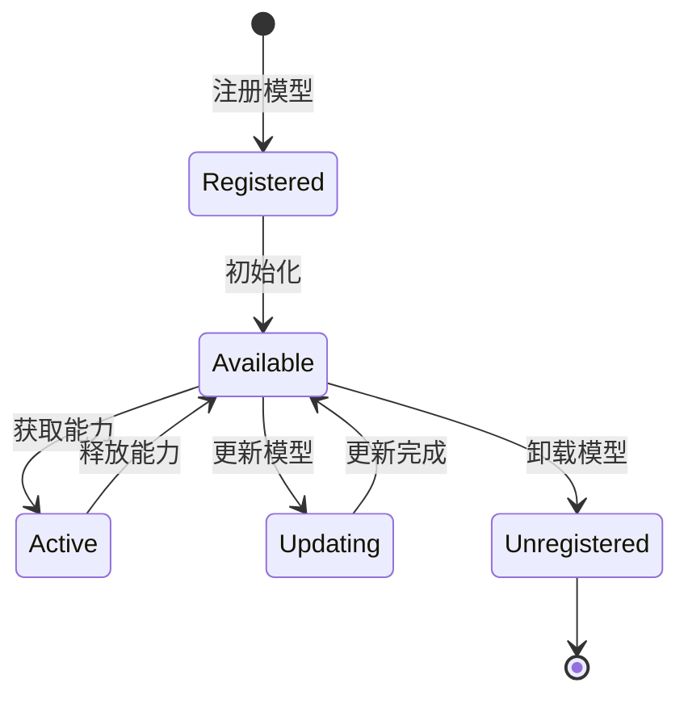
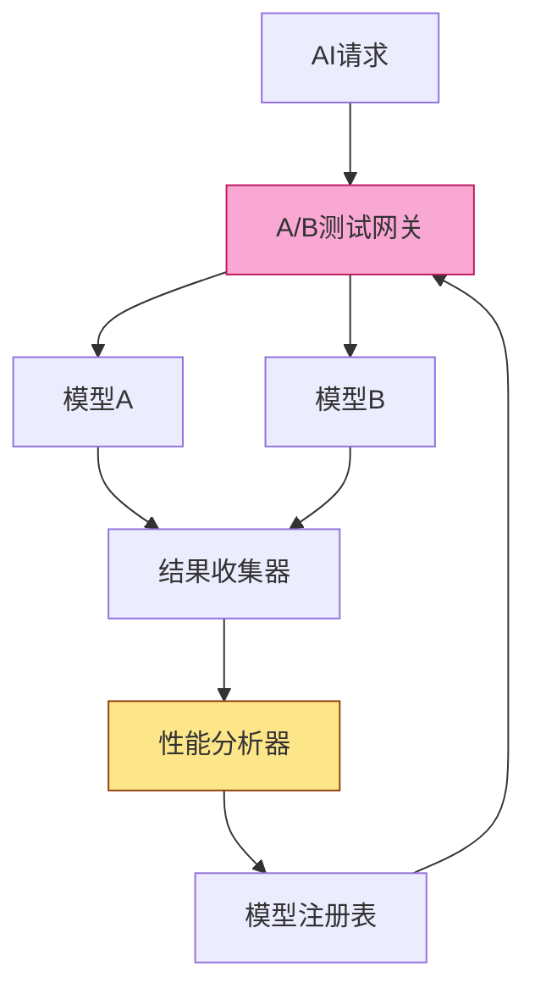
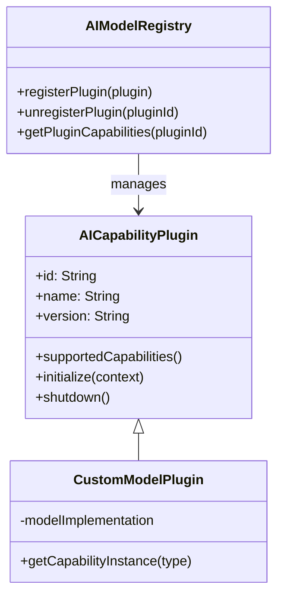

# NextBook Agent AI模型抽象设计

## 概述

NextBook Agent的AI模型抽象层提供了灵活且可扩展的机制，用于集成和管理各种AI功能，包括内容分析、推荐生成和知识图谱构建。本文档详细阐述AI模型抽象的设计原则、架构和实现策略。

## 设计目标

1. **灵活性**：支持无缝切换不同的AI模型实现
2. **可扩展性**：便于集成新的AI能力和算法
3. **性能优化**：根据任务需求和设备能力选择最合适的模型
4. **离线优先**：确保核心功能在离线环境中可用
5. **隐私保护**：本地处理敏感数据，减少外部依赖

## 架构设计

### 核心抽象层



### 能力分类

AI功能按领域划分为不同的能力接口：



### 实现策略

每种AI能力可以有多种实现，包括本地、远程和混合模式：



## 模型选择策略

NextBook Agent使用多维度的策略来选择最合适的AI模型：

### 场景因素

1. **任务复杂度**：
   - 简单任务使用轻量级本地模型
   - 复杂任务可选择使用高级远程模型

2. **内容敏感性**：
   - 敏感内容优先使用本地模型处理
   - 非敏感内容可使用云服务增强处理质量

3. **响应时间要求**：
   - 需要实时响应的功能使用本地模型
   - 后台任务可以使用更精确但较慢的远程模型

### 环境因素

1. **设备能力**：
   - 根据CPU/GPU/内存资源动态选择模型复杂度
   - 支持模型量化和优化以适应设备限制

2. **网络状态**：
   - 离线时自动切换到本地模型
   - 弱网络条件下选择带宽需求较低的模型

3. **电池状态**：
   - 低电量时使用能效更高的模型
   - 充电状态下可使用更复杂的模型

## 模型生命周期管理



1. **加载优化**：
   - 懒加载：仅在需要时加载模型
   - 预加载：预测用户可能需要的模型
   - 共享实例：多个请求共享同一模型实例

2. **资源管理**：
   - 内存管理：不使用的模型释放内存
   - 计算资源分配：根据优先级分配计算资源
   - 批处理：合并请求减少模型切换开销

3. **版本控制**：
   - 模型版本兼容性检查
   - 平滑升级策略
   - 降级回退机制

## A/B测试框架

NextBook Agent内置对AI模型的A/B测试支持：



### 关键功能

1. **实验设计**：
   - 流量分配：控制不同模型的使用比例
   - 用户分组：确保用户体验一致性
   - 指标定义：明确测试的成功标准

2. **数据收集**：
   - 结果质量评估
   - 性能指标监测
   - 用户反馈收集

3. **分析优化**：
   - 统计显著性评估
   - 自动模型选择
   - 持续优化循环

## 隐私与安全

1. **数据处理原则**：
   - 本地处理优先：尽可能在设备上处理数据
   - 最小数据传输：只传输必要的信息
   - 匿名化处理：移除个人识别信息

2. **模型安全**：
   - 模型完整性验证
   - 安全通信通道
   - 输入验证和防注入措施

3. **用户控制**：
   - 透明的AI使用策略
   - AI功能开关控制
   - 数据使用偏好设置

## 插件扩展

NextBook Agent的AI抽象层支持通过插件扩展AI功能：



### 插件功能

1. **新能力引入**：
   - 添加全新的AI能力类型
   - 扩展现有能力的功能范围

2. **替代实现**：
   - 提供现有能力的替代实现
   - 针对特定领域优化的专用模型

3. **集成服务**：
   - 连接专有或第三方AI服务
   - 提供特定领域专业模型

## 实现示例

### 本地推荐引擎实现

```swift
class LocalRecommendationEngine: RecommendationCapability {
    private var model: MLModel?
    private var userProfile: UserProfile
    
    func initialize(config: [String: Any]) -> Bool {
        guard let modelPath = config["modelPath"] as? String else {
            return false
        }
        
        do {
            model = try MLModel(contentsOf: URL(fileURLWithPath: modelPath))
            return true
        } catch {
            logger.error("Failed to load model: \(error)")
            return false
        }
    }
    
    func isAvailable() -> Bool {
        return model != nil
    }
    
    func getMetadata() -> [String: Any] {
        return [
            "name": "Local Recommendation Engine",
            "version": "1.0.0",
            "capabilities": ["basic_recommendations", "offline_operation"],
            "resource_usage": "low"
        ]
    }
    
    func generateRecommendations(userProfile: UserProfile, count: Int) -> [BookRecommendation] {
        // 本地推荐算法实现
        // ...
    }
    
    func explainRecommendation(item: BookRecommendation) -> String {
        // 生成推荐解释
        // ...
    }
    
    func incorporateFeedback(feedback: RecommendationFeedback) {
        // 处理用户反馈，更新本地模型
        // ...
    }
}
```

### 混合模式文本分析器

```swift
class HybridTextAnalyzer: TextAnalysisCapability {
    private var localAnalyzer: LocalNLPAnalyzer
    private var remoteAnalyzer: RemoteGPTAnalyzer
    private var networkMonitor: NetworkMonitor
    
    init() {
        localAnalyzer = LocalNLPAnalyzer()
        remoteAnalyzer = RemoteGPTAnalyzer()
        networkMonitor = NetworkMonitor.shared
    }
    
    func initialize(config: [String: Any]) -> Bool {
        let localSuccess = localAnalyzer.initialize(config: config)
        let remoteSuccess = remoteAnalyzer.initialize(config: config)
        return localSuccess || remoteSuccess
    }
    
    func isAvailable() -> Bool {
        return localAnalyzer.isAvailable() || remoteAnalyzer.isAvailable()
    }
    
    func getMetadata() -> [String: Any] {
        return [
            "name": "Hybrid Text Analyzer",
            "version": "1.0.0",
            "capabilities": ["text_analysis", "entity_extraction", "summarization"],
            "mode": "adaptive"
        ]
    }
    
    func analyzeText(text: String) -> TextAnalysisResult {
        // 决定使用哪个分析器
        if shouldUseRemoteAnalyzer(text: text) {
            do {
                return try remoteAnalyzer.analyzeText(text: text)
            } catch {
                // 远程分析失败，降级到本地
                return localAnalyzer.analyzeText(text: text)
            }
        } else {
            return localAnalyzer.analyzeText(text: text)
        }
    }
    
    private func shouldUseRemoteAnalyzer(text: String) -> Bool {
        // 根据文本复杂性、网络状态和用户设置决定
        if text.count > 1000 && networkMonitor.isConnected && UserPreferences.shared.allowRemoteProcessing {
            return true
        }
        return false
    }
    
    // 实现其他TextAnalysisCapability接口方法
    // ...
}
```

## 结语

NextBook Agent的AI模型抽象层设计提供了灵活且强大的框架，使应用能够适应不同的使用场景、设备能力和用户偏好。通过清晰的接口定义和策略化的模型选择，系统能够在保持核心功能稳定性的同时，不断整合新的AI能力和优化现有功能。
