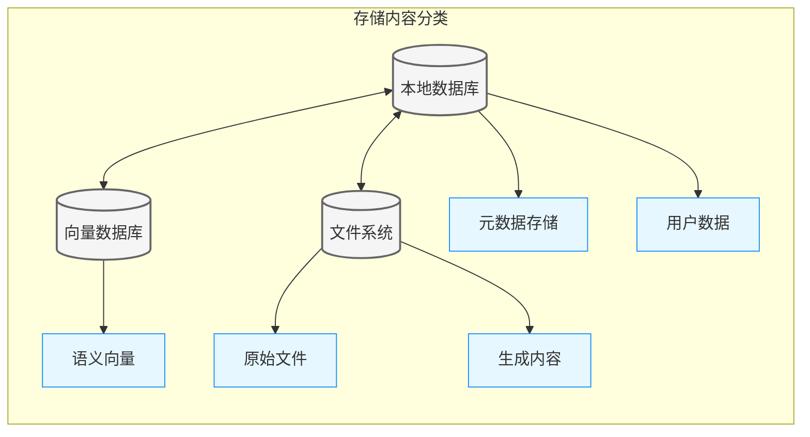
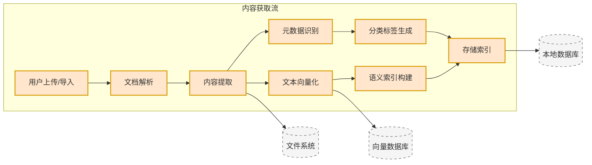
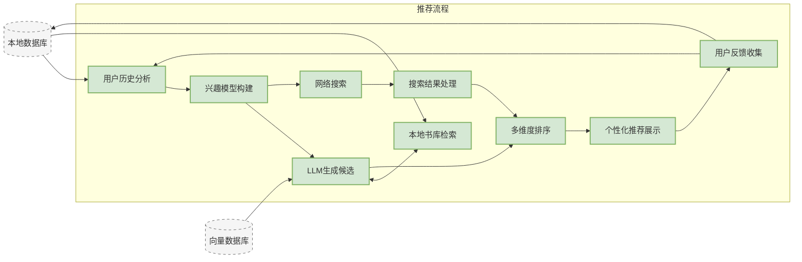
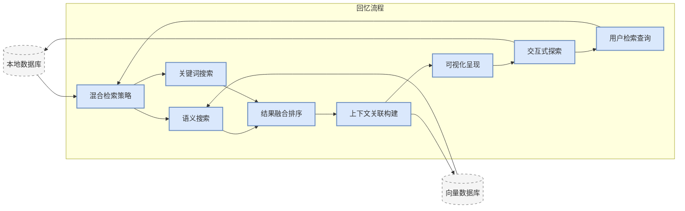
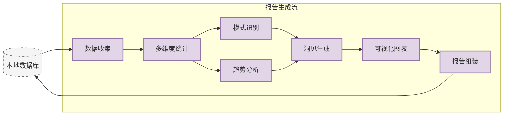
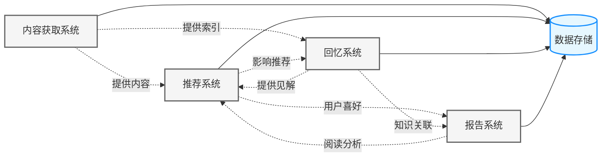

# NextBook 通用架构设计原则

本文档描述了NextBook Agent的基本架构设计原则和思路，适用于所有版本的实现。

## 架构设计原则

* **本地优先**：核心功能不依赖网络连接
* **模块化设计**：组件可独立升级和替换
* **渐进增强**：基础功能的技术方案保持简单，只有在必要时，才引入更复杂技术方案
* **隐私保护**：敏感数据默认存储在本地，云同步为可选项

## 数据流架构

系统的数据流被分为四个主要功能流，所有流程共享核心存储系统。

### 核心存储架构

**存储组件用途解释**:

| 存储组件             | 类型     | 用途说明                                                             |
| -------------------- | -------- | -------------------------------------------------------------------- |
| **本地数据库 (DB)**  | 核心存储 | 存储结构化数据，管理用户信息、阅读历史、书籍元数据和系统配置         |
| **向量数据库 (VDB)** | 核心存储 | 管理文本语义向量，支持相似度搜索和语义匹配，为推荐和回忆功能提供支持 |
| **文件系统 (FS)**    | 核心存储 | 存储原始书籍文件、图像和导出内容，提供高效的大文件管理               |
| **元数据存储 (MD)**  | 内容分类 | 保存书籍信息（标题、作者、出版信息）、阅读状态和标签数据             |
| **用户数据 (UD)**    | 内容分类 | 记录用户配置、阅读习惯、偏好设置和推荐历史                           |
| **语义向量 (VS)**    | 内容分类 | 存储文本内容的向量表示，用于相似内容查找和语义检索                   |
| **原始文件 (RAW)**   | 内容分类 | 保存原始PDF、EPUB等格式的完整书籍文件，确保内容完整性                |
| **生成内容 (GEN)**   | 内容分类 | 存储AI生成的摘要、见解、报告和知识关联等衍生内容                     |

### 内容获取流程 (SAVE)

### 推荐系统流程 (NEXT)

### 知识回忆流程 (RECALL)

### 数据报告流程 (REPORT)

### 跨流程数据交互

## 相关架构设计

- [返回README](../../README.md)
- [macOS版架构设计](ArchDesignMacOsVersion.md)
- [多平台版架构设计](ArchDesignMultiOsVersion.md)
