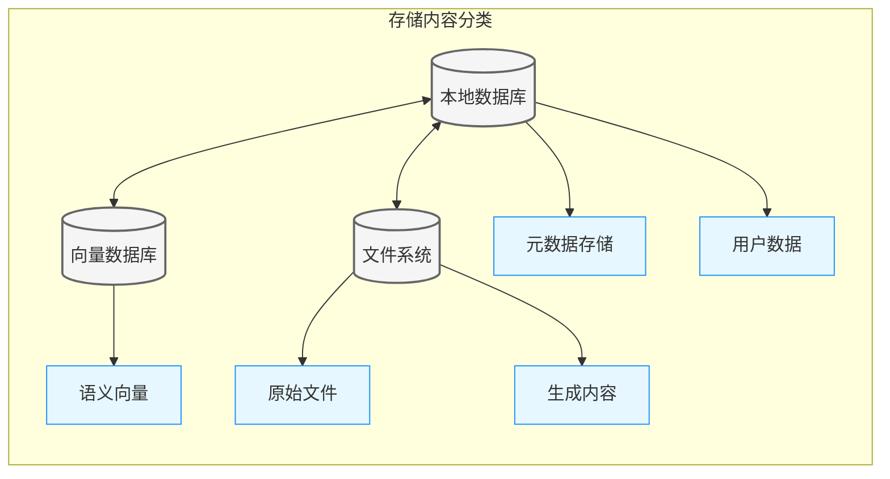
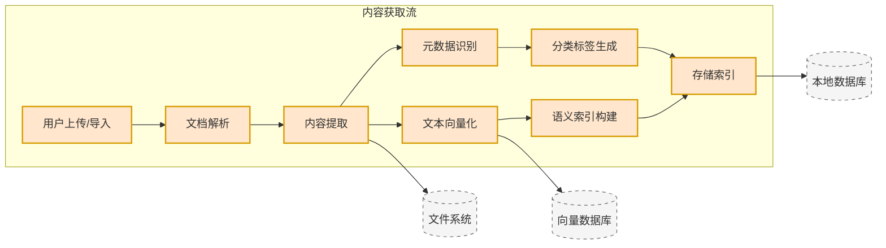
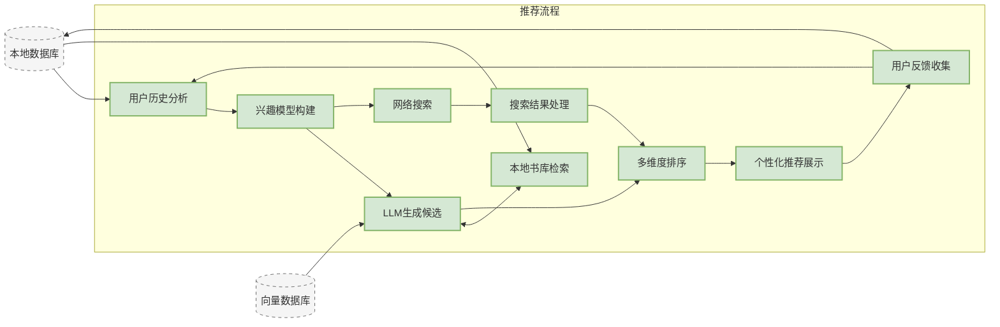
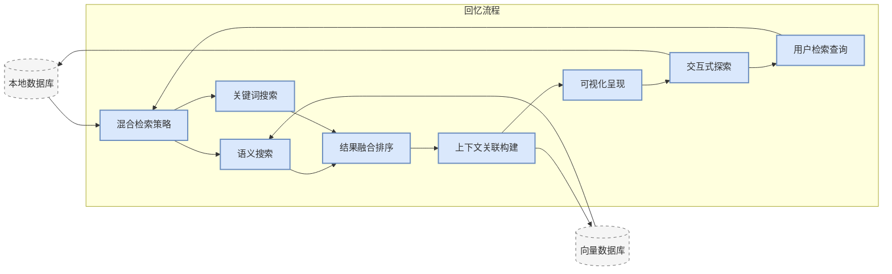
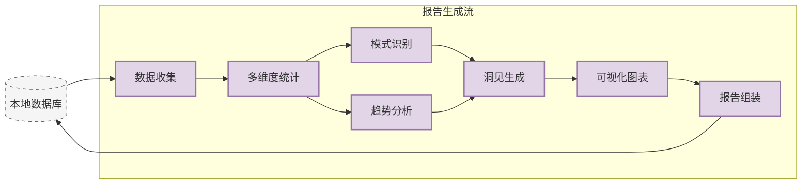
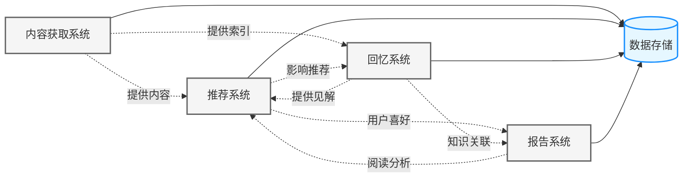
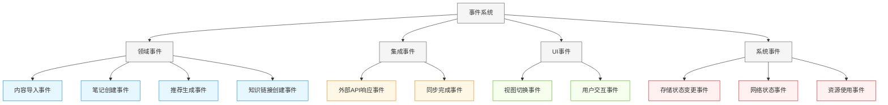
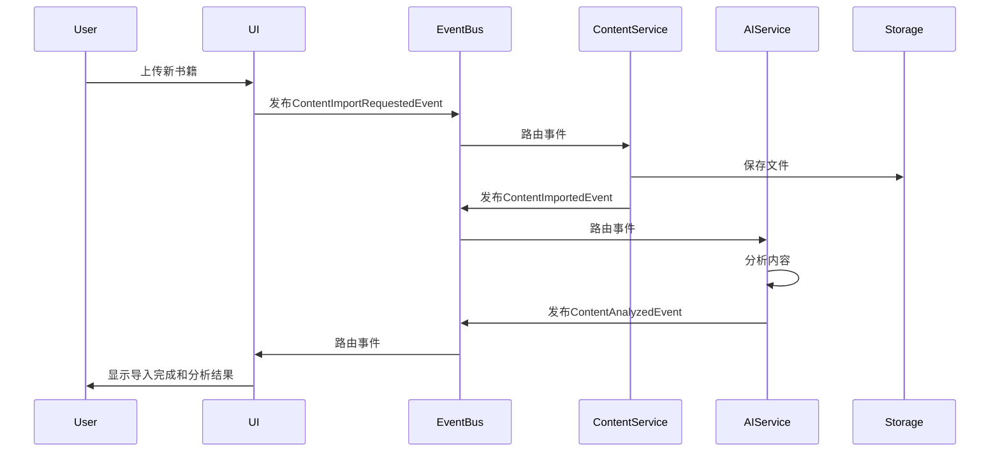
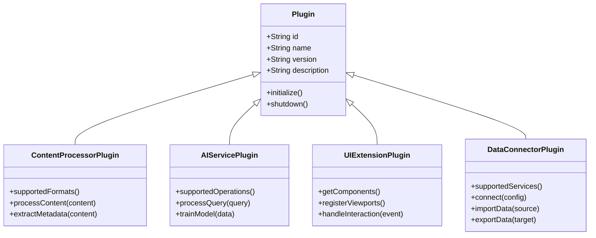

# NextBook Agent 通用架构设计原则

## 设计理念

NextBook Agent的架构设计遵循以下核心理念：

1. **本地优先** - 保障用户数据安全与隐私
2. **模块化设计** - 确保系统各部分松耦合，便于扩展和维护
3. **领域驱动** - 架构反映业务逻辑和用户需求
4. **渐进增强** - 基础功能可离线使用，联网时提供增强体验

## 架构原则

### 1. 数据主权

- 用户数据默认存储在本地设备上
- 只有经用户明确许可的数据才会上传至云端
- 支持本地加密保护敏感内容

### 2. 性能优先

- 优化启动时间和响应速度
- 预加载和缓存常用数据
- 异步处理耗时操作，避免阻塞UI

### 3. 资源效率

- 合理管理内存使用
- 优化电池消耗
- 智能管理存储空间

### 4. 可扩展性

- 插件化架构支持功能扩展
- 定义清晰的API约定
- 支持多种数据来源和处理模块

### 5. 优雅降级

- 核心功能在离线状态下可用
- 网络不稳定时平滑降级
- 容错设计避免单点故障

## 技术选择标准

选择NextBook Agent使用的技术栈时，考虑以下因素：

1. **成熟度** - 优先选择稳定且广泛使用的技术
2. **社区支持** - 活跃的社区意味着更好的资源和长期维护
3. **跨平台能力** - 支持未来扩展到多平台
4. **性能特性** - 满足响应速度和资源效率要求
5. **开发效率** - 平衡开发速度和产品质量

## 版本演进策略

NextBook Agent采用渐进式架构演进策略：

1. **单机版（POC）** - 专注核心体验和概念验证
2. **多端版** - 扩展到更多平台，增加数据同步
3. **社区版** - 添加内容分享和协作功能

每个阶段都保持架构的一致性，同时为下一阶段做好准备。

## 数据流架构

系统的数据流被分为四个主要功能流，所有流程共享核心存储系统。

### 核心存储架构

**存储组件用途解释**:

| 存储组件             | 类型     | 用途说明                                                                 |
| -------------------- | -------- | ------------------------------------------------------------------------ |
| **本地数据库 (DB)**  | 核心存储 | 存储结构化数据，管理用户信息、阅读历史、书籍元数据和系统配置             |
| **向量数据库 (VDB)** | 核心存储 | 管理文本语义向量，支持相似度搜索和语义匹配，为推荐和回忆功能提供支持     |
| **文件系统 (FS)**    | 核心存储 | 存储原始书籍文件、图像和导出内容，提供高效的大文件管理                   |
| **元数据存储 (MD)**  | 内容分类 | 保存书籍信息（标题、作者、出版信息）、阅读状态和标签数据                 |
| **用户数据 (UD)**    | 内容分类 | 记录用户配置、阅读习惯、偏好设置和推荐历史                               |
| **语义向量 (VS)**    | 内容分类 | 存储文本内容的向量表示，用于相似内容查找和语义检索                       |
| **原始文件 (RAW)**   | 内容分类 | 保存原始PDF、EPUB、TXT等格式的完整书籍文件，确保内容完整性及多格式兼容性 |
| **生成内容 (GEN)**   | 内容分类 | 存储AI生成的摘要、见解、报告和知识关联等衍生内容                         |

### 内容获取流程 (SAVE)

### 推荐系统流程 (NEXT)

### 知识回忆流程 (RECALL)

### 数据报告流程 (REPORT)

### 跨流程数据交互

## 事件驱动设计

NextBook Agent采用事件驱动设计模式，提高系统各组件解耦度，增强可扩展性。

### 事件分类

### 事件流程

1. **发布-订阅模型**：
   - 事件生产者无需了解订阅者
   - 多个订阅者可对同一事件做出反应
   - 支持异步和同步处理模式

2. **事件存储**：
   - 关键领域事件持久化存储
   - 支持事件溯源和系统状态重构
   - 提供审计跟踪和历史回放功能

3. **事件处理策略**：
   - 即时处理：需要立即响应的关键事件
   - 批处理：可延迟处理的次要事件
   - 重试机制：确保事件最终被处理

4. **事件路由**：
   - 基于事件类型和属性的动态路由
   - 支持事件过滤和转换
   - 可配置的事件传播规则

### 示例事件流

## 插件系统设计

为实现高度可扩展的架构，NextBook Agent设计了标准化的插件系统。

### 插件类型

1. **内容处理插件**
   - 文档解析器：支持不同文件格式的解析
   - 元数据提取器：从内容中提取元数据
   - 内容增强器：为内容添加附加信息

2. **AI服务插件**
   - 推荐算法：自定义推荐逻辑
   - 内容分析：文本和语义分析
   - 知识图谱构建：自定义知识连接算法

3. **UI扩展插件**
   - 视图组件：自定义内容查看器
   - 交互组件：增强用户交互方式
   - 可视化组件：自定义数据可视化

4. **数据连接插件**
   - 外部服务连接器：集成第三方服务
   - 数据导入导出：支持不同格式的数据交换
   - 同步适配器：自定义同步逻辑

### 插件接口设计

### 插件生命周期

1. **注册**：插件向系统注册自身能力和依赖
2. **激活**：系统验证并激活符合条件的插件
3. **执行**：插件在适当的系统事件或用户操作时执行功能
4. **状态管理**：插件可保存和恢复状态
5. **更新**：支持插件热更新，无需重启应用
6. **停用**：在不需要时可临时停用插件
7. **卸载**：完全移除插件及其数据

### 插件安全与隔离

1. **权限模型**：插件只能访问明确授权的系统资源
2. **沙箱执行**：插件在受限环境中运行
3. **资源限制**：防止插件过度消耗系统资源
4. **验证机制**：插件签名验证和来源检查
5. **数据隔离**：插件数据相互隔离，防止干扰

## 相关架构设计

- [返回README](../../README.md)
- [macOS版架构设计](ArchDesignMacOsVersion.md)
- [多平台版架构设计](ArchDesignMultiOsVersion.md)
