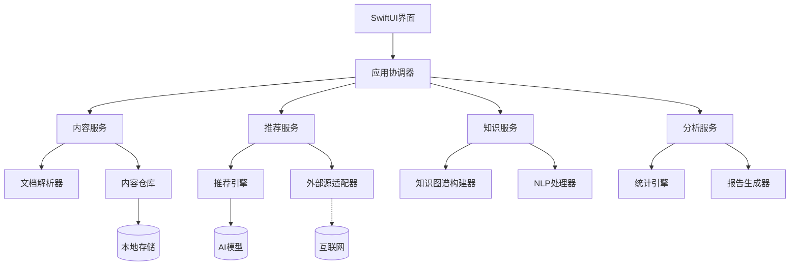

# NextBook Agent macOS版架构设计

## 概述

macOS版作为NextBook Agent的POC（概念验证）版本，采用单机架构设计，专注于提供核心功能和验证用户体验。本文档详细描述macOS版的技术架构、组件设计和实现方案。

## 技术栈选择

macOS版NextBook Agent采用以下技术栈：

- **UI框架**: SwiftUI
- **后端逻辑**: Python + Swift
- **AI处理**: PyTorch/TensorFlow (轻量级模型)
- **数据存储**: SQLite + Core Data
- **文档处理**: PDFKit + EPUB解析库
- **自然语言处理**: SpaCy + NLTK

## 系统架构

### 整体架构

macOS版采用分层架构，从上到下依次为：

1. **表现层** - SwiftUI界面组件
2. **应用层** - 业务逻辑和功能协调
3. **领域层** - 核心业务规则和领域模型
4. **基础设施层** - 数据存储、AI服务和外部接口

### 组件设计

## 数据流设计

### SAVE功能数据流

1. 用户选择文件或输入内容
2. DocumentParser解析内容结构和元数据
3. ContentService处理内容分类和关联
4. ContentRepository持久化存储内容和元数据
5. UI更新显示保存结果和内容视图

### NEXT功能数据流

1. RecommendationService请求推荐内容
2. RecommendationEngine基于用户历史和偏好生成推荐
3. ExternalSourceAdapter获取推荐内容详情（可选）
4. UI展示推荐结果和相关信息
5. 用户交互结果反馈给推荐引擎优化未来推荐

## 离线能力

macOS版本设计为主要依赖本地功能：

- **内容管理完全本地化** - 不需要网络即可使用
- **内置基础推荐能力** - 基于本地数据的简单推荐
- **选择性联网增强** - 联网时获得更丰富的推荐和元数据

## 性能考量

为确保在各种配置的macOS设备上流畅运行：

- **延迟加载** - 大型内容按需加载
- **后台处理** - AI分析和索引构建在后台线程执行
- **资源监控** - 动态调整资源使用，避免过度消耗
- **缓存策略** - 智能缓存常用数据减少处理时间

## 扩展性考虑

虽然macOS版是POC，但架构设计预留了扩展空间：

- **模块化API** - 定义清晰的服务接口便于功能扩展
- **数据迁移路径** - 为未来多平台版本设计数据结构
- **插件机制准备** - 预留插件接口设计

## 实现路线图

1. **最小可行产品(MVP)**
   - 基础UI框架
   - 文件导入和笔记功能
   - 简单本地推荐

2. **功能完善阶段**
   - 高级内容管理
   - 完整推荐系统
   - 知识图谱构建

3. **体验优化阶段**
   - 性能优化
   - UI/UX完善
   - 本地AI能力增强
