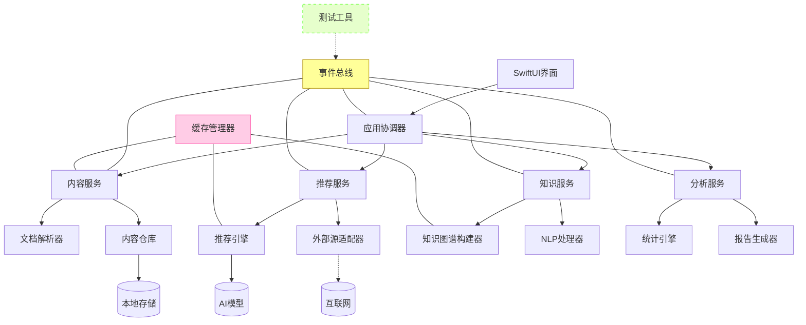
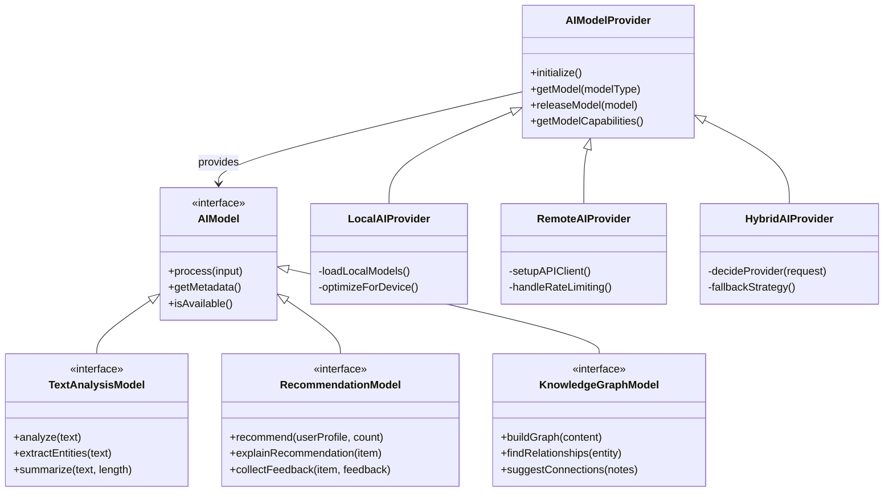
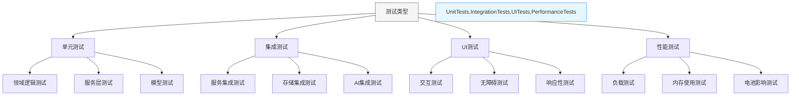

# NextBook Agent macOS版架构设计

## 概述

macOS版作为NextBook Agent的POC（概念验证）版本，采用单机架构设计，专注于提供核心功能和验证用户体验。本文档详细描述macOS版的技术架构、组件设计和实现方案。

## 技术栈选择

macOS版NextBook Agent采用以下技术栈：

- **UI框架**: SwiftUI
- **后端逻辑**: Python + Swift
- **AI处理**: PyTorch/TensorFlow (轻量级模型)
- **数据存储**: SQLite + Core Data
- **文档处理**: PDFKit + EPUB解析库
- **自然语言处理**: SpaCy + NLTK

## 系统架构

### 整体架构

macOS版采用分层架构，从上到下依次为：

1. **表现层** - SwiftUI界面组件
2. **应用层** - 业务逻辑和功能协调
3. **领域层** - 核心业务规则和领域模型
4. **基础设施层** - 数据存储、AI服务和外部接口

### 组件设计

## 数据流设计

### SAVE功能数据流

1. 用户选择文件或输入内容
2. DocumentParser解析内容结构和元数据
3. ContentService处理内容分类和关联
4. ContentRepository持久化存储内容和元数据
5. UI更新显示保存结果和内容视图

### NEXT功能数据流

1. RecommendationService请求推荐内容
2. RecommendationEngine基于用户历史和偏好生成推荐
3. ExternalSourceAdapter获取推荐内容详情（可选）
4. UI展示推荐结果和相关信息
5. 用户交互结果反馈给推荐引擎优化未来推荐

## 离线能力

macOS版本设计为主要依赖本地功能：

- **内容管理完全本地化** - 不需要网络即可使用
- **内置基础推荐能力** - 基于本地数据的简单推荐
- **选择性联网增强** - 联网时获得更丰富的推荐和元数据

## 性能考量

为确保在各种配置的macOS设备上流畅运行：

- **延迟加载** - 大型内容按需加载
- **后台处理** - AI分析和索引构建在后台线程执行
- **资源监控** - 动态调整资源使用，避免过度消耗
- **缓存策略** - 智能缓存常用数据减少处理时间

## 扩展性考虑

虽然macOS版是POC，但架构设计预留了扩展空间：

- **模块化API** - 定义清晰的服务接口便于功能扩展
- **数据迁移路径** - 为未来多平台版本设计数据结构
- **插件机制准备** - 预留插件接口设计

## 实现路线图

1. **最小可行产品(MVP)**
   - 基础UI框架
   - 文件导入和笔记功能
   - 简单本地推荐

2. **功能完善阶段**
   - 高级内容管理
   - 完整推荐系统
   - 知识图谱构建

3. **体验优化阶段**
   - 性能优化
   - UI/UX完善
   - 本地AI能力增强

## AI模型抽象架构

macOS版设计了灵活的AI模型抽象层，支持不同AI能力的平滑集成和切换：

### AI能力策略

1. **本地模型优先**：
   - 轻量级模型在本地运行，确保隐私和离线能力
   - 针对设备性能优化的推理引擎
   - 增量学习支持，不断适应用户偏好

2. **远程增强**：
   - 复杂计算可选择性地使用远程API
   - 批处理请求减少API调用频率
   - 缓存远程结果用于离线访问

3. **模型切换机制**：
   - 基于任务类型自动选择最佳模型
   - 支持模型热更新，不中断应用使用
   - A/B测试框架评估不同模型性能

## 高级缓存策略

macOS版实现了多层缓存策略：

1. **内存缓存层**：
   - LRU缓存保存最近访问内容
   - 用户会话状态缓存
   - 频繁计算结果缓存

2. **磁盘缓存层**：
   - 内容索引和向量缓存
   - 外部API响应缓存
   - 二进制大对象存储(BLOB)

3. **智能预取**：
   - 页面预取：预加载可能查看的下一页内容
   - 关联预取：加载当前内容相关的其他内容
   - 推荐预取：后台准备推荐内容

4. **缓存一致性管理**：
   - 基于事件的缓存失效
   - 时间和访问频率策略
   - 低优先级后台更新

## 测试架构

macOS版内置全面的测试架构，确保功能稳定性和性能：

### 测试策略

1. **自动化测试**：
   - CI/CD集成的自动化测试套件
   - 每次代码提交触发单元测试
   - 定时执行集成测试和性能测试

2. **测试数据管理**：
   - 合成测试数据生成器
   - 真实数据的匿名化测试集
   - 边缘情况测试数据库

3. **模拟和存根**：
   - 外部依赖的模拟组件
   - 网络请求的响应模拟
   - AI模型的行为模拟

4. **用户体验测试**：
   - 自动化UI测试流程
   - 用户操作回放和验证
   - 无障碍功能合规性检查

【版本定义】
单机版：macOS版  
- 设备要求：仅支持macOS设备  
- 部署方式：单设备本地部署
