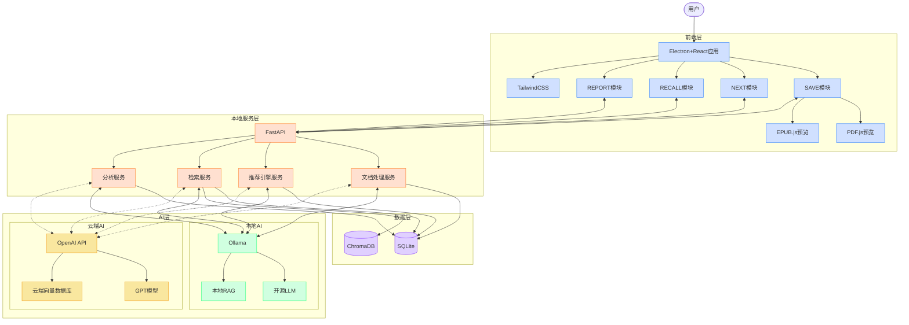

# NextBook macOS版架构设计

本文档描述了NextBook Agent在macOS平台上的实现架构，作为概念验证(POC)版本。

## 首版架构 (macOS Version\<for POC\>)

## 技术栈说明

### 前端技术

- **应用框架**: Electron (提供桌面原生能力)
- **UI框架**: React + TailwindCSS
- **文档查看器**: 
  - PDF.js: 处理PDF文件显示
  - EPUB.js: 处理EPUB电子书显示
- **状态管理**: Redux或Context API
- **数据可视化**: D3.js/Chart.js

### 后端技术

- **服务框架**: FastAPI (Python)
- **数据存储**:
  - SQLite: 轻量级关系数据库，存储结构化数据
  - ChromaDB: 向量数据库，用于语义搜索
  - 文件系统: 存储原始文档
- **AI组件**:
  - Ollama: 本地LLM引擎，支持多种开源模型
  - LangChain: RAG实现
  - OpenAI API: 可选的云端AI支持

### 核心服务

- **文档处理服务**: 负责文档解析、内容提取和索引
- **推荐引擎服务**: 基于用户历史和内容相似度生成推荐
- **检索服务**: 混合语义和关键词搜索，提供回忆功能
- **分析服务**: 统计分析和报告生成

## 技术选型考虑

### 为什么选择Electron+React

- **跨平台潜力**: 虽然首版是macOS专用，但Electron架构为未来多平台支持奠定基础
- **丰富的UI生态**: React组件库提供丰富的UI选项
- **性能考虑**: 对于文档处理这样的IO密集型应用，Electron的性能足够

### 为什么选择SQLite+ChromaDB

- **轻量级部署**: 不需要安装独立数据库服务
- **本地优先**: 符合架构设计原则，保护用户隐私
- **语义搜索能力**: ChromaDB提供高效的向量搜索功能

### 为什么提供本地与云端AI双选项

- **灵活性**: 用户可根据隐私需求和性能期望选择AI服务方式
- **性能平衡**: 本地AI提供基础能力，云端AI提供更强大的处理能力
- **网络适应**: 离线环境下可使用本地AI保持核心功能

## 相关架构设计

- [返回README](../../README.md)
- [通用架构设计原则](ArchDesignCommon.md)
- [多平台版架构设计](ArchDesignMultiOsVersion.md)
