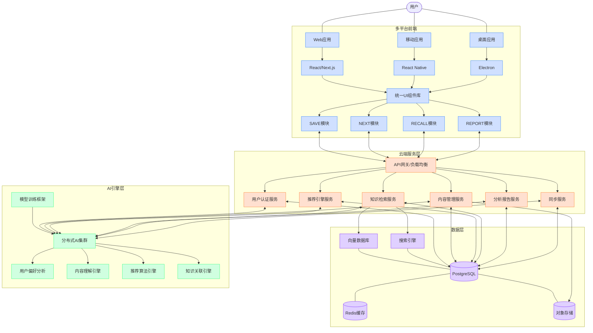

# NextBook 多平台版架构设计

本文档描述了NextBook Agent的多平台版本架构设计，支持包括Web、移动和桌面在内的多种平台。

## 扩展架构 (multiOS Version)

## 多平台支持策略

### 前端统一策略

- **组件库共享**: 使用Storybook管理统一UI组件库，确保多平台视觉一致性
- **状态管理共享**: 使用同一套状态管理逻辑，减少代码重复
- **平台特性适配**: 针对不同平台的特性(如iOS的手势、Android的Material设计)进行适当适配
- **响应式设计**: 所有界面采用响应式设计，适应从手机到大屏幕的多种尺寸

### 云服务架构

- **微服务架构**: 按功能域划分微服务，支持独立扩展
- **无状态设计**: 服务层设计为无状态，便于水平扩展
- **容器化部署**: 使用Docker和Kubernetes实现云服务的容器化管理
- **API网关**: 统一接口管理，处理认证、限流和日志

### 数据同步机制

- **多设备同步**: 通过同步服务和消息队列实现多设备数据一致性
- **冲突解决**: 实现乐观锁和版本控制机制解决并发编辑冲突
- **增量同步**: 只同步变更数据，减少带宽消耗
- **离线支持**: 支持离线操作，网络恢复后自动同步

### 安全与隐私

- **端到端加密**: 敏感数据在传输和存储过程中加密
- **数据分区**: 用户数据严格隔离
- **权限模型**: 细粒度的访问控制
- **合规设计**: 符合GDPR、CCPA等隐私法规要求

## 技术栈选型

### 前端技术

- **Web**: React + Next.js + TailwindCSS
- **移动**: React Native + Native模块
- **桌面**: Electron + 优化的本地功能

### 后端技术

- **API**: GraphQL + REST
- **服务**: Node.js(TS) + Python
- **数据库**: PostgreSQL + Redis
- **搜索**: Elasticsearch + Pinecone/Weaviate(向量搜索)
- **消息队列**: Kafka/RabbitMQ
- **对象存储**: S3兼容存储

### AI技术

- **模型服务**: TorchServe/TensorRT
- **分布式训练**: Kubernetes + Ray
- **特征工程**: Feature Store
- **监控与分析**: Prometheus + Grafana

## 架构演进计划

### 第一阶段: 单体云服务

- 从macOS版的本地应用架构演进到单体云服务
- 增加用户认证和基础同步功能
- 部署Web版本作为多平台战略的首步

### 第二阶段: 服务拆分

- 将单体服务拆分为多个微服务
- 建立完整的DevOps流程
- 添加移动平台支持

### 第三阶段: 全平台覆盖与高级功能

- 实现所有平台的完整支持
- 增强AI能力和社区功能
- 优化性能和用户体验

## 相关架构设计

- [返回README](../../README.md)
- [通用架构设计原则](ArchDesignCommon.md)
- [macOS版架构设计](ArchDesignMacOsVersion.md)
