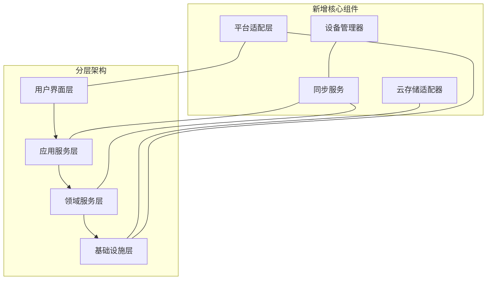
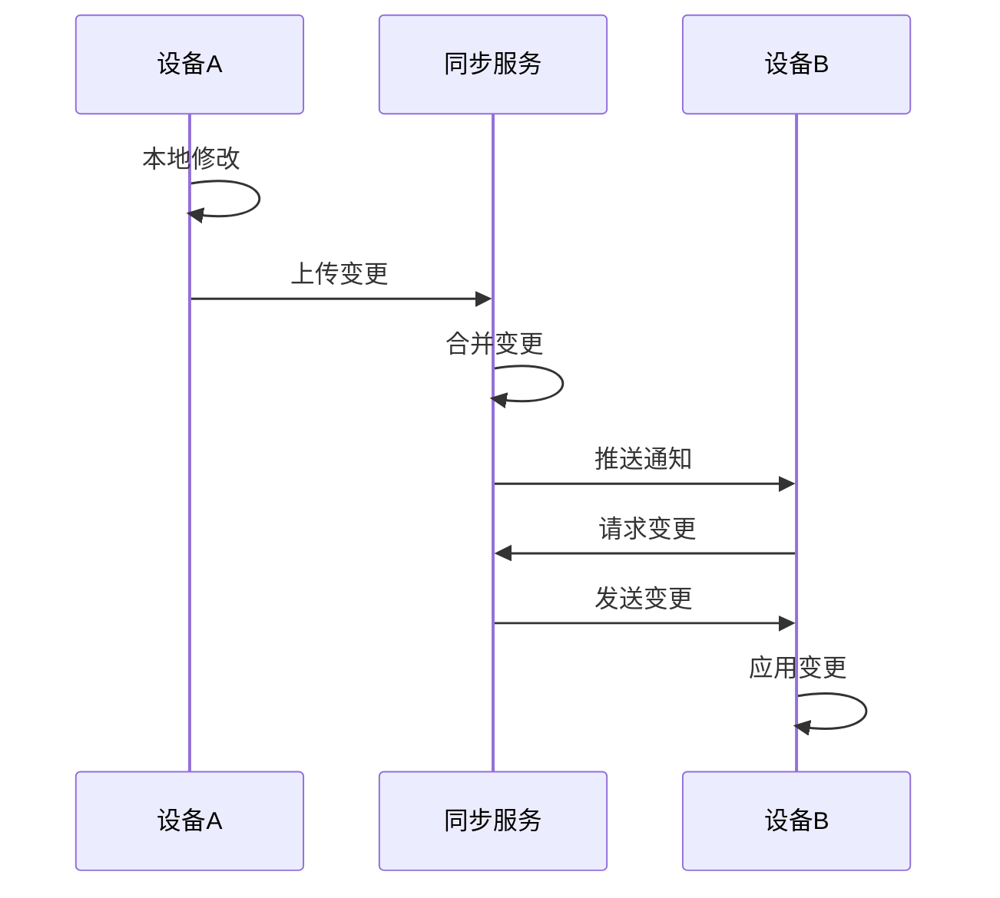

# NextBook Agent 多平台版架构设计

## 概述

NextBook Agent的多平台版是在单机版基础上的扩展，旨在提供跨设备、多平台的一致用户体验。本文档详细描述多平台版的架构设计、同步机制和平台适配策略。

## 支持平台

多平台版计划支持以下操作系统和设备类型：

- **桌面平台**
  - macOS (12.0+)
  - Windows 11
  - Ubuntu Linux (20.04+)
  
- **移动平台**
  - iOS (16.0+)
  - Android (12.0+)

## 架构演进

从单机版到多平台版，架构核心保持稳定，同时引入新组件以支持跨平台需求：

## 技术选择

多平台版采用以下技术栈实现跨平台支持：

### 跨平台框架

- **UI层**: Flutter / React Native (待定)
- **应用层**: 平台原生 + 共享逻辑库
- **领域层**: 跨平台核心库 (C++/Rust)
- **基础设施层**: 平台原生 + 抽象接口

### 数据同步技术

- **同步协议**: CRDTs (无冲突复制数据类型)
- **传输层**: gRPC / WebSockets
- **安全层**: E2EE (端到端加密)

### 存储技术

- **本地存储**: SQLite + 平台原生文件系统
- **云存储**: 支持多种提供商 (AWS S3, Azure Blob, Google Cloud Storage)

## 同步架构

### 同步模型

NextBook Agent采用"本地优先"的同步模型：

1. **本地操作优先** - 所有操作首先在本地完成并存储
2. **后台同步** - 系统自动在后台同步数据变更
3. **冲突解决** - 使用CRDTs自动解决大多数冲突，必要时请求用户决策

### 同步流程

### 同步范围

用户可以控制同步的内容范围：

- **全同步** - 所有内容和设置
- **选择性同步** - 指定书籍/笔记集合
- **设置同步** - 仅同步用户设置和偏好
- **离线模式** - 完全禁用同步

## 平台适配策略

### UI适配原则

1. **平台感知** - 遵循各平台设计规范
2. **功能一致** - 跨平台功能核心体验一致
3. **优化交互** - 根据设备类型优化操作方式
4. **响应式布局** - 适应不同屏幕尺寸和方向

### 平台特定功能

根据平台能力提供特定增强功能：

- **macOS**: 快捷键、拖放、菜单栏集成
- **iOS**: 小组件、分享扩展、快捷指令
- **Windows**: 开始菜单集成、通知中心
- **Android**: 意图过滤器、通知通道自定义
- **Linux**: 命令行工具、系统集成

## 离线能力

多平台版保持强大的离线能力：

- **完整本地功能** - 所有核心功能可离线使用
- **同步队列** - 离线操作排队等待联网后同步
- **增量下载** - 优先下载元数据，按需下载全内容
- **带宽感知** - 根据网络质量调整同步行为

## 安全与隐私

多平台版加强了数据安全措施：

- **端到端加密** - 所有同步数据加密传输和存储
- **本地密钥** - 加密密钥存储在用户设备
- **设备授权** - 新设备需要现有设备授权
- **远程抹除** - 支持远程移除设备访问权限
- **数据主权** - 用户可随时导出所有数据

## 资源优化

针对多种设备的资源约束进行优化：

- **渐进式图像和内容** - 按设备能力加载不同分辨率
- **后台处理调度** - 考虑设备状态和电量
- **存储策略** - 智能缓存和存储管理
- **功能降级** - 在资源受限设备上优雅降级

## 实施路线图

1. **基础架构升级**
   - 重构核心库支持跨平台
   - 设计同步协议和数据模型

2. **平台适配阶段**
   - 桌面平台优先实现 (macOS, Windows, Linux)
   - 移动平台后续实现 (iOS, Android)

3. **同步服务构建**
   - 部署云同步基础设施
   - 实现端到端加密和授权机制

4. **平台特定优化**
   - 为各平台调整UI/UX
   - 集成平台特有功能

5. **统一发布准备**
   - 跨平台测试和性能优化
   - 准备多平台同步发布
