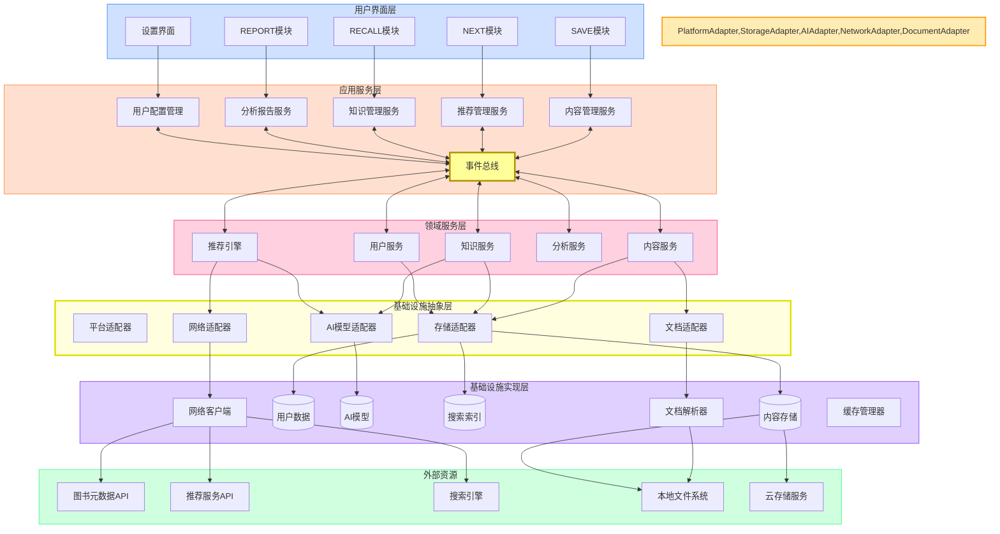
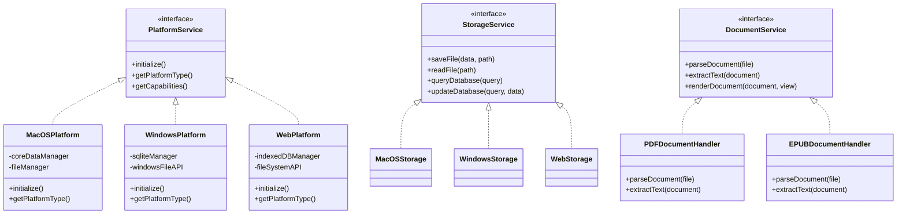
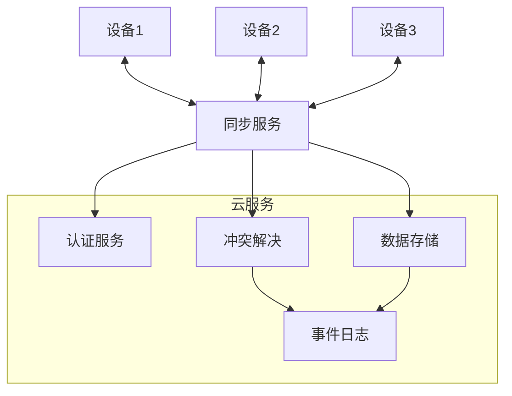
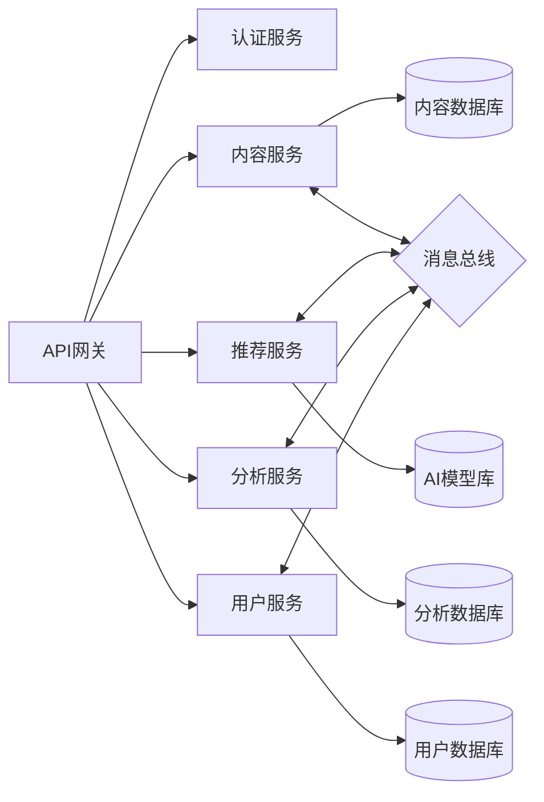

# NextBook Agent 系统架构

## 完整架构概览

NextBook Agent采用平台无关的多层架构，结合本地优先和云服务增强的混合模式，实现高性能、安全且功能丰富的阅读助手系统。

### 架构图

## 架构分层详解

### 1. 用户界面层

用户界面层负责与用户的直接交互，包含四大核心功能模块和配置界面。使用平台无关的UI抽象组件。

特点：
- **跨平台设计** - 使用React Native、Flutter等跨平台框架实现界面
- **响应式设计** - 使用声明式UI模式，确保界面快速响应
- **状态管理** - 采用单向数据流架构，维护一致的UI状态
- **适配性** - 支持不同屏幕尺寸和操作系统的交互方式

### 2. 应用服务层

应用服务层协调用户操作和系统功能，实现业务用例和应用逻辑。

职责：
- **功能编排** - 协调多个领域服务完成复杂业务流程
- **会话管理** - 维护用户会话状态
- **权限控制** - 确保操作符合用户权限
- **事件处理** - 响应系统事件和用户交互事件

### 3. 领域服务层

领域服务层包含核心业务逻辑，实现领域模型中定义的规则和流程。完全与平台无关。

组件：
- **内容服务** - 管理书籍、笔记和其他内容
- **推荐引擎** - 生成个性化内容推荐
- **知识服务** - 构建和查询知识图谱
- **分析服务** - 生成统计数据和见解
- **用户服务** - 处理用户配置和偏好

### 4. 基础设施抽象层

基础设施抽象层提供平台无关的接口，隔离上层服务与具体实现细节，是实现跨平台的关键。

模块：
- **平台适配器** - 提供操作系统功能的抽象
- **存储适配器** - 统一的数据存储接口
- **AI模型适配器** - 标准化AI模型访问方式
- **网络适配器** - 封装网络请求实现
- **文档适配器** - 平台无关的文档处理接口

### 5. 基础设施实现层

基础设施实现层负责实现各种平台特定的功能，隐藏平台差异。

组件：
- **存储实现** - 本地数据库和文件管理
- **AI模型实现** - 推荐、分类和内容理解模型
- **索引引擎** - 全文搜索和内容索引
- **文档解析器** - 处理不同格式的文档
- **网络客户端** - 与外部API安全通信

### 6. 外部资源

系统与多种外部资源交互，丰富功能和内容。

接口：
- **图书元数据API** - 获取书籍信息和封面
- **推荐服务** - 外部推荐引擎补充
- **搜索引擎** - 获取公开内容和评价
- **文件系统** - 访问本地文件
- **云存储服务** - 支持数据同步和备份

### 7. 事件驱动架构

事件驱动是NextBook Agent架构的核心设计模式，通过事件总线实现模块间的松耦合通信。

组件：
- **事件总线**：中央消息通道，协调系统内各组件的通信
- **事件生产者**：触发事件的系统组件
- **事件消费者**：订阅并响应事件的组件
- **事件存储**：重要事件的持久化存储，支持事件溯源和回放

主要事件类型：
- **领域事件**：代表系统中的业务事件，如"内容导入完成"、"生成新推荐"
- **集成事件**：跨系统边界的事件，用于与外部系统集成
- **命令**：请求系统执行特定操作的消息
- **查询**：请求系统提供信息的消息

### 8. 多级缓存策略

NextBook Agent采用多级缓存架构，根据数据特性选择最佳缓存策略：

- **内存缓存**：
  - 热点数据（如当前阅读内容、活跃书籍元数据）
  - 用户界面状态和偏好设置
  - AI模型推理过程中的中间结果

- **本地持久化缓存**：
  - 搜索索引和向量缓存
  - 常用推荐数据
  - 外部API响应结果

- **预加载策略**：
  - 基于用户行为预测的智能预加载
  - 阅读流内容的前瞻性缓存
  - 后台异步获取可能需要的相关内容

- **缓存一致性**：
  - 基于事件的缓存失效机制
  - 缓存条目的生命周期管理
  - 多平台版本中的缓存同步策略

## 数据流向

### 主要数据流路径

1. **内容导入流**
   - 从文件系统读取文档 → 解析内容结构 → 提取元数据 → 存储至内容库 → 更新索引 → 更新UI

2. **推荐生成流**
   - 用户请求推荐 → 获取用户模型 → 本地推荐计算 → 增强外部数据(可选) → 结果排序 → 展示UI

3. **知识回忆流**
   - 查询请求 → 搜索索引 → 知识图谱匹配 → 相关内容检索 → 结果组织 → 展示UI

4. **报告生成流**
   - 分析请求 → 数据聚合 → 统计计算 → 洞见生成 → 可视化渲染 → 展示UI

## 扩展性设计

NextBook Agent的架构设计考虑了以下扩展点：

1. **事件驱动扩展**：任何组件可通过订阅事件响应系统行为，无需直接修改源代码
2. **插件系统** - 标准化插件接口，包括：
   - 内容解析插件：支持更多文档格式
   - 推荐算法插件：自定义推荐逻辑
   - 视图扩展插件：自定义界面元素
   - 数据导出插件：支持多种导出格式
3. **多平台适配** - 界面层和应用层设计支持跨平台实现
4. **云同步能力** - 数据模型设计考虑未来云同步需求
5. **AI能力升级** - 模型接口标准化，支持替换和升级AI模型
6. **数据源扩展** - 开放式适配器设计，支持新增内容和推荐源

## 安全性考量

1. **本地优先** - 敏感数据默认存储在本地
2. **最小权限** - 只请求必要的系统权限
3. **数据加密** - 支持内容和配置的加密存储
4. **安全通信** - 使用TLS和API密钥保护网络通信
5. **隐私控制** - 用户完全控制数据分享范围

## 性能优化

1. **异步处理** - 耗时操作在后台线程执行
2. **增量索引** - 大型内容增量建立索引
3. **智能缓存** - 多级缓存策略减少计算和网络请求
4. **懒加载** - 按需加载内容和资源
5. **资源限制** - 动态调整资源使用，避免过度消耗
6. **预测性获取** - 基于用户行为预测下一步可能访问的内容
7. **本地计算优先** - 适合本地处理的计算不发送到服务器

## 可测试性设计

NextBook Agent架构内置高可测试性：

1. **分层测试策略**：
   - 单元测试：领域服务和基础设施组件的独立测试
   - 集成测试：组件间交互的验证
   - 端到端测试：完整功能流程测试
   
2. **依赖注入**：
   - 所有组件遵循依赖注入原则，便于模拟外部依赖
   - 服务定位器模式用于动态替换实现

3. **A/B测试框架**：
   - 支持并行运行多个推荐算法版本
   - 用户反馈收集与分析机制
   - 性能与质量指标自动比较

4. **监控与可观测性**：
   - 关键操作的性能追踪
   - 用户行为分析
   - 系统健康指标收集

## 平台适配策略

为确保NextBook Agent能够在不同平台上运行，同时最大化代码复用，我们采用以下适配策略：

### 适配层设计

### 平台适配策略

1. **依赖注入**：
   - 通过依赖注入容器提供平台特定实现
   - 启动时自动检测平台并加载相应适配器

2. **特性检测**：
   - 运行时检测平台特定功能可用性
   - 根据可用特性提供优雅降级方案

3. **共享核心代码**：
   - 领域层和应用服务层使用平台无关技术实现
   - 只在适配层包含平台特定代码

4. **统一API契约**：
   - 所有平台实现必须遵循相同的接口契约
   - 使用接口隔离原则减少实现依赖

## 云原生架构设计

为支持未来的多设备同步和云服务集成，NextBook Agent的架构设计考虑了以下云原生特性：

### 1. 数据同步架构

### 2. 微服务架构（扩展模式）

### 3. 数据一致性策略

- **CRDT数据结构** - 使用无冲突复制数据类型实现自动冲突解决
- **事件溯源** - 通过事件日志记录所有数据变更
- **乐观并发控制** - 支持离线编辑和后续合并
- **版本向量** - 跟踪数据版本以检测冲突

### 4. 云服务集成能力

- **服务发现** - 动态发现和连接云服务组件
- **配置管理** - 远程配置和特性标志支持
- **身份联合** - 支持多种身份提供商集成
- **容器化支持** - 服务可打包为容器便于部署
- **弹性伸缩** - 基于负载自动调整资源分配

## 修改优先级与路线图

建议按以下优先级进行架构调整：

1. **立即修改**：
   - 引入平台抽象层，隔离平台特定代码
   - 建立清晰的API定义，为前后端分离做准备
   - 增强存储抽象接口，使其平台无关化

2. **短期计划**（1-2个月）：
   - 选择跨平台UI框架，替代SwiftUI
   - 设计云同步数据模型和冲突解决策略
   - 构建平台无关的文档处理模块

3. **中期计划**（2-4个月）：
   - 实现前后端分离架构
   - 构建完整的API层
   - 开发初步的云同步功能

4. **长期计划**（4-6个月）：
   - 完成完整的云原生架构
   - 实现端到端加密的数据同步
   - 支持所有目标平台

## 结论

NextBook Agent的领域模型设计较为合理，但技术架构过度依赖macOS平台，需要进行重构以实现真正的跨平台和云原生能力。通过采用平台中立的技术栈、前后端分离架构和强化存储抽象层，可以在保留现有业务逻辑的同时，提升项目的技术可移植性和未来扩展性。

### 系统架构修改建议

NextBook Agent的架构设计通过引入平台抽象层，采用本地优先与云服务增强相结合的方式，既保证了良好的离线体验，又为未来的多平台扩展和云服务集成提供了技术基础。该架构支持从单机版向多平台版本的平滑过渡，并具备潜在的云原生扩展能力。
