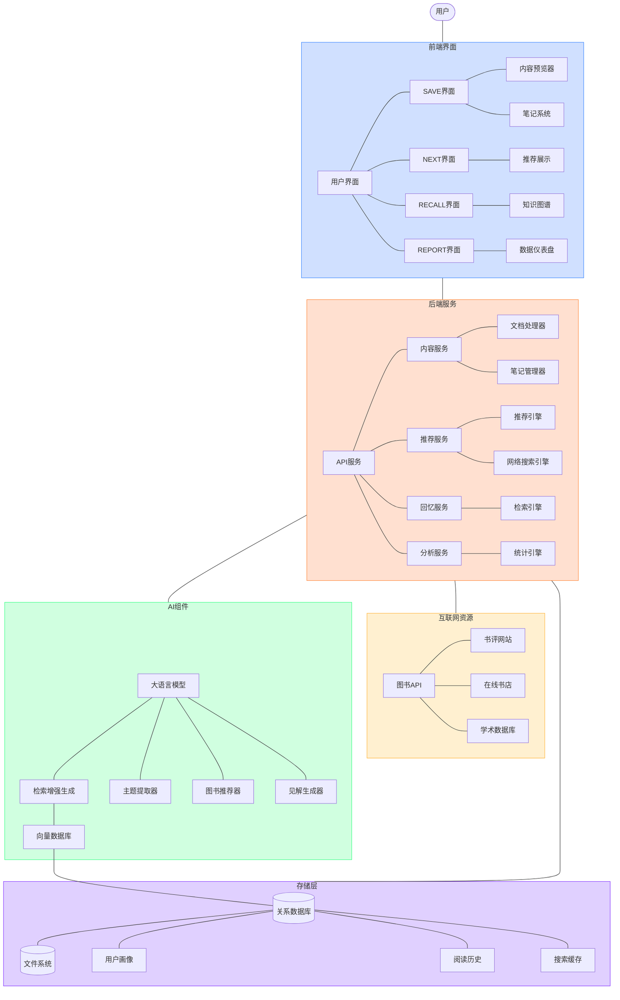

# NextBook Agent 系统架构

本文档详细描述了NextBook Agent的系统架构设计。

## 完整架构图

## 架构说明

### 前端界面（Frontend）

前端界面负责与用户交互，分为四大核心功能模块：

1. **SAVE界面**：处理内容导入、预览和笔记管理
2. **NEXT界面**：展示个性化推荐的书籍和内容
3. **RECALL界面**：提供知识回忆和检索功能
4. **REPORT界面**：生成阅读统计报告和可视化分析

### 后端服务（Backend）

后端服务层提供业务逻辑支持，包括以下主要服务：

1. **内容服务（ContentService）**：管理文档处理和笔记系统
2. **推荐服务（RecommendService）**：提供个性化书籍推荐
3. **回忆服务（RecallService）**：处理内容检索和知识关联
4. **分析服务（AnalyticsService）**：生成统计数据和用户画像

### AI组件

AI组件为系统提供智能功能支持：

1. **大语言模型（LLM）**：提供自然语言处理能力
2. **检索增强生成（RAG）**：结合向量数据库提高内容理解精度
3. **主题提取器**：分析内容主题并进行分类
4. **图书推荐器**：基于用户兴趣生成个性化推荐
5. **见解生成器**：提取阅读内容中的关键见解

### 存储层（Storage）

存储层负责数据持久化和管理：

1. **关系数据库**：存储结构化数据
2. **文件系统**：管理书籍文件和资源
3. **向量数据库**：支持语义搜索和内容关联
4. **用户画像**：记录用户阅读偏好和行为模式
5. **阅读历史**：跟踪用户阅读活动和进度

### 互联网资源（Internet）

系统选择性地连接外部资源：

1. **图书API**：获取最新图书信息
2. **书评网站**：收集用户评价和专业评论
3. **在线书店**：提供购买链接和价格信息
4. **学术数据库**：获取专业学术著作推荐
