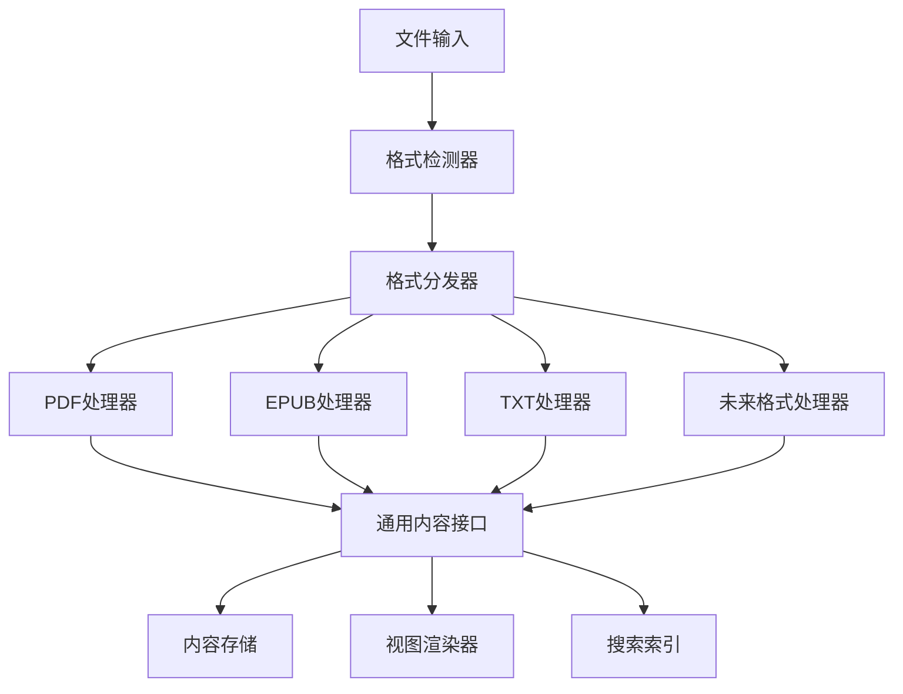

# NextBook Agent 文件格式支持计划

## 当前支持的格式

### PDF
- **支持级别**：完全支持
- **功能**：完整渲染、文本提取、结构解析、高亮、笔记
- **处理方式**：使用PDF.js进行解析和渲染

### EPUB
- **支持级别**：完全支持
- **功能**：完整渲染、文本提取、结构解析、高亮、笔记
- **处理方式**：使用EPUB.js进行解析和渲染

### TXT
- **支持级别**：基础支持
- **功能**：文本显示、编码检测、基础结构解析、高亮、笔记
- **处理方式**：自定义解析器处理文本，智能识别段落和章节
- **特殊挑战**：
  - 多种编码格式检测（UTF-8, GBK, ISO-8859, etc.）
  - 缺乏明确的章节结构，需要启发式算法识别
  - 排版优化以提升阅读体验

## 计划支持的格式

### 第一阶段扩展（预计3-6个月）

#### RTF
- **计划功能**：基础支持，包括文本提取和格式保留
- **技术方案**：使用RTF解析库如python-rtf或自定义解析器
- **开发难度**：中等
- **预期挑战**：嵌入对象处理，格式保留

#### MOBI
- **计划功能**：基础支持，主要用于文本提取和基本结构
- **技术方案**：集成KindleUnpack或类似工具转换为EPUB中间格式
- **开发难度**：高
- **预期挑战**：专有格式解析，无完整开源规范

### 第二阶段扩展（预计6-12个月）

#### DOC/DOCX
- **计划功能**：基础到中级支持
- **技术方案**：使用Apache POI或类似库进行解析
- **开发难度**：高
- **预期挑战**：复杂格式处理，嵌入对象管理

#### FB2
- **计划功能**：完整支持
- **技术方案**：基于XML解析，相对直接
- **开发难度**：低
- **预期挑战**：格式化显示与标准一致性

#### AZW/KF8
- **计划功能**：基础支持
- **技术方案**：转换为EPUB格式处理
- **开发难度**：高
- **预期挑战**：DRM处理，专有格式解析

### 长期规划（1年以上）

#### CBZ/CBR
- **用途**：漫画、图像集合支持
- **技术方案**：直接解压并管理图像序列
- **开发难度**：中等
- **预期挑战**：图像排序和处理

#### DJVU
- **用途**：扫描文档支持
- **技术方案**：集成DjVuLibre或类似解析库
- **开发难度**：高
- **预期挑战**：复杂格式处理，OCR集成需求

## 通用文件处理架构

为支持多格式扩展，NextBook Agent将采用插件化文件处理架构：

### 插件设计原则

1. **统一接口**：所有格式处理器实现相同的接口
2. **按需加载**：仅加载当前所需的格式处理器
3. **功能降级**：不支持特定功能时提供优雅的降级方案
4. **元数据一致性**：各格式提取的元数据映射到统一模型
5. **扩展性设计**：允许第三方开发新的格式处理器

## 实现优先级和资源分配

1. **TXT支持完善**：1-2人月
2. **RTF基础支持**：1-2人月
3. **MOBI基础支持**：2-3人月
4. **其他格式**：根据用户反馈和需求调整优先级

## 结论与建议

扩展文件格式支持是提升用户体验和扩大用户群体的重要举措。建议采取渐进式实现策略，先完善对TXT这种基础且广泛使用的格式的支持，然后按照上述计划逐步扩展到其他格式。

同时，应将插件化文件处理架构作为近期优先开发的技术基础，为未来支持更多格式奠定基础。
