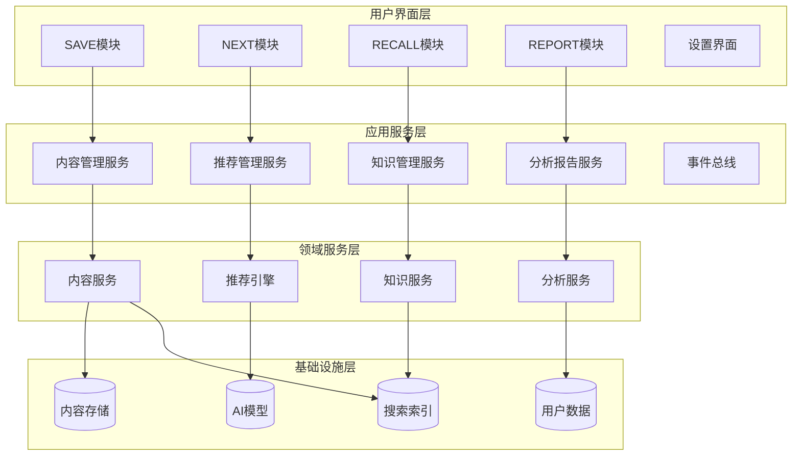

# NextBook Agent 开发者手册

本手册面向希望参与NextBook Agent开发、扩展其功能或创建插件的开发者。通过本手册，您将了解项目架构、开发环境设置、API使用和贡献指南。

## 目录

- [开发环境设置](#开发环境设置)
- [项目架构](#项目架构)
- [API文档](#API文档)
- [插件开发](#插件开发)
- [测试指南](#测试指南)
- [贡献流程](#贡献流程)

## 开发环境设置

### 系统要求

在开始开发之前，确保您的环境满足以下要求：

- **操作系统**：macOS 12.0+（开发POC版本）
- **Python**：3.10+
- **Node.js**：16.x+（用于前端开发）
- **Git**：2.x+
- **IDE**：推荐使用Visual Studio Code或PyCharm

### 设置步骤

1. **克隆代码库**

```bash
git clone https://github.com/yourusername/nextbook-agent.git
cd nextbook-agent
```

2. **创建并激活虚拟环境**

```bash
# 使用venv
python -m venv venv
source venv/bin/activate  # macOS/Linux
# 或 venv\Scripts\activate  # Windows
```

3. **安装后端依赖**

```bash
pip install -r requirements.txt
pip install -r requirements-dev.txt  # 开发工具依赖
```

4. **安装前端依赖**

```bash
cd frontend
npm install
cd ..
```

5. **设置配置文件**

```bash
cp config.example.yml config.yml
# 编辑config.yml文件设置本地开发配置
```

6. **启动开发服务器**

```bash
# 启动后端
python run.py --dev

# 在另一个终端启动前端
cd frontend
npm run dev
```

## 项目架构

NextBook Agent采用模块化架构，由多个层次组成。下面是系统架构的概览：



### 核心目录结构

```
nextbook-agent/
├── api/                # API定义和路由
├── core/               # 核心领域服务
│   ├── content/        # 内容服务
│   ├── recommendation/ # 推荐服务
│   ├── knowledge/      # 知识服务
│   └── analytics/      # 分析服务
├── data/               # 数据访问层
│   ├── models/         # 数据模型
│   ├── repositories/   # 仓库实现
│   └── storage/        # 存储接口
├── frontend/           # 前端代码
│   ├── src/            # 源代码
│   ├── public/         # 静态资源
│   └── dist/           # 构建输出
├── plugins/            # 插件系统
│   ├── core/           # 核心插件
│   └── custom/         # 自定义插件
├── scripts/            # 工具脚本
├── tests/              # 测试代码
│   ├── unit/           # 单元测试
│   ├── integration/    # 集成测试
│   └── e2e/            # 端到端测试
├── docs/               # 文档
└── utils/              # 通用工具类
```

## API文档

### 核心API概览

NextBook Agent提供了一系列API用于与系统交互：

#### 内容管理API

| 端点                  | 方法   | 描述             |
| --------------------- | ------ | ---------------- |
| `/api/content`        | GET    | 获取所有内容列表 |
| `/api/content/{id}`   | GET    | 获取特定内容详情 |
| `/api/content`        | POST   | 创建新内容       |
| `/api/content/{id}`   | PUT    | 更新内容         |
| `/api/content/{id}`   | DELETE | 删除内容         |
| `/api/content/import` | POST   | 导入内容         |

#### 笔记API

| 端点                | 方法   | 描述         |
| ------------------- | ------ | ------------ |
| `/api/notes`        | GET    | 获取所有笔记 |
| `/api/notes/{id}`   | GET    | 获取特定笔记 |
| `/api/notes`        | POST   | 创建新笔记   |
| `/api/notes/{id}`   | PUT    | 更新笔记     |
| `/api/notes/{id}`   | DELETE | 删除笔记     |
| `/api/notes/search` | GET    | 搜索笔记     |

#### 推荐API

| 端点                                 | 方法 | 描述         |
| ------------------------------------ | ---- | ------------ |
| `/api/recommendations`               | GET  | 获取推荐列表 |
| `/api/recommendations/refresh`       | POST | 刷新推荐     |
| `/api/recommendations/{id}/feedback` | POST | 提交推荐反馈 |

### API使用示例

**使用Python请求内容列表：**

```python
import requests

def get_content_list():
    response = requests.get('http://localhost:5000/api/content')
    if response.status_code == 200:
        return response.json()
    else:
        return {"error": f"请求失败：{response.status_code}"}

contents = get_content_list()
for content in contents:
    print(f"ID: {content['id']}, 标题: {content['title']}")
```

**使用JavaScript创建笔记：**

```javascript
async function createNote(contentId, text, position) {
  try {
    const response = await fetch('http://localhost:5000/api/notes', {
      method: 'POST',
      headers: {
        'Content-Type': 'application/json',
      },
      body: JSON.stringify({
        contentId,
        text,
        position,
        createdAt: new Date().toISOString()
      }),
    });
    
    if (!response.ok) {
      throw new Error(`HTTP error! status: ${response.status}`);
    }
    
    return await response.json();
  } catch (error) {
    console.error('创建笔记时出错:', error);
    return null;
  }
}

// 调用示例
createNote('book-123', '这是一个重要的观点', { page: 42, offset: 150 })
  .then(note => console.log('笔记已创建:', note))
  .catch(err => console.error(err));
```

## 插件开发

NextBook Agent提供了插件系统，允许开发者扩展系统功能。

### 插件类型

NextBook Agent支持四种主要插件类型：

1. **内容处理插件**：用于处理不同类型的内容格式
2. **AI服务插件**：自定义推荐和分析算法
3. **UI扩展插件**：添加新的界面组件和视图
4. **数据连接器插件**：与外部系统集成

### 创建插件步骤

1. **创建插件目录结构**

```
plugins/custom/my-plugin/
├── __init__.py
├── manifest.json
├── main.py
└── requirements.txt
```

2. **编写manifest.json**

```json
{
  "id": "com.example.my-plugin",
  "name": "My Custom Plugin",
  "version": "1.0.0",
  "description": "这是一个示例插件",
  "author": "Your Name",
  "type": "content_processor",
  "entryPoint": "main.py",
  "requirements": ["requests>=2.25.0"],
  "permissions": ["content:read", "content:write"]
}
```

3. **实现插件代码**

```python
# main.py
from nextbook.plugins import ContentProcessorPlugin

class MyCustomPlugin(ContentProcessorPlugin):
    def __init__(self):
        super().__init__()
        self.name = "My Custom Plugin"
        self.supported_formats = ["custom_format"]
    
    def process_content(self, content_data, metadata=None):
        """处理自定义格式的内容"""
        # 实现您的内容处理逻辑
        processed_content = self._transform_content(content_data)
        extracted_metadata = self._extract_metadata(content_data)
        
        return {
            "content": processed_content,
            "metadata": {**metadata, **extracted_metadata} if metadata else extracted_metadata
        }
    
    def _transform_content(self, content_data):
        # 转换内容的实际逻辑
        return content_data
    
    def _extract_metadata(self, content_data):
        # 提取元数据的实际逻辑
        return {"format": "custom", "size": len(content_data)}

# 插件入口点
plugin = MyCustomPlugin()
```

4. **安装和测试插件**

```bash
# 从开发目录安装插件
pip install -e plugins/custom/my-plugin

# 重启NextBook Agent应用
```

### 调试插件

1. 启用插件调试模式：在配置中设置`plugin.debug=true`
2. 查看插件日志：`tail -f logs/plugins.log`
3. 使用内置的插件检查器：访问`http://localhost:5000/plugin-inspector`

## 测试指南

### 单元测试

单元测试使用pytest框架。运行单元测试：

```bash
# 运行所有单元测试
pytest tests/unit

# 运行特定测试文件
pytest tests/unit/test_content_service.py

# 运行带特定标记的测试
pytest -m "core"
```

### 集成测试

集成测试验证组件之间的交互：

```bash
# 运行所有集成测试
pytest tests/integration

# 使用特定配置运行
pytest tests/integration --config=test_config.yml
```

### 端到端测试

端到端测试验证完整的用户流程：

```bash
# 运行所有E2E测试
pytest tests/e2e

# 运行特定场景
pytest tests/e2e/test_import_workflow.py
```

### 测试覆盖率

检查测试覆盖率：

```bash
# 生成覆盖率报告
pytest --cov=nextbook tests/

# 生成HTML覆盖率报告
pytest --cov=nextbook --cov-report=html tests/
```

## 贡献流程

### 贡献步骤

1. **找到问题或功能**：查看GitHub Issues或提出新想法
2. **创建分支**：从主分支创建功能分支
   ```bash
   git checkout main
   git pull
   git checkout -b feature/my-new-feature
   ```
3. **开发并测试**：实现您的更改并编写测试
4. **提交更改**：
   ```bash
   git add .
   git commit -m "Add feature: detailed description of changes"
   ```
5. **推送到远程**：
   ```bash
   git push origin feature/my-new-feature
   ```
6. **创建Pull Request**：在GitHub上创建PR并等待审核

### 代码规范

- 遵循PEP 8 Python代码风格
- 使用类型提示增强代码可读性
- 为所有新代码编写文档字符串
- 确保新功能有足够的测试覆盖率

### 审核标准

所有PR在合并前必须满足：

- 通过所有自动化测试
- 代码审核由至少一名维护者批准
- 遵循项目的代码规范和架构原则
- 更新相关文档
- 所有讨论和反馈都已解决

### 版本控制

项目使用语义化版本控制（Semantic Versioning）：

- **主版本号**：不兼容的API变更
- **次版本号**：向后兼容的功能新增
- **修订号**：向后兼容的问题修复

## 性能优化指南

### 数据处理优化

大型文档处理建议：

```python
def process_large_document(file_path):
    # 使用分块处理大型文档
    chunk_size = 1024 * 1024  # 1MB chunks
    with open(file_path, 'rb') as f:
        while True:
            chunk = f.read(chunk_size)
            if not chunk:
                break
            process_chunk(chunk)
```

### UI渲染优化

React组件优化示例：

```jsx
// 使用React.memo减少不必要的重渲染
const BookCard = React.memo(({ book, onSelect }) => {
  return (
    <div className="book-card" onClick={() => onSelect(book.id)}>
      
      <h3>{book.title}</h3>
      <p>{book.author}</p>
    </div>
  );
});

// 优化列表渲染
function BookList({ books }) {
  return (
    <div className="book-list">
      {books.map(book => (
        <BookCard 
          key={book.id} 
          book={book} 
          onSelect={handleSelectBook}
        />
      ))}
    </div>
  );
}
```

通过遵循本手册的指导，您将能够高效地参与NextBook Agent的开发，创建扩展插件，并为项目做出有价值的贡献。
