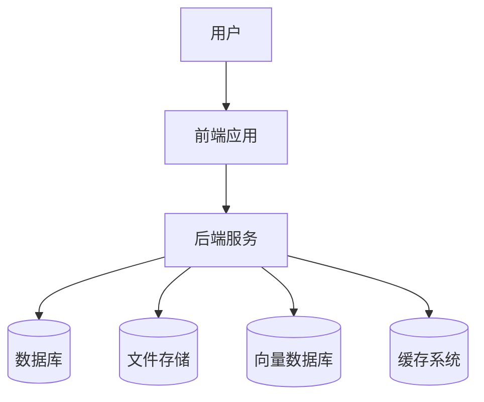

# NextBook Agent 维护者手册

本手册面向NextBook Agent的系统管理员和维护人员，提供关于部署、配置、监控、故障排除和维护的详细指南。

## 目录

- [系统架构](#系统架构)
- [安装部署](#安装部署)
- [配置管理](#配置管理)
- [性能监控](#性能监控)
- [故障排除](#故障排除)
- [数据管理](#数据管理)
- [系统升级](#系统升级)
- [安全维护](#安全维护)

## 系统架构

了解NextBook Agent的系统架构对于维护工作至关重要。

### 架构概览

NextBook Agent采用分层架构，主要组件包括：



### 组件依赖

系统主要组件及其依赖关系：

| 组件       | 描述                   | 依赖项                |
| ---------- | ---------------------- | --------------------- |
| 前端应用   | 基于Electron的桌面应用 | Node.js, Electron     |
| 后端服务   | Python后端API服务      | Python 3.10+, FastAPI |
| 数据库     | 关系型数据库           | SQLite/PostgreSQL     |
| 向量数据库 | 存储和检索向量嵌入     | Chroma/FAISS          |
| 文件存储   | 管理电子书和文档文件   | 本地文件系统          |
| 缓存系统   | 提高数据访问性能       | Redis (可选)          |

## 安装部署

### 系统要求

- **操作系统**：macOS 12.0+（POC版本）
- **CPU**：双核处理器，推荐四核或更高
- **内存**：最低8GB，推荐16GB或更高
- **存储**：最低10GB可用空间，根据书库大小可能需要更多
- **依赖**：Python 3.10+，Node.js 16+

### 部署选项

#### 方法1：使用安装程序

1. 下载最新的安装程序：
   - 前往[发布页面](https://github.com/yourusername/nextbook-agent/releases)
   - 下载对应操作系统的安装包
   
2. 运行安装程序：
   - 双击安装文件
   - 按照安装向导进行操作
   - 选择安装位置和配置选项

3. 首次启动配置：
   - 启动应用
   - 按照初始化向导设置基本参数

#### 方法2：手动部署

1. 准备环境：

```bash
# 创建目录
mkdir -p /opt/nextbook-agent
cd /opt/nextbook-agent

# 克隆代码库
git clone https://github.com/yourusername/nextbook-agent.git .

# 创建虚拟环境
python -m venv venv
source venv/bin/activate
```

2. 安装依赖：

```bash
# 安装Python依赖
pip install -r requirements.txt

# 安装前端依赖
cd frontend
npm install --production
npm run build
cd ..
```

3. 配置应用：

```bash
cp config.example.yml config.yml
# 编辑config.yml设置适当的配置
```

4. 创建服务（Linux系统）：

```bash
# 创建systemd服务文件
cat > /etc/systemd/system/nextbook.service << EOF
[Unit]
Description=NextBook Agent Service
After=network.target

[Service]
Type=simple
User=nextbook
WorkingDirectory=/opt/nextbook-agent
ExecStart=/opt/nextbook-agent/venv/bin/python run.py
Restart=on-failure
RestartSec=5s

[Install]
WantedBy=multi-user.target
EOF

# 启用并启动服务
systemctl enable nextbook.service
systemctl start nextbook.service
```

### 验证部署

执行以下验证步骤：

1. 检查服务状态：
   ```bash
   # 对于systemd服务
   systemctl status nextbook.service
   
   # 检查日志
   journalctl -u nextbook.service
   ```

2. 验证API连接：
   ```bash
   curl http://localhost:5000/api/health
   # 应该返回 {"status": "ok"}
   ```

3. 打开用户界面：
   - 启动应用
   - 检查连接状态指示器（应显示绿色）
   - 尝试导入测试文档确认功能正常

## 配置管理

### 配置文件结构

NextBook Agent使用YAML格式的配置文件。主配置文件位于`config.yml`，结构如下：

```yaml
# 常规配置
general:
  app_name: "NextBook Agent"
  debug: false
  log_level: "info"

# 数据存储配置
storage:
  database:
    type: "sqlite"
    path: "data/nextbook.db"
    # 或使用PostgreSQL
    # type: "postgresql"
    # host: "localhost"
    # port: 5432
    # user: "nextbook"
    # password: "password"
    # database: "nextbook"
  
  vector_db:
    type: "chroma"
    path: "data/vectors"
  
  file_storage:
    path: "data/files"
    max_file_size: 104857600  # 100MB

# AI服务配置
ai:
  embedding_model: "sentence-transformers/all-mpnet-base-v2"
  large_model_provider: "local"  # 或 "openai"
  openai_api_key: ""
  local_model_path: "models/llama2"

# 网络设置
network:
  port: 5000
  host: "127.0.0.1"
  allowed_origins:
    - "http://localhost:3000"

# 缓存设置
cache:
  type: "memory"  # 或 "redis"
  ttl: 3600  # 秒
  # Redis配置 (如果使用)
  # redis_host: "localhost"
  # redis_port: 6379
  # redis_password: ""

# 特性开关
features:
  enable_web_content_import: true
  enable_ocr: false
  enable_cloud_sync: false
```

### 环境变量

除了配置文件，系统也支持通过环境变量配置，格式为`NEXTBOOK_<SECTION>_<KEY>`：

```bash
# 设置日志级别
export NEXTBOOK_GENERAL_LOG_LEVEL=debug

# 设置数据库连接
export NEXTBOOK_STORAGE_DATABASE_TYPE=postgresql
export NEXTBOOK_STORAGE_DATABASE_HOST=db.example.com

# 设置AI服务
export NEXTBOOK_AI_OPENAI_API_KEY=sk-your-api-key
```

### 配置优先级

配置项的优先级从高到低：

1. 命令行参数
2. 环境变量
3. 配置文件
4. 默认值

## 性能监控

### 监控指标

NextBook Agent提供以下主要监控指标：

#### 系统健康指标

| 指标名称   | 描述                   | 建议阈值 |
| ---------- | ---------------------- | -------- |
| CPU使用率  | 系统CPU占用百分比      | <80%     |
| 内存使用率 | 系统内存占用百分比     | <90%     |
| 磁盘使用率 | 数据存储磁盘使用百分比 | <85%     |
| 响应时间   | API请求的平均响应时间  | <500ms   |

#### 应用特定指标

| 指标名称     | 描述                   | 建议阈值 |
| ------------ | ---------------------- | -------- |
| 文档导入速度 | 每秒处理的文档数据量   | >1MB/s   |
| 搜索延迟     | 知识检索平均响应时间   | <1s      |
| 推荐生成时间 | 生成推荐所需时间       | <5s      |
| 向量查询性能 | 向量搜索平均响应时间   | <100ms   |
| 缓存命中率   | 缓存命中占总查询百分比 | >70%     |

### 监控设置

#### 使用内置监控页面

1. 启用监控界面：在配置中设置`monitoring.enable_dashboard: true`
2. 访问监控面板：打开`http://localhost:5000/monitoring`
3. 默认凭据：admin/nextbook（请在生产环境中更改）

#### 接入外部监控系统

支持将指标导出到以下系统：

1. **Prometheus集成**：

```yaml
# config.yml
monitoring:
  export_prometheus: true
  prometheus_endpoint: "/metrics"
```

2. **Grafana仪表盘**：

系统提供了预配置的Grafana仪表盘模板，位于`/tools/monitoring/grafana-dashboard.json`。

3. **日志集成**：

系统日志可配置输出到标准日志文件或Elastic Stack：

```yaml
logging:
  output: "file"  # 或 "elasticsearch"
  file_path: "logs/nextbook.log"
  rotation: "daily"  # 每天轮转
  elasticsearch:
    hosts: ["http://elastic:9200"]
```

## 故障排除

### 常见问题

#### 启动问题

| 问题           | 可能原因                   | 解决方法                                           |
| -------------- | -------------------------- | -------------------------------------------------- |
| 服务无法启动   | 依赖项缺失                 | 检查依赖项安装：`pip list`与`requirements.txt`比对 |
| 端口冲突       | 其他服务占用端口           | 修改配置中的端口或停止冲突服务                     |
| 数据库连接失败 | 数据库服务未运行或凭据错误 | 验证数据库状态和连接参数                           |
| 权限问题       | 文件系统权限不足           | 检查应用目录权限：`ls -la /opt/nextbook-agent`     |

#### 性能问题

| 问题           | 可能原因         | 解决方法                          |
| -------------- | ---------------- | --------------------------------- |
| API响应缓慢    | 数据库查询效率低 | 检查并优化数据库索引或查询        |
| 内存使用过高   | 向量缓存过大     | 调整缓存配置或增加内存            |
| 导入大文件失败 | 文件超过大小限制 | 增加`max_file_size`配置并检查内存 |
| 推荐生成慢     | AI模型加载缓慢   | 配置模型预加载或使用轻量模型      |

### 诊断工具

#### 系统诊断脚本

使用内置诊断工具检查系统状态：

```bash
# 运行系统诊断
python scripts/diagnose.py

# 针对特定组件运行诊断
python scripts/diagnose.py --component database
python scripts/diagnose.py --component vectordb
python scripts/diagnose.py --component ai
```

#### 日志分析

系统日志位于`logs/`目录，包含以下文件：

- `nextbook.log` - 主应用日志
- `api.log` - API请求日志
- `error.log` - 错误日志
- `import.log` - 内容导入日志
- `ai.log` - AI相关操作日志

使用日志分析工具：

```bash
# 查找错误
grep "ERROR" logs/nextbook.log

# 分析慢查询
python scripts/analyze_logs.py --slow-queries

# 生成日志报告
python scripts/log_report.py --last 24h
```

### 故障恢复

#### 数据恢复

从备份恢复数据：

```bash
# 停止服务
systemctl stop nextbook.service

# 恢复数据库
python scripts/restore.py --database backups/nextbook-db-2023-05-15.sql

# 恢复文件存储
python scripts/restore.py --files backups/files-2023-05-15.tar.gz

# 重新启动服务
systemctl start nextbook.service
```

#### 系统重置

在极端情况下执行系统重置：

```bash
# 停止服务
systemctl stop nextbook.service

# 重置数据库（警告：将删除所有数据）
python scripts/reset.py --database

# 重置所有数据和配置（完全重置）
python scripts/reset.py --all

# 重新初始化系统
python scripts/initialize.py

# 重新启动服务
systemctl start nextbook.service
```

## 数据管理

### 备份策略

推荐的备份策略：

1. **定期自动备份**：

```bash
# 在crontab中添加每日备份
0 2 * * * /opt/nextbook-agent/scripts/backup.py --full >> /var/log/nextbook-backup.log 2>&1
```

2. **备份内容**：
   - 数据库完整备份
   - 用户上传文件
   - 应用配置
   - 向量数据库（可选，可以从原始内容重建）

3. **备份保留策略**：
   - 每日备份保留7天
   - 每周备份保留4周
   - 每月备份保留6个月

### 备份脚本

创建备份：

```bash
# 创建完整备份
python scripts/backup.py --full --output /path/to/backup/dir

# 只备份数据库
python scripts/backup.py --database --output /path/to/backup/dir

# 只备份用户文件
python scripts/backup.py --files --output /path/to/backup/dir
```

### 数据迁移

迁移到新服务器：

```bash
# 在源服务器上创建完整备份
python scripts/backup.py --full --output /tmp/nextbook-migration

# 将备份传输到新服务器
scp -r /tmp/nextbook-migration newserver:/tmp/

# 在新服务器上恢复
cd /opt/nextbook-agent
python scripts/restore.py --input /tmp/nextbook-migration
```

### 数据库维护

定期执行数据库维护任务：

```bash
# 优化数据库
python scripts/maintenance.py --optimize-db

# 清理临时文件
python scripts/maintenance.py --clean-temp

# 重建搜索索引
python scripts/maintenance.py --rebuild-index

# 验证数据完整性
python scripts/maintenance.py --verify-integrity
```

## 系统升级

### 版本管理

NextBook Agent遵循语义化版本控制（X.Y.Z）：
- X：主版本号（不兼容变更）
- Y：次版本号（向后兼容的功能）
- Z：修订号（向后兼容的修复）

### 升级流程

#### 自动升级（推荐）

使用升级脚本执行自动升级：

```bash
# 检查可用更新
python scripts/upgrade.py --check

# 查看更新详情
python scripts/upgrade.py --info

# 执行升级
python scripts/upgrade.py --perform
```

#### 手动升级

1. 备份当前系统：
   ```bash
   python scripts/backup.py --full --output /tmp/pre-upgrade-backup
   ```

2. 更新代码：
   ```bash
   cd /opt/nextbook-agent
   git fetch
   git checkout v1.2.0  # 替换为目标版本
   ```

3. 更新依赖：
   ```bash
   source venv/bin/activate
   pip install -r requirements.txt
   
   cd frontend
   npm install
   npm run build
   cd ..
   ```

4. 执行数据迁移：
   ```bash
   python scripts/migrate.py
   ```

5. 重新启动服务：
   ```bash
   systemctl restart nextbook.service
   ```

### 回滚流程

如果升级出现问题，按照以下步骤回滚：

```bash
# 停止服务
systemctl stop nextbook.service

# 恢复代码到之前版本
git checkout v1.1.0  # 替换为之前的稳定版本

# 恢复数据（如果需要）
python scripts/restore.py --input /tmp/pre-upgrade-backup

# 重新安装依赖
pip install -r requirements.txt
cd frontend && npm install && npm run build && cd ..

# 重新启动服务
systemctl start nextbook.service
```

## 安全维护

### 安全最佳实践

保护NextBook Agent的安全建议：

1. **定期更新**：
   - 及时应用安全补丁和更新
   - 关注项目安全公告

2. **访问控制**：
   - 使用最小权限原则配置服务
   - 限制API访问为本地接口或启用身份验证

3. **数据保护**：
   - 启用敏感数据加密功能
   - 定期审查数据访问日志

4. **网络安全**：
   - 配置防火墙仅允许必要端口访问
   - 如需远程访问，使用TLS和身份验证

### 配置安全设置

增强系统安全性的配置：

```yaml
# config.yml
security:
  # 加密设置
  encryption:
    enabled: true
    key_file: "keys/encryption.key"
  
  # 身份验证
  authentication:
    enabled: true
    method: "basic"  # 或 "oauth", "jwt"
    session_timeout: 3600  # 秒
  
  # 访问控制
  access_control:
    api_whitelist: ["127.0.0.1", "192.168.1.0/24"]
    rate_limit: 100  # 每分钟请求数
  
  # 文件验证
  file_validation:
    scan_uploads: true
    allowed_types: ["application/pdf", "application/epub+zip", "text/plain"]
    max_file_size: 52428800  # 50MB
```

### 安全审计

定期执行安全审计：

```bash
# 运行安全审计脚本
python scripts/security_audit.py

# 检查依赖项安全漏洞
pip-audit

# 生成安全报告
python scripts/security_audit.py --report
```

这将检查：
- 配置文件中的安全选项
- 文件和目录权限
- 数据库安全配置
- API端点访问控制
- 依赖项已知漏洞

### 日志安全监控

设置日志监控以检测安全事件：

```yaml
# config.yml
logging:
  security_events: true
  failed_logins: true
  access_log: true
  suspicious_activities: true
```

设置安全警报：

```bash
# 配置安全警报通知
python scripts/configure_alerts.py --email admin@example.com --threshold high
```

通过遵循本手册的指导，您将能够高效地部署、配置、监控和维护NextBook Agent系统，确保其稳定、安全地运行，并在需要时顺利执行升级和故障恢复操作。
