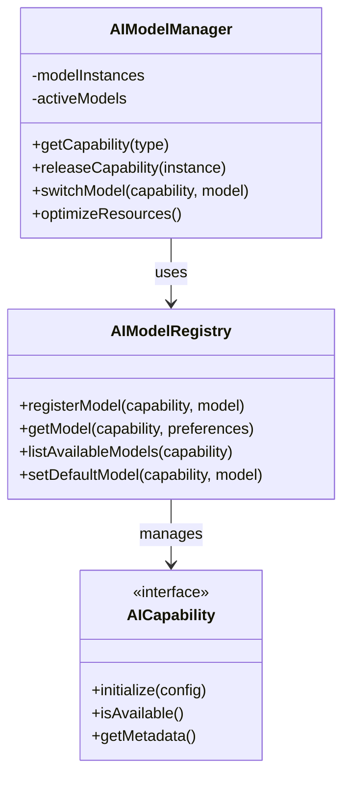
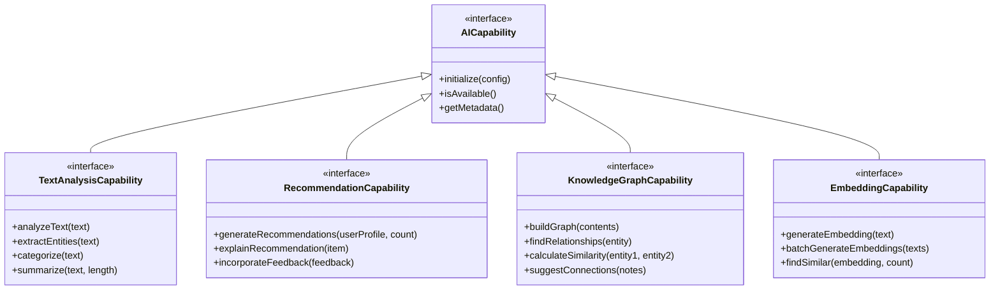
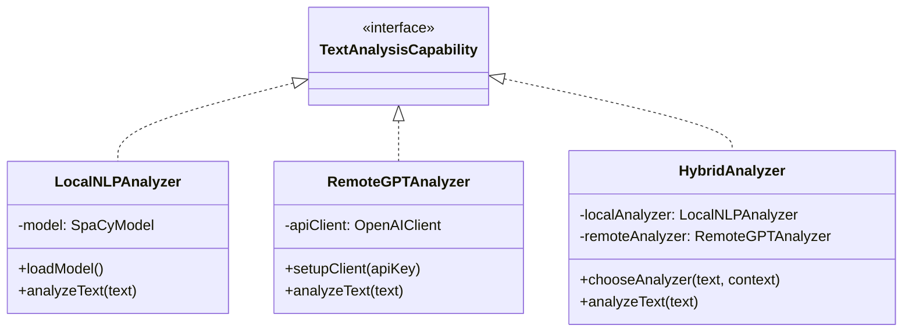
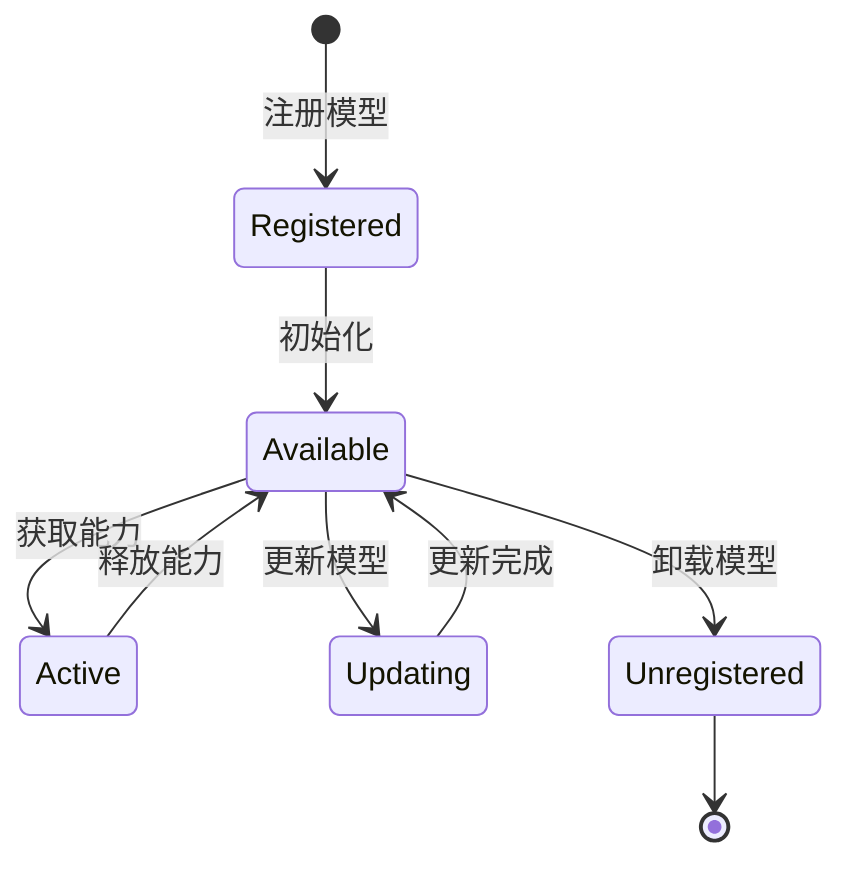
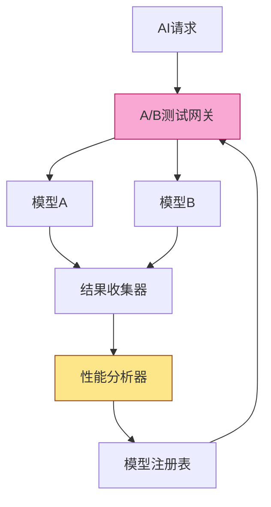
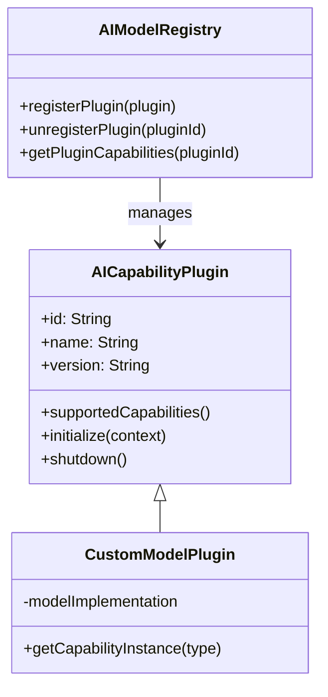

# NextBook Agent AI模型抽象设计

## 概述

NextBook Agent的AI模型抽象层提供了灵活且可扩展的机制，用于集成和管理各种AI功能，包括内容分析、推荐生成和知识图谱构建。本文档详细阐述AI模型抽象的设计原则、架构和实现策略。

## 设计目标

1. **灵活性**：支持无缝切换不同的AI模型实现
2. **可扩展性**：便于集成新的AI能力和算法
3. **性能优化**：根据任务需求和设备能力选择最合适的模型
4. **离线优先**：确保核心功能在离线环境中可用
5. **隐私保护**：本地处理敏感数据，减少外部依赖

## 架构设计

### 核心抽象层



### 能力分类

AI功能按领域划分为不同的能力接口：



### 实现策略

每种AI能力可以有多种实现，包括本地、远程和混合模式：



## 模型选择策略

NextBook Agent使用多维度的策略来选择最合适的AI模型：

### 场景因素

1. **任务复杂度**：
   - 简单任务使用轻量级本地模型
   - 复杂任务可选择使用高级远程模型

2. **内容敏感性**：
   - 敏感内容优先使用本地模型处理
   - 非敏感内容可使用云服务增强处理质量

3. **响应时间要求**：
   - 需要实时响应的功能使用本地模型
   - 后台任务可以使用更精确但较慢的远程模型

### 环境因素

1. **设备能力**：
   - 根据CPU/GPU/内存资源动态选择模型复杂度
   - 支持模型量化和优化以适应设备限制

2. **网络状态**：
   - 离线时自动切换到本地模型
   - 弱网络条件下选择带宽需求较低的模型

3. **电池状态**：
   - 低电量时使用能效更高的模型
   - 充电状态下可使用更复杂的模型

## 模型生命周期管理



1. **加载优化**：
   - 懒加载：仅在需要时加载模型
   - 预加载：预测用户可能需要的模型
   - 共享实例：多个请求共享同一模型实例

2. **资源管理**：
   - 内存管理：不使用的模型释放内存
   - 计算资源分配：根据优先级分配计算资源
   - 批处理：合并请求减少模型切换开销

3. **版本控制**：
   - 模型版本兼容性检查
   - 平滑升级策略
   - 降级回退机制

## A/B测试框架

NextBook Agent内置对AI模型的A/B测试支持：



### 关键功能

1. **实验设计**：
   - 流量分配：控制不同模型的使用比例
   - 用户分组：确保用户体验一致性
   - 指标定义：明确测试的成功标准

2. **数据收集**：
   - 结果质量评估
   - 性能指标监测
   - 用户反馈收集

3. **分析优化**：
   - 统计显著性评估
   - 自动模型选择
   - 持续优化循环

## 隐私与安全

1. **数据处理原则**：
   - 本地处理优先：尽可能在设备上处理数据
   - 最小数据传输：只传输必要的信息
   - 匿名化处理：移除个人识别信息

2. **模型安全**：
   - 模型完整性验证
   - 安全通信通道
   - 输入验证和防注入措施

3. **用户控制**：
   - 透明的AI使用策略
   - AI功能开关控制
   - 数据使用偏好设置

## 插件扩展

NextBook Agent的AI抽象层支持通过插件扩展AI功能：



### 插件功能

1. **新能力引入**：
   - 添加全新的AI能力类型
   - 扩展现有能力的功能范围

2. **替代实现**：
   - 提供现有能力的替代实现
   - 针对特定领域优化的专用模型

3. **集成服务**：
   - 连接专有或第三方AI服务
   - 提供特定领域专业模型

## 实现示例

### 本地推荐引擎实现

```pseudocode
CLASS LocalRecommendationEngine IMPLEMENTS RecommendationCapability
    FIELD model: MLModel
    FIELD userProfile: UserProfile
    
    METHOD initialize(config: Dictionary): Boolean
        IF config DOES NOT CONTAIN "modelPath" THEN
            RETURN false
        END IF
        
        TRY
            model = loadMLModel(config["modelPath"])
            RETURN true
        CATCH error
            logError("Failed to load model: " + error)
            RETURN false
        END TRY
    END METHOD
    
    METHOD isAvailable(): Boolean
        RETURN model IS NOT NULL
    END METHOD
    
    METHOD getMetadata(): Dictionary
        RETURN {
            "name": "Local Recommendation Engine",
            "version": "1.0.0",
            "capabilities": ["basic_recommendations", "offline_operation"],
            "resource_usage": "low"
        }
    END METHOD
    
    METHOD generateRecommendations(userProfile: UserProfile, count: Integer): List<BookRecommendation>
        // 本地推荐算法实现
        readHistory = userProfile.getReadHistory()
        userInterests = userProfile.getInterests()
        
        // 分析用户阅读历史和兴趣
        candidateBooks = findRelevantBooks(readHistory, userInterests)
        
        // 排序和评分
        rankedBooks = rankBooksByRelevance(candidateBooks, userProfile)
        
        // 选择前count本书
        recommendations = []
        FOR i = 0 TO count - 1
            IF i < rankedBooks.length THEN
                book = rankedBooks[i]
                reason = generateRecommendationReason(book, userProfile)
                confidence = calculateConfidence(book, userProfile)
                
                recommendation = new BookRecommendation(
                    book,
                    reason,
                    confidence,
                    "local_recommendation_engine"
                )
                recommendations.ADD(recommendation)
            END IF
        END FOR
        
        RETURN recommendations
    END METHOD
    
    METHOD explainRecommendation(item: BookRecommendation): String
        // 生成推荐解释
        book = item.getBook()
        factors = analyzeRecommendationFactors(book, userProfile)
        
        explanation = "推荐理由: "
        FOR EACH factor IN factors
            explanation = explanation + factor.getDescription() + " "
        END FOR
        
        RETURN explanation
    END METHOD
    
    METHOD incorporateFeedback(feedback: RecommendationFeedback)
        // 处理用户反馈，更新本地模型
        IF feedback.isPositive() THEN
            reinforcePattern(feedback.getRecommendation(), userProfile)
        ELSE
            weakenPattern(feedback.getRecommendation(), userProfile)
        END IF
        
        // 保存更新后的模型
        saveModelUpdates()
    END METHOD
END CLASS
```

### 混合模式文本分析器

```pseudocode
CLASS HybridTextAnalyzer IMPLEMENTS TextAnalysisCapability
    FIELD localAnalyzer: LocalNLPAnalyzer
    FIELD remoteAnalyzer: RemoteGPTAnalyzer
    FIELD networkMonitor: NetworkMonitor
    
    CONSTRUCTOR()
        localAnalyzer = new LocalNLPAnalyzer()
        remoteAnalyzer = new RemoteGPTAnalyzer()
        networkMonitor = NetworkMonitor.getSharedInstance()
    END CONSTRUCTOR
    
    METHOD initialize(config: Dictionary): Boolean
        localSuccess = localAnalyzer.initialize(config)
        remoteSuccess = remoteAnalyzer.initialize(config)
        RETURN localSuccess OR remoteSuccess
    END METHOD
    
    METHOD isAvailable(): Boolean
        RETURN localAnalyzer.isAvailable() OR remoteAnalyzer.isAvailable()
    END METHOD
    
    METHOD getMetadata(): Dictionary
        RETURN {
            "name": "Hybrid Text Analyzer",
            "version": "1.0.0",
            "capabilities": ["text_analysis", "entity_extraction", "summarization"],
            "mode": "adaptive"
        }
    END METHOD
    
    METHOD analyzeText(text: String): TextAnalysisResult
        // 决定使用哪个分析器
        IF shouldUseRemoteAnalyzer(text) THEN
            TRY
                RETURN remoteAnalyzer.analyzeText(text)
            CATCH error
                // 远程分析失败，降级到本地
                RETURN localAnalyzer.analyzeText(text)
            END TRY
        ELSE
            RETURN localAnalyzer.analyzeText(text)
        END IF
    END METHOD
    
    METHOD shouldUseRemoteAnalyzer(text: String): Boolean
        // 根据文本复杂性、网络状态和用户设置决定
        IF text.length > 1000 AND 
           networkMonitor.isConnected AND 
           UserPreferences.getSharedInstance().allowRemoteProcessing THEN
            RETURN true
        END IF
        RETURN false
    END METHOD
END CLASS
```

## 结语

NextBook Agent的AI模型抽象层设计提供了灵活且强大的框架，使应用能够适应不同的使用场景、设备能力和用户偏好。通过清晰的接口定义和策略化的模型选择，系统能够在保持核心功能稳定性的同时，不断整合新的AI能力和优化现有功能。