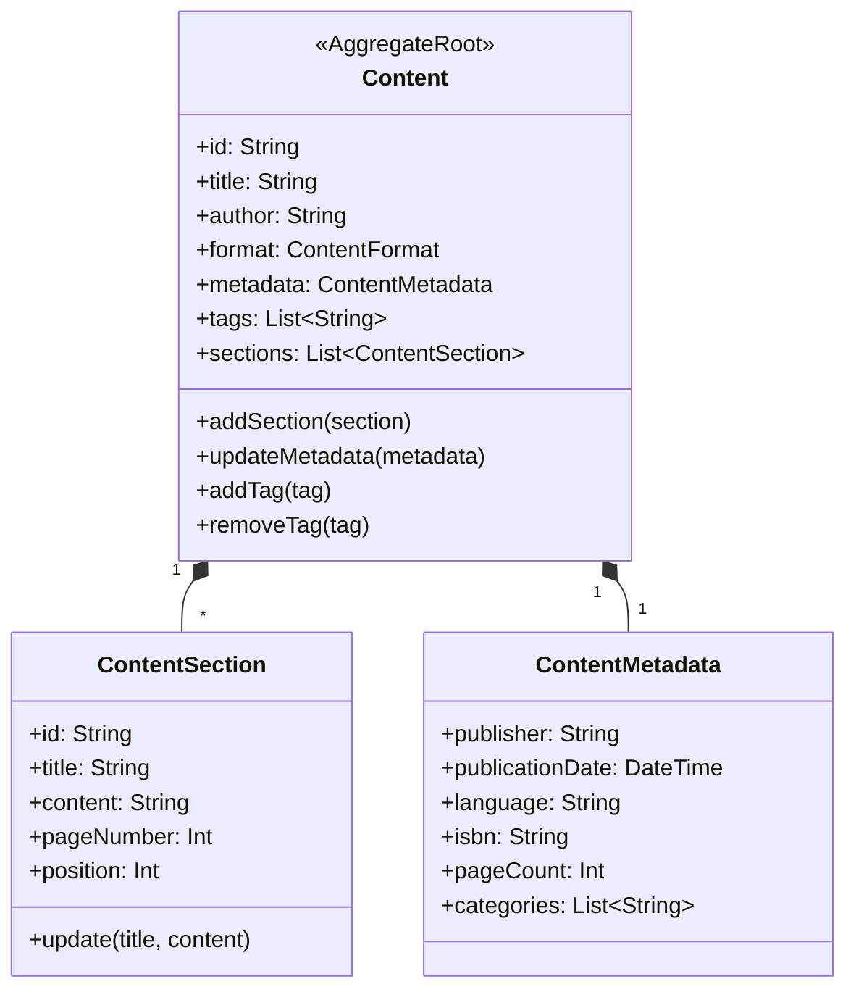
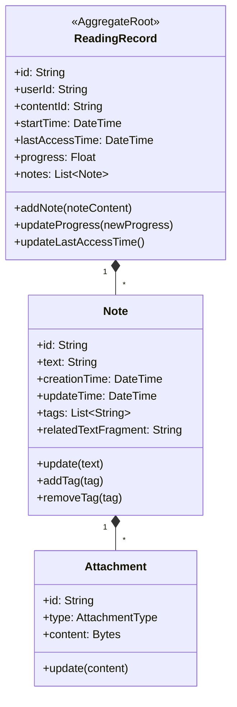
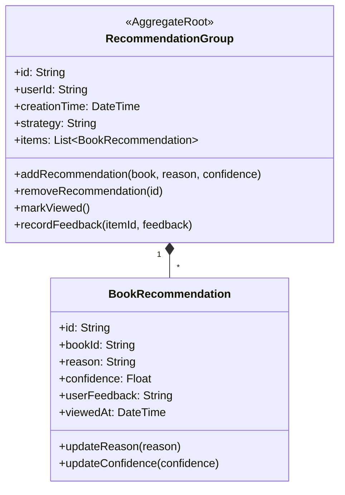
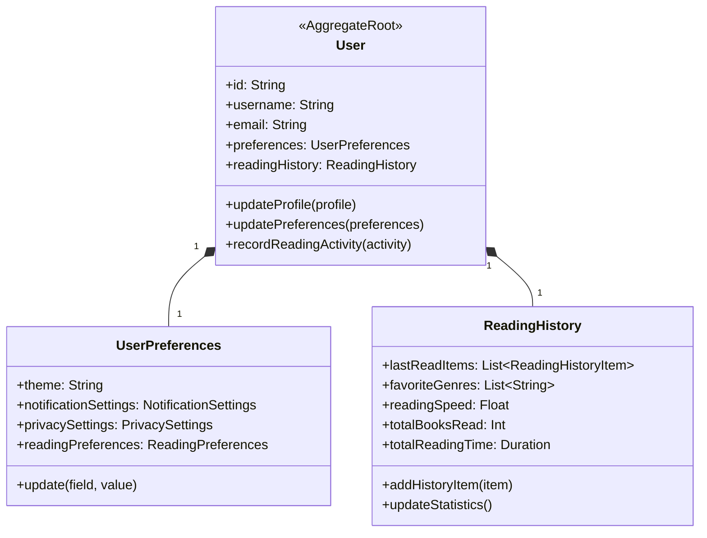
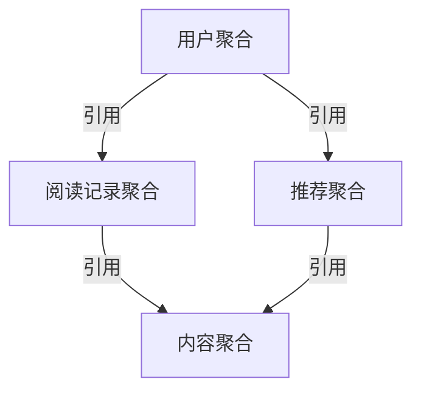

# NextBook 聚合与聚合根设计

聚合(Aggregate)是领域驱动设计(DDD)中的重要概念，用于确保业务规则的一致性边界。NextBook Agent设计了明确的聚合结构，以保证数据操作的原子性和业务规则的完整性。

## 聚合设计原则

在NextBook Agent中，聚合设计遵循以下原则：

1. **事务一致性** - 聚合是事务一致性的基本单位
2. **业务完整性** - 聚合包含完成特定业务功能所需的所有实体
3. **最小化范围** - 聚合尽量保持小型化，避免过大的事务范围
4. **引用外部对象** - 跨聚合引用使用身份标识而非直接对象引用
5. **单一入口** - 通过聚合根访问聚合内部对象

## 核心聚合

### 内容聚合

**一致性规则**：
- 内容的元数据更新必须作为单个事务进行
- 章节顺序与位置必须保持一致
- 删除内容时必须级联删除所有章节和关联的元数据

### 阅读记录聚合

**一致性规则**：
- 笔记必须属于一个且仅一个阅读记录
- 阅读进度必须是有效值(0.0-1.0)
- 进度更新必须同时更新最后访问时间

### 推荐聚合

**一致性规则**：
- 一个推荐组内的推荐项目不能重复
- 推荐置信度必须在有效范围内(0.0-1.0)
- 用户反馈值必须是预定义的有效值

### 用户聚合

**一致性规则**：
- 用户偏好变更必须作为单个事务更新
- 阅读历史记录必须按时间顺序维护
- 更新阅读统计时必须确保与历史记录一致

## 聚合间关系

聚合之间通过以下方式维护关系：

1. **身份引用** - 仅通过ID引用其他聚合，而非直接对象引用
2. **最终一致性** - 跨聚合操作通过领域事件和最终一致性维护
3. **约束验证** - 对外部引用的聚合ID进行存在性验证

## 事务边界设计

NextBook Agent中的事务边界严格遵循聚合边界：

| 操作           | 事务范围     | 一致性策略 |
| -------------- | ------------ | ---------- |
| 内容导入       | 内容聚合     | 强一致性   |
| 添加笔记       | 阅读记录聚合 | 强一致性   |
| 生成推荐       | 推荐聚合     | 强一致性   |
| 更新推荐反馈   | 推荐聚合     | 强一致性   |
| 内容与笔记关联 | 跨聚合       | 最终一致性 |
| 用户统计更新   | 跨聚合       | 最终一致性 |

## 聚合大小考量

NextBook Agent在聚合设计中权衡了以下因素：

1. **性能影响** - 过大的聚合会导致性能瓶颈和并发问题
2. **业务完整性** - 过小的聚合难以维护业务规则完整性
3. **数据频变程度** - 频繁变更的数据应尽量在同一聚合中
4. **查询需求** - 常常一起查询的数据放在同一聚合中

在实际实现中，我们采用适度的聚合大小，专注于业务操作的原子性，同时通过有效的缓存策略和预加载优化查询性能。
