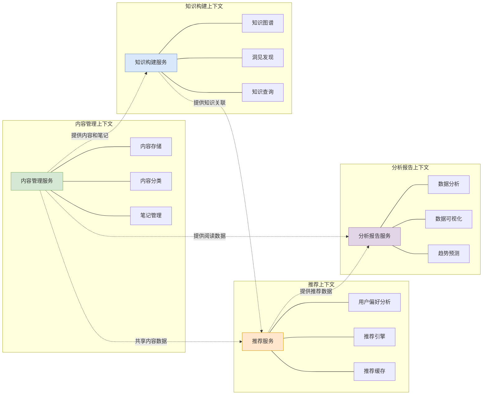

# NextBook 核心领域与边界上下文

本文档描述了NextBook Agent系统的核心领域划分及其边界上下文，明确各领域的责任范围和交互方式。

## 核心领域划分

NextBook Agent系统主要划分为四个核心领域：

1. **内容管理领域**：处理书籍、文章和笔记的导入、存储和分类
2. **推荐领域**：负责基于用户阅读历史和偏好推荐新内容
3. **知识构建领域**：处理知识图谱构建、关联发现和洞见链接
4. **分析报告领域**：负责统计分析和报告生成

## 边界上下文映射

## 上下文间协作

各个边界上下文间通过明确定义的接口和事件进行协作：

### 内容管理 → 推荐
- 提供内容元数据和用户阅读历史
- 通知新内容导入事件
- 通知笔记创建和更新事件

### 内容管理 → 知识构建
- 提供内容全文和用户笔记
- 通知内容关系变更
- 请求知识关联查询

### 知识构建 → 推荐
- 提供内容间的关联强度
- 提供主题聚类结果
- 通知新洞见发现

### 内容管理/推荐/知识构建 → 分析报告
- 提供原始数据进行统计分析
- 订阅分析结果用于优化各自服务

## 通用语言

为确保各上下文间的有效沟通，系统定义了以下通用语言：

| 术语 | 定义 | 所属上下文 |
|------|------|------------|
| 内容 | 可被阅读和分析的基本单位，包括书籍、文章等 | 内容管理 |
| 笔记 | 用户对内容的标记、摘录或评论 | 内容管理 |
| 推荐项 | 系统生成的推荐内容，包含内容信息和推荐理由 | 推荐 |
| 知识点 | 知识图谱中的最小单位，可以是概念、事实或观点 | 知识构建 |
| 洞见 | 系统发现的内容间的隐含关联或价值发现 | 知识构建 |
| 统计指标 | 量化用户阅读行为和内容特征的数值 | 分析报告 |
