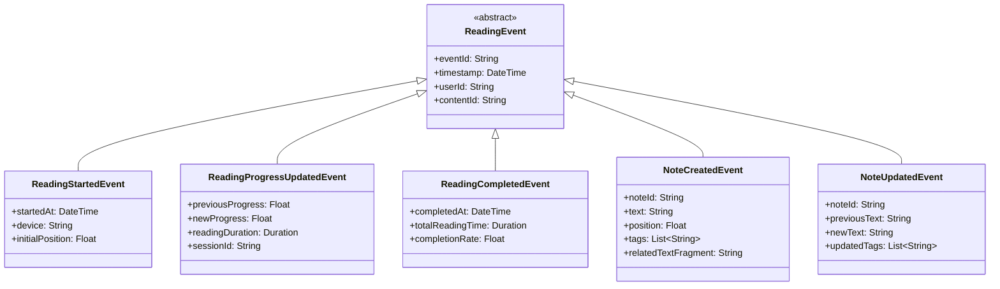

# NextBook 领域事件设计

领域事件(Domain Events)是系统中发生的、具有业务意义的事件，代表领域模型中状态的变化。NextBook Agent使用领域事件实现业务流程编排、聚合间通信和系统集成。

## 事件驱动架构

NextBook Agent采用事件驱动架构，通过领域事件的发布和订阅模式实现组件间的松耦合通信：

## 核心领域事件

NextBook Agent定义了以下核心领域事件：

### 内容相关事件

### 阅读记录相关事件

### 推荐相关事件

### 知识图谱相关事件

### 用户相关事件

## 事件流程与生命周期

NextBook Agent中的领域事件遵循以下生命周期：

### 事件生成

1. **实体状态变更** - 当领域实体状态发生变化时创建相应事件
2. **聚合根责任** - 事件由聚合根负责创建并发布
3. **事件属性** - 包含足够的信息以表示状态变更，但不包含敏感数据

### 事件发布

1. **同步发布** - 在聚合事务完成后立即发布事件
2. **事件总线** - 通过中央事件总线分发事件
3. **持久化** - 重要的领域事件会被持久化到事件存储

### 事件订阅

1. **声明式订阅** - 服务组件声明对特定事件类型的订阅
2. **处理职责** - 订阅者负责正确处理接收到的事件
3. **幂等性** - 事件处理必须是幂等的，以应对重复事件

## 事件存储

NextBook Agent使用事件存储来持久化关键领域事件：

事件存储具有以下功能：

1. **完整性保障** - 确保所有关键事件被可靠存储
2. **顺序保证** - 维护事件的时间顺序
3. **重放能力** - 支持从事件流重建系统状态
4. **分析支持** - 提供事件数据用于分析和报告

## 跨聚合通信模式

NextBook Agent使用领域事件实现聚合间通信，主要有以下通信模式：

### 后续处理模式

**应用场景**：当内容被导入后，生成推荐和更新知识图谱

### 集成事件模式

**应用场景**：内容管理领域与推荐领域之间的交互

### 事件溯源模式

**应用场景**：用户阅读进度和笔记历史的精确记录

## 事件与性能考量

为确保系统性能，NextBook Agent在事件处理方面采取以下策略：

1. **异步处理** - 非关键路径的事件处理使用异步方式
2. **批处理** - 适当情况下批量处理事件
3. **背压控制** - 实现背压机制防止系统过载
4. **监控与告警** - 对事件处理延迟和队列长度进行监控

## 事件版本与兼容性

随着系统演化，事件结构可能需要变更。NextBook Agent采用以下策略管理事件版本：

1. **向后兼容** - 事件变更保持向后兼容
2. **版本标记** - 事件包含版本信息
3. **转换器** - 提供事件版本间的转换功能
4. **松散契约** - 事件订阅者忽略未知字段

通过这些策略，NextBook Agent建立了可靠的事件驱动架构，支持系统的松耦合设计和可扩展性，同时保持业务逻辑的完整性和一致性。
