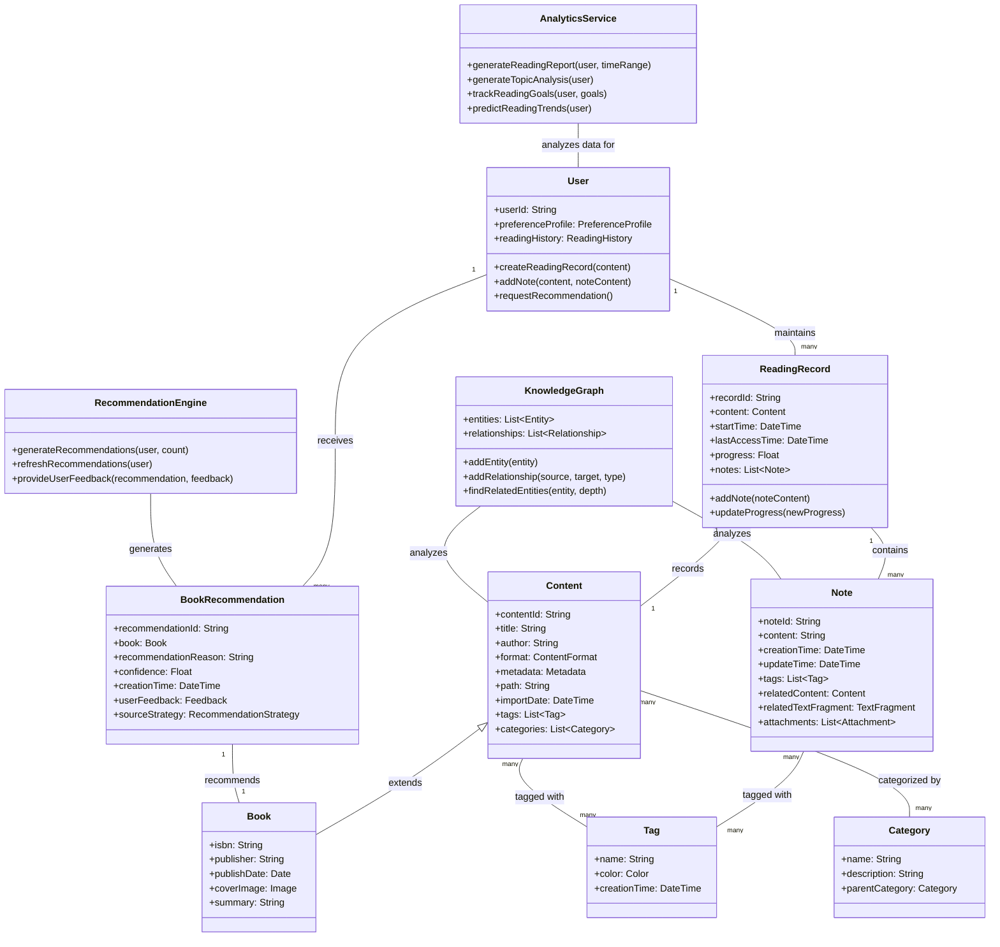

# NextBook 领域模型设计

本文档详细描述了NextBook Agent的完整领域模型设计，包括实体关系、属性定义以及行为设计。

## 完整领域模型图

## 核心实体说明

### 用户 (User)
用户实体代表系统的核心使用者，拥有自己的阅读偏好和历史记录。用户可以创建阅读记录、添加笔记，并接收个性化推荐。

### 内容 (Content)
内容是系统中可被阅读、记录和分析的基本单位，可以是书籍、文章或其他形式的可读材料。内容拥有元数据、标签和分类信息。

### 阅读记录 (ReadingRecord)
阅读记录跟踪用户与特定内容的交互历史，包括阅读开始时间、进度和相关笔记。

### 笔记 (Note)
笔记是用户对内容的个人见解、摘录或评论，与特定内容或内容片段相关联。

## 领域行为

* **内容导入**：用户可以导入新内容，系统自动提取元数据并创建内容实体
* **笔记创建**：用户可以在阅读过程中创建笔记，关联到特定内容或文本片段
* **内容组织**：用户可以通过标签和分类组织内容，便于后续检索
* **推荐生成**：系统根据用户的阅读历史、笔记和偏好生成个性化推荐
* **知识关联**：系统分析内容和笔记，构建知识图谱，发现内容间的关联和洞见
