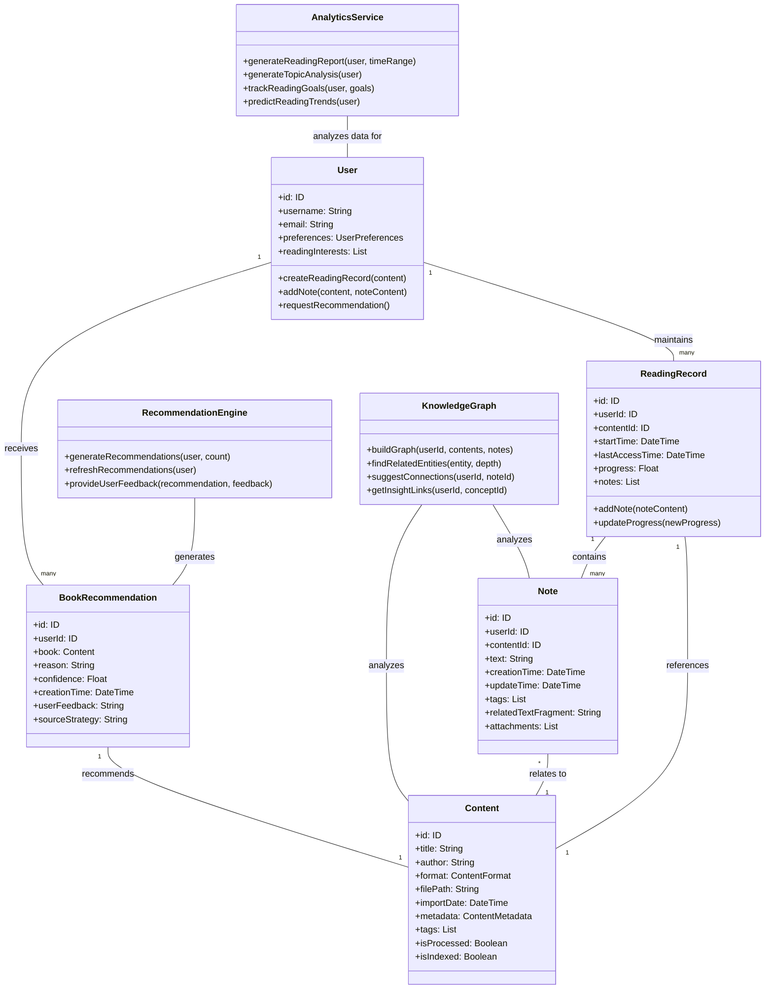

# NextBook 领域模型设计

NextBook Agent采用领域驱动设计(DDD)构建核心模型，确保业务概念清晰表达并支持系统的四大核心功能。

本文档详细描述了NextBook Agent的完整领域模型设计，包括实体关系、属性定义以及行为设计。

## 完整领域模型图

## 核心实体说明

### 用户 (User)
用户实体代表系统的核心使用者，包含个人信息、认证信息和偏好设置。用户可以创建阅读记录、添加笔记，并接收个性化推荐。

**主要属性**：
- id: 用户唯一标识符
- username: 用户名
- email: 电子邮件地址
- preferences: 用户偏好设置
- readingInterests: 阅读兴趣标签列表

**主要方法**：
- createReadingRecord(content): 创建新的阅读记录
- addNote(content, noteContent): 为内容添加笔记
- requestRecommendation(): 请求个性化推荐

### 内容 (Content)
内容是系统中可被阅读、记录和分析的基本单位，包括书籍、文章或其他形式的可读材料。每个内容项都包含元数据、处理状态和分类信息。

**主要属性**：
- id: 内容唯一标识符
- title: 标题
- author: 作者
- format: 内容格式(PDF、EPUB、TXT等)
- filePath: 文件存储路径
- importDate: 导入日期
- metadata: 详细元数据
- tags: 标签列表
- isProcessed: 是否已处理完成
- isIndexed: 是否已建立索引

### 阅读记录 (ReadingRecord)
阅读记录跟踪用户与特定内容的交互历史，包括阅读开始时间、进度和相关笔记。

**主要属性**：
- id: 记录唯一标识符
- userId: 用户ID
- contentId: 内容ID
- startTime: 开始阅读时间
- lastAccessTime: 最近访问时间
- progress: 阅读进度(0-1)
- notes: 相关笔记列表

**主要方法**：
- addNote(noteContent): 添加新笔记
- updateProgress(newProgress): 更新阅读进度

### 笔记 (Note)
笔记是用户对内容的个人见解、摘录或评论，与特定内容或内容片段相关联。

**主要属性**：
- id: 笔记唯一标识符
- userId: 创建用户ID
- contentId: 关联内容ID
- text: 笔记内容
- creationTime: 创建时间
- updateTime: 最后更新时间
- tags: 标签列表
- relatedTextFragment: 关联的原文片段
- attachments: 附件列表

### 推荐引擎 (RecommendationEngine)
推荐引擎负责基于用户历史、偏好和内容特征生成个性化推荐。

**主要方法**：
- generateRecommendations(user, count): 为用户生成指定数量的推荐
- refreshRecommendations(user): 刷新用户的推荐列表
- provideUserFeedback(recommendation, feedback): 处理用户对推荐的反馈

### 图书推荐 (BookRecommendation)
表示系统为特定用户推荐的书籍，包含推荐理由和置信度。

**主要属性**：
- id: 推荐唯一标识符
- userId: 用户ID
- book: 推荐书籍内容
- reason: 推荐原因说明
- confidence: 推荐置信度(0-1)
- creationTime: 创建时间
- userFeedback: 用户反馈
- sourceStrategy: 使用的推荐策略

### 知识图谱 (KnowledgeGraph)
知识图谱构建用户笔记和内容之间的关联，帮助用户发现知识连接和洞见。

**主要方法**：
- buildGraph(userId, contents, notes): 为用户构建知识图谱
- findRelatedEntities(entity, depth): 查找与实体相关的其他实体
- suggestConnections(userId, noteId): 为笔记推荐潜在关联
- getInsightLinks(userId, conceptId): 获取概念与经典思想的关联

### 分析服务 (AnalyticsService)
分析服务生成用户阅读数据的统计分析和可视化报告。

**主要方法**：
- generateReadingReport(user, timeRange): 生成阅读报告
- generateTopicAnalysis(user): 生成主题分析
- trackReadingGoals(user, goals): 跟踪阅读目标完成情况
- predictReadingTrends(user): 预测阅读趋势

## 核心模型对应功能

下表展示了核心领域模型与系统四大功能之间的对应关系：

| 核心模型                                  | 对应功能     | 关键职责                                         |
| ----------------------------------------- | ------------ | ------------------------------------------------ |
| Content                                   | SAVE         | 表示书籍、文章等内容项，支持元数据提取与自动分类 |
| ReadingRecord + Note                      | SAVE, RECALL | 记录阅读历史与笔记，支持后续回顾与检索           |
| RecommendationEngine + BookRecommendation | NEXT         | 生成个性化书籍推荐，整合多种推荐策略             |
| KnowledgeGraph                            | RECALL       | 构建知识关联，支持知识回顾与洞见链接             |
| AnalyticsService                          | REPORT       | 生成阅读统计与报告，提供多维度分析               |

## 领域行为

系统支持的主要领域行为包括：

* **内容导入**：用户可以导入新内容，系统自动提取元数据并创建内容实体
* **笔记创建**：用户可以在阅读过程中创建笔记，关联到特定内容或文本片段
* **内容组织**：用户可以通过标签和分类组织内容，便于后续检索
* **推荐生成**：系统根据用户的阅读历史、笔记和偏好生成个性化推荐
* **知识关联**：系统分析内容和笔记，构建知识图谱，发现内容间的关联和洞见
* **数据分析**：系统生成阅读统计和报告，帮助用户了解自己的阅读习惯和知识增长
* **洞见链接**：系统将用户笔记与经典思想进行关联，提供更深层次的知识连接

## 数据一致性与完整性

为确保领域模型的一致性和数据完整性，NextBook Agent采用以下策略：

1. **聚合设计**：使用聚合和聚合根组织相关实体，确保事务一致性
2. **不可变值对象**：对于不需要单独身份的属性集，使用值对象模式
3. **领域事件**：使用事件驱动设计记录系统状态变化
4. **验证规则**：在领域层实现核心业务规则验证
5. **乐观并发控制**：使用版本标记管理并发修改
