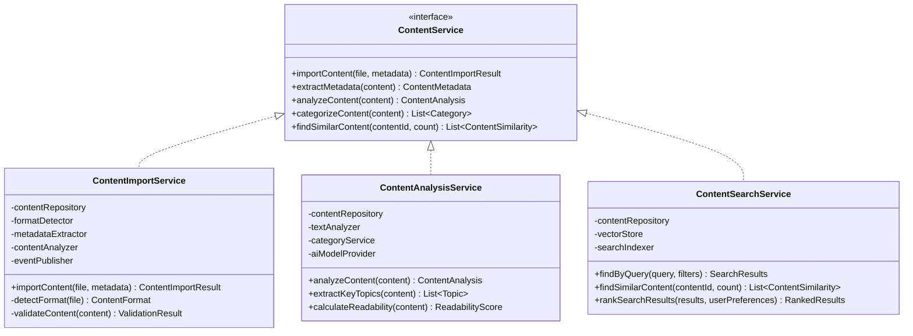

# NextBook 领域服务设计

领域服务(Domain Services)处理不属于单个实体或值对象的领域逻辑，实现跨实体的业务规则和复杂过程。NextBook Agent设计了一系列领域服务，以支持系统的核心功能和业务流程。

## 领域服务原则

NextBook Agent的领域服务设计遵循以下原则：

1. **无状态设计** - 领域服务不维护状态，只实现操作
2. **业务领域语言** - 服务命名和接口使用通用语言
3. **高内聚低耦合** - 每个服务专注于特定域的业务逻辑
4. **依赖注入** - 通过依赖注入获取所需的仓储和其他服务
5. **明确边界** - 与应用服务和基础设施服务有清晰的职责划分

## 核心领域服务

### 内容管理服务

内容管理服务负责处理与内容相关的复杂业务逻辑，包括内容导入、处理和分析。



**主要职责**：
- 文件格式检测与验证
- 内容元数据提取与增强
- 内容分类与标签生成
- 内容分析与可读性评估
- 相似内容发现

### 推荐服务

推荐服务实现跨实体的推荐算法和策略，提供个性化书籍推荐。


**主要职责**：
- 个性化推荐生成
- 多策略推荐融合
- 推荐解释生成
- 用户反馈处理
- 推荐策略评估与优化

### 知识图谱服务

知识图谱服务负责构建和查询用户的知识网络，提供知识关联和洞见发现。


**主要职责**：
- 用户知识图谱构建
- 概念提取与关系识别
- 跨内容概念关联
- 知识洞见发现
- 用户笔记与经典思想链接

### 分析报告服务

分析报告服务处理用户阅读数据的统计分析和报告生成。


**主要职责**：
- 阅读数据统计与报告生成
- 阅读习惯和模式分析
- 主题兴趣识别与跟踪
- 阅读目标进度评估
- 阅读趋势预测

### 用户配置服务

用户配置服务管理用户偏好设置和个性化配置。


**主要职责**：
- 用户偏好管理与验证
- 用户兴趣计算与更新
- 设备间配置同步
- 设置冲突解决

## 领域服务实现策略

NextBook Agent实现领域服务时采用以下策略：

### 职责分层


1. **专注业务规则** - 领域服务只包含业务逻辑，不含基础设施代码
2. **应用服务协调** - 应用服务协调领域服务的调用和事务管理
3. **领域模型操作** - 领域服务操作领域模型，通过仓储获取和持久化

### 实现模式

NextBook Agent的领域服务实现遵循以下模式：

#### 策略模式

用于实现可替换的算法和业务规则：

```java
public interface RecommendationStrategy {
    List<BookRecommendation> recommend(UserProfile profile, int count);
    String getStrategyName();
    float getConfidenceScore();
}

public class ContentBasedStrategy implements RecommendationStrategy {
    // 实现基于内容的推荐算法
}

public class CollaborativeFilteringStrategy implements RecommendationStrategy {
    // 实现协同过滤推荐算法
}

public class HybridRecommendationStrategy implements RecommendationStrategy {
    // 实现混合推荐算法
}
```

#### 组合模式

用于构建复杂的分析和处理流程：

```java
public interface ContentProcessor {
    ContentProcessingResult process(Content content);
}

public class MetadataExtractor implements ContentProcessor {
    // 提取元数据
}

public class TextAnalyzer implements ContentProcessor {
    // 分析文本内容
}

public class ContentProcessingPipeline implements ContentProcessor {
    private List<ContentProcessor> processors;
    
    public ContentProcessingResult process(Content content) {
        ContentProcessingResult result = new ContentProcessingResult();
        for (ContentProcessor processor : processors) {
            result.combine(processor.process(content));
        }
        return result;
    }
}
```

#### 观察者模式

用于实现事件驱动的领域服务通信：

```java
public interface DomainEventSubscriber<T extends DomainEvent> {
    void handleEvent(T event);
    Class<T> getEventType();
}

public class KnowledgeGraphUpdater implements DomainEventSubscriber<ContentImportedEvent> {
    private KnowledgeGraphService graphService;
    
    @Override
    public void handleEvent(ContentImportedEvent event) {
        graphService.updateGraphWithContent(event.getUserId(), event.getContentId());
    }
    
    @Override
    public Class<ContentImportedEvent> getEventType() {
        return ContentImportedEvent.class;
    }
}
```

## 服务间的协作

领域服务通过以下方式协作完成复杂业务流程：

### 直接调用

对于同步且紧密耦合的流程：


### 事件驱动

对于异步且松耦合的流程：


## 与基础设施的交互

领域服务通过仓储接口与基础设施交互，保持领域逻辑与技术实现的隔离：


领域服务设计隐藏基础设施细节，使得领域逻辑可以独立测试和演化，同时支持灵活替换基础设施实现。

## 服务测试策略

NextBook Agent采用以下策略测试领域服务：

1. **单元测试** - 测试服务中的业务规则和算法
2. **集成测试** - 测试服务与仓储和其他服务的交互
3. **契约测试** - 验证服务实现是否符合接口契约
4. **行为测试** - 使用行为驱动开发(BDD)验证业务场景

通过这些领域服务，NextBook Agent实现了复杂的业务逻辑，同时保持了代码的组织性和可维护性。领域服务作为系统的核心组件，承载了最重要的业务规则，是实现四大核心功能(SAVE, NEXT, RECALL, REPORT)的关键基础。
