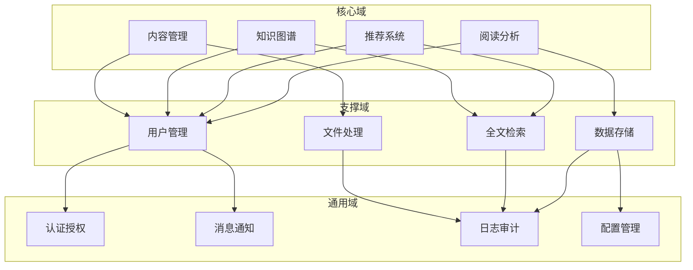
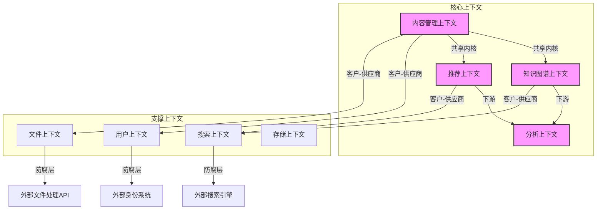

# NextBook 战略设计

战略设计是领域驱动设计(DDD)的核心部分，侧重于大局观点，明确系统的领域划分、限界上下文及其关系，并建立通用语言。本文档详述NextBook Agent的战略设计决策。

## 领域划分

NextBook Agent的系统划分为以下核心领域和支撑域：

### 核心域

* **内容管理域**
  * 职责：管理用户导入的书籍、文章等内容，以及用户创建的笔记和注释
  * 关键实体：Content、Note、ReadingRecord
  * 核心价值：确保内容管理的完整性和易用性，支持SAVE功能

* **知识图谱域**
  * 职责：构建用户知识网络，关联内容、笔记和概念
  * 关键实体：KnowledgeGraph、Concept、ConceptRelation
  * 核心价值：提供知识关联和洞见链接，支持RECALL功能

* **推荐系统域**
  * 职责：基于用户阅读历史和兴趣生成个性化推荐
  * 关键实体：RecommendationEngine、BookRecommendation
  * 核心价值：提供高质量的阅读建议，支持NEXT功能

* **阅读分析域**
  * 职责：收集和分析用户阅读数据，生成报告和可视化
  * 关键实体：AnalyticsService、ReadingStats、TopicDistribution
  * 核心价值：提供阅读行为洞察，支持REPORT功能

### 支撑域

* **用户管理域**
  * 职责：管理用户账户、偏好设置和权限
  * 关键实体：User、UserPreferences、UserProfile
  
* **文件处理域**
  * 职责：处理不同格式的文件导入、转换和内容提取
  * 关键组件：FileProcessor、MetadataExtractor、ContentParser
  
* **全文检索域**
  * 职责：为内容和笔记建立索引，提供快速搜索能力
  * 关键组件：SearchEngine、IndexManager、QueryProcessor
  
* **数据存储域**
  * 职责：管理系统数据的持久化和检索
  * 关键组件：Repository、DataModel、CacheManager

### 通用域

* **认证授权域**
  * 职责：验证用户身份和控制权限
  * 关键组件：AuthService、PermissionChecker、SessionManager

* **消息通知域**
  * 职责：处理系统内部和用户通知
  * 关键组件：NotificationService、MessageBus、AlertManager
  
* **日志审计域**
  * 职责：记录系统操作和行为
  * 关键组件：LogService、AuditTrail、ActivityMonitor
  
* **配置管理域**
  * 职责：管理系统配置和环境设置
  * 关键组件：ConfigManager, SettingsStore, FeatureToggle

## 限界上下文

限界上下文定义了模型在特定上下文中的边界，确保概念在其边界内一致。NextBook Agent的限界上下文及其关系如下：

### 上下文关系模式

1. **共享内核（Shared Kernel）**
   * 内容管理、知识图谱和推荐上下文共享关键领域模型（如Content、Note）
   * 共享模型需经所有团队同意才能变更
   * 减少重复，但增加了协调成本

2. **客户-供应商（Customer-Supplier）**
   * 核心上下文作为客户，支撑上下文作为供应商
   * 供应商优先满足客户需求，但保持一定自主权
   * 例如：推荐上下文依赖搜索上下文提供的搜索服务

3. **防腐层（Anticorruption Layer）**
   * 在与外部系统交互处建立转换层，保护内部模型
   * 例如：文件上下文与外部文件处理API之间的防腐层

4. **开放主机服务（Open Host Service）**
   * 分析上下文提供开放API供其他上下文调用
   * 定义明确的集成协议，简化多上下文交互

5. **发布语言（Published Language）**
   * 使用标准化格式（如JSON Schema）定义上下文间数据交换格式
   * 减少翻译成本，提高互操作性

## 通用语言

通用语言是团队和领域专家共同使用的语言，确保在整个项目中使用一致的术语。下面是NextBook Agent的核心通用语言术语表：

### 内容管理术语

| 术语                         | 定义                               | 示例                        |
| ---------------------------- | ---------------------------------- | --------------------------- |
| 内容（Content）              | 可被系统管理的任何文本或多媒体资料 | 书籍、文章、论文            |
| 笔记（Note）                 | 用户对内容的观察、思考或记录       | 摘抄、评论、疑问            |
| 阅读记录（Reading Record）   | 跟踪用户与特定内容的交互历史       | 阅读进度、阅读时间          |
| 阅读进度（Reading Progress） | 用户对特定内容的完成程度           | "已读30%"、"第54页/共180页" |

### 知识图谱术语

| 术语                           | 定义                           | 示例                       |
| ------------------------------ | ------------------------------ | -------------------------- |
| 知识图谱（Knowledge Graph）    | 表示内容和概念间关系的网络结构 | 主题间的关联、概念层次     |
| 概念（Concept）                | 知识图谱中的基本语义单元       | "人工智能"、"气候变化"     |
| 概念关系（Concept Relation）   | 两个概念间的语义连接           | "包含"、"相关"、"对立"     |
| 洞见链接（Insight Connection） | 用户笔记与外部知识体系的关联   | 用户想法与哲学家观点的共鸣 |

### 推荐系统术语

| 术语                                | 定义                             | 示例                 |
| ----------------------------------- | -------------------------------- | -------------------- |
| 推荐（Recommendation）              | 系统向用户提议的内容             | 新书推荐、相关阅读   |
| 推荐原因（Recommendation Reason）   | 解释为何向用户推荐特定内容的依据 | "基于你对XX的兴趣"   |
| 推荐策略（Recommendation Strategy） | 生成推荐的算法或方法             | 协同过滤、内容相似度 |
| 推荐反馈（Recommendation Feedback） | 用户对推荐的响应                 | 接受、拒绝、稍后阅读 |

### 阅读分析术语

| 术语                           | 定义                         | 示例                         |
| ------------------------------ | ---------------------------- | ---------------------------- |
| 阅读统计（Reading Stats）      | 用户阅读行为的量化指标       | 阅读时长、完成书籍数         |
| 主题分布（Topic Distribution） | 用户阅读内容的主题分类比例   | 科学30%、历史25%、艺术15%    |
| 阅读模式（Reading Pattern）    | 用户阅读习惯的时间和行为特征 | 晚间集中阅读、碎片化阅读     |
| 阅读目标（Reading Goal）       | 用户设定的阅读相关目标       | 每月完成3本书、每周阅读5小时 |

## 战略设计决策记录

以下是NextBook Agent项目中关键的战略设计决策记录：

### SDR-1: 采用领域驱动设计方法

* **上下文**: 项目启动阶段需要确定系统设计方法
* **决策**: 采用领域驱动设计(DDD)作为主要设计方法
* **状态**: 已接受
* **后果**:
  * 优点: 更好地表达业务概念，改善团队沟通，提高模型准确性
  * 缺点: 学习曲线较陡，需要更多前期投入
* **选项**:
  * 传统分层架构：更简单但业务表达力较弱
  * 微服务架构：过早引入分布式复杂性
  * 领域驱动设计：平衡复杂性和表达力

### SDR-2: 以内容管理为系统核心域

* **上下文**: 需要确定系统的核心竞争力所在
* **决策**: 将内容管理确立为核心域，其他功能围绕这一核心构建
* **状态**: 已接受
* **后果**:
  * 优点: 明确资源分配优先级，确保核心功能质量
  * 缺点: 可能对其他域的创新限制较多
* **选项**:
  * 以推荐系统为核心：创新性高但依赖内容基础
  * 以知识图谱为核心：差异化明显但过于学术
  * 以内容管理为核心：满足基本需求，支持其他域发展

### SDR-3: 本地优先架构

* **上下文**: 需要在用户数据控制与云服务便利间平衡
* **决策**: 采用"本地优先"设计，核心功能不依赖云服务
* **状态**: 已接受
* **后果**:
  * 优点: 提高隐私保护，降低网络依赖，提升响应速度
  * 缺点: 多设备同步复杂度增加，部分高级功能受限
* **选项**:
  * 纯云架构：便于同步但隐私风险高
  * 混合架构：平衡但复杂度高
  * 本地优先：用户控制最大化

## 演进策略

随着项目发展，战略设计会随之演进。以下是计划的演进路径：

1. **初始阶段**：专注于单用户本地模式，强化核心域功能
2. **成长阶段**：引入有限云集成，增强用户体验
3. **成熟阶段**：提供完整的多端同步，增强社区功能
4. **扩展阶段**：探索企业级功能，考虑与其他知识系统集成

在每个阶段，我们会重新评估领域划分和限界上下文，确保架构能够支持业务需求的演进。
