# NextBook 值对象设计

值对象(Value Objects)是领域驱动设计(DDD)中的重要概念，它们代表描述事物特征的对象，没有概念标识，通过属性值而非身份确定相等性。NextBook Agent中的值对象设计旨在提高系统的表达力和不变性。

## 值对象设计原则

NextBook Agent的值对象设计遵循以下原则：

1. **不可变性** - 值对象创建后不可修改，任何"修改"都返回新实例
2. **无副作用** - 值对象的方法不产生副作用
3. **自包含验证** - 值对象自身保证有效性
4. **相等性比较** - 基于所有属性的相等性比较，而非身份
5. **表达意图** - 值对象命名和设计应表达领域概念

## 核心值对象

### 内容相关值对象


### 用户相关值对象


### 推荐相关值对象


### 知识图谱相关值对象


### 分析相关值对象

```mermaid
classDiagram
    class ReadingStats {
        <<ValueObject>>
        +period: DateRange
        +totalBooksRead: Integer
        +totalPagesRead: Integer
        +totalReadingTime: Duration
        +averageReadingSpeed: ReadingSpeed
        +completionRate: Float
        +calculateDailyAverage(): Float
    }
    
    class TopicDistribution {
        <<ValueObject>>
        +topics: Map~String, Float~
        +primaryTopic: String
        +entropy: Float
        +periodComparison: TopicTrend
        +getTopTopics(count): List~TopicWeight~
    }
    
    class ReadingPattern {
        <<ValueObject>>
        +timeOfDayDistribution: Map~TimeOfDay, Float~
        +dayOfWeekDistribution: Map~DayOfWeek, Float~
        +durationDistribution: Map~DurationRange, Float~
        +consistency: Float
        +volatility: Float
        +findOptimalReadingTime(): TimeOfDay
    }
    
    class GoalProgress {
        <<ValueObject>>
        +goalId: String
        +targetValue: Float
        +currentValue: Float
        +percentage: Float
        +deadline: DateTime
        +timeRemaining: Duration
        +isOnTrack(): Boolean
        +calculateProjectedCompletion(): DateTime
    }
    
    class ReadabilityMetrics {
        <<ValueObject>>
        +fleschReadingEase: Float
        +fleschKincaidGrade: Float
        +smogIndex: Float
        +automatedReadabilityIndex: Float
        +averageSentenceLength: Float
        +averageWordLength: Float
        +getOverallReadability(): ReadabilityLevel
    }
```



### 通用值对象


## 值对象实现模式

### 不可变性实现

NextBook Agent使用以下模式确保值对象的不可变性：

1. **所有字段都是final** - 防止字段被修改
2. **无setter方法** - 通过构造函数设置所有值
3. **防御性拷贝** - 对可变引用类型进行拷贝
4. **with方法** - 提供返回新实例的修改方法

```java
// 值对象示例实现
public final class ReadingProgress {
    private final float percentage;
    private final int currentPage;
    private final int totalPages;
    private final TextPosition lastPosition;
    private final String currentChapter;
    
    // 构造函数
    public ReadingProgress(float percentage, int currentPage, int totalPages, 
                          TextPosition lastPosition, String currentChapter) {
        if (percentage < 0 || percentage > 1) {
            throw new IllegalArgumentException("Percentage must be between 0 and 1");
        }
        if (currentPage < 0 || currentPage > totalPages) {
            throw new IllegalArgumentException("Current page must be valid");
        }
        
        this.percentage = percentage;
        this.currentPage = currentPage;
        this.totalPages = totalPages;
        this.lastPosition = lastPosition != null ? lastPosition : TextPosition.BEGINNING;
        this.currentChapter = currentChapter != null ? currentChapter : "";
    }
    
    // Getters
    public float getPercentage() { return percentage; }
    public int getCurrentPage() { return currentPage; }
    public int getTotalPages() { return totalPages; }
    public TextPosition getLastPosition() { return lastPosition; } // Note: TextPosition is also immutable
    public String getCurrentChapter() { return currentChapter; }
    
    // 功能方法
    public boolean isComplete() {
        return percentage >= 0.98f;
    }
    
    public int getRemainingPages() {
        return totalPages - currentPage;
    }
    
    // "修改"方法 - 返回新实例
    public ReadingProgress withUpdatedPage(int newPage) {
        if (newPage == this.currentPage) return this;
        
        float newPercentage = (float) newPage / totalPages;
        return new ReadingProgress(newPercentage, newPage, totalPages, 
                                  lastPosition, currentChapter);
    }
    
    public ReadingProgress withUpdatedChapter(String newChapter) {
        return new ReadingProgress(percentage, currentPage, totalPages, 
                                  lastPosition, newChapter);
    }
    
    // equals, hashCode 和 toString 方法...
}
```

### 值相等实现

确保值对象基于其属性值而非身份进行相等性比较：

```java
@Override
public boolean equals(Object o) {
    if (this == o) return true;
    if (o == null || getClass() != o.getClass()) return false;
    
    ReadingProgress that = (ReadingProgress) o;
    
    if (Float.compare(that.percentage, percentage) != 0) return false;
    if (currentPage != that.currentPage) return false;
    if (totalPages != that.totalPages) return false;
    if (!Objects.equals(lastPosition, that.lastPosition)) return false;
    return Objects.equals(currentChapter, that.currentChapter);
}

@Override
public int hashCode() {
    int result = Float.floatToIntBits(percentage);
    result = 31 * result + currentPage;
    result = 31 * result + totalPages;
    result = 31 * result + (lastPosition != null ? lastPosition.hashCode() : 0);
    result = 31 * result + (currentChapter != null ? currentChapter.hashCode() : 0);
    return result;
}
```

### 自验证实现

值对象在创建时进行自我验证，确保业务规则完整性：

```java
public final class EmailAddress {
    private static final Pattern EMAIL_PATTERN = Pattern.compile(
        "^[A-Z0-9._%+-]+@[A-Z0-9.-]+\\.[A-Z]{2,6}$", Pattern.CASE_INSENSITIVE);
    
    private final String address;
    
    public EmailAddress(String address) {
        if (address == null || address.trim().isEmpty()) {
            throw new IllegalArgumentException("Email address cannot be empty");
        }
        
        if (!isValidEmail(address)) {
            throw new IllegalArgumentException("Invalid email format: " + address);
        }
        
        this.address = address.toLowerCase().trim();
    }
    
    private boolean isValidEmail(String email) {
        return EMAIL_PATTERN.matcher(email).matches();
    }
    
    public String getAddress() {
        return address;
    }
    
    // equals, hashCode, toString...
}
```

## 值对象的使用场景

NextBook Agent在以下场景使用值对象：

### 描述特征

使用值对象描述实体的特征：

```java
public class Content {
    private ContentId id;
    private ContentMetadata metadata;  // 值对象
    private ContentFormat format;      // 值对象
    private ContentStatistics statistics;  // 值对象
    // 其他属性...
}
```

### 度量与数量

使用值对象表示度量和数量：

```java
public class ReadingSession {
    private ReadingSessionId id;
    private UserId userId;
    private ContentId contentId;
    private Duration readingTime;      // 值对象
    private ReadingProgress progress;  // 值对象
    // 其他属性...
}
```

### 复杂验证和计算

使用值对象封装复杂的验证和计算逻辑：

```java
public class RecommendationEngine {
    public List<BookRecommendation> recommend(UserId userId, int count) {
        UserProfile profile = userRepository.findById(userId);
        List<BookRecommendation> candidates = generateCandidates(profile);
        
        // 使用值对象进行复杂计算
        RecommendationScore[] scores = candidates.stream()
            .map(c -> calculateScore(c, profile))
            .toArray(RecommendationScore[]::new);
        
        return selectTopRecommendations(candidates, scores, count);
    }
    
    private RecommendationScore calculateScore(BookRecommendation candidate, UserProfile profile) {
        // 使用值对象封装复杂计算逻辑
        return new RecommendationScore(
            calculateRelevance(candidate, profile),
            calculateDiversity(candidate, profile),
            calculateNovelty(candidate, profile),
            calculateTrending(candidate),
            calculatePopularity(candidate)
        );
    }
}
```

### 代替基本类型

使用值对象代替基本类型，提高代码的表达性和类型安全：

```java
// 不推荐：使用基本类型
public void updateProgress(String userId, String contentId, float progress) {
    // 实现...
}

// 推荐：使用值对象
public void updateProgress(UserId userId, ContentId contentId, ReadingProgress progress) {
    // 实现...
}
```

## 值对象的序列化与持久化

NextBook Agent采用以下策略处理值对象的序列化和持久化：

### ORM映射策略

使用Hibernate或JPA将值对象映射为嵌入式组件(Embeddable)：

```java
@Embeddable
public class ContentMetadata {
    @Column(name = "title")
    private String title;
    
    @Column(name = "author")
    private String author;
    
    @Column(name = "publisher")
    private String publisher;
    
    @Column(name = "publication_date")
    private LocalDate publicationDate;
    
    // 其他属性和方法...
}

@Entity
public class Content {
    @Id
    private String id;
    
    @Embedded
    private ContentMetadata metadata;
    
    // 其他属性和方法...
}
```

### JSON序列化策略

使用自定义序列化器确保值对象的正确序列化和反序列化：

```java
public class ReadingProgressSerializer extends JsonSerializer<ReadingProgress> {
    @Override
    public void serialize(ReadingProgress value, JsonGenerator gen, SerializerProvider provider) throws IOException {
        gen.writeStartObject();
        gen.writeNumberField("percentage", value.getPercentage());
        gen.writeNumberField("currentPage", value.getCurrentPage());
        gen.writeNumberField("totalPages", value.getTotalPages());
        gen.writeObjectField("lastPosition", value.getLastPosition());
        gen.writeStringField("currentChapter", value.getCurrentChapter());
        gen.writeEndObject();
    }
}

public class ReadingProgressDeserializer extends JsonDeserializer<ReadingProgress> {
    @Override
    public ReadingProgress deserialize(JsonParser p, DeserializationContext ctxt) throws IOException {
        JsonNode node = p.getCodec().readTree(p);
        float percentage = node.get("percentage").floatValue();
        int currentPage = node.get("currentPage").intValue();
        int totalPages = node.get("totalPages").intValue();
        TextPosition lastPosition = ctxt.readValue(
            node.get("lastPosition").traverse(p.getCodec()), TextPosition.class);
        String currentChapter = node.get("currentChapter").textValue();
        
        return new ReadingProgress(percentage, currentPage, totalPages, lastPosition, currentChapter);
    }
}
```

通过精心设计的值对象，NextBook Agent实现了领域概念的准确表达，提高了代码的可读性、可维护性和业务含义的准确传达。值对象的不可变性也提高了系统的线程安全性和可靠性。
