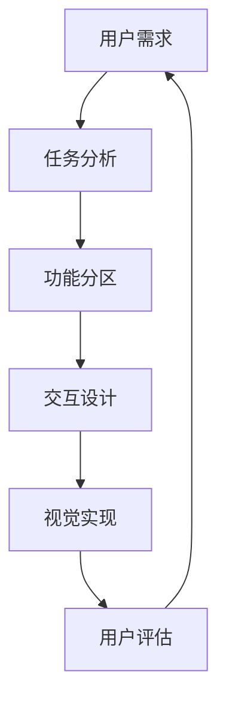

# NextBook Agent 界面设计理念

## 核心设计哲学

NextBook Agent的界面设计以**内容为王**为核心理念，围绕着让用户高效管理阅读内容、获取推荐、回忆知识和生成报告这四大核心功能的使用体验而设计。

## 指导原则

### 内容为王
- **最大化内容区域**：减少界面元素占用空间，提供充足的阅读和写作区域
- **适当留白**：使用恰当的留白增强可读性和内容层级感
- **焦点突出**：视觉引导用户关注当前最重要的内容元素

### 减少干扰
- **简洁界面**：移除不必要的装饰性元素
- **渐进式披露**：高级功能隐藏在基础操作之后，按需展示
- **上下文工具**：工具只在相关内容环境中出现，不常驻界面

### 自然交互
- **符合直觉**：操作方式与真实世界类比，如卡片、书籍翻页等
- **一致性体验**：在不同功能模块中保持一致的交互模式
- **预期反馈**：每个操作都有明确的视觉或动效反馈

### 灵活适应
- **可自定义布局**：允许用户调整界面布局以适应个人工作流
- **适应不同场景**：针对阅读、写作、推荐等场景优化界面状态
- **设备环境感知**：根据屏幕尺寸、光照条件等自动调整界面

### 信息层级
- **清晰导航**：用户随时知道自己在哪里，可以去哪里
- **信息分层**：主次分明的视觉层级，引导用户浏览路径
- **渐进式复杂度**：从简单到复杂，帮助用户逐步掌握功能

## 设计思维模型

NextBook Agent的界面设计基于以下思维模型：

1. **用户需求**：了解用户在阅读管理过程中的核心痛点
2. **任务分析**：拆解用户任务流程，识别关键步骤和决策点
3. **功能分区**：将相关功能进行逻辑分组，构建信息架构
4. **交互设计**：设计每个功能的交互模式和操作流程
5. **视觉实现**：应用视觉设计语言，实现界面元素
6. **用户评估**：通过用户测试收集反馈，持续迭代改进

## 目标体验

NextBook Agent致力于创造以下用户体验：

- **高效**：最少步骤完成任务
- **愉悦**：使用过程轻松自然
- **启发**：促进知识连接和创造
- **可控**：用户掌握工具，而非被工具主导
- **信任**：界面行为符合预期，保持透明

通过这些设计理念的贯彻实施，NextBook Agent将为用户提供一个专注、高效且愉悦的阅读管理体验。
