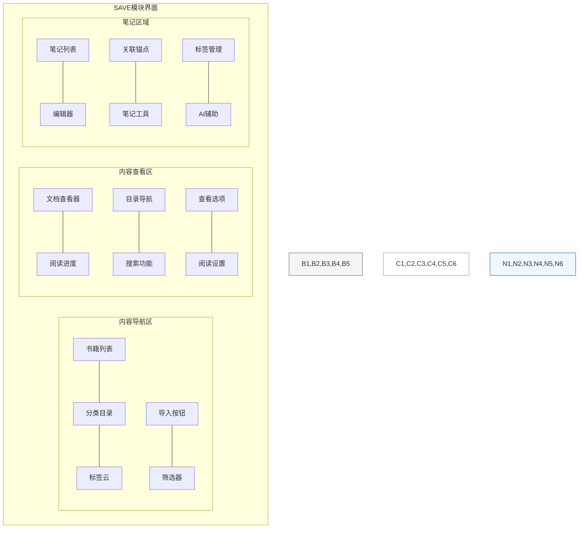
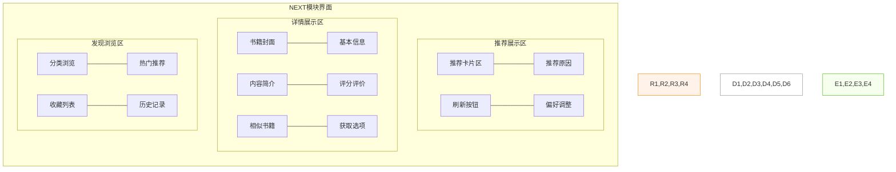
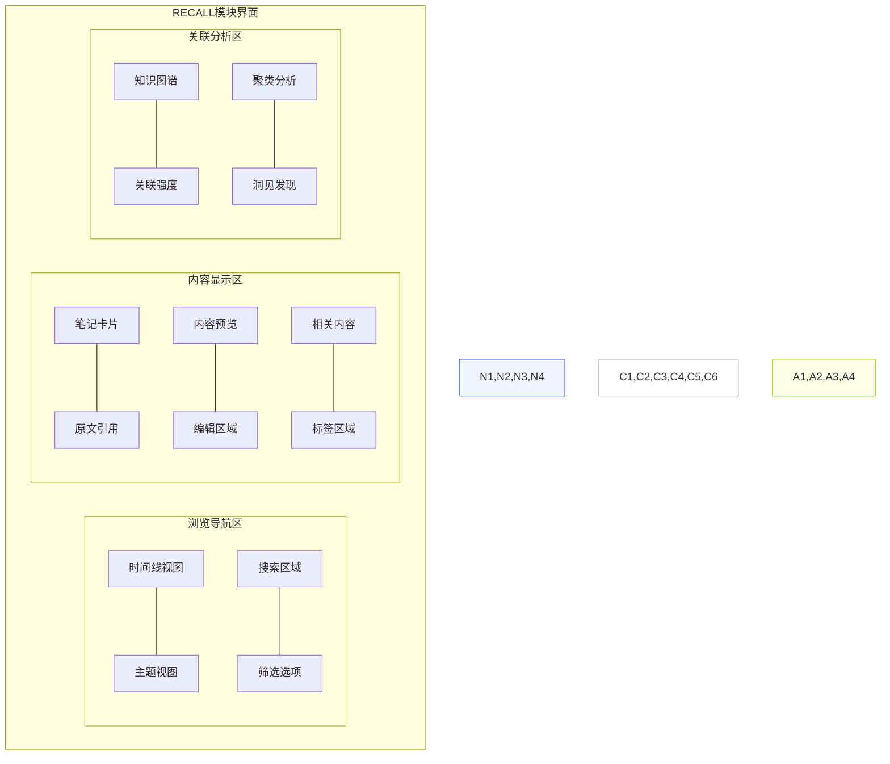
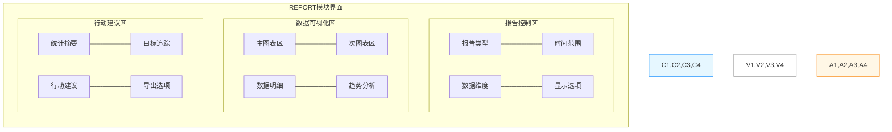

# NextBook Agent 功能模块界面设计

NextBook Agent包含四大核心功能模块：SAVE、NEXT、RECALL和REPORT。每个模块拥有独特的界面设计以支持其特定功能需求。

## 📥 SAVE - 内容保存模块

SAVE模块专注于帮助用户导入、管理和组织阅读内容与笔记。

### 界面结构

### 关键界面元素

#### 内容导航区
- **书籍列表**：显示已导入的所有内容，支持排序和过滤
- **分类目录**：树形结构展示用户创建的内容分类
- **标签云**：可视化显示常用标签，点击筛选相关内容
- **导入按钮**：大型醒目的导入按钮，支持多种导入方式
- **搜索与筛选**：全文搜索和多维度筛选工具

#### 内容查看区
- **文档查看器**：支持PDF、EPUB、TXT等格式的内容查看
- **阅读进度**：可视化显示阅读进度和书签位置
- **目录导航**：内容章节结构导航
- **文本工具**：选择、高亮、添加笔记等文本操作工具
- **视图设置**：调整字体、行距、主题等阅读偏好
- **格式增强**：自动优化TXT文件排版和结构显示

#### 笔记区域
- **笔记列表**：当前文档相关笔记列表
- **笔记编辑器**：富文本编辑器，支持格式化和媒体嵌入
- **关联锚点**：可视化显示笔记与原文的关联
- **标签系统**：为笔记添加标签和分类
- **AI辅助**：智能总结、问题生成等AI辅助功能

### 典型界面流程

**内容导入流程**：
1. 点击"导入"按钮，显示导入选项菜单
2. 选择导入方式（文件/链接/复制粘贴）
3. 选择分类和初始标签
4. 确认导入，系统处理文件
5. 内容显示在查看区，自动提取元数据

**笔记创建流程**：
1. 在文档中选择文本
2. 点击出现的"添加笔记"按钮
3. 笔记编辑器打开，已包含选中文本作为引用
4. 编写笔记内容，可添加标签和关联
5. 笔记自动保存，在文档中显示标记

## 📚 NEXT - 书籍推荐模块

NEXT模块为用户提供个性化的阅读推荐，帮助发现新书和相关内容。

### 界面结构

### 关键界面元素

#### 推荐展示区
- **推荐卡片**：每张卡片展示一本推荐书籍，包含基本信息和缩略图
- **推荐原因**：简洁解释为什么推荐此书
- **控制按钮**：刷新推荐、调整偏好等操作按钮
- **反馈机制**：喜欢/不喜欢按钮，可选填反馈原因

#### 详情展示区
- **书籍封面**：高质量大图书封面展示
- **基本信息**：标题、作者、出版社、出版日期等
- **内容简介**：书籍内容摘要和主题关键词
- **评分评价**：来自各平台的评分和精选评论
- **相似书籍**：横向滚动的相似书籍推荐
- **获取选项**：多种获取途径：购买链接、图书馆检索、在线资源等

#### 发现浏览区
- **分类导航**：按主题、流派等分类浏览
- **特色列表**：新书、经典、热门等特色推荐列表
- **个人书单**：已收藏和感兴趣的书籍列表
- **历史记录**：之前查看过的推荐历史

### 典型界面流程

**推荐浏览流程**：
1. 进入NEXT模块，显示3本个性化推荐
2. 卡片布局展示基本信息和推荐理由
3. 水平滑动浏览更多推荐项
4. 点击感兴趣的书籍查看详情
5. 提供反馈，系统调整未来推荐

**书籍详情流程**：
1. 点击推荐卡片，展开详情视图
2. 详情页上方显示封面和基本信息
3. 下方显示内容简介、评价和相似推荐
4. 展示多种获取选项
5. 可添加到个人书单或关闭返回推荐列表

## 🔍 RECALL - 知识回忆模块

RECALL模块帮助用户回忆和挖掘之前的阅读内容与笔记，构建知识网络。

### 界面结构

### 关键界面元素

#### 浏览导航区
- **时间线**：可缩放的时间轴，显示内容创建/修改时间
- **主题导航**：按主题/标签组织的内容导航
- **搜索功能**：全文搜索和语义搜索工具
- **高级筛选**：多维度筛选条件组合

#### 内容显示区
- **笔记卡片**：以卡片形式展示笔记内容
- **原文引用**：关联的原文内容引用
- **上下文信息**：来源书籍、创建时间等上下文
- **快速编辑**：直接编辑笔记和添加新思考
- **标签系统**：查看和修改标签分类

#### 关联分析区
- **知识图谱**：可视化展示内容之间的关联
- **关系强度**：用连线粗细或颜色表示关联强度
- **聚类分组**：自动或手动内容聚类
- **洞见发现**：AI辅助发现隐藏联系和知识洞见
- **交互控制**：图谱缩放、过滤、重排等交互控件

### 典型界面流程

**时间回忆流程**：
1. 在时间轴上选择时间段
2. 系统展示该时段的阅读内容和笔记
3. 浏览卡片式笔记摘要
4. 点击感兴趣的笔记查看详情
5. 可添加新的思考或见解

**关联探索流程**：
1. 选择某个笔记或主题作为起点
2. 系统生成相关的知识图谱
3. 通过图谱探索相关内容和联系
4. 点击节点查看详细内容
5. 发现新的知识关联和洞见

## 📊 REPORT - 数据报告模块

REPORT模块为用户提供阅读活动的数据分析和可视化报告。

### 界面结构

### 关键界面元素

#### 报告控制区
- **报告类型**：选择不同类型的报告（阅读统计/主题分析/时间分布等）
- **时间范围**：设置报告的时间范围
- **数据维度**：选择分析维度和指标
- **显示选项**：调整图表类型和显示参数
- **保存设置**：保存当前报告配置为模板

#### 数据可视化区
- **主图表**：核心数据的主要可视化表达
- **辅助图表**：补充数据和细分分析
- **交互元素**：支持点击、悬停、拖拽等交互操作
- **数据标签**：清晰的数据标注和说明
- **图例说明**：图表元素的解释说明

#### 行动建议区
- **统计摘要**：关键数据的文字摘要
- **目标追踪**：与设定目标的对比分析
- **行动建议**：基于数据的个性化建议
- **导出选项**：以多种格式导出报告
- **分享功能**：生成分享链接或图片

### 典型界面流程

**报告生成流程**：
1. 选择报告类型和参数
2. 系统生成初始报告视图
3. 调整数据维度和显示选项
4. 探索交互式图表，查看详细数据
5. 导出或保存报告结果

**目标追踪流程**：
1. 查看阅读目标完成情况
2. 分析阅读习惯和模式
3. 查看系统生成的改进建议
4. 调整未来阅读目标
5. 设置提醒和追踪点

## 模块间的一致性与转换

尽管四大功能模块各具特色，NextBook Agent仍然保持以下界面一致性：

### 视觉一致性
- **配色方案**：各模块使用统一的基础配色，辅以功能特色色
- **图标语言**：一致的图标设计语言和交互隐喻
- **排版规则**：统一的字体、尺寸和间距系统
- **组件样式**：按钮、卡片、表单等组件的一致设计

### 导航一致性
- **模块切换**：四大模块间的无缝切换
- **数据连续性**：在不同模块查看相同内容时保持数据一致
- **状态保持**：切换模块后返回，保持之前的状态
- **通用操作**：搜索、筛选、收藏等通用功能在各模块中保持一致

### 转换效果
- **平滑动效**：模块切换时使用平滑过渡动画
- **上下文保留**：切换模块时保留当前内容上下文
- **关联跳转**：不同模块间的相关内容可直接跳转
- **最近访问**：提供快速回到最近访问内容的选项

通过精心设计的四大功能模块界面，NextBook Agent为用户提供了强大而统一的阅读管理体验，兼顾功能特色与整体一致性。
