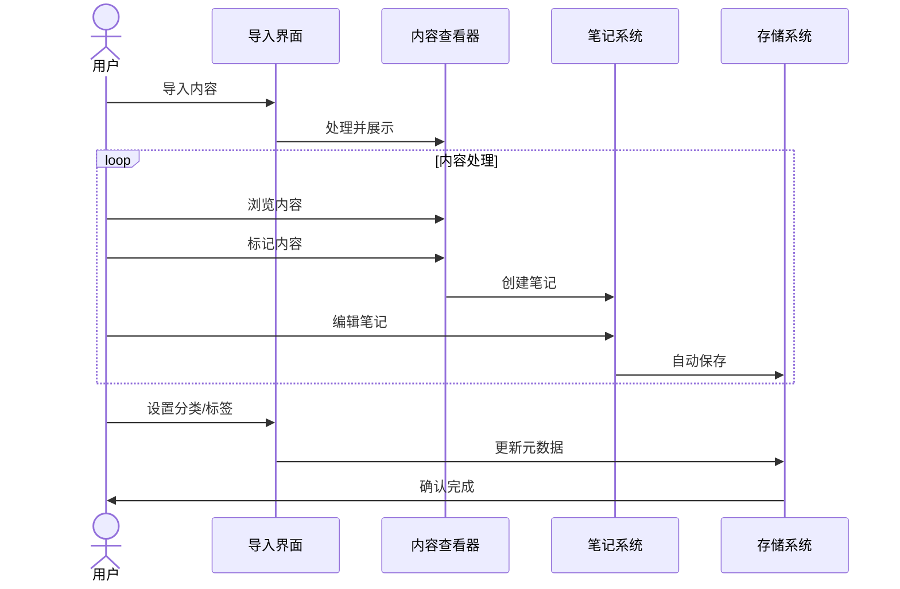
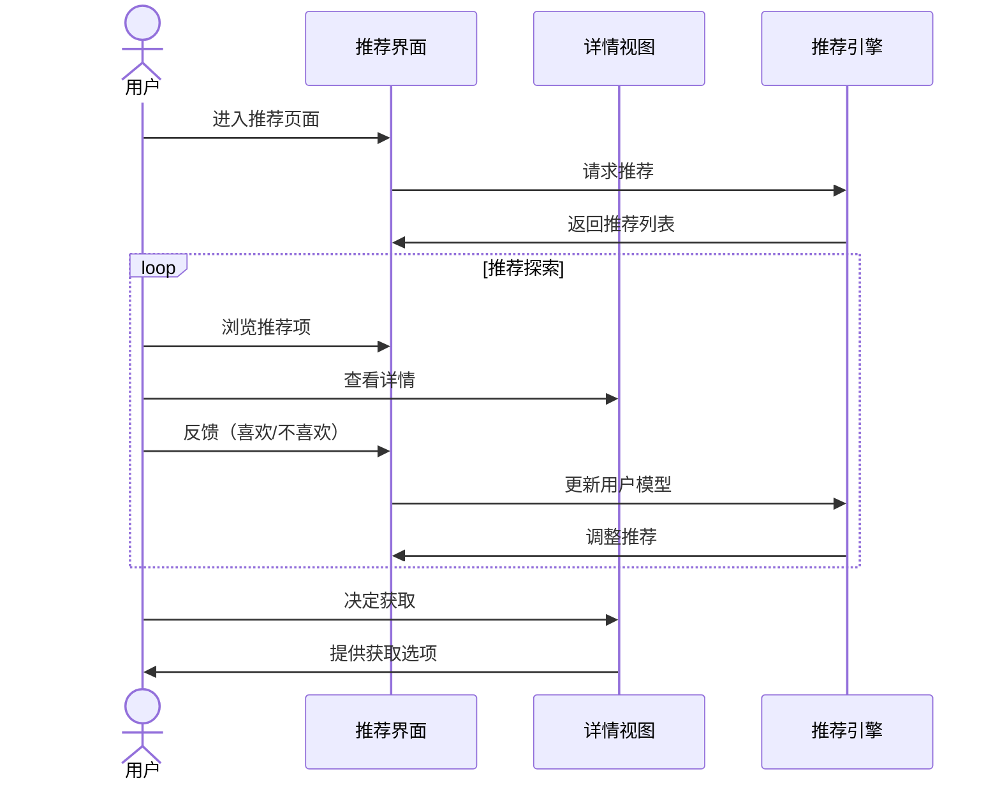
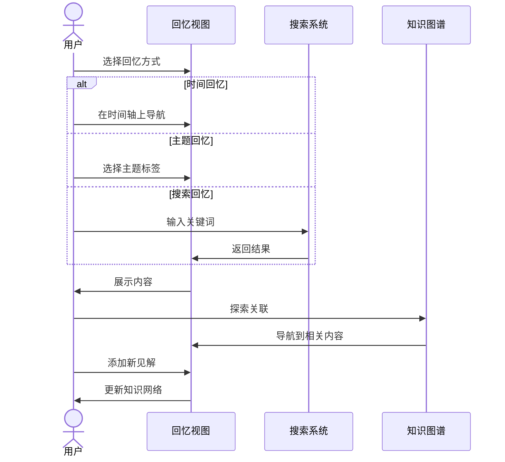
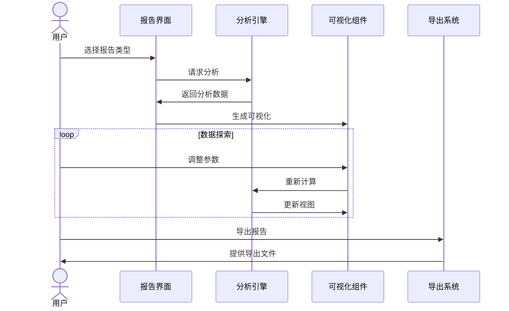

# NextBook Agent 交互模型设计

## 交互设计原则

NextBook Agent的交互设计遵循以下核心原则：

1. **预期一致性**：行为与用户预期保持一致
2. **即时反馈**：操作后立即给予反馈
3. **可逆操作**：允许用户撤销大多数操作
4. **容错设计**：降低错误发生概率，提供恢复机制
5. **效率优先**：减少操作步骤，简化工作流程

## 全局交互模式

### 导航模型

NextBook Agent采用"模块-功能-详情"三层导航结构：

- **一级导航**：四大核心功能模块（SAVE、NEXT、RECALL、REPORT）
- **二级导航**：每个模块内的功能分区
- **三级导航**：具体内容的详情页面

### 手势与快捷键

| 操作 | 触控板手势 | 键盘快捷键 | 功能描述 |
|-----|----------|-----------|--------|
| 切换模块 | 四指水平滑动 | ⌘+1,2,3,4 | 在四大功能模块间切换 |
| 返回 | 两指向右滑动 | ⌘+[ | 返回上一级页面 |
| 前进 | 两指向左滑动 | ⌘+] | 前进到下一页 |
| 搜索 | 双指点按 | ⌘+F | 打开搜索框 |
| 保存 | - | ⌘+S | 保存当前内容 |
| 新建笔记 | - | ⌘+N | 创建新笔记 |
| 全屏模式 | - | ⌘+⇧+F | 进入/退出全屏模式 |

## 功能模块交互流

### SAVE - 内容保存流程

#### 关键交互点：
- **内容导入**：支持拖放、复制粘贴和文件选择器
- **文本选择**：选中文本自动弹出操作菜单（高亮、笔记、复制）
- **笔记创建**：侧边栏笔记与原文保持同步滚动
- **分类系统**：标签拖拽分类，支持多级目录

### NEXT - 推荐浏览流程

#### 关键交互点：
- **卡片浏览**：水平滑动或点击箭头浏览推荐项
- **反馈机制**：简单的喜欢/不喜欢反馈，带有选填理由
- **细节展示**：点击卡片平滑展开详情，无需页面跳转
- **刷新机制**：下拉刷新获取新推荐

### RECALL - 知识回忆流程

#### 关键交互点：
- **时间导航**：时间轴缩放与定位，支持拖拽和点击
- **关联探索**：知识图谱节点交互，支持放大、缩小、拖动
- **笔记追加**：在历史笔记上直接追加新思考
- **上下文切换**：在不同内容间保持思考连贯性

### REPORT - 数据报告流程

#### 关键交互点：
- **图表交互**：支持点击、拖拽、缩放等图表交互操作
- **参数调整**：实时预览参数变化对报告的影响
- **视图切换**：在不同可视化表现形式间无缝切换
- **导出定制**：选择导出格式和内容范围

## 状态转换与反馈

NextBook Agent为所有关键操作提供明确的状态反馈：

| 操作状态 | 视觉反馈 | 交互反馈 |
|---------|---------|---------|
| 加载中 | 进度指示器 | 部分功能短暂禁用 |
| 成功完成 | 简短确认消息 | 声音提示（可选） |
| 需要注意 | 黄色提示信息 | 可点击获取详情 |
| 出现错误 | 红色错误消息 | 提供解决方案 |

## 可访问性考虑

交互设计同时考虑以下可访问性需求：

- **键盘导航**：所有功能可通过键盘完成
- **屏幕阅读器**：界面元素有适当的ARIA标签
- **操作替代**：提供多种方式完成同一操作
- **操作撤销**：关键操作提供撤销机会

通过精心设计的交互模型，NextBook Agent确保用户在使用过程中体验流畅、高效和愉悦，减少认知负担，专注于内容本身。
