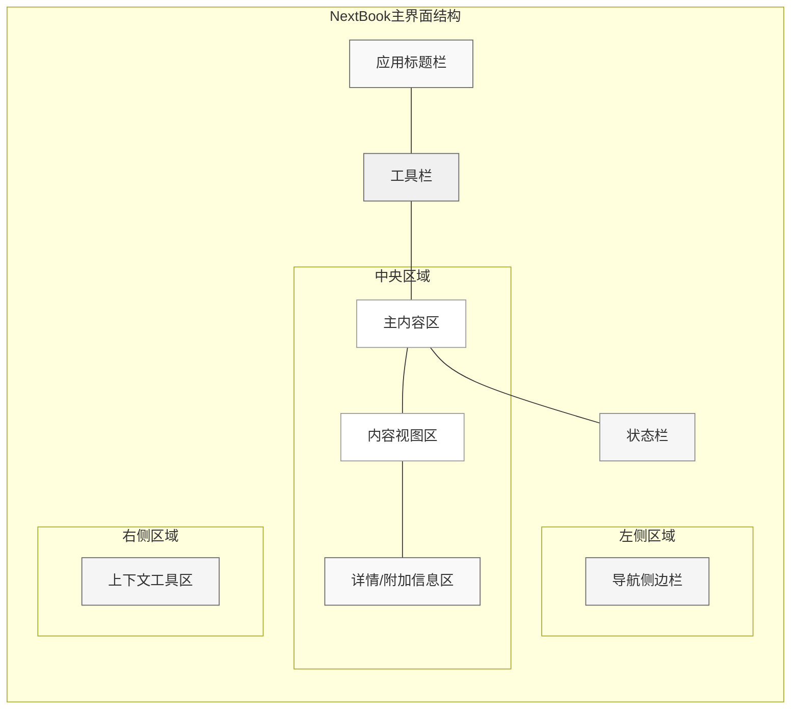

# NextBook Agent 主界面布局设计

## 布局结构概览

NextBook Agent采用经典的分区式布局结构，在保证内容区域最大化的同时，提供直观的导航和工具访问。

## 主界面组件详细说明

### 导航侧边栏

导航侧边栏是功能模块的主入口，采用垂直排列的图标+文字标签结构。

**设计要点：**
- **固定+可展开设计**：默认折叠为图标栏，悬停或点击时展开
- **视觉层级**：当前模块高亮显示，便于定位
- **快捷访问区**：底部提供最近内容和快速笔记功能
- **收起选项**：允许完全隐藏，最大化内容区域

**组件结构：**
