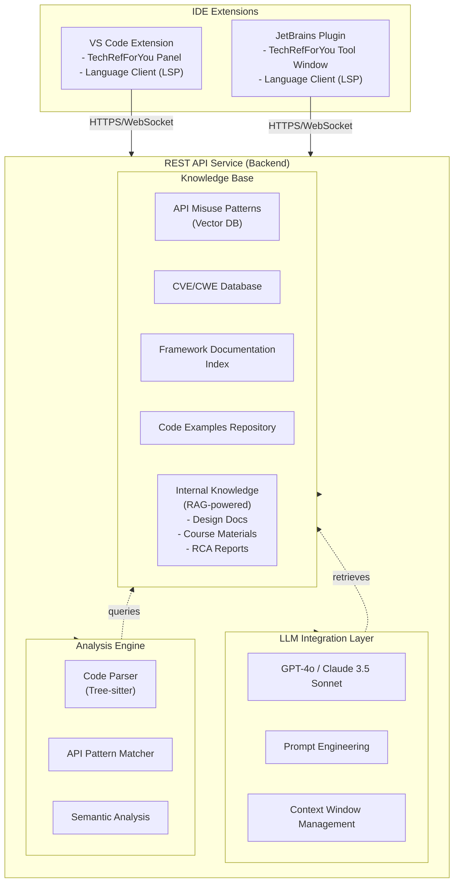

# Technical Reference Recommendation Agent

## Vision

An **LLM-powered intelligent coding agent** that provides **async, silent API usage advice** through IDE extensions (VS Code, JetBrains) and a REST API service. Features a dedicated **"TechRefForYou"** panel (similar to PROBLEMS panel), helping developers code confidently from memory while catching common pitfalls.

## Architecture

### System Components



### Tech Stack

**IDE Extensions:**
- **VS Code**: TypeScript, VS Code Extension API, Language Server Protocol
- **JetBrains**: Kotlin/Java, IntelliJ Platform SDK, LSP support

**Backend Service:**
- **API Framework**: FastAPI (Python) or Express (Node.js)
- **LLM Integration**: 
  - OpenAI API (GPT-4o, GPT-4-turbo)
  - Anthropic API (Claude 3.5 Sonnet)
  - LangChain for orchestration
- **Code Analysis**: Tree-sitter for multi-language parsing
- **Vector Database**: Pinecone/Weaviate for semantic search
- **Caching**: Redis for response caching
- **Message Queue**: RabbitMQ for async processing

**Knowledge Base:**
- **Vector embeddings** for API documentation and code examples
- **Graph database** (Neo4j) for API relationship mapping
- **CVE/CWE database** integration for security patterns
- **Community-sourced patterns** from GitHub, Stack Overflow
- **Internal Knowledge Base** (RAG-powered):
  - Design documents (architecture decisions, system designs)
  - Course materials (internal training, best practices guides)
  - Root-cause analysis docs (post-mortems, incident reports)
  - Team coding standards and conventions
  - Historical bug patterns and fixes

### API Endpoints

**OpenAI-Compatible Format** (Drop-in replacement for OpenAI API)

```http
POST /v1/chat/completions
Content-Type: application/json
Authorization: Bearer YOUR_API_KEY

Request:
{
  "model": "techref-advisor-v1",
  "messages": [
    {
      "role": "system",
      "content": "You are a technical reference advisor for code analysis."
    },
    {
      "role": "user", 
      "content": "Analyze: int fd = open(filename, O_RDWR);"
    }
  ],
  "temperature": 0.7,
  "stream": false,
  
  // Custom extensions (optional)
  "techref_context": {
    "language": "c",
    "file_path": "src/main.c",
    "severity_filter": ["critical", "warning"],
    "include_examples": true,
    "internal_knowledge": true
  }
}

Response (OpenAI-compatible):
{
  "id": "techref-chatcmpl-abc123",
  "object": "chat.completion",
  "created": 1700000000,
  "model": "techref-advisor-v1",
  "choices": [
    {
      "index": 0,
      "message": {
        "role": "assistant",
        "content": "🔴 **Missing Error Check**\n\nThe `open()` system call returns -1 on error...",
        "techref_metadata": {
          "suggestions": [
            {
              "severity": "critical",
              "category": "error_handling",
              "line": 1,
              "message": "Missing error check for open()",
              "code_example": "if (fd < 0) { perror(\"open\"); return -1; }"
            }
          ],
          "related_docs": [
            {"type": "rca", "title": "RCA-2024-03-15", "relevance": 0.92}
          ]
        }
      },
      "finish_reason": "stop"
    }
  ],
  "usage": {
    "prompt_tokens": 45,
    "completion_tokens": 120,
    "total_tokens": 165
  }
}
```

**Streaming Support (Server-Sent Events)**

```http
POST /v1/chat/completions
{
  "model": "techref-advisor-v1",
  "messages": [...],
  "stream": true
}

Response Stream:
data: {"id":"techref-1","object":"chat.completion.chunk","choices":[{"delta":{"role":"assistant"}}]}

data: {"id":"techref-1","object":"chat.completion.chunk","choices":[{"delta":{"content":"🔴"}}]}

data: {"id":"techref-1","object":"chat.completion.chunk","choices":[{"delta":{"content":" Missing"}}]}

data: [DONE]
```

**Additional Endpoints**

```http
GET /v1/models
  - Lists available analysis models
  - Response: { "data": [{"id": "techref-advisor-v1", ...}] }

POST /v1/embeddings
  - Generate embeddings for code snippets
  - Request: { "model": "techref-embeddings", "input": "code..." }
  - Response: { "data": [{"embedding": [...]}] }

POST /v1/knowledge/query
  - Query internal knowledge base
  - Request: { "query": "...", "doc_types": ["design", "rca"] }
  - Response: { "results": [...] }

POST /v1/knowledge/ingest
  - Index internal documents
  - Request: { "content": "...", "metadata": {...}, "doc_type": "rca" }
  - Response: { "indexed": true, "id": "doc-123" }
```

**Client Usage Example**

```python
from openai import OpenAI

# Just change base_url - existing OpenAI code works!
client = OpenAI(
    base_url="https://techref-service.yourcompany.com/v1",
    api_key="your-api-key"
)

response = client.chat.completions.create(
    model="techref-advisor-v1",
    messages=[
        {"role": "system", "content": "Analyze code for API misuse"},
        {"role": "user", "content": "int fd = open(file, O_RDWR);"}
    ],
    extra_body={
        "techref_context": {
            "language": "c",
            "internal_knowledge": True
        }
    }
)

print(response.choices[0].message.content)
```

## User Stories

### Story 1: System Call Safety Assistant
**AS** a C/C++ developer coding from memory,
**I WANT** real-time advice in the "TechRefForYou" panel when I use Linux system calls (like `snprintf`, `fork`, `mmap`),
**SO THAT** I can catch easy-to-misuse points, security issues, and error handling gaps without breaking my coding flow or switching to documentation.

**Acceptance Criteria:**
- Panel shows critical warnings (🔴) for missing error checks
- Displays common pitfall warnings (🟡) with code examples
- Provides info tips (🔵) for best practices and performance
- Updates asynchronously after typing pause (no interruptions)
- Clickable entries jump to relevant code location
- Hover tooltips show detailed explanations

### Story 2: Framework/Library API Guard
**AS** a developer using modern frameworks (React, Spring, SQLAlchemy, etc.),
**I WANT** proactive warnings about deprecated APIs, performance anti-patterns, and version-specific behaviors,
**SO THAT** I can avoid technical debt and production issues before code review or runtime.

**Acceptance Criteria:**
- Detects deprecated API usage with migration paths
- Warns about N+1 queries, unnecessary re-renders, etc.
- Shows version compatibility issues
- Filters advice by framework/library category
- Non-blocking notifications (badge count, gutter icons)
- Contextual code examples for recommended alternatives

### Story 3: Concurrency & Threading Advisor
**AS** a developer working with multi-threaded code,
**I WANT** alerts about deadlock risks, race conditions, and thread-safety issues in the "TechRefForYou" panel,
**SO THAT** I can prevent concurrency bugs that are hard to debug and reproduce.

**Acceptance Criteria:**
- Identifies unsafe shared state access patterns
- Warns about lock ordering and nested lock issues
- Suggests thread-safe alternatives (e.g., `strtok_r` vs `strtok`)
- Shows memory ordering concerns for atomics
- Groups related issues by synchronization primitive

### Story 4: Memory Safety Checker
**AS** a developer managing memory manually,
**I WANT** detection of use-after-free, double-free, buffer overflows, and memory leaks,
**SO THAT** I can write safer code and reduce debugging time for memory corruption issues.

**Acceptance Criteria:**
- Flags unsafe string operations (`strcpy`, `sprintf`)
- Detects missing free/delete calls
- Warns about pointer arithmetic risks
- Suggests modern alternatives (smart pointers, RAII)
- Critical issues show immediately in editor gutter

### Story 5: Cryptography & Security Advisor
**AS** a developer implementing security-sensitive features,
**I WANT** warnings about weak crypto algorithms, insecure randomness, and timing attacks,
**SO THAT** I don't accidentally introduce vulnerabilities that could be exploited.

**Acceptance Criteria:**
- Flags weak algorithms (MD5, SHA1, DES)
- Warns about `rand()` usage for security purposes
- Detects hardcoded secrets and insecure key storage
- Recommends current standards (AES-256-GCM, bcrypt)
- Links to security best practices documentation

### Story 6: Internal Knowledge Advisor (RAG-Powered)
**AS** a team member working on an existing codebase,
**I WANT** contextual recommendations from our internal design docs, training courses, and past RCA reports when I'm coding,
**SO THAT** I can leverage team knowledge, avoid repeating past mistakes, and follow established architectural patterns without searching through documentation.

**Acceptance Criteria:**
- **Context-aware suggestions**: 
  - When working on payment module → surfaces payment service design doc
  - When using deprecated pattern → shows RCA from similar past incident
  - When implementing feature → recommends relevant internal course material
- **Document types indexed**:
  - 📋 Design documents (architecture decisions, system designs, API specs)
  - 📚 Course materials (onboarding guides, best practices, coding standards)
  - 🔍 Root-cause analysis (post-mortems, incident reports, bug patterns)
  - 📖 Team conventions (code style, review guidelines, deployment procedures)
- **Smart retrieval**:
  - Semantic search across all internal docs
  - Relevance ranking based on current code context
  - Shows "Related Docs" section in TechRefForYou panel
- **Continuous learning**:
  - Auto-indexes new docs from Confluence, Notion, Google Docs
  - Updates embeddings when documents are modified
  - Learns from which suggestions developers actually use
- **Privacy & security**:
  - Internal knowledge stays within company infrastructure
  - Role-based access control for sensitive docs
  - Audit logs for compliance

**Example Scenarios:**
```
Scenario A: Avoiding Repeated Mistakes
  You write: db.query("SELECT * FROM users WHERE id = " + userId)
  
  TechRefForYou shows:
  🔴 SQL Injection Risk (from RCA-2024-03-15)
      "This exact pattern caused production incident last March.
       Use parameterized queries instead."
  📚 Related: Secure Coding Course - Module 3
```

```
Scenario B: Following Design Decisions
  You create: class PaymentProcessor { ... }
  
  TechRefForYou shows:
  🔵 Architecture Alignment (from Design Doc: Payment-v2)
      "Payment processing should use PaymentGatewayInterface
       per our service architecture. See section 3.2."
  📋 Related: payment-service-design.md
```

```
Scenario C: Learning from Past Experience
  You implement: multi-threading without locks
  
  TechRefForYou shows:
  🟡 Concurrency Pattern (from RCA-2023-11-20)
      "Race condition in user session handler was caused by
       similar pattern. Consider using read-write locks."
  📚 Related: Concurrency Best Practices Course
```

### Story 7: Personalized & Noise-Free Experience
**AS** a developer using the service daily,
**I WANT** the agent to remember what I've already seen and adapt to my specific context,
**SO THAT** I'm not annoyed by repetitive advice and only see relevant, "new" information.

**Acceptance Criteria:**
- **Smart Deduplication**:
  - Tracks "seen" advice per user/project
  - Suppresses warnings I've explicitly dismissed or fixed previously
  - Doesn't show the same "best practice" tip 50 times a day
- **User Context Isolation**:
  - Maintains separate profiles for different developers
  - Adapts to my role (e.g., Junior Dev gets more educational tips, Senior Dev gets only critical architectural warnings)
  - Learns my preferences (e.g., "Don't warn me about `printf` in debug builds")
- **Project-Specific Context**:
  - Understands project-specific conventions (e.g., "In this legacy repo, we use `MyString` instead of `std::string`")
  - Filters advice based on project configuration (e.g., C++11 vs C++20 standards)

## Key Features

### 🎯 "TechRefForYou" Panel
- **Dedicated view panel** alongside PROBLEMS, OUTPUT, TERMINAL
- **Categorized advice**: 
  - 🔴 Critical (security, memory safety)
  - 🟡 Warning (common pitfalls, deprecated APIs)
  - 🔵 Info (best practices, performance tips)
- **Non-blocking**: Updates asynchronously as you code
- **Clickable items**: Jump to code location
- **Filterable**: By severity, by API category (syscall, framework, crypto, etc.)
- **Collapsible groups**: Organize by file or by issue type
- **Personalized View**: Shows "New for You" vs "All Issues"

### 🧠 Smart Filtering & Personalization
- **History Tracking**: Remembers dismissed suggestions
- **Role-Based Tuning**: Junior/Senior/Security-Specialist profiles
- **Noise Reduction**: Auto-suppresses repetitive tips
- **Context Awareness**: User + Project + Team settings

### 🌊 Flow-Preserving UX
- **Silent analysis**: Triggers after typing pause (500ms debounce)
- **Gutter icons**: Subtle 💡 in editor for quick reference
- **Hover tooltips**: Detailed advice on mouseover
- **No interruptions**: No modals, no auto-focus stealing
- **Badge count**: Shows new suggestions without disruption

### 🧠 Memory-Assist Mode
- Detects when you're "coding from memory"
- Validates against actual API contracts
- Highlights differences between what you wrote vs. recommended patterns
- Shows migration paths for outdated knowledge
